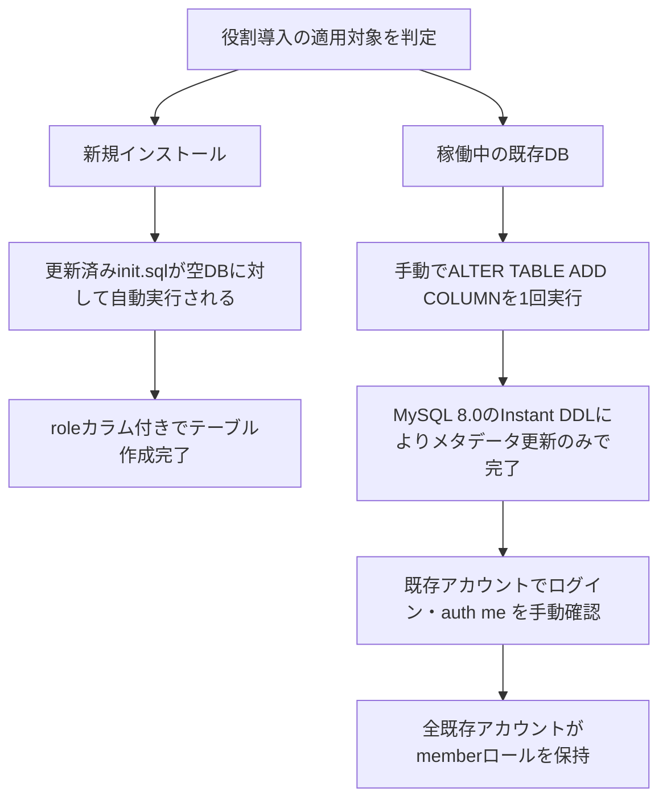

# Design Document

## Overview
**Purpose**: 本機能は、ユーザーアカウントに`role`（`admin` / `member`）という区分を導入し、今後の管理者画面・認可・アカウント無効化機能が拠り所とする権限管理の基礎データを提供する。
**Users**: 直接のUIは持たないが、今後実装される管理者・認可関連の各仕様、および将来的に企業導入時のシステム運用者がこのデータに依存する。
**Impact**: `users`テーブルにNOT NULLの`role`列を追加し、新規登録・既存アカウントの双方に`member`を既定値として付与する。認証APIのレスポンス（`/auth/me`）に`role`を含める。

### Goals
- すべてのユーザーアカウント（新規・既存）が`role`値（`admin`または`member`）を持つ
- 新規登録時・登録リクエストへの不正な値混入時のいずれも、常に安全側（`member`）に倒す
- 認証済みユーザーが自分のロールを確認できる
- 将来のロール値追加（`group_leader`等）に既存データが耐えられる設計にする

### Non-Goals
- 管理者画面（ユーザー一覧・権限変更・アカウント無効化UI）の実装
- ロールに基づく認可（アクセス制御・ミドルウェア）の実装
- 初期管理者アカウントの作成フロー（環境変数指定 or セットアップ画面の決定）
- `group_leader`ロールおよびグループ単位の権限管理
- マイグレーションツール・フレームワークの導入

## Boundary Commitments

### This Spec Owns
- `users.role`列のスキーマ定義とデフォルト値
- 新規登録時のロール割り当て（常に`member`）
- 既存アカウントへの`role`付与（本番DBへの一回限りの適用手順を含む）
- `AuthRepository`の`User`型・クエリへの`role`追加
- `/auth/me`レスポンスへの`role`追加

### Out of Boundary
- ロール値の変更手段（誰かを`admin`にするAPI・UI）— 「初期管理者アカウントの作成フロー」「管理者画面」の各スペックが担当
- `role`値に基づくアクセス制御の判断・実施 — 「認可（Authorization）」スペックが担当
- フロントエンド（`todo-web`）の変更 — `middleware.ts`はレスポンスボディを読まずステータスのみで判定するため、本機能は影響を与えない

### Allowed Dependencies
- MySQL 8.0（既存の`docker-compose.yml`定義、Instant DDLを利用）
- 既存の`authBodySchema`（`todo-api/src/routes/auth.route.ts`）の`additionalProperties: false`制約
- 既存のレイヤー構成（Repository → Service → Controller → Route）を変更せず、そのまま拡張する

### Revalidation Triggers
- `group_leader`等の新しいロール値を追加する場合、本設計の`ENUM`定義とTypeScript側の`UserRole`型の両方を同時に更新する必要がある（片方だけの変更は不整合を招く）
- `/auth/me`のレスポンス契約（`role`フィールドの追加）に依存する後続スペース（管理者画面・認可）は、このフィールド名・型が変わる場合に再検証が必要

## Architecture

### Existing Architecture Analysis
- 既存はFastify層構成（Route → Controller → Service → Repository → DB）を厳格に分離しており（`structure.md`）、本機能もこのパターンをそのまま踏襲する。新しいレイヤーやコンポーネントは導入しない。
- `AuthRepository.findByEmail`は`SELECT *`のため、列追加後は自動的に`role`を取得する。`findById`は明示的なカラム指定（`SELECT id, email`）のため、`role`を追加する必要がある。
- リクエストボディの検証（AJV/JSON Schema）は`additionalProperties: false`を既に採用しており、この既存パターンがRequirement 2.2の意図を実現する（詳細は`research.md`の該当Decision参照）。

### Technology Stack
| Layer | Choice / Version | Role in Feature | Notes |
|-------|------------------|-----------------|-------|
| Data / Storage | MySQL 8.0 | `users.role`列の追加・既定値付与 | Instant DDLにより既存行への影響なし |
| Backend / Services | Fastify 5 + TypeScript（既存） | `role`をリポジトリ層で取得し、APIレスポンスに含める | 新規ライブラリ追加なし |

## File Structure Plan

### Modified Files
- `mysql/init.sql` — `users`テーブル定義に`role ENUM('admin','member') NOT NULL DEFAULT 'member'`列を追加（新規インストール向け）
- `todo-api/src/repositories/auth.repository.ts` — `UserRole`型の定義、`User`型に`role`を追加、`findById`のSELECT句に`role`を追加（`findByEmail`は`SELECT *`のため変更不要、`createUser`はDB既定値に委ねるため変更不要）
- `todo-api/src/services/auth.service.ts` — 変更なし（`AuthRepository`が返す値をそのまま透過するため）
- `todo-api/src/controllers/auth.controller.ts` — `me`ハンドラのレスポンスに`role: user.role`を追加
- `todo-api/src/routes/_test_/auth.api.test.ts` — `/auth/me`のロール値検証、登録リクエストへの`role`混入時に無視されることの確認を追加
- 本番データベースへの一回限りの適用: `ALTER TABLE users ADD COLUMN role ENUM('admin','member') NOT NULL DEFAULT 'member' AFTER password_hash;`（コードの一部として管理するファイルは作らず、デプロイ手順として実行する。詳細は Migration Strategy 参照）

> このスペックはファイル追加を伴わない小規模拡張のため、新しいディレクトリ構造は発生しない。

## Requirements Traceability

| Requirement | Summary | Components | Interfaces | Flows |
|-------------|---------|------------|------------|-------|
| 1.1 | 全アカウントがロール値を持つ | `mysql/init.sql`, `AuthRepository` | `users.role`列（NOT NULL） | Migration Strategy |
| 1.2 | ロール値を`admin`/`member`に制限 | `mysql/init.sql` | `ENUM('admin','member')` | - |
| 1.3 | 将来の値追加に既存データが耐える | `mysql/init.sql` | `ENUM`への`ALTER TABLE ... MODIFY COLUMN`（将来） | - |
| 2.1 | 新規登録時に`member`を既定割り当て | `mysql/init.sql` | `DEFAULT 'member'` | - |
| 2.2 | 登録リクエストの`role`値を無視 | `todo-api/src/routes/auth.route.ts`（既存） | `authBodySchema`（`additionalProperties: false`） | Error Handling参照 |
| 3.1 | 既存アカウントへの`role`付与 | 本番DB適用手順 | `ALTER TABLE ... ADD COLUMN ... DEFAULT 'member'` | Migration Strategy |
| 3.2 | 既存アカウントのログイン継続 | 本番DB適用手順 | Instant DDL（MySQL 8.0） | Migration Strategy |
| 4.1 | 自身のロール参照 | `AuthRepository`, `AuthController` | `GET /auth/me`レスポンス | - |

## Components and Interfaces

| Component | Domain/Layer | Intent | Req Coverage | Key Dependencies (P0/P1) | Contracts |
|-----------|--------------|--------|--------------|--------------------------|-----------|
| `AuthRepository` | Data | `role`を含むユーザー情報の取得 | 1.1, 4.1 | MySQL `users`テーブル (P0) | Service |
| `AuthController.me` | API | `/auth/me`レスポンスに`role`を含める | 4.1 | `AuthRepository`経由の`AuthService` (P0) | API |

### Data
#### AuthRepository
| Field | Detail |
|-------|--------|
| Intent | `role`を含むユーザーレコードの取得・作成 |
| Requirements | 1.1, 4.1 |

**Responsibilities & Constraints**
- `User`型に`role: UserRole`を追加する（`any`は使用しない）
- `findById`のSELECT句に`role`を追加する
- `createUser`はロールを明示的に指定しない（DBの`DEFAULT 'member'`に委ねる）

**Contracts**: Service [x] / API [ ] / Event [ ] / Batch [ ] / State [ ]

##### Service Interface
```typescript
export type UserRole = 'admin' | 'member';

export type User = RowDataPacket & {
  id: number;
  email: string;
  password_hash: string;
  role: UserRole;
};
```
- Preconditions: `users.role`列が存在すること（本番は事前にALTER TABLE適用済みであること）
- Postconditions: 返却される`User`は常に有効な`role`値を持つ
- Invariants: `role`は`'admin' | 'member'`のいずれか

### API
#### AuthController.me
| Field | Detail |
|-------|--------|
| Intent | 認証済みユーザー自身のアカウント情報（ロール含む）を返す |
| Requirements | 4.1 |

**Contracts**: Service [ ] / API [x] / Event [ ] / Batch [ ] / State [ ]

##### API Contract
| Method | Endpoint | Request | Response | Errors |
|--------|----------|---------|----------|--------|
| GET | /auth/me | (Cookie: session) | `{ id: number, email: string, role: 'admin' \| 'member' }` | 401（未認証） |

**Implementation Notes**
- Integration: `AuthService.me`はリポジトリの返り値をそのまま透過するため変更不要
- Validation: 新規バリデーション追加なし（既存の`additionalProperties: false`が2.2を満たす）
- Risks: なし（既存レスポンス形状へのフィールド追加のみで後方互換）

## Data Models

### Logical Data Model
- `users`エンティティに属性`role: 'admin' | 'member'`を追加。既定値`'member'`、NOT NULL。
- `todos`との既存リレーション（`user_id`外部キー）に変更なし。

### Physical Data Model
```sql
-- mysql/init.sql（新規インストール向け、CREATE TABLE内に追加）
role ENUM('admin', 'member') NOT NULL DEFAULT 'member'

-- 本番DBへの一回限りの適用（Migration Strategy参照）
ALTER TABLE users
  ADD COLUMN role ENUM('admin', 'member') NOT NULL DEFAULT 'member' AFTER password_hash;
```

## Error Handling

### Error Categories and Responses
**訂正（実装時に判明）**: 登録リクエストに未定義フィールド（`role`含む）が含まれる場合、既存の`authBodySchema`（`additionalProperties: false`）が適用されるが、Fastify 5のデフォルトAJV設定は`removeAdditional: true`のため、**リクエストは400で拒否されず、未定義フィールドが黙って取り除かれた上で201で成功する**。これは実装時（タスク4.1）に発覚し、当初の想定（「リクエスト自体を拒否する」）は誤りだった。結果としてRequirement 2.2の文言「その値を無視し、常に`member`を割り当てる」の方が、実際の挙動をより正確に表している。セキュリティ上の実害はない（`role`はDBに一切届かない）。詳細は`research.md`参照。

### Security Considerations
- 新規アカウントは常に最小権限（`member`）から開始する（Requirement 2.1）。
- `role`列の追加自体は認可を実施しない。管理者画面・認可スペックが実装されるまで、`role`が`admin`であっても機能上の権限差は発生しない — この列単体では何もアクセス制御しないことを明確にしておく（Non-Goalsとの整合）。

## Testing Strategy

### Unit Tests
- `AuthRepository`: `findById`が`role`を含む値を返すこと
- 型チェック: `UserRole`が`'admin' | 'member'`以外を受け付けないこと（コンパイル時）

### Integration Tests（`auth.api.test.ts`拡張）
- 新規登録後、ログインして`GET /auth/me`を呼ぶと、レスポンスに`role: "member"`が含まれる（Requirement 2.1, 4.1）
- `POST /auth/register`のペイロードに`role: "admin"`を含めても201で登録が成功し、かつ`GET /auth/me`で取得したロールは`member`のままである（未定義フィールドが黙って無視され、Requirement 2.2を満たすことの確認。当初400を想定していたが実装時にFastifyの`removeAdditional: true`挙動により誤りと判明）
- （運用確認・自動テスト対象外）本番相当データに対する`ALTER TABLE`適用後、既存アカウントでのログイン・`/auth/me`が引き続き200で成功することを手動確認する（Requirement 3.1, 3.2）

## Migration Strategy



- Phase 1（新規インストール）: `mysql/init.sql`の更新のみで完結。追加作業なし。
- Phase 2（既存の本番DB）: デプロイ手順の一部として`ALTER TABLE`を一度だけ手動実行する。ロールバックが必要な場合は`ALTER TABLE users DROP COLUMN role;`で復元可能（列追加のみのため、他データへの影響なし）。
- Validation Checkpoint: 適用後、既存アカウントでのログインと`/auth/me`が引き続き成功することを確認する。
