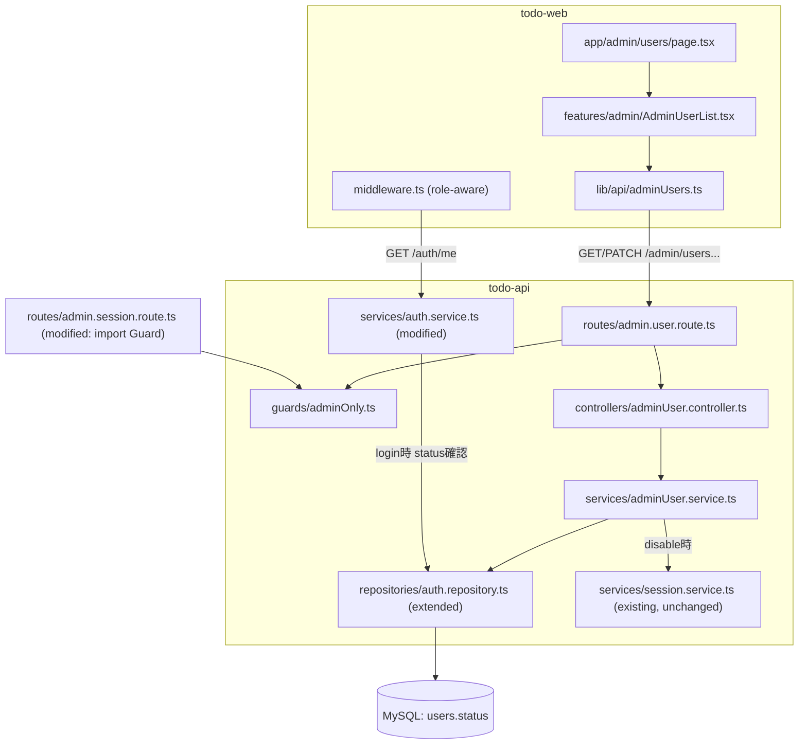
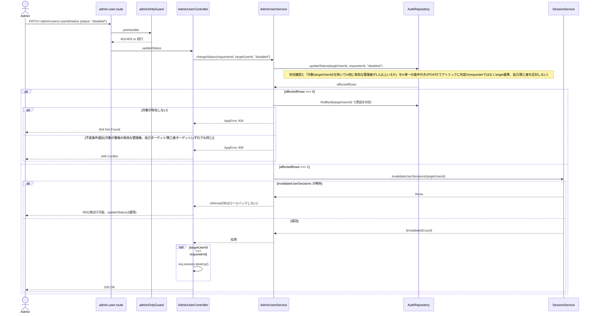

# Technical Design

## Overview

**Purpose**: 本機能は、管理者ロールを持つユーザーに対し、システムに登録されている全ユーザーの一覧確認・ロール変更・アカウントの無効化/再有効化を行う手段を提供する。

**Users**: `role = admin`のユーザーが、管理者画面（`/admin/users`）からユーザー管理操作を行う。

**Impact**: `users`テーブルに`status`（有効/無効）カラムを追加し、`AuthRepository`にユーザー一覧・更新系メソッドを追加する。既存の`admin.session.route.ts`（`session-invalidation` spec）の管理者ガードを共有ガードに切り出し、そこにも接続する。todo-web側に新規の管理者画面（一覧表示・操作UI）と、`middleware.ts`のロール判定拡張を追加する。

### Goals
- 管理者がユーザー一覧をロール・アカウント状態付きで参照できる
- 管理者がユーザーのロール（`admin`/`member`）を変更できる
- 管理者がアカウントを無効化でき、無効化時に既存セッションが強制的に終了する
- 管理者が無効化したアカウントを再有効化できる
- 上記操作が管理者ロールを持つユーザーのみに許可される
- システムで最後の有効な管理者となるアカウントは、自分自身への操作・他の管理者からの操作のいずれによっても降格・無効化されない

### Non-Goals
- グループ/チーム単位のアクセス制御（認可）— 別イテレーション
- ユーザー一覧の検索・絞り込み・ページネーション
- アカウントのデータ削除（無効化のみ、削除は対象外）
- 無効化操作の監査ログ記録、無効化された本人への通知
- 初期管理者アカウントの作成フロー

## Boundary Commitments

### This Spec Owns
- `users`テーブルへの`status`（`active`/`disabled`）カラムの追加とその既定値
- 管理者向けユーザー一覧取得API（`GET /admin/users`）
- 管理者向けロール変更API（`PATCH /admin/users/:userId/role`）
- 管理者向けアカウント状態変更API（`PATCH /admin/users/:userId/status`）— 無効化・再有効化を統合
- 無効化時に既存の強制セッション無効化能力（`SessionService.invalidateUserSessions`）を呼び出す連携ロジック
- 無効化されたアカウントでのログイン拒否（`AuthService.login`への状態チェック追加）
- 管理者専用ルートに対する共有認可ガード（`guards/adminOnly.ts`として切り出し、既存`admin.session.route.ts`にも接続）
- システムで最後の有効な管理者となるアカウントの降格・無効化保護ロジック（自己/第三者どちらの操作でも同じ判定）
- todo-web側の管理者向けユーザー管理画面（一覧表示、ロール変更操作、無効化/再有効化操作）
- `todo-web/middleware.ts`における`/admin`配下パスへのロールベースのアクセス制御拡張

### Out of Boundary
- グループ/チーム単位のアクセス制御（認可）の実装
- ユーザー一覧の検索・絞り込み・ページネーション
- アカウントのデータ削除
- 無効化操作の監査ログ記録、無効化された本人への通知
- 初期管理者アカウントの作成フロー
- セッション強制無効化の内部実装（Redis索引、複数インスタンス間の一貫性）— `session-invalidation` specが既に提供済みで、本specはそれを呼び出すのみ

### Allowed Dependencies
- `SessionService.invalidateUserSessions`（`todo-api/src/services/session.service.ts`）— シグネチャ・戻り値型を変更せずに呼び出す
- `AuthRepository`（`todo-api/src/repositories/auth.repository.ts`）— 拡張対象（一覧・更新系メソッドを追加）
- 既存の`role`カラムと`/auth/me`レスポンス形状（`admin-role` spec提供）
- `todo-web/middleware.ts`の既存認証キャッシュ機構（TTL 3秒）— キャッシュ値に`role`を追加する形で拡張

### Revalidation Triggers
- `SessionService.invalidateUserSessions`のシグネチャ・戻り値変更
- `users`テーブルの`role`/`status`カラムの型・許容値集合の変更
- `/auth/me`レスポンス形状の変更
- `guards/adminOnly.ts`の判定ロジック変更（`admin.session.route.ts`側の挙動にも影響するため）

## Architecture

### Existing Architecture Analysis
- レイヤー構成（routes → controllers → services → repositories → DB）を維持する。
- ユーザー行への唯一のアクセス経路は`AuthRepository`であり、並行するリポジトリは作らない（`research.md`のSimplification参照）。
- 管理者専用ルートは、Fastifyのプラグインカプセル化を利用し、プラグインスコープの`preHandler`として管理者ガードを適用する既存パターン（`admin.session.route.ts`）を踏襲する。

### Architecture Pattern & Boundary Map



**Architecture Integration**:
- 選択パターン: 既存の層構造をそのまま拡張（新規アーキテクチャパターンの導入なし）
- ドメイン境界: 「ユーザー管理（一覧・ロール・状態）」を新規`AdminUserService`として`AuthService`（自己認証）から分離
- 既存パターンの維持: プラグインスコープ`preHandler`ガード、`AppError`ベースのエラー処理、`_test_`同居のテスト配置
- 新規コンポーネントの理由: `AdminUserService`/`AdminUserController`/`admin.user.route.ts`は既存の`AuthService`等とは責務が異なる（管理者による他者操作 vs 自己認証）ため分離。`guards/adminOnly.ts`は2箇所目の利用が発生したタイミングでの共通化。
- Steering準拠: サーバーサイドauth guard必須（`structure.md`）、レイヤー分離維持

### Technology Stack

| Layer | Choice / Version | Role in Feature | Notes |
|-------|------------------|------------------|-------|
| Backend | Fastify 5 / TypeScript（既存） | 管理者向けAPI追加 | 新規ライブラリなし |
| Data | MySQL（既存） | `users.status`カラム追加 | `role`と同じENUM+DEFAULTパターン |
| Frontend | Next.js 16 / React 19（既存） | 管理者画面UI | 新規ライブラリなし |

## File Structure Plan

### Directory Structure
```
todo-api/src/
├── guards/
│   └── adminOnly.ts              # NEW: 管理者ロール判定preHandler（共有ガード）
├── repositories/
│   └── auth.repository.ts        # MODIFIED: findAll/updateRole/updateStatus 追加(不変条件チェックはUPDATE文内のEXISTSに一本化)、User型に status 追加
├── services/
│   ├── auth.service.ts           # MODIFIED: login時にstatus===disabledなら403
│   └── adminUser.service.ts      # NEW: 一覧取得・ロール変更・状態変更・最後の管理者保護
├── controllers/
│   └── adminUser.controller.ts   # NEW: リクエスト解析、AdminUserServiceの呼び出し、自己ターゲット時のsession.destroy()
├── routes/
│   ├── admin.user.route.ts       # NEW: GET /admin/users, PATCH /admin/users/:userId/role, PATCH /admin/users/:userId/status
│   └── admin.session.route.ts    # MODIFIED: インラインガードを guards/adminOnly.ts の import に置き換え（挙動変更なし）
├── types/
│   └── admin.ts                  # NEW: UserSummary, ChangeRoleInput, ChangeStatusInput 等
└── app.ts                        # MODIFIED: adminUserRoutes を登録

mysql/init.sql                    # MODIFIED: users.status ENUM('active','disabled') NOT NULL DEFAULT 'active'
docs/database-schema.md           # MODIFIED: role/status カラムをスキーマ図に反映（現状roleの反映も漏れているため合わせて更新）

todo-web/
├── middleware.ts                 # MODIFIED: /auth/me レスポンスから role も読み取りキャッシュ、/admin配下はrole==='admin'を要求
├── lib/
│   ├── types.ts                  # MODIFIED: User, UserRole, AccountStatus 型を追加
│   └── api/
│       └── adminUsers.ts         # NEW: fetchUsers, updateUserRole, updateUserStatus
├── features/admin/
│   ├── AdminUserList.tsx         # NEW: 一覧表示 + ロール変更/無効化/再有効化操作UI
│   └── _test_/
│       └── AdminUserList.test.tsx # NEW
└── app/admin/users/
    └── page.tsx                  # NEW: AdminUserList を render
```

### Modified Files
- `todo-api/src/repositories/auth.repository.ts` — `User`型に`status: AccountStatus`を追加。`findAll()`を追加。`updateRole(userId, requesterId, role)`・`updateStatus(userId, requesterId, status)`は、対象の存在確認と「最後の管理者」不変条件チェックを含む単一の条件付きUPDATE文を実行し、`affectedRows: number`を返す契約とする（`AdminUserService`はこの値のみで404/409を判別し、count→ifの非アトミックな事前チェックには依存しない）。**`findAll()`は`findById`と同じく`SELECT id, email, role, status FROM users`のみを実行し、`findByEmail`のような`SELECT *`は使わない（`password_hash`を`GET /admin/users`のレスポンスに絶対に含めないため）。** 不変条件チェックはUPDATE文内の`EXISTS`サブクエリに一本化するため、独立した`countActiveAdmins()`メソッドは追加しない（別メソッドとして切り出すと、本番コードのどこからも呼ばれない死んだコードになる）。
- `todo-api/src/services/auth.service.ts` — `login`内、パスワード一致確認後に`user.status === 'disabled'`なら`AppError('account disabled', 403)`を投げる。**意図的な選択**: 既存の「メールアドレス不明・パスワード不一致」は区別せず401「invalid credentials」に統一しているのに対し、無効化アカウントだけ403で理由を明示する。これは退職者本人に分かりやすく伝える利点があるが、裏面としてクレデンシャルスタッフィング攻撃者（他サービスの漏洩パスワードを試す攻撃者）に対し「このメール+パスワードの組み合わせは実在するアカウントのものだ（無効化されているだけ）」という確認信号を与えてしまう。この確認には既に正しいパスワードを知っている必要があるため実害は限定的だが、UXとセキュリティのトレードオフとして意図的に選んだ判断であり、「直すべきバグ」ではないことを明記する。
- `todo-api/src/routes/admin.session.route.ts` — インラインの401/403判定ブロックを`app.addHook("preHandler", adminOnlyGuard)`に置き換える。判定内容・レスポンスは変更しない。
- `todo-api/src/app.ts` — `adminUserRoutes`をimportし登録する。
- `mysql/init.sql` — `users`テーブルに`status`カラムを追加。既存本番DBには別途手動適用が必要（`admin-role` spec同様、デプロイ手順として扱い、タスク一覧には含めない）。**重要**: このマイグレーションは新アプリコードのデプロイより先に(最低でも同時に)本番へ適用しなければならない。`AuthService.login`は全ユーザーが通る経路で無条件に`user.status`を読むため、`status`カラムが存在しない状態で新コードが先に動くと、管理者機能だけでなく**全ユーザーのログインがSQLエラーで一括停止する**。デプロイ手順（CD）にこの順序を明記すること。
- `docs/database-schema.md` — ER図・テーブル定義に`role`・`status`を反映（`role`は`admin-role` spec時点の反映漏れ、本specで合わせて更新）。
- `todo-web/middleware.ts` — `resolveAuth`が返す情報に`role`を追加し、`/admin`配下のパスは`role === 'admin'`でない場合`/todos`にリダイレクトする。
- `todo-web/lib/types.ts` — `User`、`UserRole`、`AccountStatus`型を追加。

## System Flows

### アカウント無効化フロー（Requirement 4, 7）



- ロール変更（`changeRole`）も同じ「対象行基準・単一の条件付きUPDATEでアトミックに判定する」パターンを適用する（Requirement 7.1, 7.4）。ロール変更には`SessionService`連携が無いため、`affectedRows`による404/409判定のみで完結する。
- 対象が「最後の有効な管理者」でなければ、自己ターゲット・第三者ターゲットいずれも同じ処理を通る（Requirement 7.3）。

## Requirements Traceability

| Requirement | Summary | Components | Interfaces | Flows |
|---|---|---|---|---|
| 1.1 | 一覧にロール・状態を含める | AdminUserService, AuthRepository | `GET /admin/users` | - |
| 1.2 | 全ユーザーをグループ絞り込みなしで含める | AuthRepository.findAll | `GET /admin/users` | - |
| 2.1 | ロール変更を反映 | AdminUserService.changeRole, AuthRepository.updateRole | `PATCH /admin/users/:userId/role` | - |
| 2.2 | 変更後のロールを次回取得時に反映 | AuthController.me（既存・無変更） | `GET /auth/me` | - |
| 3.1 | 新規登録は既定で有効 | mysql/init.sql (DEFAULT 'active') | - | - |
| 3.2 | 導入前アカウントも既定で有効 | mysql/init.sql (DEFAULT 'active') | - | - |
| 4.1 | 無効化で状態を変更 | AdminUserService.changeStatus, AuthRepository.updateStatus | `PATCH /admin/users/:userId/status` | 無効化フロー |
| 4.2 | 無効化時に既存セッションを強制終了 | AdminUserService.changeStatus → SessionService.invalidateUserSessions | - | 無効化フロー |
| 4.3 | 無効化アカウントのログイン拒否 | AuthService.login | `POST /auth/login` | - |
| 5.1 | 再有効化で状態を戻す | AdminUserService.changeStatus, AuthRepository.updateStatus | `PATCH /admin/users/:userId/status` | - |
| 5.2 | 再有効化後は通常通りログイン可能 | AuthService.login（status===active分岐を通る） | `POST /auth/login` | - |
| 6.1 | 非管理者からの操作を拒否 | guards/adminOnly.ts | 全admin.user.routeエンドポイント | - |
| 6.2 | 管理者のみ許可 | guards/adminOnly.ts | 全admin.user.routeエンドポイント | - |
| 7.1 | 対象が最後の管理者ならロール変更を拒否（自己/第三者問わず） | AdminUserService.changeRole, AuthRepository（条件付きUPDATE） | `PATCH /admin/users/:userId/role` | 無効化フロー（同型分岐） |
| 7.2 | 対象が最後の管理者なら無効化を拒否（自己/第三者問わず） | AdminUserService.changeStatus, AuthRepository（条件付きUPDATE） | `PATCH /admin/users/:userId/status` | 無効化フロー |
| 7.3 | 対象以外にも管理者がいれば自己/第三者を問わず通常通り | AdminUserService.changeRole/changeStatus | - | 無効化フロー |
| 7.4 | 同時要求でも有効な管理者0人にはならない | AuthRepository（対象行基準のアトミックUPDATE） | `PATCH /admin/users/:userId/role`, `PATCH /admin/users/:userId/status` | 無効化フロー |

## Components and Interfaces

| Component | Domain/Layer | Intent | Req Coverage | Key Dependencies (P0/P1) | Contracts |
|-----------|--------------|--------|---------------|---------------------------|-----------|
| `adminOnlyGuard` | API / Guard | 管理者ロールのみ許可 | 6.1, 6.2 | AuthRepository (P0) | Service |
| `AdminUserService` | API / Service | 一覧・ロール変更・状態変更・最後の管理者保護 | 1.1, 1.2, 2.1, 4.1, 4.2, 5.1, 7.1, 7.2, 7.3, 7.4 | AuthRepository (P0), SessionService (P0) | Service |
| `AdminUserController` | API / Controller | リクエスト整形、自己ターゲットのsession破棄 | 2.1, 4.1, 4.2, 5.1 | AdminUserService (P0) | API |
| `AuthRepository`（拡張） | API / Repository | usersテーブルの一覧・更新 | 1.1, 1.2, 2.1, 3.1, 3.2, 4.1, 5.1, 7.1, 7.2 | MySQL (P0) | Service |
| `AuthService.login`（拡張） | API / Service | 無効化アカウントのログイン拒否 | 4.3, 5.2 | AuthRepository (P0) | Service |
| `AdminUserList`（todo-web） | Web / Feature | 一覧表示・操作UI | 1.1, 1.2, 2.1, 4.1, 5.1 | lib/api/adminUsers (P0) | - |
| `middleware.ts`（拡張） | Web / Guard | `/admin`配下のロール制御（UX層の補助） | 6.1, 6.2 | Fastify `/auth/me` (P0) | - |

### API / Guard

#### adminOnlyGuard

| Field | Detail |
|-------|--------|
| Intent | 認証済みかつ`role === "admin"`であることを確認するpreHandler |
| Requirements | 6.1, 6.2 |

**Responsibilities & Constraints**
- 未認証（`req.session.userId`なし）なら401
- 認証済みだが`role !== "admin"`なら403
- `admin.user.route.ts`・`admin.session.route.ts`双方のプラグインスコープに`app.addHook("preHandler", adminOnlyGuard)`として適用する

**Contracts**: Service [x]

```typescript
function adminOnlyGuard(req: FastifyRequest, reply: FastifyReply): Promise<void | FastifyReply>;
```
- Preconditions: なし
- Postconditions: 許可された場合は何も送信せず`undefined`を返す（FastifyのpreHandlerチェーンが継続する）。拒否された場合はレスポンスを送信して処理を止める。
- Invariants: このガードは`req.session`と`AuthRepository`以外に依存しない

### API / Service

#### AdminUserService

| Field | Detail |
|-------|--------|
| Intent | ユーザー一覧取得、ロール変更、アカウント状態変更、最後の有効な管理者となる対象の降格・無効化保護 |
| Requirements | 1.1, 1.2, 2.1, 4.1, 4.2, 5.1, 7.1, 7.2, 7.3 |

**Responsibilities & Constraints**
- 権限チェックは行わない（呼び出し元ルートの`adminOnlyGuard`が既に確認済みという前提。`SessionService`と同じ規約）
- 「有効な管理者が最低1人残る」という不変条件は、**リクエストしたのが本人か第三者かを区別せず**、「対象(target)の行が、システムで最後の有効な管理者かどうか」だけで判定する。自己ターゲットのみを特別扱いしない(下記Invariants参照)
- 状態変更が`disabled`への変更である場合のみ`SessionService.invalidateUserSessions`を呼び出す
- 「有効な管理者が最低1人残る」という不変条件は、count-then-updateの2ステップではなく**単一の条件付きUPDATE**でアトミックに強制する。管理者がちょうど2人の状態で、両者が同時に「自分自身を降格」しても、あるいは「お互いを降格させ合う」（AがBを、BがAを同時に降格）場合でも、不変条件に違反する側のUPDATEだけが0行更新になり失敗する。前者(自己ターゲット)だけでなく後者(第三者への操作の応酬)も同じ条件式で塞がれる — 判定基準がrequesterではなくtargetだから

**Dependencies**
- Outbound: `AuthRepository` — ユーザー行の読み書き (P0)
- Outbound: `SessionService.invalidateUserSessions` — 無効化時の強制ログアウト (P0)

**Contracts**: Service [x]

```typescript
type AccountStatus = "active" | "disabled";

// password_hash は含めない。AuthRepository.findAll() が SELECT で
// 明示的に除外する(findByIdと同じ列選択パターン、findByEmailのSELECT *は使わない)
interface UserSummary {
  id: number;
  email: string;
  role: "admin" | "member";
  status: AccountStatus;
}

interface AdminUserServiceType {
  listUsers(): Promise<UserSummary[]>;
  changeRole(requesterId: number, targetUserId: number, newRole: "admin" | "member"): Promise<void>;
  changeStatus(requesterId: number, targetUserId: number, newStatus: AccountStatus): Promise<{ invalidatedCount: number }>;
}
```
- Preconditions: `requesterId`は呼び出し元ガードにより管理者であることが確認済み
- Postconditions: `changeStatus`が`"disabled"`を返す場合、対象ユーザーの有効なセッションは全て終了している
- Invariants: `changeRole`/`changeStatus`は、**降格方向**（`role`を`member`にする、または`status`を`disabled`にする）の変更によって対象行が「システムで最後の有効な管理者」でなくなる場合、DBを変更せず`AppError(409)`を投げる。この判定は**requester(誰が要求したか)ではなくtarget(誰に対する操作か)を基準**にするため、自己ターゲットと第三者ターゲットを区別しない — 「AがBを降格」「BがAを降格」が同時に来ても、後からコミットする側は「対象(相手)がもう最後の管理者になっている」ことを検知して409になる。昇格方向（`admin`への変更、`active`への変更）には最後の管理者チェックを適用しない。この判定と更新は次のように単一SQL文でアトミックに行う（count-then-updateの2ステップに分割しない）:
  ```sql
  -- changeRole: 昇格(newRole='admin')は無条件許可。降格(newRole='member')は、
  -- 対象行(id)が現在「有効な唯一の管理者」でない場合にのみ許可する。
  -- 誰が要求したか(自分自身か第三者か)は判定に使わない — 対象基準にすることで、
  -- 「AがBを、BがAを同時に降格」のような第三者への操作の応酬も塞げる
  -- (requesterIdベースの自己ターゲット限定チェックでは、第三者への操作が
  -- 無条件で許可されてしまい、この相互降格を防げない)。
  --
  -- updated_at = NOW() を明示的にSETへ含める点が重要: mysql2の既定設定では
  -- UPDATEのaffectedRowsは「実際に値が変わった行数」であり、CLIENT_FOUND_ROWS
  -- フラグを有効化しない限り「WHEREにマッチしたが値が同じだった行数」は含まれない。
  -- role/statusの値そのものは変化しない冪等な再送(既にmemberへの降格が完了済みの
  -- 状態への再送等)でもaffectedRows>=1を得るために、他カラムが変化しない限り
  -- 自動更新されない`ON UPDATE CURRENT_TIMESTAMP`に任せず、常に変化するupdated_at
  -- をSET句に明示する。これがないと、「既にその状態(no-op成功)」が
  -- 「対象なし(404)」や「不変条件違反(409)」と区別できず、Issue 2の500後の
  -- 冪等な再試行(再送すれば成功するはずの手順)が誤って409を返してしまう。
  UPDATE users
  SET role = ?, updated_at = NOW()
  WHERE id = ?
    AND (? = 'admin' OR EXISTS (
      SELECT 1 FROM users WHERE role = 'admin' AND status = 'active' AND id <> ?  -- 対象(id)自身を除いた他の有効な管理者
    ))
  -- affectedRows = 0 の場合、更新対象が存在しないか不変条件違反のいずれかであり、
  -- AdminUserServiceが呼び出し元から原因を判別してAppError(404 or 409)を投げる
  ```
  `changeStatus`も同様に、`SET status = ?, updated_at = NOW()`の形で`updated_at`を明示的に含め、対象行基準で判定する。`newStatus='active'`（再有効化）方向は保護対象外とし、`newStatus='disabled'`への変更でのみ最後の管理者チェックの条件を付与する。`requesterId`はこの不変条件の判定には使わず、コントローラー側の自己ターゲット時`req.session.destroy()`判定にのみ使う

**Implementation Notes**
- Integration: 「最後の管理者」保護の判定はDB側の条件付きUPDATE内で対象行基準で行うため、`AdminUserService`はレスポンスとして返る`affectedRows`のみを見て404/409を判別する（アプリケーション層でのcount→ifによる非アトミックな判定は行わない。自己/第三者の区別もSQL側では行わない）
- Validation: `newRole`/`newStatus`の値域チェックはルートスキーマ（AJV）側で行う
- Risks:
  - 「最後の管理者」判定は`role=admin AND status=active`のユーザー数（対象行を除く）に基づく — 無効化済みの管理者は保護対象の母数に含めない。この判定はUPDATE文内の`EXISTS`サブクエリとしてのみ存在し、独立した`countActiveAdmins()`メソッドは持たない
  - `changeStatus`が`updateStatus`成功後に`SessionService.invalidateUserSessions`の呼び出しで例外を投げた場合、DB上は無効化済みだがセッションが残る不整合が起きうる。この場合`AdminUserService`は例外を再throwし（DBをロールバックしない）、コントローラーは500を返す。管理者は500を見て再試行する想定で、再試行時は`updateStatus`が既に`disabled`の行に対して冪等に実行され、`invalidateUserSessions`のみが再実行される（Requirements: 4.2）
  - **既知の受容リスク（dual-write順序問題）**: 同一ユーザーに対する`disabled`へのPATCHと`active`へのPATCHがほぼ同時に届いた場合、DBの行ロックにより最終的な`status`はどちらか一方に確定する（後勝ち）。しかし`disabled`側のリクエストは自分のUPDATEが成功した時点で無条件に`invalidateUserSessions`を呼ぶため、**最終的に`active`が確定した場合でも、そのユーザーは一度強制ログアウトされる**可能性がある。実害はセッションが1回切れて再ログインが必要になる程度（権限昇格やデータ漏洩には至らない）であり、管理者が同じ対象に対して無効化操作と再有効化操作をほぼ同時に送る状況自体が稀なため、本specでは対処せず受容する。再発・実害が確認された場合は、`invalidateUserSessions`実行前に対象の`status`が依然`disabled`であることを再確認する、または行ロックを`invalidateUserSessions`完了までホールドしてリクエストを直列化する対応を検討する

### API / Controller

#### AdminUserController

| Field | Detail |
|-------|--------|
| Intent | リクエスト解析、`AdminUserService`呼び出し、自己ターゲット無効化時の`req.session.destroy()` |
| Requirements | 2.1, 4.1, 4.2, 5.1 |

**Contracts**: API [x]

##### API Contract

| Method | Endpoint | Request | Response | Errors |
|--------|----------|---------|----------|--------|
| GET | `/admin/users` | - | `UserSummary[]` | 401, 403 |
| PATCH | `/admin/users/:userId/role` | `{ role: "admin" \| "member" }` | `{ message: "role updated" }` | 400, 401, 403, 404, 409 |
| PATCH | `/admin/users/:userId/status` | `{ status: "active" \| "disabled" }` | `{ invalidatedCount: number }`（active時は`0`） | 400, 401, 403, 404, 409 |

**Implementation Notes**
- Integration: `PATCH .../status`のハンドラは、`req.session.userId === req.params.userId`かつ結果が`disabled`だった場合、`admin.session.controller.ts`と同じパターンで`req.session.destroy()`を呼ぶ
- Validation: `userId`はAJVスキーマで`integer`必須（`admin.session.route.ts`と同じ形式）。`affectedRows === 0`の場合、`AdminUserService`が対象ユーザーの存在を再確認し、存在しなければ404、存在すれば（自己ターゲットの不変条件違反）409を投げる
- Risks: `PATCH .../status`が500を返した場合、`updateStatus`自体は成功しDBは既に`disabled`になっている可能性がある。管理者が再試行すると`updateStatus`は同じ行に対して冪等（既に`disabled`への更新は`affectedRows`の判定に影響しない）だが、`invalidatedCount`は再試行時点で新たに生成されたセッションのみを反映する点をUIのエラーメッセージで示すこと

### Web / Feature

#### AdminUserList / `lib/api/adminUsers.ts` / `middleware.ts`拡張

| Field | Detail |
|-------|--------|
| Intent | 管理者画面の一覧表示・操作、`/admin`配下ページのロールベースのアクセス制御 |
| Requirements | 1.1, 1.2, 2.1, 4.1, 5.1, 6.1, 6.2 |

**Responsibilities & Constraints**
- `AdminUserList`は`fetchUsers`/`updateUserRole`/`updateUserStatus`（`lib/api/adminUsers.ts`）を呼び、`lib/api/todos.ts`と同じ直接fetchパターン（`credentials: "include"`、cookie変更を伴わないため`app/api`プロキシは不要）に従う
- `middleware.ts`は`/auth/me`のレスポンスボディから`role`を読み取り、既存の認証キャッシュ（TTL 3秒）に`role`を追加する。`/admin`で始まるパスは、認証済みかつ`role === "admin"`でなければ`/todos`にリダイレクトする
- **この画面レベルのリダイレクトはUXの補助であり、認可の権威的な判定はAPI側（`adminOnlyGuard`）が担う**。ここでの判定はAPIコールが403で失敗するのを未然に防ぐためのものであり、これ自体をセキュリティ境界として扱わない

**Contracts**: API [x] / State [x]

```typescript
// lib/types.ts
type UserRole = "admin" | "member";
type AccountStatus = "active" | "disabled";
interface User {
  id: number;
  email: string;
  role: UserRole;
  status: AccountStatus;
}

// lib/api/adminUsers.ts
function fetchUsers(): Promise<User[]>;
function updateUserRole(userId: number, role: UserRole): Promise<void>;
function updateUserStatus(userId: number, status: AccountStatus): Promise<{ invalidatedCount: number }>;
```

**Implementation Notes**
- Integration: 一覧取得後にエラー（403/409等）が返った場合、`lib/api/todos.ts`と同様に`throw new Error(...)`し、呼び出し元コンポーネントでトースト等の表示を行う
- Risks: `middleware.ts`のキャッシュ値に`role`を追加することでキャッシュエントリのサイズが増えるが、既存の500件clear方式で十分（許容範囲）

## Data Models

### Physical Data Model

`users`テーブルに1カラム追加（`role`と同じ手法）:

| Column | Type | Constraints | Notes |
|---|---|---|---|
| `status` | `ENUM('active','disabled')` | `NOT NULL`, `DEFAULT 'active'` | 既定値により新規・既存アカウントとも自動的に`active`になる |

`todos`テーブルへの変更なし。

## Error Handling

### Error Categories and Responses
- **401 Unauthorized**: 未認証で管理者専用エンドポイントにアクセス（`adminOnlyGuard`）
- **403 Forbidden**: 認証済みだが`role !== admin`（`adminOnlyGuard`）／無効化されたアカウントでのログイン試行（`AuthService.login`）
- **404 Not Found**: 存在しない`userId`を対象にした操作（`updateRole`/`updateStatus`の`affectedRows === 0`かつ対象が存在しない場合）
- **409 Conflict**: 対象アカウントがシステムで最後の有効な管理者であり、それを降格・無効化する試行（`affectedRows === 0`かつ対象は存在する場合。Requirement 7）— 自分自身への操作か第三者への操作かは判定に影響しない。判定はアプリケーション層のcount→ifではなく、DBの条件付きUPDATE1文で対象行基準にアトミックに行うため、同時実行下（自己ターゲット同時降格・第三者への相互降格のいずれも）でも不変条件（有効な管理者が最低1人）は破られない
- **500 Internal Server Error**: `updateStatus`成功後、`SessionService.invalidateUserSessions`が例外を投げた場合。DBは既に`disabled`だがセッションが残っている可能性があるため、管理者は再試行する（`updateStatus`は冪等）

### Monitoring
既存の`req.log.error`によるログ記録パターンを継続する。追加の監視要件はスコープ外（Non-Goals参照）。

## Testing Strategy

- **Unit Tests**:
  - `AdminUserService.changeRole` / `changeStatus` — 自己ターゲットかつ最後の管理者の場合に`AppError(409)`を投げること、他ユーザー対象では通常通り成功すること
  - `AdminUserService` — `updateRole`/`updateStatus`が`affectedRows: 0`を返したとき、対象の存在有無に応じて404/409を正しく振り分けること
  - `AdminUserService` — `invalidateUserSessions`が例外を投げた場合、`updateStatus`をロールバックせず例外を再throwすること（500になること）
  - `AuthRepository.updateRole`/`updateStatus` — 対象が「有効な唯一の管理者」であるとき降格系の変更を試みると`affectedRows === 0`を返し、無効化済みの管理者は「有効な管理者」の母数に含めない（EXISTSサブクエリの条件そのものを検証する）
  - `AuthService.login` — `status='disabled'`のユーザーに対して403を返すこと（既存の401ケースと区別）
- **Integration Tests**（`admin.user.api.test.ts`、`admin.session.api.test.ts`パターンを踏襲）:
  - 非管理者からの`GET/PATCH /admin/users*`が401/403になること
  - 管理者による無効化が対象ユーザーの既存セッションを終了させること（`ioredis-mock`使用、`invalidatedCount`検証）
  - 唯一の管理者が自己無効化しようとして409になること、他に管理者がいる場合は成功すること
  - 管理者がちょうど2人の状態で、両者が同時に自己降格（または自己無効化）を要求した場合、片方のみ成功しもう片方は409になること（`Promise.all`で2リクエストを並行実行して検証、条件付きUPDATEのアトミック性のリグレッション）
  - 管理者がちょうど2人（A・B）の状態で、AがBを・BがAを同時に降格（または無効化）要求した場合も、片方のみ成功しもう片方は409になり、有効な管理者が0人にならないこと（第三者ターゲットの相互操作、Requirement 7.4のリグレッション）
  - 既に`disabled`のアカウントに対して再度`status: "disabled"`のPATCHを送った場合（値の変化がない冪等な再送）、404/409にならず200で成功として扱われること（`updated_at`明示によるaffectedRowsのリグレッション）
  - 既存の`admin.session.api.test.ts`が、ガード共通化後も全てgreenであること（リグレッション）
- **E2E/UI Tests**:
  - 管理者としてログインし、一覧からユーザーを無効化 → 対象ユーザーが再ログインできないことを確認
  - 一般ユーザーが`/admin/users`にアクセスすると`/todos`にリダイレクトされること
