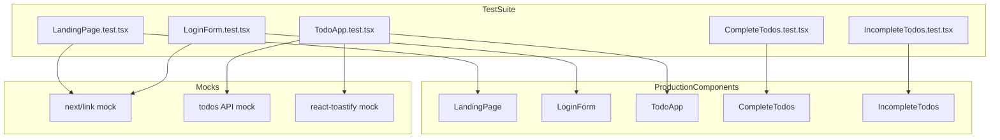

# Design Document: frontend-screen-tests

## Overview

This feature adds automated regression test coverage for five untested frontend components in the todo-web application: LandingPage, LoginForm, TodoApp, CompleteTodos, and IncompleteTodos. The test suite uses Vitest + React Testing Library (RTL) with the jsdom environment already configured in `vitest.config.ts`. Five new test files are placed in `_test_/` subdirectories adjacent to each component, following the pattern established by the existing `InputTodo.test.tsx`.

**Purpose**: Provide automated regression coverage so that behavior regressions in frontend screen components are detected before merge.
**Users**: Frontend developers run `pnpm test` locally and in CI to verify component behavior.
**Impact**: Adds 5 new test files with 26 test cases. No production source code is modified.

### Goals
- Cover all 26 acceptance criteria defined in Requirements 1–6
- Follow the `_test_/` colocated directory pattern and existing Vitest + RTL style
- Use no new dependencies beyond what is already installed

### Non-Goals
- Testing `app/*/page.tsx` wrapper files (no executable logic)
- E2E or browser testing (out of scope; different toolchain)
- Modifying production source code
- Adding new test libraries

---

## Boundary Commitments

### This Spec Owns
- 5 new test files: `LandingPage.test.tsx`, `LoginForm.test.tsx`, `TodoApp.test.tsx`, `CompleteTodos.test.tsx`, `IncompleteTodos.test.tsx`
- `vi.mock()` definitions for `next/link`, `@/lib/api/todos`, and `react-toastify` within those test files
- Test fixture data (sample `Todo` objects used across tests)

### Out of Boundary
- `InputTodo.test.tsx` — already complete; not modified
- `app/*/page.tsx` — no test files created for thin wrapper pages
- Production source code (`features/`, `components/`, `lib/`) — not modified
- `vitest.config.ts` and `vitest.setup.ts` — already configured; not modified
- Backend API tests in `todo-api` — separate concern

### Allowed Dependencies
- `vitest` 4.1.9 — test runner and `vi.mock` / `vi.fn`
- `@testing-library/react` 16.3.2 — component rendering and queries
- `@testing-library/user-event` 14.6.1 — user interaction simulation
- `@testing-library/jest-dom` 6.9.1 — DOM assertion matchers
- `@/lib/api/todos` — mocked in TodoApp tests (not called directly)
- `@/lib/validation` — imported directly (pure functions; no mock needed)
- `next/link` — mocked in LandingPage and LoginForm tests
- `react-toastify` — mocked in TodoApp tests

### Revalidation Triggers
- `LandingPage.tsx` heading text or navigation link targets change → `LandingPage.test.tsx` needs update
- `LoginForm.tsx` validation error messages or field structure changes → `LoginForm.test.tsx` needs update
- `TodoApp.tsx` CRUD behavior, incomplete todo limit, or state update flow changes → `TodoApp.test.tsx` needs update
- `CompleteTodos.tsx` or `IncompleteTodos.tsx` button labels or callback signatures change → respective test files need update
- `lib/validation.ts` error messages change → `LoginForm.test.tsx` acceptance criteria 2.3–2.6 need update

---

## Architecture

### Existing Architecture Analysis

The project already has Vitest configured with `jsdom` environment, React 19, and Next.js 16 App Router. The established test pattern (from `InputTodo.test.tsx`) is:
- Test file colocated in `_test_/` subdirectory beside the component
- Imports from `vitest` (`describe`, `it`, `expect`, `vi`) and `@testing-library/react` (`render`, `screen`)
- `userEvent.setup()` for interaction simulation
- `vi.fn()` for callback mocks

Next.js App Router `'use client'` components render normally under RTL + jsdom. `next/link` requires a mock since the Next.js router context is absent in jsdom.

### Architecture Pattern & Boundary Map



### Technology Stack

| Layer | Choice / Version | Role |
|-------|-----------------|------|
| Test Runner | Vitest 4.1.9 | Test execution, `vi.mock`, `vi.fn`, `waitFor` |
| UI Testing | @testing-library/react 16.3.2 | `render`, `screen` queries |
| User Events | @testing-library/user-event 14.6.1 | `userEvent.setup()`, click/type simulation |
| DOM Assertions | @testing-library/jest-dom 6.9.1 | `toBeInTheDocument`, `toBeDisabled`, `toHaveBeenCalledWith` |
| Environment | jsdom 29.1.1 | Browser DOM simulation in Node.js |

---

## File Structure Plan

```
todo-web/
├── features/
│   ├── landing/
│   │   └── _test_/
│   │       └── LandingPage.test.tsx    # NEW — Req 1.1, 1.2, 1.3
│   ├── auth/
│   │   └── _test_/
│   │       └── LoginForm.test.tsx      # NEW — Req 2.1–2.7, 3.1, 3.2
│   └── todo/
│       └── _test_/
│           └── TodoApp.test.tsx        # NEW — Req 4.1–4.7
└── components/
    └── todo/
        └── _test_/
            ├── InputTodo.test.tsx      # EXISTING — not modified
            ├── CompleteTodos.test.tsx  # NEW — Req 5.1–5.3
            └── IncompleteTodos.test.tsx # NEW — Req 6.1–6.4
```

No production files are modified.

---

## Requirements Traceability

| Requirement | Summary | Test File | Mocks |
|-------------|---------|-----------|-------|
| 1.1 | heading "シンプルさこそ便利さ。" displayed | LandingPage.test.tsx | next/link |
| 1.2 | link to /login rendered | LandingPage.test.tsx | next/link |
| 1.3 | link to /register rendered | LandingPage.test.tsx | next/link |
| 2.1 | login mode renders title "ログイン" | LoginForm.test.tsx | next/link |
| 2.2 | email + password inputs and submit button | LoginForm.test.tsx | next/link |
| 2.3 | empty email → error "メールアドレスを入力してください!" | LoginForm.test.tsx | next/link |
| 2.4 | invalid email format → error "メールの形式が正しくありません" | LoginForm.test.tsx | next/link |
| 2.5 | empty password → error "パスワードを入力してください!" | LoginForm.test.tsx | next/link |
| 2.6 | weak password → error "8文字以上・大文字1つ・数字1つ以上が必要です" | LoginForm.test.tsx | next/link |
| 2.7 | login mode renders link to /register | LoginForm.test.tsx | next/link |
| 3.1 | register mode renders title "新規登録" | LoginForm.test.tsx | next/link |
| 3.2 | register mode renders link to /login | LoginForm.test.tsx | next/link |
| 4.1 | fetched todos displayed on mount | TodoApp.test.tsx | todos API, toastify |
| 4.2 | new todo appears in incomplete section after add | TodoApp.test.tsx | todos API, toastify |
| 4.3 | complete button moves todo to completed section | TodoApp.test.tsx | todos API, toastify |
| 4.4 | delete button removes todo from list | TodoApp.test.tsx | todos API, toastify |
| 4.5 | back button moves todo to incomplete section | TodoApp.test.tsx | todos API, toastify |
| 4.6 | 5 incomplete todos disables add button + shows warning | TodoApp.test.tsx | todos API, toastify |
| 4.7 | clicking disabled add button adds no todo | TodoApp.test.tsx | todos API, toastify |
| 5.1 | completed todos list renders each title | CompleteTodos.test.tsx | none |
| 5.2 | empty list renders no todo items | CompleteTodos.test.tsx | none |
| 5.3 | 戻す button invokes onClickBack with todo id | CompleteTodos.test.tsx | none |
| 6.1 | incomplete todos list renders each title | IncompleteTodos.test.tsx | none |
| 6.2 | empty list renders no todo items | IncompleteTodos.test.tsx | none |
| 6.3 | 完了 button invokes onClickComplete with todo id | IncompleteTodos.test.tsx | none |
| 6.4 | 削除 button invokes onClickDelete with todo id | IncompleteTodos.test.tsx | none |

---

## Components and Interfaces

### Summary Table

| Test File | Requirements | Mocks Required | Async |
|-----------|-------------|----------------|-------|
| LandingPage.test.tsx | 1.1–1.3 | next/link | No |
| LoginForm.test.tsx | 2.1–2.7, 3.1–3.2 | next/link | No |
| TodoApp.test.tsx | 4.1–4.7 | @/lib/api/todos, react-toastify | Yes |
| CompleteTodos.test.tsx | 5.1–5.3 | none | No |
| IncompleteTodos.test.tsx | 6.1–6.4 | none | No |

---

### Feature Tests

#### LandingPage.test.tsx

| Field | Detail |
|-------|--------|
| Intent | Verify heading text and navigation links render correctly |
| Requirements | 1.1, 1.2, 1.3 |

**Mock Setup**

```typescript
vi.mock('next/link', () => ({
  default: ({ href, children }: { href: string; children: React.ReactNode }) => (
    <a href={href}>{children}</a>
  ),
}));
```

**Test Structure**
```
describe("LandingPage") {
  renders heading "シンプルさこそ便利さ。"
  renders link to /login
  renders link to /register
}
```

---

#### LoginForm.test.tsx

| Field | Detail |
|-------|--------|
| Intent | Verify login/register mode UI and client-side validation error messages |
| Requirements | 2.1–2.7, 3.1, 3.2 |

**Mock Setup**: Same `next/link` mock as LandingPage.test.tsx.

**Key Design Note**: `LoginForm` calls `e.currentTarget.submit()` when validation passes. In jsdom, `HTMLFormElement.submit()` is a no-op, so tests focus on verifying error message presence/absence after form submit attempts. `lib/validation` is a pure function; it is imported directly without mocking.

**Test Structure**
```
describe("LoginForm") {
  describe("login mode") {
    renders title "ログイン"                             // Req 2.1
    renders email and password inputs and submit button // Req 2.2
    shows email required error on empty submit          // Req 2.3
    shows email format error on invalid email           // Req 2.4
    shows password required error on empty submit       // Req 2.5
    shows password strength error on weak password      // Req 2.6
    renders link to /register                           // Req 2.7
  }
  describe("register mode") {
    renders title "新規登録"                            // Req 3.1
    renders link to /login                              // Req 3.2
  }
}
```

---

#### TodoApp.test.tsx

| Field | Detail |
|-------|--------|
| Intent | Verify async data load, CRUD interactions, and 5-item incomplete limit |
| Requirements | 4.1–4.7 |

**Mock Setup**

```typescript
vi.mock('@/lib/api/todos', () => ({
  fetchTodos: vi.fn(),
  createTodo: vi.fn(),
  updateTodo: vi.fn(),
  deleteTodo: vi.fn(),
}));

vi.mock('react-toastify', () => ({
  toast: { error: vi.fn() },
}));
```

**Async Strategy**
- `fetchTodos` is called in `useEffect` on mount. After `render()`, use `await waitFor(() => screen.getByText(...))` to assert that fetched todo titles appear.
- After user interactions (`userEvent.click`), use `waitFor()` to assert state changes.

**Test Fixture**

```typescript
const mockIncompleteTodo: Todo = {
  id: 1, title: "未完了Todo", status: 0,
  created_at: "2026-01-01T00:00:00Z", updated_at: "2026-01-01T00:00:00Z",
};
const mockCompleteTodo: Todo = {
  id: 2, title: "完了Todo", status: 1,
  created_at: "2026-01-01T00:00:00Z", updated_at: "2026-01-01T00:00:00Z",
};
```

**Fetch Refresh Pattern**: `TodoApp` calls `fetchTodos` again after `createTodo`. The mock must return updated data on the second call:
```typescript
fetchTodos
  .mockResolvedValueOnce([...initialTodos])   // initial load
  .mockResolvedValueOnce([...updatedTodos]);  // after create
```

**5-item Limit Test**: Pre-populate `fetchTodos` with 5 incomplete todos to assert that the add button is disabled and the limit message is shown.

**Test Structure**
```
describe("TodoApp") {
  beforeEach: reset all mocks, set default fetchTodos return value

  displays fetched todos on mount                                  // Req 4.1
  adds new todo to incomplete section on click                     // Req 4.2
  moves todo to completed section on complete button click         // Req 4.3
  removes todo from list on delete button click                    // Req 4.4
  moves todo to incomplete section on back button click            // Req 4.5
  disables add button and shows warning with 5 incomplete todos    // Req 4.6
  does not add todo when add button is disabled                    // Req 4.7
}
```

---

### Component Tests

#### CompleteTodos.test.tsx

| Field | Detail |
|-------|--------|
| Intent | Verify completed todo list rendering and 戻す callback dispatch |
| Requirements | 5.1, 5.2, 5.3 |

**No mocks required** — pure presentational component.

**Props Contract**

```typescript
type CompleteTodoProps = {
  todos: Todo[];
  onClickBack: (id: number) => void;
};
```

**Test Structure**
```
describe("CompleteTodos") {
  renders each todo title                             // Req 5.1
  renders no items when list is empty                 // Req 5.2
  calls onClickBack with correct id on 戻す click     // Req 5.3
}
```

---

#### IncompleteTodos.test.tsx

| Field | Detail |
|-------|--------|
| Intent | Verify incomplete todo list rendering, 完了 and 削除 callback dispatch |
| Requirements | 6.1–6.4 |

**No mocks required** — same pattern as CompleteTodos.

**Props Contract**

```typescript
type InCompleteTodoProps = {
  todos: Todo[];
  onClickComplete: (id: number) => void;
  onClickDelete: (id: number) => void;
};
```

**Test Structure**
```
describe("IncompleteTodos") {
  renders each todo title                               // Req 6.1
  renders no items when list is empty                   // Req 6.2
  calls onClickComplete with correct id on 完了 click   // Req 6.3
  calls onClickDelete with correct id on 削除 click     // Req 6.4
}
```

---

## Testing Strategy

The test suite is this feature's primary artifact. The following patterns are applied consistently across all test files.

| Pattern | Usage |
|---------|-------|
| `render()` + `screen.getBy*()` | Rendering assertions (Reqs 1, 2, 3, 4, 5, 6) |
| `userEvent.setup()` + `await user.click/type()` | Interaction simulation (Reqs 2, 4, 5, 6) |
| `vi.fn()` + `expect(fn).toHaveBeenCalledWith()` | Callback verification (Reqs 5, 6) |
| `waitFor()` | Async state assertion (Req 4 — useEffect, mutation handlers) |
| `vi.mock()` with factory | Module-level mock for next/link, API module, toastify |
| `mockResolvedValueOnce()` | Sequenced async return values (Req 4.2–4.5 fetch refresh) |

**Total new test cases**: 26 (matching the 26 acceptance criteria)
