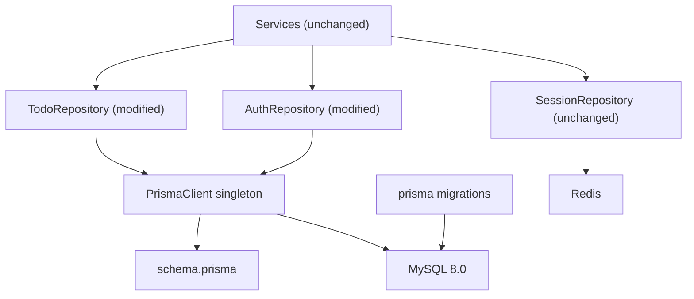
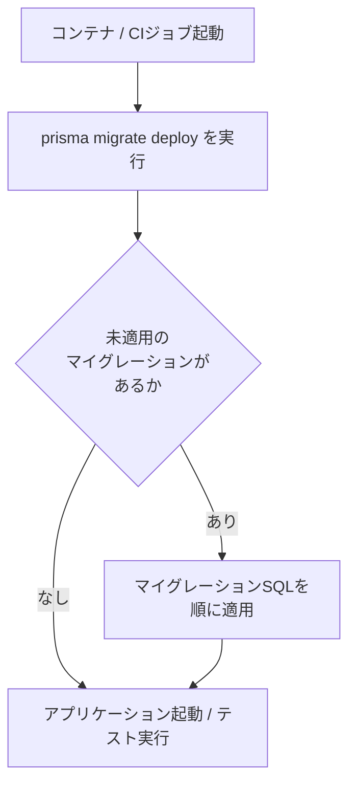
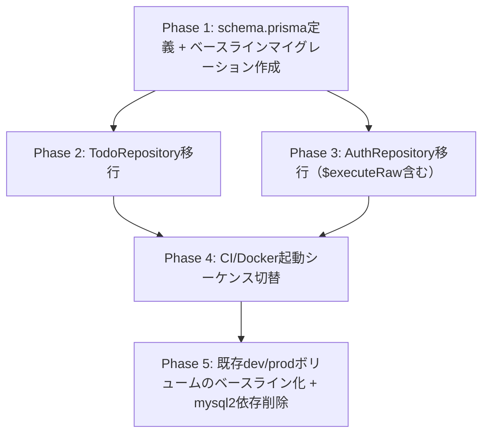

# 技術設計書

## Overview

本機能は、`todo-api`のデータアクセス層をPrisma ORM(`7.8.0`)ベースに置き換える。現状`todo-api/src/repositories/`配下の`TodoRepository`/`AuthRepository`は`mysql2`による生SQLを個別に手書きしており、テーブル・リレーションが増えるほど型不整合のリスクが上がる。本機能を完了させることで、以降のspec（`team-management`, `task-status-model`, `task-assignment`）が新規テーブル・カラムを型安全なPrisma Migrateのマイグレーションとして追加できる基盤が整う。

**Users**: `todo-api`を実装・保守する開発者。エンドユーザー（Todoアプリ利用者）から見た挙動・レスポンスは一切変化しない。

**Impact**: `todo-api/src/db/client.ts`（`mysql2`の`pool`）を`Prisma Client`のシングルトンに置き換え、`TodoRepository`/`AuthRepository`の内部実装をPrisma Clientベースに書き換える。スキーマ管理の正を`mysql/init.sql`からPrisma Migrateのマイグレーション履歴に移す。サービス層・コントローラー層・ルート層・フロントエンドは変更しない。

### Goals
- 既存の`users`/`todos`テーブルをPrismaの`schema.prisma`として型安全に定義する
- `TodoRepository`/`AuthRepository`の全メソッドをPrisma Clientベースに移行し、既存のAPI挙動（レスポンス形式・エラーハンドリング・認可ロジック・「最後の管理者」不変条件）を1つも変えない
- Prisma Migrateによるマイグレーション運用（ベースライン化・CI・Docker起動シーケンス）を確立し、以降のspecがスキーマ変更を型安全に行える状態にする

### Non-Goals
- `groups`/`membership`等の新規テーブル・カラムの追加（`team-management`以降のspecの責務）
- APIレスポンス形式・エラーメッセージ・ステータスコードの変更
- 既存の認可ロジック・バリデーションロジックの変更
- DBエンジンの変更（MySQLを継続使用）
- `SessionRepository`（Redisベースのセッション追跡）の実装変更

## Boundary Commitments

### This Spec Owns
- `prisma/schema.prisma`（`users`/`todos`モデル定義、enum定義、datasource/generator設定）
- `prisma/migrations/`配下のベースラインマイグレーションと、以降のマイグレーション運用手順
- `todo-api/src/db/prismaClient.ts`（Prisma Clientシングルトンの提供。旧`db/client.ts`を置き換える）
- `TodoRepository`・`AuthRepository`の内部実装（公開メソッドシグネチャ・戻り値の形は変更しない）
- CI（`ci.yml`）・`todo-api/Dockerfile`・`docker-compose*.yml`におけるスキーマ適用手順（`mysql/init.sql`実行からPrisma Migrate実行への置き換え）

### Out of Boundary
- `SessionRepository`/`sessionRepositoryInstance.ts`（Redisベース。`mysql2`/リレーショナルDBと無関係のため対象外）
- サービス層（`AuthService`, `AdminUserService`, `ProfileService`, `TodoService`, `SessionService`）の業務ロジック・呼び出しシグネチャ
- コントローラー層・ルート層（Fastifyスキーマ、認可ガード）
- `groups`/`membership`等、既存の2テーブル（`users`, `todos`）以外の新規スキーマ設計
- フロントエンド（`todo-web`）

### Allowed Dependencies
- Prisma CLI / `@prisma/client`（`^7.8.0`、npm registryで確認済みの現行安定版）
- MySQL 8.0（既存のDBエンジンをそのまま利用。バージョン変更なし）
- 既存の`AppError`（`todo-api/src/errors/AppError.ts`）— リポジトリ層はこれまで通りエラーを送出しない（エラー判定はサービス層の責務のまま）

### Revalidation Triggers
- `prisma/schema.prisma`のモデル・enum定義を変更する場合（後続spec全てが再検証対象）
- `TodoRepository`/`AuthRepository`の公開メソッドシグネチャ・戻り値の形を変更する場合
- `DATABASE_URL`の接続文字列形式・環境変数名を変更する場合
- マイグレーション適用手順（CI/Docker起動シーケンス）を変更する場合

## Architecture

### Existing Architecture Analysis

現状のレイヤードアーキテクチャ（`routes → controllers → services → repositories → DB`）における依存方向は維持する。変更が閉じるのは`repositories`層と`db`層のみであり、`services`層以上は一切変更しない。

- 既存パターン: リポジトリはオブジェクトリテラル（`TodoRepository`, `AuthRepository`）としてexportされ、`static`メソッド的に呼び出される。この呼び出し形は維持する
- 維持すべき制約: `TodoRepository.findAll(userId)`のようにuser_idスコープを常に適用する、`affectedRows`（influenced行数）を返すことでサービス層が404/409を判別する契約
- 技術的負債: マイグレーション管理の仕組みが存在しない（`mysql/init.sql`が唯一のスキーマ源）。本機能で解消する

### Architecture Pattern & Boundary Map



**Architecture Integration**:
- 選択パターン: 既存のレイヤードアーキテクチャを維持したまま、リポジトリ層の内部実装のみをPrisma Clientベースに置き換える「内部実装差し替え」パターン
- ドメイン境界: `TodoRepository`（todosドメイン）と`AuthRepository`（auth/admin.user/profileドメイン）の境界は既存のまま維持し、統合・分割は行わない
- 既存パターンの維持: サービス層からの呼び出しシグネチャ、`affectedRows`ベースのエラー判別契約、user_idスコープの強制
- 新規コンポーネントの理由: `prismaClient.ts`（接続の一元管理）、`prisma/schema.prisma`・`prisma/migrations/`（スキーマ・マイグレーション履歴の正）
- Steering準拠: TypeScript strict、`any`不使用（`tech.md`）、レイヤー単一責務（`structure.md`）を維持

**依存方向**: `schema.prisma`（型・データモデル定義）→ `prismaClient.ts`（接続設定）→ `Repository`（データアクセス）→ `Service`（既存・変更なし）→ `Controller/Route`（既存・変更なし）。各層は左側のレイヤーのみを参照し、右から左への逆参照は行わない。

### Technology Stack

| Layer | Choice / Version | Role in Feature | Notes |
|-------|------------------|------------------|-------|
| ORM | Prisma / `@prisma/client` `^7.8.0` | スキーマ定義・型安全なクエリ実行・マイグレーション管理 | npm registryで現行安定版として確認済み（`research.md`参照） |
| Data / Storage | MySQL 8.0 | 既存DBエンジンを継続使用 | バージョン変更なし |
| Backend | Fastify 5 / Node.js 22（既存） | リポジトリ層のみ変更、上位層は無変更 | CI/Dockerfileが既にNode.js 22 |

## File Structure Plan

### Directory Structure
```
todo-api/
├── prisma/
│   ├── schema.prisma              # User/Todoモデル、enum、datasource/generator定義（新規）
│   └── migrations/
│       └── 0_init/
│           └── migration.sql      # mysql/init.sqlと同一DDLのベースラインマイグレーション（新規）
├── src/
│   ├── db/
│   │   ├── client.ts              # 削除（mysql2 pool。Prisma移行完了後に不要）
│   │   └── prismaClient.ts        # PrismaClientシングルトンをexport（新規）
│   ├── repositories/
│   │   ├── todos.repository.ts    # 変更: Prisma Client呼び出しに書き換え（公開シグネチャ不変）
│   │   ├── auth.repository.ts     # 変更: Prisma Client呼び出しに書き換え（updateRole/updateStatusは$executeRaw維持）
│   │   ├── session.repository.ts          # 変更なし（Redisベース、対象外）
│   │   └── sessionRepositoryInstance.ts    # 変更なし
│   └── types/
│       └── todo.ts                # 変更なし（Todo型はリポジトリ境界でそのまま維持）
```

### Modified Files
- `todo-api/package.json` — `prisma`（devDependencies）・`@prisma/client`（dependencies）を追加、`mysql2`は全リポジトリ移行完了後に削除
- `todo-api/src/repositories/todos.repository.ts` — 内部実装をPrisma Clientに置き換え
- `todo-api/src/repositories/auth.repository.ts` — 内部実装をPrisma Clientに置き換え（2メソッドは`$executeRaw`）
- `todo-api/src/repositories/_test_/*.test.ts` — 実DBに対する統合テストの体裁は維持したまま、fixture準備・後始末を`pool.query`からPrisma Client呼び出しに最小限差し替え
- `todo-api/Dockerfile` — `CMD`をマイグレーション適用（`prisma migrate deploy`）→アプリ起動の順に変更
- `docker-compose.dev.yml` — `api`サービスの`command`にマイグレーション適用ステップを追加
- `docker-compose.yml` / `docker-compose.prod.yml` — 本番起動シーケンスにマイグレーション適用ステップを追加
- `.github/workflows/ci.yml` — `mysql ... < mysql/init.sql`ステップを`prisma migrate deploy`に置き換え
- `todo-api/.env.dev` / 本番環境変数 — `DATABASE_URL`を追加
- `mysql/init.sql` — 廃止（スキーマの正をPrisma Migrateへ一本化。ファイル自体は履歴として残置するかは実装時に判断）

## System Flows

### マイグレーション適用フロー（アプリ起動時）



- ゲーティング条件: `prisma migrate deploy`が失敗した場合はアプリケーションを起動しない（フェイルファスト）
- 初回切替時のみ、既存の永続化済みdev/prodボリュームに対して`prisma migrate resolve --applied 0_init`を1回実行し、ベースラインマイグレーションを「適用済み」として記録する（DDLは再実行しない）。CIは毎回まっさらなDBサービスコンテナのため、この手順は不要で`prisma migrate deploy`のみでよい

## Requirements Traceability

| Requirement | Summary | Components | Interfaces | Flows |
|-------------|---------|------------|------------|-------|
| 1.1, 1.2, 1.3, 1.4 | 既存スキーマのPrisma化 | PrismaSchema | schema.prisma（User/Todoモデル、enum） | - |
| 2.1–2.7 | Todoデータアクセス移行 | TodoRepository, PrismaClientSingleton | TodoRepository Service Interface | - |
| 3.1–3.4, 3.10–3.12 | 認証・プロフィールデータアクセス移行 | AuthRepository, PrismaClientSingleton | AuthRepository Service Interface | - |
| 3.5–3.9 | 管理者ロール/ステータス変更の不変条件維持 | AuthRepository | AuthRepository Service Interface（$executeRaw） | - |
| 4.1–4.4 | マイグレーション運用の確立 | MigrationWorkflow | prisma/migrations, CI/Docker起動シーケンス | マイグレーション適用フロー |
| 5.1–5.4 | 既存動作の非回帰保証 | TodoRepository, AuthRepository, MigrationWorkflow | 全リポジトリ公開シグネチャ不変 | - |
| 5.5 | SessionRepository不変 | SessionRepository (Out of Boundary) | 変更なし | - |

## Components and Interfaces

| Component | Domain/Layer | Intent | Req Coverage | Key Dependencies (P0/P1) | Contracts |
|-----------|---------------|--------|---------------|---------------------------|-----------|
| PrismaSchema | Data Layer | `users`/`todos`のモデル・enum定義の正 | 1.1, 1.2, 1.3, 1.4 | MySQL 8.0 (P0) | State |
| PrismaClientSingleton | Data Layer | Prisma Clientの単一インスタンスを提供 | 2.1–2.7, 3.1–3.12 | PrismaSchema (P0) | Service |
| TodoRepository | Data Layer | Todo CRUDのPrismaベース実装 | 2.1–2.7, 5.1, 5.3, 5.4 | PrismaClientSingleton (P0) | Service |
| AuthRepository | Data Layer | 認証/管理者/プロフィールのPrismaベース実装 | 3.1–3.12, 5.1, 5.2, 5.3, 5.4 | PrismaClientSingleton (P0) | Service |
| MigrationWorkflow | Ops/Infra | ベースライン化・CI・Docker起動時のマイグレーション適用 | 4.1, 4.2, 4.3, 4.4 | PrismaSchema (P0) | Batch |

### Data Layer

#### PrismaSchema

| Field | Detail |
|-------|--------|
| Intent | 既存`users`/`todos`テーブルの構造をPrismaのモデル・enumとして定義し、以降のスキーマ変更の型安全な起点にする |
| Requirements | 1.1, 1.2, 1.3, 1.4 |

**Responsibilities & Constraints**
- `User`モデル：`id`(Int, PK, autoincrement), `email`(String, unique), `passwordHash`(String, `@map("password_hash")`), `role`(UserRole enum, default member), `status`(AccountStatus enum, default active), `createdAt`/`updatedAt`(DateTime, `@map`), `name`(String)
- `Todo`モデル：`id`(Int, PK, autoincrement), `userId`(Int, `@map("user_id")`), `title`(String), `status`(Boolean, default false), `createdAt`/`updatedAt`(DateTime), `user`リレーション（`onDelete: Cascade`）
- `UserRole` enum: `admin`, `member`。`AccountStatus` enum: `active`, `disabled`
- テーブル名は`@@map("users")`/`@@map("todos")`で既存の物理名を維持し、カラム名も`@map`で既存のスネークケースを維持する（アプリ側フィールド名はcamelCaseにするか既存のスネークケースをそのまま使うかは実装時に統一するが、いずれの場合もDB上の物理名は変更しない）
- 既存データへの破壊的変更（カラム削除・非互換な型変更）を発生させない

**Dependencies**
- Outbound: MySQL 8.0 — datasourceとして接続（P0）

**Contracts**: Service [ ] / API [ ] / Event [ ] / Batch [ ] / State [x]

##### State Management
- State model: `users`/`todos`テーブルの構造そのものがstate。Prisma Migrateのマイグレーション履歴が変更履歴を管理する
- Persistence & consistency: 既存のPRIMARY KEY・UNIQUE制約・FOREIGN KEY（ON DELETE CASCADE）をそのまま維持
- Concurrency strategy: スキーマレベルの排他制御なし（行レベルの排他は`AuthRepository`の該当メソッドが個別に担う）

**Implementation Notes**
- Integration: `prisma generate`で型を生成し、`prismaClient.ts`経由でリポジトリ層に公開する
- Validation: `prisma migrate diff`等でベースラインマイグレーションのDDLが`mysql/init.sql`と一致することを実装時に確認する
- Risks: カラム名のスネークケース/キャメルケース変換方針が曖昧だと、後続specのモデル追加時に命名規則が割れる。実装タスクで統一方針を確定する

#### PrismaClientSingleton

| Field | Detail |
|-------|--------|
| Intent | アプリ全体で単一の`PrismaClient`インスタンスを共有し、接続をシングルトンとして管理する（旧`pool`の役割を継承） |
| Requirements | 2.1–2.7, 3.1–3.12 |

**Responsibilities & Constraints**
- モジュール読み込み時に`PrismaClient`を1度だけインスタンス化してexportする（`db/client.ts`の`pool`と同じ初期化パターン）
- `DATABASE_URL`環境変数から接続情報を取得する（`dotenv`で`.env`読み込み、既存の`db/client.ts`と同じ規約）

**Dependencies**
- Outbound: PrismaSchema（生成された型・クライアントコード） (P0)

**Contracts**: Service [x] / API [ ] / Event [ ] / Batch [ ] / State [ ]

##### Service Interface
```typescript
export const prisma: PrismaClient;
```
- Preconditions: `DATABASE_URL`が有効な接続文字列として設定されていること
- Postconditions: 呼び出し元（`TodoRepository`/`AuthRepository`）はこの単一インスタンスを通じてのみDBにアクセスする
- Invariants: プロセス内で複数の`PrismaClient`インスタンスを生成しない（接続プールの重複を避ける）

**Implementation Notes**
- Integration: 実装開始時にPrisma 7.8.0のMySQL接続方式（ドライバアダプタの要否）を`prisma init`のスキャフォールド出力で確認し、必要な追加パッケージがあれば導入する（`research.md`のRisks参照）
- Validation: アプリ起動時に接続失敗した場合、既存の`pool`同様にプロセス起動が失敗する状態を維持する
- Risks: バージョン間でのAPI差異。実装タスクの最初にこの1コンポーネントを確定させてから他タスクに着手する

#### TodoRepository（変更）

| Field | Detail |
|-------|--------|
| Intent | Todo CRUDをPrisma Clientベースで実行し、既存の公開シグネチャ・挙動を維持する |
| Requirements | 2.1, 2.2, 2.3, 2.4, 2.5, 2.6, 2.7, 5.1, 5.3, 5.4 |

**Responsibilities & Constraints**
- `findAll(userId)`: `prisma.todo.findMany({ where: { userId } })`相当。返り値の形は既存`Todo[]`と一致させる
- `findById(id, userId)`: `prisma.todo.findFirst({ where: { id, userId } })`相当。存在しなければ`null`
- `create(title, userId, status)`: `prisma.todo.create(...)`相当。`created_at`/`updated_at`は既存同様DB側で自動設定（Prismaの`@default(now())`/`@updatedAt`、または既存同様アプリ側で明示指定するかは実装時に統一）
- `update(id, userId, data)`: `title`/`status`のうち指定されたフィールドのみを`prisma.todo.updateMany({ where: { id, userId }, data: {...} })`相当で更新。指定フィールドが0件なら何もしない（既存の早期return挙動を維持）
- `delete(id, userId)`: `prisma.todo.deleteMany({ where: { id, userId } })`相当
- 全メソッドで`userId`スコープを常に条件に含め、他ユーザーのTodoを操作させない

**Dependencies**
- Inbound: TodoService — Todo CRUD呼び出し (P0)
- Outbound: PrismaClientSingleton (P0)

**Contracts**: Service [x] / API [ ] / Event [ ] / Batch [ ] / State [ ]

##### Service Interface
```typescript
interface TodoRepositoryContract {
  findAll(userId: number): Promise<Todo[]>;
  findById(id: number, userId: number): Promise<Todo | null>;
  create(title: string, userId: number, status?: number): Promise<void>;
  update(id: number, userId: number, data: Partial<Pick<Todo, "title" | "status">>): Promise<void>;
  delete(id: number, userId: number): Promise<void>;
}
```
- Preconditions: `userId`は認証済みセッションから取得された値であること（サービス層の責務）
- Postconditions: 戻り値の形・件数は移行前の`mysql2`実装と同一
- Invariants: `user_id`が一致しない行は一切変更・返却しない

**Implementation Notes**
- Integration: 既存の`TodoService`は無変更。呼び出しシグネチャが変わらないことを型チェック（`pnpm build`）で保証する
- Validation: 既存の`todos.repository.test.ts`をPrisma呼び出し用に最小限修正し、同一のアサーションが通ることを確認する
- Risks: `todos.status`はMySQL上`BOOLEAN`（実体`TINYINT(1)`）。Prismaの`Boolean`型マッピングと既存コードの`status: number`引数の扱い（0/1）の整合を実装時に確認する

#### AuthRepository（変更）

| Field | Detail |
|-------|--------|
| Intent | 認証・管理者ロール/ステータス変更・プロフィール操作をPrisma Clientベースで実行し、既存の公開シグネチャ・不変条件を維持する |
| Requirements | 3.1, 3.2, 3.3, 3.4, 3.5, 3.6, 3.7, 3.8, 3.9, 3.10, 3.11, 3.12, 5.1, 5.2, 5.3, 5.4 |

**Responsibilities & Constraints**
- `findByEmail`/`findById`/`findAll`/`createUser`/`updateName`/`findPasswordHashById`/`updatePasswordHash`: 標準的なPrisma Clientのモデル操作（`findUnique`/`findMany`/`create`/`update`）で置き換え可能。列選択は既存同様`select`で絞り込む（`findByEmail`のみ`password_hash`を含む全カラム、それ以外はAPI到達可能なため`password_hash`を除外）
- `updateRole`/`updateStatus`: 「対象ユーザー以外に有効な管理者が1人以上いる場合のみ許可」という不変条件を、既存と同一のSQL文（派生テーブルでラップしたEXISTSサブクエリ）を`prisma.$executeRaw`（タグ付きテンプレート、パラメータバインド）でそのまま実行して維持する。`updated_at = NOW()`を明示的にSETに含める既存の冪等性保証もそのまま踏襲する
- 戻り値は既存同様、影響を受けた行数（`affectedRows`相当）を返す。`AdminUserService`はこの値のみで404/409を判別するため、この契約を変更しない

**Dependencies**
- Inbound: AuthService, AdminUserService, ProfileService (P0)
- Outbound: PrismaClientSingleton (P0)

**Contracts**: Service [x] / API [ ] / Event [ ] / Batch [ ] / State [ ]

##### Service Interface
```typescript
interface AuthRepositoryContract {
  findByEmail(email: string): Promise<User | null>;
  findById(id: number): Promise<User | null>;
  findAll(): Promise<UserSummary[]>;
  createUser(input: CreateUserInput): Promise<void>;
  updateRole(userId: number, newRole: UserRole): Promise<number>;
  updateStatus(userId: number, newStatus: AccountStatus): Promise<number>;
  updateName(userId: number, name: string): Promise<number>;
  findPasswordHashById(userId: number): Promise<string | null>;
  updatePasswordHash(userId: number, passwordHash: string): Promise<number>;
}
```
- Preconditions: `updateRole`/`updateStatus`は対象行(id)基準で判定し、リクエスト送信者（requesterId）を引数に取らない（既存契約と同一）
- Postconditions: 降格・無効化が「対象ユーザー以外に有効な管理者0人」の場合、更新行数0を返す（更新不成立）。それ以外は既存の値変更なし冪等再送を含め、更新行数1以上を返す
- Invariants: 「有効な管理者が最低1人残る」という不変条件は、count確認とupdateの2ステップに分解せず単一の生SQL文でアトミックに強制される

**Implementation Notes**
- Integration: `AdminUserService`/`ProfileService`/`AuthService`は無変更。既存の`UserRole`/`AccountStatus`/`User`/`UserSummary`型定義は`auth.repository.ts`からの再exportを維持する
- Validation: 既存の`auth.repository.test.ts`・`auth.repository.concurrency.test.ts`をPrisma呼び出し用に最小限修正し、同一のアサーション（特に並行更新時の不変条件）が通ることを確認する
- Risks: `$executeRaw`はPrismaのスキーマ変更検知・型チェックの対象外。将来`users`テーブルのカラム名を変更する際にこの2メソッドを見落とすリスクがあるため、コード内コメントで明記する（`research.md`のRisks参照）

### Ops/Infra

#### MigrationWorkflow

| Field | Detail |
|-------|--------|
| Intent | Prisma Migrateによるベースライン化・以降のマイグレーション作成・CI/Docker起動時の自動適用手順を確立する |
| Requirements | 4.1, 4.2, 4.3, 4.4 |

**Responsibilities & Constraints**
- ベースラインマイグレーション（`prisma/migrations/0_init/migration.sql`）は`mysql/init.sql`と同一のDDLを持つ
- CI（`ci.yml`）: MySQLサービスコンテナ起動後、`mysql ... < mysql/init.sql`ステップを`pnpm --filter todo-api exec prisma migrate deploy`に置き換える
- Docker起動シーケンス（`Dockerfile`のCMD、`docker-compose.dev.yml`の`api.command`）: アプリ起動前に`prisma migrate deploy`を実行し、失敗時はアプリを起動しない
- 既存の永続化済みdev/prod DBボリュームに対しては、初回切替時のみ`prisma migrate resolve --applied 0_init`を1回実行してベースラインを「適用済み」として記録する（データ・スキーマの再作成は行わない）

**Dependencies**
- Outbound: PrismaSchema（マイグレーション対象のモデル定義） (P0)
- External: MySQL 8.0 (P0)

**Contracts**: Service [ ] / API [ ] / Event [ ] / Batch [x] / State [ ]

##### Batch / Job Contract
- Trigger: コンテナ起動（dev/prod）、CIジョブ実行
- Input / validation: `DATABASE_URL`環境変数、`prisma/migrations/`配下のマイグレーション履歴
- Output / destination: MySQL上の`users`/`todos`スキーマが最新マイグレーション状態に一致
- Idempotency & recovery: `prisma migrate deploy`は未適用のマイグレーションのみ適用するため、再実行しても安全（冪等）。適用失敗時はマイグレーションが「失敗」として記録され、次回実行時に手動解決が必要（Prisma標準の失敗ハンドリング）

**Implementation Notes**
- Integration: `.env.dev`・本番環境変数・CI環境変数に`DATABASE_URL`を追加する
- Validation: CI実行時、ベースラインマイグレーション適用後に既存Vitestスイートが全て合格することを確認する
- Risks: 永続化済みボリュームに対するベースライン化手順を実施し忘れると、次回`prisma migrate deploy`がテーブル重複作成で失敗する（`research.md`のRisks参照。デプロイ前チェックリストに明記する）

## Data Models

### Domain Model
- `User`（アグリゲートルート）: `id`を自然キーとする認証・認可の中心エンティティ。`role`/`status`の値変更に「有効な管理者が最低1人残る」不変条件を持つ
- `Todo`（アグリゲートルート）: `userId`に従属し、所有者以外からは不可視・操作不可（user_idスコープ）
- ドメインイベントなし（本機能は内部実装置き換えのみ）

### Logical Data Model
- `User 1 --- N Todo`（`Todo.user_id → User.id`、`ON DELETE CASCADE`）
- 自然キー: `User.email`（UNIQUE）、`User.id`/`Todo.id`（サロゲートキー、AUTO_INCREMENT）
- 参照整合性: 既存のFOREIGN KEY制約をPrismaスキーマの`@relation(onDelete: Cascade)`でそのまま表現する

### Physical Data Model

**For Relational Databases**:
- `users`: `id INT AUTO_INCREMENT PK`, `email VARCHAR(255) UNIQUE NOT NULL`, `password_hash VARCHAR(255) NOT NULL`, `role ENUM('admin','member') NOT NULL DEFAULT 'member'`, `status ENUM('active','disabled') NOT NULL DEFAULT 'active'`, `created_at/updated_at DATETIME`, `name VARCHAR(255) NOT NULL`
- `todos`: `id INT AUTO_INCREMENT PK`, `user_id INT NOT NULL FK→users.id ON DELETE CASCADE`, `title VARCHAR(255) NOT NULL`, `status BOOLEAN NOT NULL DEFAULT 0`, `created_at/updated_at DATETIME`
- インデックス: 既存のPRIMARY KEY・UNIQUE（`users.email`）・FOREIGN KEY（`todos.user_id`）をそのまま維持。新規インデックスは本機能の範囲外
- パーティショニング: 対象外（データ量・要件から不要）

## Error Handling

### Error Strategy
リポジトリ層は既存同様、エラーを`AppError`に変換しない（サービス層の責務のまま）。Prisma固有の例外（`PrismaClientKnownRequestError`等）がリポジトリ層から送出された場合も、サービス層は既存の404/409判別ロジック（`affectedRows`ベース）をそのまま使用するため、通常フローでPrisma例外がサービス層まで伝播することは想定しない。

### Error Categories and Responses
- **接続エラー**（DB接続不可）: 既存の`mysql2` poolと同様、アプリ起動時またはリクエスト処理時に例外として伝播し、上位のFastifyエラーハンドラが処理する既存挙動を変更しない
- **制約違反**（例: 重複email）: `AuthService.register`が事前に`findByEmail`で重複チェック済みのため、Prismaのユニーク制約違反はこのフローでは発生しない想定（既存同様）

### Monitoring
既存同様、追加のロギング・監視基盤は導入しない（本機能のスコープ外）。

## Testing Strategy

### Unit Tests
- `TodoRepository`の各メソッド（`findAll`/`findById`/`create`/`update`/`delete`）が期待するPrismaクエリ引数を構築すること（Requirements 2.1–2.6）
- `AuthRepository`の標準CRUDメソッド（`findByEmail`/`findById`/`findAll`/`createUser`/`updateName`/`findPasswordHashById`/`updatePasswordHash`）がPrisma呼び出しに正しく置き換わっていること（Requirements 3.1–3.4, 3.10–3.12）

### Integration Tests
- 既存の`todos.repository.test.ts`（create→findAll、findById、update、delete）を実MySQLに対して実行し、移行前と同一の結果になること（Requirements 2.1–2.7, 5.1, 5.4）
- 既存の`auth.repository.test.ts`・`auth.repository.concurrency.test.ts`（特に「唯一の有効な管理者」への降格・無効化拒否、並行更新時の不変条件）を実MySQLに対して実行し、移行前と同一の結果になること（Requirements 3.5–3.9, 5.2, 5.4）
- ベースラインマイグレーション適用後のCI実行で、既存のVitestスイート全体が合格すること（Requirement 4.1, 5.4）

### E2E/UI Tests
対象外（本機能はAPI内部実装の置き換えのみで、UIフローは変化しない）。

### Migration/Ops Tests
- 新規の空DBに対して`prisma migrate deploy`を実行し、`mysql/init.sql`適用後と同一のテーブル構造（カラム・制約・デフォルト値）が得られること（Requirement 4.1, 4.3）
- 既存スキーマ適用済みのDBに対して`prisma migrate resolve --applied`を実行した後、`prisma migrate deploy`が正常終了すること（Requirement 4.4）

## Migration Strategy



- ロールバックトリガー: Phase4（CI切替）でVitestスイートが合格しない場合、CIの変更のみを既存の`mysql/init.sql`適用方式に戻し、Phase1–3の是正を行ってから再度Phase4に進む
- 検証チェックポイント: 各Phase完了時に`pnpm test`（Vitest）と`pnpm build`（型チェック）が合格することを確認する
- Phase5は本番デプロイ前に、永続化済みDBボリュームへの`prisma migrate resolve --applied`実行を運用手順として1回のみ実施する

## Open Questions / Risks
- Prisma 7.8.0でのMySQL接続方式（ドライバアダプタの要否・パッケージ名）は実装タスク開始時に`prisma init`のスキャフォールド出力で確認する（`research.md`参照）
- Prismaフィールド命名規則（camelCase運用か既存スネークケースをそのまま使うか）は`PrismaClientSingleton`実装前に統一方針を決定する
