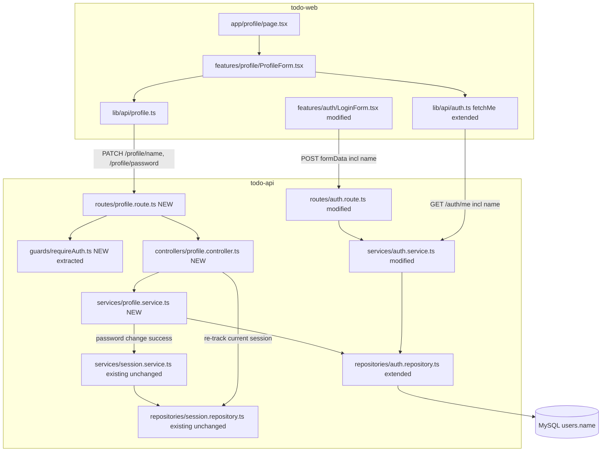
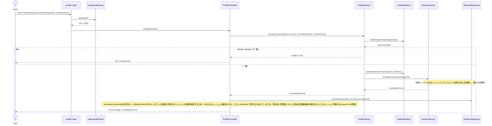

# Technical Design

## Overview

**Purpose**: ログイン中のユーザーが自分の表示名を確認・変更し、パスワードを安全に変更できる最低限のプロフィール画面を提供する。

**Users**: 認証済みの全ユーザー（ロールを問わない）が、`/profile`画面から自分自身の情報のみを操作する。

**Impact**: `users`テーブルに`name`カラムを追加する。新規登録フローに`name`入力を必須化し、既存アカウントには導入時に一括で初期値をバックフィルする。`AuthRepository`に表示名・パスワード変更用のメソッドを追加し、新規`ProfileService`/`ProfileController`/`profile.route.ts`を追加する。パスワード変更時は既存の`SessionService.invalidateUserSessions`を呼び出すが、そのシグネチャは変更しない。

### Goals
- ログイン中のユーザーが自分の表示名を確認・変更できる
- 新規登録時にnameが必須入力になり、導入前から存在するアカウントにも自動的に初期値が設定される
- ログイン中のユーザーが、現在のパスワードの確認を伴って自分のパスワードを変更できる
- パスワード変更成功時、変更を行った本人のセッションは維持したまま、それ以外の既存セッションを強制終了する
- 表示名の変更・パスワードの変更のいずれも、要求元の認証済みユーザー本人のアカウントのみを対象にする（他ユーザーを対象にする経路が存在しない）
- パスワード変更操作に、ログインと同水準の総当たり対策を適用する

### Non-Goals
- アバター画像アップロード
- パスワード変更のメール通知、メールリンクによるパスワードリセット（別スペック）
- 他ユーザーの表示名・パスワードの閲覧・変更（管理者機能を含む）
- 認証・Cookie関連の既存セキュリティ設定の見直し（アプリ全体の既存の検討事項であり本specでは対応しない）

## Boundary Commitments

### This Spec Owns
- `users`テーブルへの`name`カラムの追加と、導入前から存在するアカウントへの初期値バックフィル
- 新規登録時の`name`入力必須化（`POST /auth/register`のリクエストスキーマ拡張）
- `/auth/me`レスポンスへの`name`追加（既存フィールドの形状は変更しない）
- 自分自身の表示名変更API（`PATCH /profile/name`）
- 自分自身のパスワード変更API（`PATCH /profile/password`）— 現在パスワードの確認を必須とする
- パスワード変更成功時、既存の強制セッション無効化能力（`SessionService.invalidateUserSessions`）を呼び出し、かつ変更を行った本人のセッションが正しく維持・追跡され続けるための連携ロジック
- パスワード変更エンドポイントへの専用レート制限
- todo-web側のプロフィール画面（表示名の表示・変更、パスワード変更のUI）
- 登録フォーム（`LoginForm.tsx`の`mode==="register"`時）への`name`入力欄の追加
- Todo画面（`TodoApp.tsx`）ヘッダーへの自分の表示名の表示（既存の`fetchMe()`呼び出しを流用、新規API呼び出しなし）

### Out of Boundary
- アバター画像アップロード
- パスワード変更のメール通知、メールリンクによるパスワードリセット
- 他ユーザーの表示名・パスワードの閲覧・変更
- 認証・Cookie関連の既存セキュリティ設定の見直し
- `SessionService`・`SessionRepository`の内部実装（Redis索引、複数インスタンス間の一貫性）— `session-invalidation` specが既に提供済みで、本specはそれを呼び出す側としてのみ関与する
- 管理者向けユーザー一覧（`GET /admin/users`）のUI・API仕様変更 — `name`カラム追加により`AuthRepository.findAll`のレスポンスに`name`が付随的に含まれるが、これは既存の管理者向け情報開示範囲を超えない副次的な効果であり、本specが管理者画面を変更するものではない

### Allowed Dependencies
- `SessionService.invalidateUserSessions`（`todo-api/src/services/session.service.ts`）— シグネチャ・戻り値型を変更せずに呼び出す
- `SessionRepository.trackSession`（`todo-api/src/repositories/session.repository.ts`、`sessionRepositoryInstance.ts`経由）— 変更を行った本人セッションの索引再登録に使用する
- `AuthRepository`（`todo-api/src/repositories/auth.repository.ts`）— 拡張対象（表示名・パスワード関連メソッドを追加）
- 既存のパスワード強度ルール（`todo-api/src/routes/auth.route.ts`の`password`スキーマ定義）— 新規パスワードにも同一のルールを適用する

### Revalidation Triggers
- `SessionService.invalidateUserSessions`のシグネチャ・戻り値変更
- `SessionRepository`の索引キー設計（`user-sessions:<userId>`）の変更
- `/auth/me`レスポンス形状の変更（`admin-user-management`のmiddlewareキャッシュ拡張にも影響する）
- `users`テーブルの`name`カラムの型・NOT NULL制約の変更
- `guards/requireAuth.ts`（本specで抽出）の判定ロジック変更（`todo.route.ts`側の挙動にも影響する）

## Architecture

### Existing Architecture Analysis
- レイヤー構成（routes → controllers → services → repositories → DB）を維持する。
- ユーザー行への唯一のアクセス経路は`AuthRepository`であり、並行するリポジトリは作らない（`admin-user-management`と同じ方針、`research.md`参照）。
- 「認証済みであること」を要求するだけの単純なpreHandler（`todos.route.ts`に既にインライン実装済み）は、本specで2箇所目の利用が発生するため、`admin-user-management`が`adminOnlyGuard`を切り出した判断（2箇所目の利用時点で共通化）と同じ基準で`guards/requireAuth.ts`として切り出す。挙動は変更しない。

### Architecture Pattern & Boundary Map



**Architecture Integration**:
- 選択パターン: 既存の層構造をそのまま拡張（新規アーキテクチャパターンの導入なし）
- ドメイン境界: 「自分自身のプロフィール操作」を新規`ProfileService`として`AuthService`（自己認証・登録）および`AdminUserService`（他者操作）から分離
- 既存パターンの維持: プラグインスコープ`preHandler`ガード、`AppError`ベースのエラー処理、`_test_`同居のテスト配置、`updated_at = NOW()`明示によるUPDATE、`SELECT *`禁止によるパスワードハッシュの非露出
- 新規コンポーネントの理由: `ProfileService`/`ProfileController`/`profile.route.ts`は「本人による自己操作」という、既存の`AuthService`（登録・ログイン）とも`AdminUserService`（管理者による他者操作）とも異なる責務を持つため分離する
- Steering準拠: サーバーサイドauth guard必須（`structure.md`）、レイヤー分離維持、TypeScript strict・`any`不使用

### Technology Stack

| Layer | Choice / Version | Role in Feature | Notes |
|-------|------------------|------------------|-------|
| Backend | Fastify 5 / TypeScript（既存） | プロフィールAPI追加 | 新規ライブラリなし |
| Data | MySQL（既存） | `users.name`カラム追加 | 手動`ALTER TABLE`運用（`role`/`status`と同じ、`research.md`参照） |
| Frontend | Next.js 16 / React 19（既存） | プロフィール画面UI、登録フォーム拡張 | 新規ライブラリなし |
| Auth | bcrypt（既存） | 現在パスワードの照合・新パスワードのハッシュ化 | 既存の`AuthService.login`/`register`と同じ`bcrypt.compare`/`bcrypt.hash(_, 10)` |

## File Structure Plan

### Directory Structure
```
todo-api/src/
├── guards/
│   ├── adminOnly.ts               # 既存・変更なし
│   └── requireAuth.ts             # NEW: 認証済み(req.session.userIdあり)判定preHandler。
│                                   #      todos.route.tsのインライン実装を切り出したもの(挙動不変)
├── repositories/
│   └── auth.repository.ts         # MODIFIED: User/UserSummary型にname追加。findById/findAll/
│                                   #           createUserのSELECT列にname追加。
│                                   #           updateName, findPasswordHashById, updatePasswordHash を追加
├── services/
│   ├── auth.service.ts            # MODIFIED: register()がnameを受け取りcreateUserへ渡す
│   └── profile.service.ts         # NEW: updateName, changePassword(現在パスワード照合・
│                                   #      更新・SessionService連携)
├── controllers/
│   └── profile.controller.ts      # NEW: リクエスト解析、ProfileServiceの呼び出し、
│                                   #      パスワード変更成功時の本人セッション再追跡
├── routes/
│   ├── auth.route.ts              # MODIFIED: register専用スキーマにnameを追加(loginとは別スキーマに分離)、
│   │                                #           passwordFieldSchema/nameFieldSchemaをexport
│   ├── todos.route.ts             # MODIFIED: インラインpreHandlerをguards/requireAuth.tsのimportに置き換え(挙動不変)
│   └── profile.route.ts           # NEW: PATCH /profile/name, PATCH /profile/password
│                                   #      (専用レート制限つき)
├── types/
│   └── todo.ts                    # MODIFIED: RegisterBody型を追加(LoginBody + name)
│   └── profile.ts                 # NEW: UpdateNameBody, ChangePasswordBody
└── app.ts                         # MODIFIED: profileRoutes を登録

mysql/init.sql                     # MODIFIED: users.name VARCHAR(255) NOT NULL を追加(新規DB用)
docs/wiki/Database-Schema.md       # MODIFIED: nameカラムをスキーマ図・テーブル定義に反映
docs/wiki/Database-Schema.ja.md    # MODIFIED: 同上(日本語版)

todo-web/
├── middleware.ts                  # 変更なし(/profileはPUBLIC_PATHS外のため既存の認証必須ルールがそのまま適用される)
├── lib/
│   ├── types.ts                  # MODIFIED: User型にname追加
│   ├── validation.ts             # MODIFIED: validateName追加(1〜50文字)
│   └── api/
│       ├── auth.ts               # MODIFIED: CurrentUser型・fetchMe()の戻り値にname追加
│       └── profile.ts            # NEW: updateProfileName, changeProfilePassword
├── features/
│   ├── auth/
│   │   └── LoginForm.tsx         # MODIFIED: mode==="register"時のみname入力欄を表示
│   ├── todo/
│   │   └── TodoApp.tsx           # MODIFIED: ヘッダーに全認証済みユーザー向けの「プロフィール」リンクを追加
│   └── profile/
│       ├── ProfileForm.tsx       # NEW: 表示名の表示/変更カード + パスワード変更カード(2枚を1ページに縦積み)
│       └── _test_/
│           └── ProfileForm.test.tsx # NEW
└── app/
    ├── api/auth/register/route.ts # MODIFIED: formDataからnameを取り出しJSONに含める
    └── profile/
        └── page.tsx               # NEW: ProfileForm を render
```

### Modified Files
- `todo-api/src/repositories/auth.repository.ts` — `User`/`UserSummary`型に`name: string`を追加。`findByEmail`（`SELECT *`のため自動的に含まれる）・`findById`・`findAll`のSELECT列に`name`を追加。`createUser`が`name`を受け取り`INSERT`に含める。`updateName(userId, name): Promise<number>`（`UPDATE users SET name = ?, updated_at = NOW() WHERE id = ?`、affectedRows返却）を追加。`findPasswordHashById(userId): Promise<string | null>`（`SELECT password_hash FROM users WHERE id = ?`）を追加。`updatePasswordHash(userId, passwordHash): Promise<number>`（`UPDATE users SET password_hash = ?, updated_at = NOW() WHERE id = ?`）を追加。
- `todo-api/src/services/auth.service.ts` — `register`が`RegisterBody`（`{email, password, name}`）を受け取り、`AuthRepository.createUser`に`name`を渡す。`me`は`findById`の戻り値をそのまま返すため変更不要（`name`は自動的に含まれる）。
- `todo-api/src/controllers/auth.controller.ts` — `me`のレスポンスに`name`を追加（`{ id, email, role, name }`）。`newRegister`は`RegisterBody`を型として使うよう変更。
- `todo-api/src/routes/auth.route.ts` — `password`用のスキーマ断片を`passwordFieldSchema`としてexportし、新規に`nameFieldSchema`（`{type:"string", minLength:1, maxLength:50}`）を定義してexportする。`authBodySchema`を`loginBodySchema`（email/password、変更なし）と`registerBodySchema`（email/password/name、`name`必須）に分離し、`POST /auth/register`は`registerBodySchema`を使う。
- `todo-api/src/routes/todos.route.ts` — インラインの`preHandler`（401判定）を`guards/requireAuth.ts`のimportに置き換える。判定内容・レスポンスは変更しない。
- `todo-api/src/app.ts` — `profileRoutes`をimportし登録する。
- `mysql/init.sql` — `users`テーブルに`name VARCHAR(255) NOT NULL`を追加。**新規作成DBのみ**が対象で、既存DBへの適用は下記Migration Strategy参照。
- `docs/wiki/Database-Schema.md` / `.ja.md` — ER図・テーブル定義に`name`を反映。
- `todo-web/middleware.ts` — 変更不要。`/profile`は`PUBLIC_PATHS`に含まれないため、既存の「非公開パスは認証必須」ルールがそのまま適用される（`/todos`と同様）。
- `todo-web/lib/types.ts` — `User`型に`name: string`を追加。
- `todo-web/lib/api/auth.ts` — `CurrentUser`型に`name: string`を追加（`fetchMe()`は`/auth/me`をそのまま呼ぶため実装変更は型のみ）。
- `todo-web/features/auth/LoginForm.tsx` — `mode==="register"`のときのみ`name`の`<input>`を表示し、`handleSubmit`で`validateName`によるクライアント側チェックを追加する。
- `todo-web/app/api/auth/register/route.ts` — `formData.get("name")`を取り出し、Fastifyへ転送するJSONボディに含める。
- `todo-web/features/todo/TodoApp.tsx` — ヘッダーの管理者リンク（`isAdmin`条件付き）と同じスタイルで、`isAdmin`を問わず全認証済みユーザーに表示される「プロフィール」リンクを追加する。現状`/profile`への画面上の導線が存在しないため必須の変更。管理者は「管理者画面」「プロフィール」「ログアウト」の3ボタンが並ぶことになり、狭い画面幅では窮屈になりうるため、右側のボタン群コンテナに`flex-wrap`を追加し、収まらない場合は自然に折り返す（新規コンポーネントは追加しない、既存スタイルのみの軽微な調整）。

## System Flows

### パスワード変更フロー（Requirement 5, 6, 7, 8）



- `PATCH /profile/name`は上記のような分岐がない単純なCRUD更新のため、専用の図は省略する（`ProfileService.updateName` → `AuthRepository.updateName`の単純呼び出し）。
- パスワード変更エンドポイントには`config: { rateLimit: { max: 10, timeWindow: "15 minutes" } }`（`/auth/login`と同一値）を設定し、Requirement 8を満たす。

## Requirements Traceability

| Requirement | Summary | Components | Interfaces | Flows |
|---|---|---|---|---|
| 1.1 | プロフィール画面で表示名を提示 | AuthService.me, AuthRepository.findById | `GET /auth/me` | - |
| 1.2 | Todo画面ヘッダーで表示名を提示 | TodoApp（拡張）, lib/api/auth (fetchMe) | `GET /auth/me` | - |
| 2.1 | 表示名を変更 | ProfileService.updateName, AuthRepository.updateName | `PATCH /profile/name` | - |
| 2.2 | 変更後の表示名を1〜50文字に制限 | profile.route.ts (nameFieldSchema) | `PATCH /profile/name` | - |
| 2.3 | 変更後、次回取得時に反映 | AuthService.me（既存・無変更） | `GET /auth/me` | - |
| 3.1 | 登録時にnameを必須項目にする | auth.route.ts (registerBodySchema) | `POST /auth/register` | - |
| 3.2 | name未入力の登録要求を拒否 | auth.route.ts (registerBodySchema, required) | `POST /auth/register` | - |
| 3.3 | 登録時のnameを1〜50文字に制限 | auth.route.ts (nameFieldSchema) | `POST /auth/register` | - |
| 4.1 | 導入前アカウントへ初期nameを設定 | Migration Strategy（SQLバックフィル） | - | - |
| 4.2 | 未変更のアカウントは初期nameを維持 | Migration Strategy（一度きりのUPDATE、以降はアプリ側で変更しない限り不変） | - | - |
| 5.1 | 現在パスワード確認を伴うパスワード変更 | ProfileService.changePassword, AuthRepository.findPasswordHashById/updatePasswordHash | `PATCH /profile/password` | パスワード変更フロー |
| 5.2 | 現在パスワード不一致時は拒否 | ProfileService.changePassword (bcrypt.compare) | `PATCH /profile/password` | パスワード変更フロー |
| 5.3 | 新パスワードの強度要件を登録時と同一にする | profile.route.ts (passwordFieldSchema再利用) | `PATCH /profile/password` | - |
| 6.1 | 変更成功時、本人以外の既存セッションを終了 | ProfileService.changePassword → SessionService.invalidateUserSessions | - | パスワード変更フロー |
| 6.2 | 変更成功時、本人のセッションは維持 | ProfileController.changePassword（destroy()を呼ばず、trackSessionで再登録） | - | パスワード変更フロー |
| 7.1 | 表示名・パスワード変更は要求者本人のみを対象にする | guards/requireAuth.ts, ProfileController（session.userIdのみを使用、bodyにuserIdなし） | `PATCH /profile/name`, `PATCH /profile/password` | - |
| 8.1 | パスワード変更への総当たり対策 | profile.route.ts (config.rateLimit) | `PATCH /profile/password` | - |
| 9.1 | 未認証者からの要求を拒否 | guards/requireAuth.ts | `GET /auth/me`, `PATCH /profile/name`, `PATCH /profile/password` | - |
| 9.2 | 認証済みユーザーのみ許可 | guards/requireAuth.ts | 同上 | - |

## Components and Interfaces

| Component | Domain/Layer | Intent | Req Coverage | Key Dependencies (P0/P1) | Contracts |
|-----------|--------------|--------|---------------|---------------------------|-----------|
| `requireAuthGuard` | API / Guard | 認証済み(`req.session.userId`あり)のみ許可 | 9.1, 9.2 | なし | Service |
| `ProfileService` | API / Service | 表示名変更、パスワード変更(現在パスワード照合・セッション連携) | 2.1, 5.1, 5.2, 6.1, 7.1 | AuthRepository (P0), SessionService (P0) | Service |
| `ProfileController` | API / Controller | リクエスト整形、パスワード変更成功時の本人セッション再追跡 | 2.1, 5.1, 6.2, 7.1 | ProfileService (P0), SessionRepository (P0) | API |
| `AuthRepository`（拡張） | API / Repository | usersテーブルのname・パスワードハッシュの読み書き | 1.1, 2.1, 3.1, 4.1, 5.1 | MySQL (P0) | Service |
| `AuthService`（拡張） | API / Service | 登録時のname保存、`/auth/me`でのname返却 | 1.1, 3.1 | AuthRepository (P0) | Service |
| `ProfileForm`（todo-web） | Web / Feature | 表示名の表示/変更、パスワード変更UI | 1.1, 2.1, 5.1 | lib/api/profile (P0), lib/api/auth (P0) | - |
| `LoginForm`（拡張, todo-web） | Web / Feature | 登録時のname入力 | 3.1, 3.3 | - | - |
| `TodoApp`（拡張, todo-web） | Web / Feature | Todo画面ヘッダーに自分の表示名を提示 | 1.2 | lib/api/auth (fetchMe、既存の呼び出しを流用) | - |

### API / Guard

#### requireAuthGuard

| Field | Detail |
|-------|--------|
| Intent | `req.session.userId`が存在することのみを確認するpreHandler |
| Requirements | 9.1, 9.2 |

**Responsibilities & Constraints**
- 未認証（`req.session.userId`なし）なら401を返し処理を止める
- `todos.route.ts`・`profile.route.ts`双方のプラグインスコープに`app.addHook("preHandler", requireAuthGuard)`として適用する（`adminOnlyGuard`と同じ、Fastifyカプセル化によりスコープ外へは影響しない）
- ロール・アカウント状態の判定は行わない（`adminOnlyGuard`とは責務が異なる。既存`todos.route.ts`のインライン実装と完全に同じ判定内容）

**Contracts**: Service [x]

```typescript
function requireAuthGuard(req: FastifyRequest, reply: FastifyReply): Promise<void | FastifyReply>;
```
- Preconditions: なし
- Postconditions: 許可された場合は何も送信せず`undefined`を返す。拒否された場合は401を送信し処理を止める
- Invariants: `req.session`以外に依存しない

### API / Service

#### ProfileService

| Field | Detail |
|-------|--------|
| Intent | 自分自身の表示名変更、現在パスワード確認を伴うパスワード変更 |
| Requirements | 2.1, 5.1, 5.2, 6.1, 7.1 |

**Responsibilities & Constraints**
- 権限チェックは行わない（呼び出し元ルートの`requireAuthGuard`が既に確認済みという前提。`AdminUserService`と同じ規約）
- **対象ユーザーは常に呼び出し元が渡す`userId`（＝セッションから取得した本人のID）のみ。`userId`をリクエストボディ・パスパラメータから受け取らない設計そのものによって、他ユーザーを対象にする経路が構造的に存在しない**（Requirement 7）
- `changePassword`は、現在パスワードが一致した場合のみ更新し、成功時は必ず`SessionService.invalidateUserSessions`を呼ぶ（呼び出し元本人のセッションの生死判定はController側の責務、Serviceは関与しない）

**Dependencies**
- Outbound: `AuthRepository` — ユーザー行の読み書き (P0)
- Outbound: `SessionService.invalidateUserSessions` — 変更成功時の強制ログアウト (P0)

**Contracts**: Service [x]

```typescript
interface ProfileServiceType {
  updateName(userId: number, name: string): Promise<void>;
  changePassword(
    userId: number,
    currentPassword: string,
    newPassword: string
  ): Promise<{ invalidatedCount: number }>;
}
```
- Preconditions: `userId`は呼び出し元ガードにより認証済みであることが確認済みのセッションから取得された値
- Postconditions: `updateName`成功後、対象ユーザーの`name`は指定値に更新されている。`changePassword`成功後、対象ユーザーの全セッションが無効化されている（呼び出し元本人のセッションを維持するかどうかはController側の責務であり、このメソッドの契約には含まれない）
- Invariants: `userId`と一致しないユーザーの行が変更されることはない（両メソッドとも`WHERE id = ?`で対象を一意に固定するSQLのみを発行する）

**Implementation Notes**
- Integration: `updateName`は`AuthRepository.updateName`の`affectedRows`が0の場合、`AppError("user not found", 404)`を投げる（有効なセッションからは通常発生しないが、防御的に扱う）。`changePassword`は`findPasswordHashById`が`null`を返した場合も同様に404。
- Validation: `name`の長さ・`newPassword`の強度チェックはルートスキーマ（AJV）側で行う
- Risks: `updatePasswordHash`成功後に`invalidateUserSessions`が例外を投げた場合、パスワード自体は既に更新済み（ロールバックしない）。呼び出し元は500として扱う（`AdminUserService.changeStatus`と同じ受容済みの設計判断）

### API / Controller

#### ProfileController

| Field | Detail |
|-------|--------|
| Intent | リクエスト解析、`ProfileService`呼び出し、パスワード変更成功時の本人セッション再追跡 |
| Requirements | 2.1, 5.1, 6.2, 7.1 |

**Contracts**: API [x]

##### API Contract

| Method | Endpoint | Request | Response | Errors |
|--------|----------|---------|----------|--------|
| PATCH | `/profile/name` | `{ name: string }` | `{ message: "name updated" }` | 400, 401, 404 |
| PATCH | `/profile/password` | `{ currentPassword: string, newPassword: string }` | `{ message: "password updated", invalidatedCount: number }` | 400, 401, 404, 429 |

**Implementation Notes**
- Integration: `changePassword`ハンドラは、`ProfileService.changePassword`成功後に**必ず**`getSessionRepository().trackSession(userId, req.session.sessionId)`を呼ぶ。`req.session.destroy()`は呼ばない — `admin.session.controller.ts`とは逆に、ここでは本人セッションを意図的に「復活」させたいため（`research.md`「パスワード変更後の『自分のセッションだけ残す』」参照）。
- Validation: `userId`はいずれのハンドラも`req.session.userId!`からのみ取得する。リクエストボディ・パスパラメータに`userId`に相当するフィールドは一切定義しない（Requirement 7 の構造的な保証）。
- Risks: `trackSession`の呼び出しを忘れると、本人セッションはログイン状態としては維持される（`@fastify/session`の自動再保存のため）が、管理者による将来の強制無効化の索引から漏れる。この振る舞いは外部から観測しづらいため、Testing Strategyで専用に検証する。

### Web / Feature

#### ProfileForm / `lib/api/profile.ts`

| Field | Detail |
|-------|--------|
| Intent | 表示名の表示・変更、パスワード変更のUI |
| Requirements | 1.1, 2.1, 5.1 |

**Responsibilities & Constraints**
- ページ読み込み時に`fetchMe()`（`lib/api/auth.ts`、拡張済み）を呼び、`id`/`email`/`name`を表示する
- `lib/api/adminUsers.ts`と同じ直接fetchパターン（`credentials: "include"`、Cookie変更を伴わないため`app/api`プロキシは不要）に従う
- 表示名変更・パスワード変更は別々のフォーム操作として提供する（Requirement 2とRequirement 5は独立した操作）
- **画面構成**: `AdminUserList`と同じヘッダーパターン（ロゴ、「タスク一覧へ戻る」リンク）を持つ単一ページ（`/profile`）とし、その下に2つのカードを縦に並べる
  1. アカウント情報カード: メールアドレス（読み取り専用表示）、表示名（編集可能な入力欄）、「更新」ボタン
  2. パスワード変更カード: 現在のパスワード、新しいパスワード、新しいパスワード（確認用）の3つの入力欄、「変更」ボタン
- **確認用パスワード入力欄はクライアント側のみの検証**（新しいパスワードと一致しない場合は送信前に拒否）であり、APIへは送信しない。API契約（`currentPassword`/`newPassword`の2フィールド）は変更しない
- `TodoApp.tsx`のヘッダーに、認証済みユーザー全員が使える「プロフィール」への遷移リンクを追加する（既存の管理者リンクと同じスタイル、`isAdmin`条件なしで常に表示）。現状`/profile`へ到達する手段が画面上に存在しないため、この導線追加は本UIの前提条件

**Contracts**: API [x] / State [x]

```typescript
// lib/api/profile.ts
function updateProfileName(name: string): Promise<void>;
function changeProfilePassword(
  currentPassword: string,
  newPassword: string
): Promise<{ invalidatedCount: number }>;
```

**Implementation Notes**
- Integration: エラー（400/401/404/429）は`lib/api/todos.ts`と同様に`throw new Error(...)`し、呼び出し元コンポーネントで`AdminUserList`と同じ`react-toastify`によるトースト表示を行う。429の場合は「しばらく待ってから再試行してください」等、他と区別できるメッセージにする。パスワード変更成功時のトーストには、他のセッションが終了したことを伝える文言を含める
- Validation: 送信前に`lib/validation.ts`の`validateName`/`validatePassword`でクライアント側の事前チェックを行う（サーバー側スキーマ検証が権威、クライアント側はUX向上のみ）。確認用パスワードの不一致もこの段階で弾く
- Risks: なし

#### LoginForm（拡張）

| Field | Detail |
|-------|--------|
| Intent | 登録時のname入力 |
| Requirements | 3.1, 3.3 |

**Responsibilities & Constraints**
- `mode==="register"`のときのみ`name`の`<input name="name">`を表示する
- `handleSubmit`で`validateName`によるクライアント側チェックを追加し、`mode==="login"`のときは従来通りemail/passwordのみを検証する

**Contracts**: なし（既存コンポーネントへの条件分岐追加）

#### TodoApp（拡張）

| Field | Detail |
|-------|--------|
| Intent | Todo画面ヘッダーに自分の表示名を提示する |
| Requirements | 1.2 |

**Responsibilities & Constraints**
- `TodoApp`は既に`isAdmin`判定のために`fetchMe()`を呼んでいる（タスク4.3で追加済み）。この既存の呼び出し結果（`me.name`）をヘッダーに表示するだけで、新たなAPI呼び出しは追加しない
- 表示位置はヘッダー左側（ロゴ/ワードマークの隣）とし、右側の「管理者画面」「プロフィール」「ログアウト」ボタン群とは干渉しない
- 表示名が未取得（`fetchMe`失敗時）の間は何も表示しない（既存の`isAdmin`同様、失敗時はデフォルト値のまま握りつぶす。ログイン画面へのリダイレクトは既存middlewareの責務）

**Contracts**: なし（既存コンポーネントへの表示追加のみ）

**Implementation Notes**
- Integration: 「本機能導入前から存在するアカウント」も1.1のバックフィルによりこの時点で必ずnameを持つため、空表示になるケースはない

## Data Models

### Physical Data Model

`users`テーブルに1カラム追加:

| Column | Type | Constraints | Notes |
|---|---|---|---|
| `name` | `VARCHAR(255)` | `NOT NULL` | 導入前アカウントには下記Migration Strategyでバックフィルする |

`todos`テーブルへの変更なし。

### Migration Strategy

新規作成DB（`init.sql`実行のみ）は`name VARCHAR(255) NOT NULL`をそのまま含められるが、**既存のdev/staging/本番DBには手動での3段階の`ALTER`/`UPDATE`が必要**（`role`/`status`カラム追加時と同じ「`init.sql`は正式なマイグレーションツールではない」制約、`research.md`参照）。行ごとに異なる値をバックフィルする必要があるため、`role`/`status`のような単一の`DEFAULT`定数では対応できない。

```sql
-- 1. 一時的にNULL許容で追加
ALTER TABLE users ADD COLUMN name VARCHAR(255) NULL;

-- 2. 既存の全行に、emailの@より前の部分を初期値としてバックフィル
UPDATE users SET name = SUBSTRING_INDEX(email, '@', 1) WHERE name IS NULL;

-- 3. NOT NULL制約を確定
ALTER TABLE users MODIFY COLUMN name VARCHAR(255) NOT NULL;
```

**デプロイ順序の注意**（`admin-user-management`と同種のリスク）: 上記マイグレーションは、新アプリコードのデプロイより先に（最低でも同時に）本番へ適用しなければならない。`AuthRepository.findById`/`findAll`等が全ユーザーが通る経路で無条件に`name`列を`SELECT`するため、カラムが存在しない状態で新コードが先に動くと、プロフィール機能だけでなく`/auth/me`・ログイン後の全画面遷移が失敗しうる。デプロイ手順（CD）にこの順序を明記すること。

**3ステップ間のレースコンディションに関する注意**: このマイグレーションの実行中は旧アプリコードがまだ稼働しており、`name`を送らない既存の登録エンドポイントがリクエストを受け付け続けている。ステップ1（NULL許容追加）からステップ3（NOT NULL確定）までの間に新規登録が入ると、その行は手順2のバックフィル対象に含まれず`name IS NULL`のまま残り、ステップ3が失敗しうる。本アプリは個人運用の小規模自宅サーバー運用であり、ゼロダウンタイムマイグレーションの仕組みを構築するのは過剰であるため、**この3ステップを実行する間は新規登録を一時的に停止する**（アプリを短時間停止する、またはメンテナンスモードにする）運用で対応する。3ステップは連続して流し、間を空けない。

## Error Handling

### Error Categories and Responses
- **400 Bad Request**: `name`が1〜50文字の範囲外、`newPassword`が強度要件を満たさない、`currentPassword`/`newPassword`が未指定（AJVスキーマ検証、`profile.route.ts`/`auth.route.ts`）
- **401 Unauthorized**: 未認証で`/profile/*`にアクセス（`requireAuthGuard`）／パスワード変更時に現在パスワードが一致しない（`ProfileService.changePassword`）
- **404 Not Found**: 有効なセッションが指す`userId`のユーザー行が見つからない場合（防御的、通常到達しない）
- **429 Too Many Requests**: `PATCH /profile/password`への短時間の大量試行（既存の`@fastify/rate-limit`、`/auth/login`と同一設定）
- **500 Internal Server Error**: `updatePasswordHash`成功後に`SessionService.invalidateUserSessions`が例外を投げた場合。パスワードは既に更新済みのため、ユーザーは新パスワードで再ログイン可能（`AdminUserService.changeStatus`と同じ受容済みの設計判断）

### Monitoring
既存の`req.log.error`によるログ記録パターンを継続する。追加の監視要件はスコープ外（Non-Goals参照）。

## Security Considerations

_ベースラインの認証・レート制限・入力検証は`tech.md`/既存実装に準拠。ここでは本specに固有の判断のみを記録する。_

- **IDOR対策**: `PATCH /profile/name`・`PATCH /profile/password`はいずれも、対象ユーザーを`req.session.userId`のみから決定する。リクエストボディ・パスパラメータに`userId`に相当するフィールドを一切定義しないことで、「他ユーザーを対象にできてしまう」経路そのものを型・スキーマレベルで排除する（値の一致チェックに依存する設計にしない）。
- **現在パスワードの必須化**: パスワード変更はセッション窃取だけでは実行できず、現在のパスワードの知識を要求する（Requirement 5.1, 5.2）。
- **本人セッションの維持と索引整合性**: パスワード変更成功時、`SessionService.invalidateUserSessions`は本人セッションを含む全セッションを無効化するが、`ProfileController`が`req.session.destroy()`を呼ばないことで`@fastify/session`の自動再保存により本人セッションを存続させ、かつ`SessionRepository.trackSession`で索引に再登録する。再登録を怠ると、本人はログインしたままだが将来の管理者強制無効化の対象から漏れる（`research.md`参照）。
- **専用レート制限**: `PATCH /profile/password`は`/auth/login`と同一の`max:10, timeWindow:"15 minutes"`を適用し、現在パスワードの総当たりを防ぐ。

## Testing Strategy

- **Unit Tests**:
  - `ProfileService.updateName` — 指定した`userId`の`name`のみが更新されること、`affectedRows===0`時に`AppError(404)`を投げること
  - `ProfileService.changePassword` — 現在パスワード不一致時に`AppError(401)`を投げ、`updatePasswordHash`が呼ばれないこと。一致時は新パスワードをハッシュ化して更新し、`SessionService.invalidateUserSessions`を呼ぶこと
  - `AuthRepository.updateName` / `updatePasswordHash` / `findPasswordHashById` — 対象`userId`の行のみが影響を受けること（他ユーザーの行が変化しないこと）
  - `AuthService.register` — `name`を渡して`AuthRepository.createUser`が呼ばれること
- **Integration Tests**（`profile.api.test.ts`、`admin.user.api.test.ts`パターンを踏襲）:
  - 未認証での`PATCH /profile/name`・`PATCH /profile/password`が401になること
  - 認証済みユーザーが自分の`name`を変更でき、`GET /auth/me`で反映されていること
  - `name`が空文字・51文字以上の場合400になること
  - 現在パスワードが誤っている場合401になり、パスワードが変更されていないこと
  - 新パスワードが強度要件を満たさない場合400になること
  - パスワード変更成功後、**別セッション**（同一ユーザーの2つ目のログイン）が無効化され、**変更を行った本人のセッション**は`GET /auth/me`が引き続き200を返すこと
  - パスワード変更成功後、`SessionRepository.listSessionIds(userId)`に本人の（新しい）セッションIDが含まれていること（索引再登録の検証。`research.md`の「索引再登録漏れ」リスクへの直接的なリグレッションテスト）
  - `PATCH /profile/password`への短時間の連続試行が429になること
  - `name`登録なしでの`POST /auth/register`が400になること
  - （マイグレーションSQLの検証）バックフィル用UPDATE文を適用した既存行の`name`が、emailの`@`より前の部分と一致すること
- **E2E/UI Tests**:
  - ログイン → `/profile`で表示名を変更 → 再読み込み後も新しい表示名が表示されること
  - ログイン → パスワードを変更 → 元のパスワードでのログインが失敗し、新パスワードでのログインが成功すること
  - 2つのブラウザセッションでログイン → 片方でパスワードを変更 → もう片方は次の操作で未認証扱いになり、変更した側は引き続き操作できること
