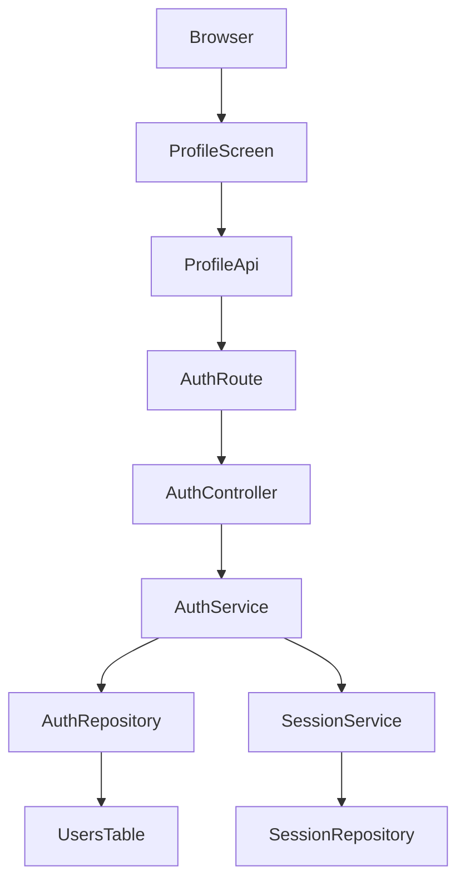
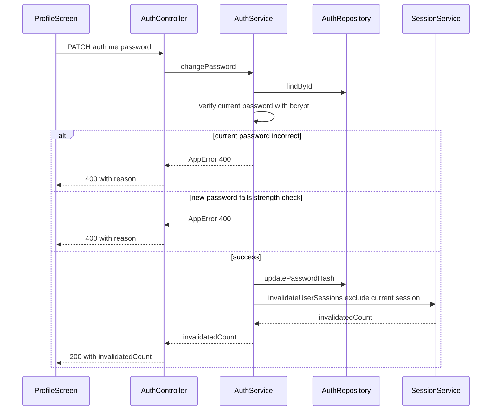

# Design Document

## Overview

**Purpose**: ログイン中ユーザーが自分のメールアドレス・表示名を確認し、表示名の変更およびパスワードの変更を行える最低限のプロフィール画面を提供する。
**Users**: 既にログイン済みの全ユーザー（管理者・一般ユーザーを問わない、本人のみが対象）。
**Impact**: `todo-api`の認証まわり（`auth.route.ts`/`auth.controller.ts`/`auth.service.ts`/`auth.repository.ts`）に2つの新規エンドポイントを追加し、`users`テーブルに`name`カラムを追加する。`todo-web`には新規ページ`/profile`とその導線を追加する。既存のログイン・登録・ログアウト・管理者機能には変更を加えない。

### Goals
- ログイン中ユーザーが自分のメールアドレスと表示名を確認できる
- 表示名を設定・変更できる
- 現在のパスワードを確認した上で、パスワードを変更できる
- パスワード変更成功時、変更を行った本人の現在のセッションは維持したまま、他の既存セッションを無効化する

### Non-Goals
- アバター画像アップロード（工数増のため見送り。UI改善フェーズ以降）
- メールアドレスの変更、アカウント削除、メール認証、パスワードリセット（別ロードマップ項目）
- 新規登録フローの変更（表示名は登録後にプロフィール画面でのみ設定可能とし、登録時の入力項目は増やさない）
- 管理者向けユーザー一覧画面（`AdminUserList.tsx`）の表示項目変更（表示名を一覧に出すかどうかは別途判断）

## Boundary Commitments

### This Spec Owns
- `users`テーブルへの`name`（表示名、nullable）カラムの追加
- 自分自身の表示名を確認・変更するAPI（`PATCH /auth/me`）
- 自分自身のパスワードを変更するAPI（`PATCH /auth/me/password`）、および変更成功時に自分以外の既存セッションを無効化する連携ロジック
- `todo-web`側のプロフィール画面（`/profile`）と、Todo画面からの導線（相互リンク）

### Out of Boundary
- アバター画像アップロード
- メールアドレス変更、アカウント削除、メール認証、パスワードリセット
- 新規登録フローそのものの変更
- 登録時のパスワード強度サーバー側検証の欠落（`AuthService.register`は現状フロントエンドの検証のみに依存しているが、これは既存の別の欠落であり本specでは修正しない）
- 管理者向けユーザー一覧画面の表示項目変更

### Allowed Dependencies
- `SessionService.invalidateUserSessions`（`todo-api/src/services/session.service.ts`）— 既存の全セッション無効化ロジックを、後方互換な形（任意の`excludeSessionId`パラメータ追加）で拡張して利用する
- `AuthRepository`（`todo-api/src/repositories/auth.repository.ts`）— 拡張対象（`updateName`/`updatePasswordHash`を追加）
- `todo-web/lib/api/auth.ts`の`fetchMe()`（admin-user-management specで追加済み）— プロフィール画面の初期表示に再利用する
- 既存の`/auth/me`セッション認可ゲート（`req.session.userId`によるinlineチェック）と同じパターンを踏襲する

### Revalidation Triggers
- `SessionService.invalidateUserSessions`のシグネチャ・戻り値変更（本spec自身が変更するため、admin-user-management側の呼び出しへの影響がないことを実装時に再確認する）
- `/auth/me`のレスポンス形状変更（`name`フィールド追加。admin-user-managementの`fetchMe()`利用箇所が新フィールドを無視して動作し続けることを確認する）
- `users`テーブルの列追加によるスキーマ変更

## Architecture

### Existing Architecture Analysis
- レイヤー構成（routes → controllers → services → repositories → DB）を維持する。新規レイヤーは追加しない
- 認証済みユーザーの判定は、既存の`/auth/me`と同じ「`req.session.userId`が無ければ401」というinlineチェックパターンを踏襲する（専用のpreHandlerガードは導入しない）
- パスワードハッシュ化（`bcrypt`）・エラー表現（`AppError(message, statusCode)`をcontrollerが`{message}`として返す）は既存パターンをそのまま使う

### Architecture Pattern & Boundary Map



**Architecture Integration**:
- 選択パターン: 既存の直接fetchパターン（`docs/architecture.md`のパターン2）。`ProfileApi`（`lib/api/profile.ts`）はブラウザから`NEXT_PUBLIC_API_BASE`経由で直接Fastifyへfetchし、Next.js側のプロキシは挟まない
- 既存パターン維持: `AppError`によるエラー表現、`bcrypt`によるハッシュ化、`req.session.userId`によるinline認可チェック、`fetchMe()`の再利用
- 新規要素の理由: `ProfileScreen`/`ProfileApi`はUI・APIクライアントの新規追加。`AuthService`/`AuthRepository`/`SessionService`は既存ファイルへの機能追加であり新規コンポーネントではない

### Technology Stack

| Layer | Choice / Version | Role in Feature | Notes |
|-------|------------------|------------------|-------|
| Backend / Services | Fastify 5（既存） | `PATCH /auth/me`, `PATCH /auth/me/password`の追加 | 新規ライブラリなし |
| Data / Storage | MySQL（既存） | `users.name`カラム追加 | `ALTER TABLE`で対応（本プロジェクトはマイグレーションツール不使用） |
| Frontend | Next.js 16 / React 19（既存） | `/profile`ページ追加 | 新規ライブラリなし |

## File Structure Plan

### Modified Files（todo-api）
- `mysql/init.sql` — `users`テーブルに`name VARCHAR(50) NULL DEFAULT NULL`を追加
- `todo-api/src/types/todo.ts`（または既存のUser型定義箇所）— `User`型に`name: string | null`を追加、`UpdateNameBody`/`ChangePasswordBody`型を追加
- `todo-api/src/repositories/auth.repository.ts` — `updateName(userId, name)`、`updatePasswordHash(userId, passwordHash)`を追加
- `todo-api/src/services/auth.service.ts` — `updateName(userId, name)`、`changePassword(userId, currentPassword, newPassword, currentSessionId)`を追加
- `todo-api/src/services/session.service.ts` — `invalidateUserSessions(targetUserId, options?: { excludeSessionId?: string })`に拡張（省略時は既存動作と同一）
- `todo-api/src/controllers/auth.controller.ts` — `updateProfile`、`changePassword`ハンドラを追加
- `todo-api/src/routes/auth.route.ts` — `PATCH /auth/me`、`PATCH /auth/me/password`を登録

### New Files（todo-web）
- `todo-web/app/profile/page.tsx` — `/admin/users/page.tsx`と同じ薄いラッパー
- `todo-web/features/profile/ProfileScreen.tsx` — 表示・表示名編集・パスワード変更フォームを持つメインコンポーネント
- `todo-web/lib/api/profile.ts` — `updateName(name)`、`changePassword(currentPassword, newPassword)`のクライアント関数

### Modified Files（todo-web）
- `todo-web/lib/types.ts` — `User`/`CurrentUser`型に`name: string | null`を追加
- `todo-web/features/todo/TodoApp.tsx` — ヘッダーに「プロフィール」リンクを追加（admin-user-managementで追加した「管理者画面」リンクと同じ並び）

## System Flows

パスワード変更は複数の分岐（現在パスワード不一致・強度不足・成功）を持つため、シーケンス図で示す。表示名変更は単純なCRUDのため図は省略する。



**Key Decisions**:
- 現在パスワードの検証を新パスワードの強度チェックより先に行う（他人が一時的にセッションを乗っ取っても、現在パスワードを知らなければ強度要件のヒントすら得られないようにするため）
- `excludeSessionId`には`req.session.sessionId`（現在のリクエストのセッションID）を渡す

## Requirements Traceability

| Requirement | Summary | Components | Interfaces |
|-------------|---------|-------------|------------|
| 1.1, 1.2, 1.3, 1.4 | プロフィール情報の表示 | ProfileScreen, AuthController.me（既存） | GET /auth/me |
| 2.1, 2.2, 2.3, 2.4 | 表示名の設定・変更 | ProfileScreen, AuthController.updateProfile, AuthService.updateName, AuthRepository.updateName | PATCH /auth/me |
| 3.1, 3.2, 3.3, 3.4, 3.5 | パスワードの変更 | ProfileScreen, AuthController.changePassword, AuthService.changePassword, AuthRepository.updatePasswordHash, SessionService.invalidateUserSessions | PATCH /auth/me/password |
| 4.1, 4.2 | アクセス制御 | AuthController（inline session check） | 全エンドポイント共通 |

## Components and Interfaces

| Component | Domain/Layer | Intent | Req Coverage | Key Dependencies | Contracts |
|-----------|--------------|--------|--------------|-------------------|-----------|
| AuthService（拡張） | Backend / Service | 表示名更新・パスワード変更のビジネスルール | 2.1-2.3, 3.1-3.5 | AuthRepository (P0), SessionService (P0) | Service |
| SessionService（拡張） | Backend / Service | 自分以外のセッションを無効化する | 3.4, 3.5 | SessionRepository (P0) | Service |
| AuthController（拡張） | Backend / API | リクエスト解析・レスポンス整形 | 2.1-2.3, 3.1-3.5, 4.1-4.2 | AuthService (P0) | API |
| ProfileScreen | Frontend / Feature | 表示・編集フォームの提供 | 1.1-1.4, 2.1-2.4, 3.1-3.5 | lib/api/profile.ts (P0), lib/api/auth.ts (P1) | State |

### Backend / Service

#### AuthService（拡張）

| Field | Detail |
|-------|--------|
| Intent | 表示名の更新、パスワードの検証つき変更 |
| Requirements | 2.1, 2.2, 2.3, 3.1, 3.2, 3.3, 3.4, 3.5 |

**Responsibilities & Constraints**
- `updateName`: 対象は常に`req.session.userId`本人。他ユーザーIDを受け付けない
- `changePassword`: 現在パスワードの一致確認（`bcrypt.compare`）→ 新パスワードの強度確認（既存フロントエンドと同一の正規表現をservice層でも検証）→ ハッシュ更新 → `SessionService.invalidateUserSessions`を`excludeSessionId`付きで呼び出す

**Dependencies**
- Outbound: AuthRepository — 永続化 (P0)
- Outbound: SessionService — 他セッション無効化 (P0)

**Contracts**: Service [x]

##### Service Interface
```typescript
interface AuthServiceProfileExtension {
  updateName(userId: number, name: string): Promise<void>;
  changePassword(
    userId: number,
    currentPassword: string,
    newPassword: string,
    currentSessionId: string
  ): Promise<{ invalidatedCount: number }>;
}
```
- Preconditions: `userId`は認証済みセッションから取得された値であること（呼び出し元のcontrollerが保証する）
- Postconditions: `changePassword`成功時、`password_hash`は更新済み、`currentSessionId`以外の当該ユーザーの全セッションは無効化済み
- Invariants: `currentSessionId`は無効化対象から常に除外される

#### SessionService（拡張）

| Field | Detail |
|-------|--------|
| Intent | 対象ユーザーのセッションを無効化する（特定のセッションを除外可能） |
| Requirements | 3.4, 3.5 |

**Responsibilities & Constraints**
- `excludeSessionId`省略時は既存動作（全セッション無効化・索引を丸ごと削除）と完全に同一。既存呼び出し元（admin-user-managementの`changeStatus`）に挙動変更なし
- `excludeSessionId`指定時は、対象セッションのみ索引から個別に除去（`untrackSession`）し、除外したセッションの索引エントリはそのまま残す

**Contracts**: Service [x]

##### Service Interface
```typescript
interface InvalidateSessionsOptions {
  excludeSessionId?: string;
}

interface SessionServiceProfileExtension {
  invalidateUserSessions(
    targetUserId: number,
    options?: InvalidateSessionsOptions
  ): Promise<{ invalidatedCount: number }>;
}
```
- Preconditions: なし（既存と同一）
- Postconditions: `excludeSessionId`が存在する場合、そのセッションの索引・実体は破棄されない
- Invariants: 戻り値の`invalidatedCount`は実際に破棄したセッション数と一致する

**Implementation Notes**
- Integration: admin-user-managementの`AdminUserService.changeStatus`は引数を1つのまま呼び出し続けるため無変更で動作する
- Validation: 実装時に既存の`session.service.test.ts`（存在する場合）が変更なく通ることを確認する
- Risks: Redis呼び出し回数がセッション数分増えるが、通常のセッション数では性能上の懸念はない

### Backend / API

#### AuthController（拡張）

| Field | Detail |
|-------|--------|
| Intent | `/auth/me`関連の新規エンドポイントのリクエスト解析・レスポンス整形 |
| Requirements | 2.1, 2.2, 2.3, 3.1-3.5, 4.1, 4.2 |

**Contracts**: API [x]

##### API Contract
| Method | Endpoint | Request | Response | Errors |
|--------|----------|---------|----------|--------|
| PATCH | /auth/me | `{ name: string }` | `{ message: string }` | 400 (空文字/50文字超), 401 (未認証) |
| PATCH | /auth/me/password | `{ currentPassword: string, newPassword: string }` | `{ message: string, invalidatedCount: number }` | 400 (現在パスワード不一致/新パスワード強度不足), 401 (未認証) |

**Implementation Notes**
- Integration: 両エンドポイントとも`req.session.userId`が無ければ401（既存の`me`ハンドラと同じinlineチェック）。対象ユーザーIDはリクエストボディから受け取らず、常にセッションから取得する（IDOR対策）
- Validation: `name`の空文字・50文字超えはFastifyのJSON Schema（`minLength: 1, maxLength: 50`）で構造的に弾く。現在パスワード不一致・新パスワード強度不足はservice層で`AppError(message, 400)`として理由を明示する（admin-user-managementで確立した「理由が分かるエラーメッセージ」の方針を踏襲）
- Risks: Fastify 5のAJV既定設定（`removeAdditional: true`）により、`additionalProperties: false`を指定していても未定義フィールドは400ではなく黙って除去される点に注意（`ai-driven-development-spec.md`記載の既知の落とし穴）。本設計ではリクエストボディが小さく実害は低いが、実装時に認識しておく

### Frontend / Feature

#### ProfileScreen

| Field | Detail |
|-------|--------|
| Intent | プロフィール情報の表示、表示名・パスワードの編集フォーム |
| Requirements | 1.1-1.4, 2.1-2.4, 3.1-3.5 |

**Contracts**: State [x]

##### State Management
- 初期表示: マウント時に`lib/api/auth.ts`の`fetchMe()`を呼び、`email`/`name`/`role`を取得（`AdminUserList.tsx`/`TodoApp.tsx`と同じ`useEffect`パターン）
- 表示名更新・パスワード変更とも、成功後は`fetchMe()`を再度呼んで画面の状態を最新化する（個別stateの楽観的更新はしない。admin-user-managementで確立した「再fetchで揃える」方針を踏襲）
- 失敗時は`react-toastify`でエラー内容を表示する（`AdminUserList.tsx`と同じトースト表示パターン）

**Implementation Notes**
- Integration: `lib/api/profile.ts`は`lib/api/adminUsers.ts`と同様、失敗時にHTTPステータスとサーバーの`message`を保持する軽量なエラー型を独自に定義する（`AdminApiError`をそのまま共有はせず、admin-user-management側のファイルには手を入れない）
- Validation: パスワード確認用の再入力欄（新パスワードを2回入力させる）は要件に明記されていないため、初期実装では設けない
- Risks: なし

## Data Models

### Logical Data Model
- `users.name`: `VARCHAR(50) NULL DEFAULT NULL`。既存ユーザーは全員`NULL`（未設定）から始まる
- 一意制約なし（表示名の重複は許容する。ユーザーの識別子は引き続き`email`）

### Physical Data Model
```sql
ALTER TABLE users ADD COLUMN name VARCHAR(50) NULL DEFAULT NULL;
```
`mysql/init.sql`にも同じ列定義を追加し、新規に立てる開発環境で最初から同じスキーマになるようにする。

## Error Handling

### Error Categories and Responses
- **User Errors (4xx)**: 未認証 → 401 `{message: "Unauthorized"}`（既存`me`と同一）。表示名が空/50文字超 → 400（スキーマ検証）。現在パスワード不一致 → 400 `{message: "current password is incorrect"}`。新パスワード強度不足 → 400 `{message: "new password does not meet the strength requirements"}`
- **System Errors (5xx)**: 予期しない例外は既存パターン通り500 `{message: "Internal Server Error"}`とし、`req.log.error`でログに残す

## Testing Strategy

### Unit Tests
- `AuthService.updateName`: 正常系（更新できる）
- `AuthService.changePassword`: 現在パスワード不一致で拒否、弱い新パスワードで拒否、成功時にハッシュが更新される
- `SessionService.invalidateUserSessions`: `excludeSessionId`省略時は既存動作と同一（既存テストの回帰）、指定時は除外セッションが破棄されず索引に残ることを確認

### Integration Tests
- `PATCH /auth/me`: 未認証は401、空文字/50文字超は400、正常な更新は200
- `PATCH /auth/me/password`: 未認証は401、現在パスワード不一致は400、弱い新パスワードは400、成功時は`invalidatedCount`が返り、変更を行ったセッション自身は`/auth/me`が引き続き200を返すことを確認する（要件3.5の直接的な検証）
- 成功時、変更前に発行していた別セッション（例えばログイン済みの別クッキー）で`/auth/me`を呼ぶと401になることを確認する（要件3.4の直接的な検証）

### E2E/UI Tests
- ProfileScreen: マウント時にメールアドレス・表示名（未設定時はその旨）が表示される
- 表示名を編集して保存すると、画面に反映される
- 誤った現在パスワードでパスワード変更を試みると、理由の分かるトーストが表示される
- Todo画面とプロフィール画面の相互リンクが機能する

## Security Considerations

- 現在パスワードの確認を必須にすることで、セッションを一時的に乗っ取られた場合でもパスワード自体を変更されるリスクを下げる（要件3.1, 3.2）
- パスワード変更成功時に他セッションを無効化することで、漏洩したパスワードを使った既存のログイン状態を断つ（要件3.4）
- 対象ユーザーは常に`req.session.userId`から取り、リクエストボディや別ユーザーのIDを受け付けない（IDOR対策、要件4.1, 4.2）
- 新パスワードの強度要件をサーバー側でも検証することで、クライアント側の検証をバイパスした直接APIコールでも要件3.3が保証される
