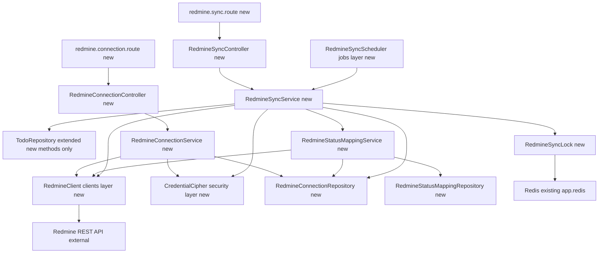
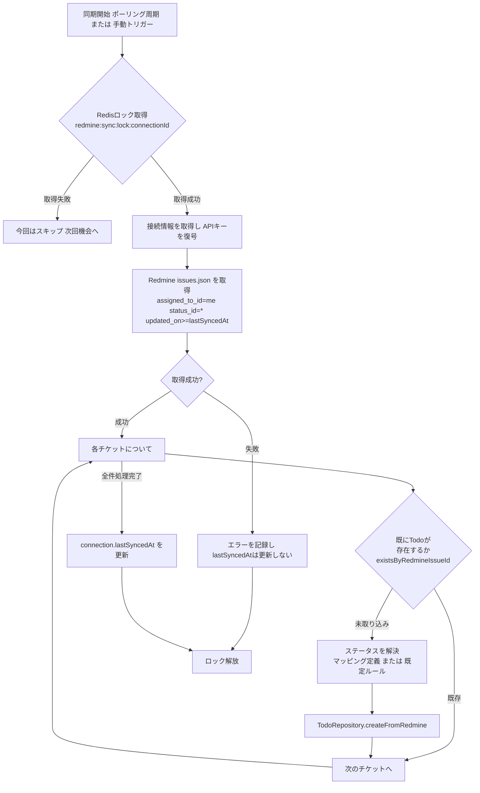
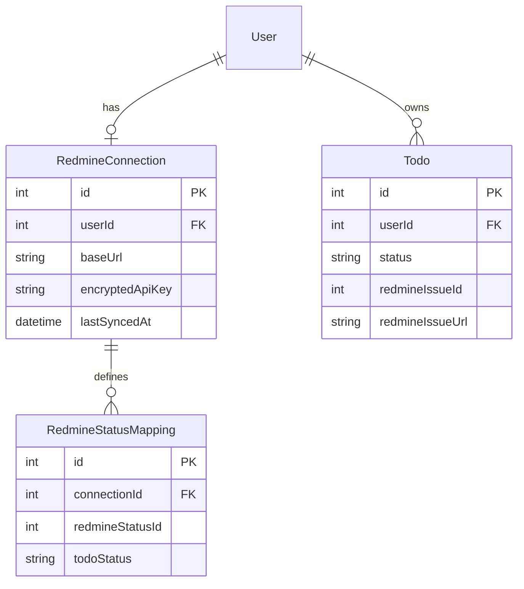
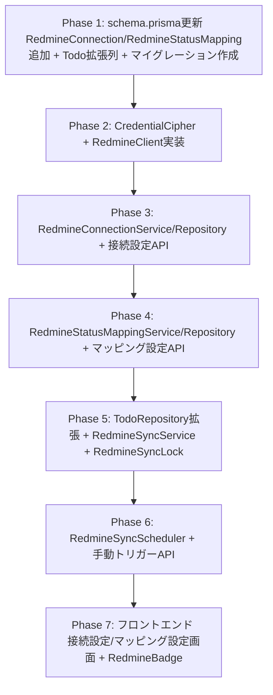

# 技術設計書

## Overview

本機能は、`todo-api`にRedmine REST APIとの一方向連携（Redmine→Todo）を追加する。利用者は自分のRedmineインスタンスの接続情報（URL・APIキー）を登録し、Redmineのステータスと`task-status-model`が確定した`TodoStatus`4値enum（`pending`/`in_progress`/`blocked`/`done`）とのマッピングを定義する。登録後は定期ポーリングまたは手動トリガーにより、利用者に割り当てられた未取り込みのRedmineチケットを検出し、対応するTodoを1件ずつ自動作成する。Todo作成後の編集はRedmineへ反映せず、Redmine側のその後のステータス変更も既存Todoへ反映しない（取り込み時点の1回限りのステータス反映）。

**Purpose**: Redmineでチケット管理を行っている開発チームに対して、日々の細かいタスク管理を担うTodoアプリへチケットを自動的に取り込む窓口を提供し、手動転記の手間を解消する。

**Users**: 自分のRedmineアカウントを持ち、そのAPIキーを使って自分に割り当てられたチケットをTodoとして取り込みたい利用者。

**Impact**: `orm-migration`が確立した`prisma/schema.prisma`に`RedmineConnection`/`RedmineStatusMapping`モデルを追加し、`task-status-model`が確定した`Todo`モデルへ`redmineIssueId`/`redmineIssueUrl`の2列を追加する（既存の`status`型・`TodoRepository`/`TodoService`の公開シグネチャは一切変更しない）。`todo-api`に新規の外部APIアダプタ層（`RedmineClient`）・暗号化ユーティリティ・定期実行基盤を追加し、`todo-web`に接続設定・ステータスマッピング設定の最小限のUIと、Todo一覧上のRedmine参照リンク表示を追加する。

### Goals
- 利用者ごとにRedmine接続情報（URL・APIキー）を登録・更新・削除でき、登録時に疎通確認を行う
- Redmineの認証情報を暗号化して永続化する
- Redmineの各ステータスを`TodoStatus`4値のいずれかへ利用者がマッピングでき、未定義のステータスには既定ルールを適用する
- 定期ポーリングと手動トリガーの両方で、利用者に割り当てられた未取り込みのRedmineチケットからTodoを自動作成する
- 同一のRedmineチケットから複数のTodoが作成されないことを保証する
- 取り込み後のTodoは他のTodoと同様に自由に編集でき、その変更もRedmine側のその後の変更も互いに反映されない

### Non-Goals
- Todo側の変更をRedmineチケットへ書き戻す機能（双方向同期）
- Redmine以外の外部トラッカー（Jira等）との連携
- Webhookによるリアルタイム連携（本specはポーリング・手動トリガーのみを実装する）
- Todo作成後のRedmine側ステータス変更を継続的に追跡し、既存Todoへ反映し続ける機能
- グループ単位でのRedmine接続情報の共有（ロードマップ上`redmine-integration`は`team-management`に依存しないため、利用者単位の接続に限定する）
- 暗号鍵のローテーション運用（将来の運用課題として`Open Questions`に記載）

## Boundary Commitments

### This Spec Owns
- `prisma/schema.prisma`への`RedmineConnection`/`RedmineStatusMapping`モデルの追加、および`Todo`モデルへの`redmineIssueId`/`redmineIssueUrl`列の追加（`task-status-model`が確定した`status`列・既存列は変更しない）
- Redmine接続情報の暗号化・復号（`CredentialCipher`）と、その永続化（`RedmineConnectionRepository`）
- Redmineステータス一覧取得・マッピング定義の保存と解決ロジック（`RedmineStatusMappingService`/`RedmineStatusMappingRepository`）
- Redmine REST APIとの通信を担う`RedmineClient`（認証・課題一覧取得・ステータス一覧取得・エラー正規化）
- チケット取得からTodo作成までのオーケストレーション（`RedmineSyncService`）と、重複防止のための排他制御（`RedmineSyncLock`）
- 定期ポーリング基盤（`RedmineSyncScheduler`）と手動トリガーのAPIエンドポイント
- 接続設定・ステータスマッピング設定の最小限のフロントエンドUIと、Todo一覧上のRedmine参照リンク表示

### Out of Boundary
- `task-status-model`が確定した`TodoStatus`4値enumの名称・意味、および`TodoRepository`/`TodoService`の既存公開メソッドのシグネチャ・挙動（本specはこれらを変更せず、新規メソッドの追加のみで拡張する）
- `orm-migration`が確立した`PrismaClientSingleton`・マイグレーション運用方式そのもの
- `task-rot-detection`が所有する`due_date`等のフィールドと腐敗判定ロジック（Redmine由来のTodoを他のTodoと区別せず、腐敗判定の対象可否について本specは何も特別扱いしない）
- グループ単位での接続情報共有（`team-management`完了後の将来拡張として扱う。本specの範囲では実装しない）
- Todo→Redmineへの書き戻し、Redmine以外のトラッカー対応、Webhook連携（Non-Goals参照）
- セッション無効化ロジック自体（`SessionService`は無変更）

### Allowed Dependencies
- `task-status-model`が確定する`TodoStatus`型・`TODO_STATUSES`定数、および`TodoRepository`/`TodoService`の既存契約（P0。本specはこれらを消費するのみで変更しない。実装着手は`task-status-model`の実装完了後）
- `orm-migration`が提供する`prismaClient.ts`（Prisma Clientシングルトン）・`prisma/schema.prisma`の既存モデル（P0）
- 既存の`AppError`（`todo-api/src/errors/AppError.ts`）によるサービス層のエラー送出パターン（P0）
- 既存の`requireAuthGuard`（`guards/requireAuth.ts`）（P0。接続設定・同期トリガーのAPIはすべてこのガードで保護し、要求者自身の`userId`のみをセッションから解決する。新規のロールガードは導入しない）
- 既存のRedis接続（`app.redis`、`@fastify/redis`経由）（P1。同期処理の排他ロックに転用する。セッションストア用途とはキー空間を分離する）
- Node.js標準の`crypto`モジュール（P0。認証情報の暗号化に使用し、新規npm依存は追加しない）

### Revalidation Triggers
- `RedmineConnection`/`RedmineStatusMapping`のテーブル構造（列名・型・ユニーク制約）を変更する場合
- `Todo.redmineIssueId`/`Todo.redmineIssueUrl`の意味・型を変更する場合（フロントエンドの表示ロジックが影響を受ける）
- `RedmineClient`が想定するRedmine REST APIのレスポンス形状（`status: { id, name, is_closed }`等）が変更された場合（Redmine側のメジャーバージョンアップ時に確認が必要）
- 取り込み後のステータス継続同期（Non-Goal）を将来実装する場合（`task-status-model`のステータス変更フロー・`task-rot-detection`の腐敗判定ロジックとの整合を再確認する必要がある）

## Architecture

### Existing Architecture Analysis
既存のレイヤードアーキテクチャ（`routes → controllers → services → repositories → DB`）を維持しつつ、外部API（Redmine）との通信を担う新しい水平レイヤー（`clients/`）と、定期実行を担う新しいレイヤー（`jobs/`）を追加する。`orm-migration`が確立した「リポジトリはPrisma Clientベース、公開シグネチャは呼び出し元から見て不変」という契約と、`task-status-model`が確定した`TodoStatus`契約をそのまま消費する。

### Architecture Pattern & Boundary Map



**Architecture Integration**:
- 選択パターン: 既存レイヤードアーキテクチャへの「新規ドメイン追加」パターン。`redmine`ドメインは既存の`todos`/`users`ドメインと並立する独立したリポジトリ/サービス/コントローラー/ルートを持ち、`TodoRepository`とは新規メソッドの追加のみで接続する
- ドメイン境界: Redmineとの接続・認証・マッピング・同期オーケストレーションは新規`redmine`ドメインが所有する。Todo自体の作成は引き続き`TodoRepository`が担い、`RedmineSyncService`は「いつ・どのステータスで・どのチケットIDを付けて」Todoを作るかを指示するだけで、Todoの永続化ロジック自体を重複実装しない
- 既存パターンの維持: リポジトリはテーブル境界で分離、サービス層が`AppError`を送出、ガードはルート層の`preHandler`、`requireAuthGuard`によるセッションベースの本人スコープ
- 新規コンポーネントの理由: `RedmineClient`（外部HTTP通信を1箇所に集約し、Redmine REST APIのレスポンス形状変化の影響範囲を限定する）、`CredentialCipher`（暗号化ロジックの単一責任化）、`RedmineSyncLock`（同時実行時の重複防止という横断的関心事の分離）、`RedmineSyncScheduler`（定期実行という新しいライフサイクルの導入）
- Steering準拠: TypeScript strict・`any`不使用（`tech.md`）、レイヤー単一責務・`<domain>.<layer>.ts`命名規則（`structure.md`）を維持。`clients/`・`jobs/`・`security/`は既存の`db/`（外部リソースとの接続を担う既存の専用ディレクトリ）と同じ思想の新規ディレクトリとして追加する

**依存方向**: `schema.prisma`（型定義） → `PrismaClientSingleton`（接続） → `Repository`（データアクセス） → `Service`（業務ロジック・外部API呼び出しの統合） → `Controller`（リクエスト/レスポンス整形） → `Route`（境界バリデーション・ガード登録）。`RedmineClient`と`CredentialCipher`は`Service`層からのみ参照される横断的な下位レイヤーであり、`Repository`層からは参照しない。`RedmineSyncScheduler`は`Service`層（`RedmineSyncService`）のみを呼び出し、`Repository`/`Client`層へ直接依存しない。

### Technology Stack

| Layer | Choice / Version | Role in Feature | Notes |
|-------|------------------|------------------|-------|
| Backend | Fastify 5 / Node.js（既存） | 接続設定・手動トリガーAPIのエンドポイント | 新規ルート追加のみ |
| Data / Storage | MySQL 8.0（既存） | `redmine_connections`/`redmine_status_mappings`テーブル、`todos`への列追加 | `orm-migration`のマイグレーション運用に追従 |
| ORM | Prisma / `@prisma/client`（`orm-migration`導入版を継続使用） | 新規モデル・`Todo`拡張列の定義とクエリ実行 | 新規バージョン導入なし |
| 外部API | Redmine REST API（JSON、`X-Redmine-API-Key`ヘッダ認証） | チケット・ステータス一覧の取得元 | `research.md`参照。認証方式・レスポンス形状を確認済み |
| 暗号化 | Node.js標準`crypto`（AES-256-GCM） | Redmine APIキーの暗号化・復号 | 新規npm依存を追加しない（`research.md` Design Decisions参照） |
| 排他制御 | 既存Redis（`@fastify/redis`） | 同期処理の重複実行防止（`SET NX PX`） | 新規インフラを追加しない |
| キャッシュ/インフラ | Docker Compose（既存） | 新規コンテナは追加しない | `setInterval`ベースの定期実行はAPIプロセス内で完結する |

## File Structure Plan

### Directory Structure
```
todo-api/
├── prisma/
│   ├── schema.prisma                            # 変更: RedmineConnection/RedmineStatusMappingモデル追加、Todoにredmine_issue_id/redmine_issue_url列追加
│   └── migrations/
│       └── <timestamp>_add_redmine_integration/
│           └── migration.sql                    # 新規: 2テーブル作成 + todos列追加 + ユニーク制約
├── src/
│   ├── clients/
│   │   └── redmineClient.ts                     # 新規: Redmine REST APIとのHTTP通信を集約するアダプタ
│   ├── security/
│   │   └── credentialCipher.ts                  # 新規: AES-256-GCMによる暗号化・復号ユーティリティ
│   ├── repositories/
│   │   ├── redmineConnection.repository.ts      # 新規: redmine_connectionsのCRUD
│   │   ├── redmineStatusMapping.repository.ts   # 新規: redmine_status_mappingsのCRUD
│   │   └── todos.repository.ts                  # 変更: createFromRedmine/existsByRedmineIssueId追加（既存メソッドは無変更）
│   ├── services/
│   │   ├── redmineConnection.service.ts         # 新規: 接続登録・更新・削除・疎通確認
│   │   ├── redmineStatusMapping.service.ts       # 新規: ステータス一覧取得・マッピング保存・解決
│   │   ├── redmineSync.service.ts                # 新規: チケット取得〜Todo作成のオーケストレーション
│   │   └── redmineSyncLock.service.ts            # 新規: Redisベースの同期処理排他ロック
│   ├── jobs/
│   │   └── redmineSync.scheduler.ts              # 新規: setIntervalベースの定期ポーリング登録
│   ├── controllers/
│   │   ├── redmineConnection.controller.ts       # 新規
│   │   └── redmineSync.controller.ts             # 新規: 手動トリガーのハンドラ
│   ├── routes/
│   │   ├── redmine.connection.route.ts           # 新規: /redmine/connection*（requireAuthGuard適用）
│   │   └── redmine.sync.route.ts                  # 新規: POST /redmine/sync（requireAuthGuard適用）
│   ├── types/
│   │   ├── redmine.ts                            # 新規: RedmineStatus, RedmineIssue, ConnectionBody等
│   │   └── todo.ts                                # 変更: Todo型にredmineIssueId/redmineIssueUrl(nullable)追加
│   └── app.ts                                     # 変更: redmineConnectionRoutes/redmineSyncRoutesの登録、registerRedmineSyncSchedulerの呼び出し追加
├── .env.dev(.example) / .env.prod(.example) / .env.test(.example)  # 変更: REDMINE_ENCRYPTION_KEY, REDMINE_POLL_INTERVAL_MS追加

todo-web/
├── lib/
│   ├── types.ts                                  # 変更: Todo型にredmineIssueId/redmineIssueUrl(nullable)追加
│   └── api/
│       └── redmine.ts                             # 新規: 接続設定・マッピング・手動同期のAPIクライアント
├── features/redmine/
│   ├── RedmineConnectionForm.tsx                  # 新規: 接続情報の登録・更新・削除・疎通結果表示
│   └── RedmineStatusMappingForm.tsx               # 新規: ステータス一覧取得・マッピング編集
├── app/settings/redmine/
│   └── page.tsx                                   # 新規: 接続設定・マッピング設定・手動同期ボタンのページ
└── components/todo/
    ├── RedmineBadge.tsx                            # 新規: redmineIssueUrlがある場合にリンクを表示する小さなプレゼンテーショナルコンポーネント
    ├── ActiveTodos.tsx                             # 変更: 各Todo行にRedmineBadgeを表示
    └── DoneTodos.tsx                               # 変更: 各Todo行にRedmineBadgeを表示
```

### Modified Files
- `todo-api/prisma/schema.prisma` — `RedmineConnection`/`RedmineStatusMapping`モデル追加。`Todo`モデルに`redmineIssueId Int? @map("redmine_issue_id")`・`redmineIssueUrl String? @map("redmine_issue_url")`を追加し、`@@unique([userId, redmineIssueId])`を追加する（`status`列・既存フィールドは無変更）
- `todo-api/src/repositories/todos.repository.ts` — `createFromRedmine(title, userId, status, redmineIssueId, redmineIssueUrl): Promise<void>`と`existsByRedmineIssueId(userId, redmineIssueId): Promise<boolean>`を追加する。既存の`findAll`/`findById`/`create`/`update`/`delete`のシグネチャ・挙動は一切変更しない
- `todo-api/src/types/todo.ts` — `Todo`型に`redmineIssueId: number | null`・`redmineIssueUrl: string | null`を追加する（オプショナルな追加列であり、既存の`status`/`title`等の型は変更しない）
- `todo-api/src/app.ts` — `redmineConnectionRoutes`/`redmineSyncRoutes`の登録と、起動シーケンスへの`registerRedmineSyncScheduler(app)`呼び出しを追加する
- `todo-web/lib/types.ts` — `Todo`型に`redmineIssueId`/`redmineIssueUrl`（いずれも`number | null`/`string | null`）を追加する
- `todo-web/components/todo/ActiveTodos.tsx`・`DoneTodos.tsx` — 各Todo行に`RedmineBadge`を追加する（`redmineIssueUrl`が`null`の場合は何も表示しない）

### New Files
- 上記ディレクトリ構造の「新規」注記を参照

## System Flows

### チケット同期フロー（ポーリング・手動トリガー共通）



- ゲーティング条件: ロック取得に失敗した場合（既に同一接続の同期処理が実行中）、当該回の同期処理全体をスキップする（要件5.3）
- チケット取得が失敗した場合、当該回のTodo作成は一切行わず`lastSyncedAt`も更新しない。次回の同期機会に同じ範囲を再取得する（要件3.3のフェイルセーフ、`research.md` Risks参照）
- 1利用者（1接続）の処理失敗は他の利用者の接続の処理に影響しない（要件3.4）。`RedmineSyncScheduler`は接続ごとに独立した`try/catch`でこのフローを呼び出す

## Requirements Traceability

| Requirement | Summary | Components | Interfaces | Flows |
|-------------|---------|------------|------------|-------|
| 1.1, 1.2, 1.3 | 接続登録時の疎通確認・暗号化保存 | RedmineConnectionService, RedmineClient, CredentialCipher | POST /redmine/connection | - |
| 1.4 | 利用者につき最大1件の接続 | RedmineConnectionSchema (unique制約), RedmineConnectionService | POST /redmine/connection | - |
| 1.5 | 接続情報の更新 | RedmineConnectionService | PATCH /redmine/connection | - |
| 1.6 | 接続情報の削除・以後の取得停止 | RedmineConnectionService, RedmineSyncScheduler | DELETE /redmine/connection | - |
| 1.7 | 本人以外のアクセス不可 | RequireAuthGuard (既存), RedmineConnectionService | 全redmineルート | - |
| 1.8 | APIキーの平文非表示 | RedmineConnectionController | GET /redmine/connection | - |
| 2.1 | Redmineステータス一覧取得 | RedmineStatusMappingService, RedmineClient | GET /redmine/connection/statuses | - |
| 2.2, 2.4 | マッピング定義・変更 | RedmineStatusMappingService, RedmineStatusMappingRepository | PUT /redmine/connection/status-mapping | - |
| 2.3 | 未定義ステータスの既定ルール | RedmineStatusMappingService (resolveStatus) | - | チケット同期フロー |
| 2.5 | 既存Todoへの遡及適用なし | RedmineSyncService (作成時のみ適用) | - | チケット同期フロー |
| 3.1 | 定期ポーリング | RedmineSyncScheduler | - | チケット同期フロー |
| 3.2 | 手動トリガー | RedmineSyncController, RedmineSyncService | POST /redmine/sync | チケット同期フロー |
| 3.3 | 取得失敗時のフェイルセーフ | RedmineClient, RedmineSyncService | - | チケット同期フロー |
| 3.4 | 1接続の失敗が他に波及しない | RedmineSyncScheduler | - | チケット同期フロー |
| 4.1, 4.3, 4.4, 4.6 | チケットからのTodo作成 | RedmineSyncService, TodoRepository (拡張) | createFromRedmine | チケット同期フロー |
| 4.2 | タイトルへのチケット識別情報の付与 | RedmineSyncService | - | - |
| 4.5 | Todo一覧上のRedmine参照リンク | Todo (redmineIssueUrl列), RedmineBadge | GET /todos (既存、無変更で列が伝播) | - |
| 5.1, 5.2 | 重複Todoの防止 | TodoRepository (unique制約), RedmineSyncService (existsByRedmineIssueId) | createFromRedmine | チケット同期フロー |
| 5.3 | 同時実行時の重複防止 | RedmineSyncLock | - | チケット同期フロー |
| 6.1, 6.2 | 取り込み後の自由編集・書き戻しなし | TodoService/TodoRepository (既存、変更なし) | 既存 PATCH /todos/:id | - |
| 6.3 | 継続的ステータス同期を行わない | RedmineSyncService (既存Todoは対象外) | - | チケット同期フロー |
| 7.1 | 認証情報の暗号化保存 | CredentialCipher, RedmineConnectionSchema | - | - |
| 7.2 | 本人のみが操作可能 | RequireAuthGuard (既存) | 全redmineルート | - |

## Components and Interfaces

| Component | Domain/Layer | Intent | Req Coverage | Key Dependencies (P0/P1) | Contracts |
|-----------|---------------|--------|---------------|---------------------------|-----------|
| RedmineConnectionSchema | Data Layer | `redmine_connections`テーブルの定義 | 1.1–1.8, 7.1 | orm-migration Prisma schema (P0) | State |
| RedmineStatusMappingSchema | Data Layer | `redmine_status_mappings`テーブルの定義 | 2.1–2.5 | RedmineConnectionSchema (P0), task-status-model TodoStatus (P0) | State |
| TodoRedmineExtension | Data Layer | `Todo`への`redmineIssueId`/`redmineIssueUrl`列追加 | 4.5, 5.1, 5.2 | task-status-model Todo schema (P0) | State |
| CredentialCipher | Security | APIキーの暗号化・復号 | 1.1, 1.3, 1.5, 7.1 | Node.js crypto (P0) | Service |
| RedmineClient | External Integration | Redmine REST APIとのHTTP通信 | 1.1, 2.1, 3.1–3.3 | Redmine REST API (P0) | Service |
| RedmineConnectionRepository | Data Layer | `redmine_connections`のCRUD | 1.1–1.8 | PrismaClientSingleton (P0) | Service |
| RedmineStatusMappingRepository | Data Layer | `redmine_status_mappings`のCRUD | 2.2, 2.4 | PrismaClientSingleton (P0) | Service |
| TodoRepository（拡張） | Data Layer | Redmine由来Todoの作成・重複検知 | 4.1, 4.3, 4.4, 4.6, 5.1, 5.2 | task-status-model TodoRepository (P0) | Service |
| RedmineConnectionService | Business Logic | 接続登録・更新・削除・疎通確認 | 1.1–1.8, 7.1, 7.2 | RedmineConnectionRepository (P0), RedmineClient (P0), CredentialCipher (P0) | Service |
| RedmineStatusMappingService | Business Logic | ステータス一覧取得・マッピング保存・解決 | 2.1–2.5 | RedmineStatusMappingRepository (P0), RedmineClient (P0) | Service |
| RedmineSyncService | Business Logic | チケット取得〜Todo作成のオーケストレーション | 3.1–3.4, 4.1–4.6, 5.1–5.3, 6.3 | RedmineClient (P0), RedmineStatusMappingService (P0), TodoRepository (P0), RedmineSyncLock (P0) | Batch |
| RedmineSyncLock | Ops/Infra | 同時実行時の排他制御 | 5.3 | Redis (P0) | Service |
| RedmineSyncScheduler | Ops/Infra | 定期ポーリングの実行基盤 | 3.1, 3.4 | RedmineSyncService (P0) | Batch |
| RedmineConnectionController / redmine.connection.route.ts | API | 接続設定・マッピング設定のHTTP窓口 | 1.1–1.8, 2.1, 2.2, 2.4, 7.2 | RedmineConnectionService (P0), RedmineStatusMappingService (P0), RequireAuthGuard (P0) | API |
| RedmineSyncController / redmine.sync.route.ts | API | 手動トリガーのHTTP窓口 | 3.2 | RedmineSyncService (P0), RequireAuthGuard (P0) | API |
| RedmineConnectionForm / RedmineStatusMappingForm | Frontend | 接続設定・マッピング設定UI | 1.1–1.6, 2.1, 2.2, 2.4 | Redmine API client (P0) | - |
| RedmineBadge | Frontend | Todo一覧上のRedmine参照リンク表示 | 4.5 | ActiveTodos/DoneTodos (P0) | - |

### Data Layer

#### RedmineConnectionSchema

| Field | Detail |
|-------|--------|
| Intent | 利用者ごとのRedmine接続情報を暗号化した形で永続化する |
| Requirements | 1.1, 1.2, 1.3, 1.4, 1.5, 1.6, 1.7, 1.8, 7.1 |

**Responsibilities & Constraints**
- `RedmineConnection`モデル: `id`(Int, PK), `userId`(Int, `@map("user_id")`, `@unique`), `baseUrl`(String, `@map("base_url")`), `encryptedApiKey`(String, `@map("encrypted_api_key")`), `apiKeyIv`(String, `@map("api_key_iv")`), `apiKeyAuthTag`(String, `@map("api_key_auth_tag")`), `lastSyncedAt`(DateTime?, `@map("last_synced_at")`), `createdAt`/`updatedAt`
- `userId`への`@unique`制約により、要件1.4（利用者につき最大1件）をDBレベルで強制する
- `User`への`@relation(onDelete: Cascade)`によりユーザー削除時に接続情報も削除される（既存の`Todo`の`onDelete: Cascade`と同じ方針）
- 暗号化されたAPIキーは常に`encryptedApiKey`/`apiKeyIv`/`apiKeyAuthTag`の3カラムの組として扱う（`CredentialCipher`の出力形状と1:1対応）

**Dependencies**
- Outbound: orm-migration Prisma schema・User model (P0)

**Contracts**: Service [ ] / API [ ] / Event [ ] / Batch [ ] / State [x]

##### State Management
- State model: 利用者ごとに0件または1件の接続情報
- Persistence & consistency: `userId`への`@unique`制約と`User`への外部キー制約
- Concurrency strategy: 追加の排他制御なし（更新・削除は`userId`スコープの単純なCRUD）

**Implementation Notes**
- Integration: `prisma generate`で型を再生成し、`RedmineConnectionRepository`から利用する
- Validation: 同一`userId`で2件目の接続を作成しようとした場合にDBのユニーク制約違反となることを確認する
- Risks: なし

#### RedmineStatusMappingSchema

| Field | Detail |
|-------|--------|
| Intent | 接続ごとにRedmineステータスと`TodoStatus`の対応関係を永続化する |
| Requirements | 2.1, 2.2, 2.3, 2.4, 2.5 |

**Responsibilities & Constraints**
- `RedmineStatusMapping`モデル: `id`(Int, PK), `connectionId`(Int, `@map("connection_id")`), `redmineStatusId`(Int, `@map("redmine_status_id")`), `redmineStatusName`(String, `@map("redmine_status_name")`, 表示用のスナップショット), `todoStatus`(`TodoStatus`、`task-status-model`が定義するenumをそのまま参照), `@@unique([connectionId, redmineStatusId])`
- `RedmineConnection`への`@relation(onDelete: Cascade)`により、接続削除時にマッピングも削除される
- `todoStatus`は`task-status-model`の`TodoStatus`enumを直接参照する（本specが独自の値を定義しない）

**Dependencies**
- Outbound: RedmineConnectionSchema (P0), task-status-model TodoStatus enum (P0)

**Contracts**: Service [ ] / API [ ] / Event [ ] / Batch [ ] / State [x]

##### State Management
- State model: 接続ごとに0件以上のマッピング行（Redmineステータスの数だけ存在し得る）
- Persistence & consistency: `(connectionId, redmineStatusId)`のユニーク制約により同一ステータスへの重複マッピングを防ぐ
- Concurrency strategy: マッピング保存は既存行の削除→洗い替えとして実装する（単純さを優先。要件2.4は「いつでも変更できる」ことのみを要求し、変更履歴の保持は求めていない）

**Implementation Notes**
- Integration: `RedmineStatusMappingRepository.replaceAll(connectionId, mappings)`として洗い替えを実装する
- Validation: 未定義のステータスに対して`RedmineStatusMappingService.resolveStatus`が既定ルールにフォールバックすることを確認する（要件2.3）
- Risks: なし

#### TodoRedmineExtension

| Field | Detail |
|-------|--------|
| Intent | `Todo`にRedmineチケットへの参照を追加し、重複防止と一覧上のリンク表示を可能にする |
| Requirements | 4.5, 5.1, 5.2 |

**Responsibilities & Constraints**
- `Todo`モデルに`redmineIssueId`(Int?, `@map("redmine_issue_id")`)・`redmineIssueUrl`(String?, `@map("redmine_issue_url")`)を追加する
- `@@unique([userId, redmineIssueId])`を追加する。MySQLのユニーク制約は複数の`NULL`を許容するため、Redmine由来でない通常のTodo（両列が`NULL`）には影響しない
- `redmineIssueUrl`は取り込み時点の接続の`baseUrl`から`RedmineSyncService`が構築した完全なURLをスナップショットとして保存する（読み取り時に`RedmineConnection`と結合しない。接続情報が後で変更・削除されても既存Todoのリンクは作成時点のURLを保持し続ける）
- 既存の`status`・`title`・その他の列、および`TodoRepository`/`TodoService`の既存公開メソッドは一切変更しない。`GET /todos`等の既存エンドポイントは`reply.send(todos)`でリポジトリの戻り値をそのまま返すため、コントローラー・サービス層を変更せずに新列がレスポンスへ自動的に伝播する

**Dependencies**
- Outbound: task-status-model Todo schema (P0)

**Contracts**: Service [ ] / API [ ] / Event [ ] / Batch [ ] / State [x]

##### State Management
- State model: `Todo`の追加属性。Redmine由来でないTodoでは常に`null`
- Persistence & consistency: `(userId, redmineIssueId)`のユニーク制約が重複取り込み防止の最終的な安全網となる（要件5.1, 5.2の二重の安全策。`RedmineSyncService`の事前チェックが一次防御）
- Concurrency strategy: 追加の排他制御なし（ユニーク制約が競合時の重複作成を防ぐ）

**Implementation Notes**
- Integration: 既存の`todos.controller.ts`/`todos.service.ts`/`todos.route.ts`は無変更。型チェック（`pnpm build`）で`Todo`型の整合を確認する
- Validation: 同一`(userId, redmineIssueId)`の組でのTodo作成が2回目以降失敗する（またはアプリケーション層の事前チェックでスキップされる）ことを確認する
- Risks: なし

### Security

#### CredentialCipher

| Field | Detail |
|-------|--------|
| Intent | RedmineのAPIキーをAES-256-GCMで暗号化・復号する |
| Requirements | 1.1, 1.3, 1.5, 7.1 |

**Responsibilities & Constraints**
- 暗号鍵は環境変数`REDMINE_ENCRYPTION_KEY`（32byte相当のhex文字列）から読み込む。未設定の場合はアプリケーション起動時にフェイルファストする（既存の`SESSION_SECRET`と同じ運用パターン、`research.md` Design Decisions参照）
- 暗号化のたびにランダムなIV（初期化ベクトル）を生成し、暗号文・IV・認証タグを呼び出し元に返す。復号時は3値すべてを要求する
- 平文のAPIキーをログ・例外メッセージに一切含めない

**Dependencies**
- Inbound: RedmineConnectionService (P0)
- Outbound: Node.js `crypto`モジュール (P0)

**Contracts**: Service [x] / API [ ] / Event [ ] / Batch [ ] / State [ ]

##### Service Interface
```typescript
interface EncryptedPayload {
  ciphertext: string;
  iv: string;
  authTag: string;
}

interface CredentialCipherContract {
  encrypt(plainText: string): EncryptedPayload;
  decrypt(payload: EncryptedPayload): string;
}
```
- Preconditions: `REDMINE_ENCRYPTION_KEY`が有効な32byte相当の鍵として設定されていること
- Postconditions: `decrypt(encrypt(x))`は常に`x`と等しい。認証タグが一致しない場合は例外を投げる（改ざん検知）
- Invariants: 暗号化アルゴリズム・鍵導出方式はプロセス内で固定（バージョン管理はスコープ外、`Open Questions`参照）

**Implementation Notes**
- Integration: `RedmineConnectionService`からのみ呼び出される
- Validation: 暗号化→復号のラウンドトリップが元の平文と一致することをユニットテストで確認する
- Risks: 鍵のローテーション手順は本specの範囲外（`Open Questions`参照）

### External Integration

#### RedmineClient

| Field | Detail |
|-------|--------|
| Intent | Redmine REST APIとのHTTP通信を集約し、レスポンス形状の変化の影響範囲を限定する |
| Requirements | 1.1, 2.1, 3.1, 3.2, 3.3 |

**Responsibilities & Constraints**
- `X-Redmine-API-Key`ヘッダによる認証で全リクエストを送信する（`research.md`参照。Basic認証は使用しない）
- `testConnection`: `GET /users/current.json`を呼び出し、成功すれば疎通確認完了、401/403等の認証エラーおよびネットワークエラー（DNS解決失敗、タイムアウト等）を区別可能な形で呼び出し元に伝える
- `listIssueStatuses`: `GET /issue_statuses.json`を呼び出し、`{ id, name, isClosed }`の配列に正規化して返す
- `listAssignedIssues`: `GET /issues.json?assigned_to_id=me&status_id=*&updated_on=%3E%3D<ISO8601>&limit=<n>&offset=<n>`を呼び出し、ページネーション（`total_count`/`offset`/`limit`）に基づき全件を呼び出し元に返す。1回の同期で取得する上限件数を設ける（実装時に確定、`research.md` Risks参照）
- HTTPタイムアウトを設定し、Redmineインスタンスの無応答が同期処理全体を無期限にブロックしないようにする

**Dependencies**
- Inbound: RedmineConnectionService, RedmineStatusMappingService, RedmineSyncService (P0)
- External: Redmine REST API (P0, `research.md`参照)

**Contracts**: Service [x] / API [ ] / Event [ ] / Batch [ ] / State [ ]

##### Service Interface
```typescript
type RedmineStatus = {
  id: number;
  name: string;
  isClosed: boolean;
};

type RedmineIssue = {
  id: number;
  subject: string;
  status: RedmineStatus;
  updatedOn: string;
};

class RedmineAuthError extends Error {}
class RedmineUnavailableError extends Error {}

interface RedmineClientContract {
  testConnection(baseUrl: string, apiKey: string): Promise<void>;
  listIssueStatuses(baseUrl: string, apiKey: string): Promise<RedmineStatus[]>;
  listAssignedIssues(
    baseUrl: string,
    apiKey: string,
    params: { updatedSince?: string; offset: number; limit: number }
  ): Promise<{ issues: RedmineIssue[]; totalCount: number }>;
}
```
- Preconditions: `baseUrl`は有効なURL形式であること（呼び出し元が事前検証）
- Postconditions: 認証失敗時は`RedmineAuthError`、到達不能・タイムアウト時は`RedmineUnavailableError`を投げる。呼び出し元（サービス層）はこの2種のみを捕捉すればよい
- Invariants: 平文のAPIキーを例外メッセージ・ログに含めない

**Implementation Notes**
- Integration: `RedmineConnectionService.registerConnection`/`updateConnection`は`testConnection`の例外を捕捉して`AppError(400)`に変換する。`RedmineSyncService`は`RedmineUnavailableError`/`RedmineAuthError`を捕捉して当該回の同期を中断する（要件3.3）
- Validation: モックHTTPサーバーに対するユニットテストで、認証エラー・タイムアウト・正常系のレスポンス正規化を確認する
- Risks: Redmine側のメジャーバージョンアップでレスポンス形状が変わる可能性がある（`research.md`参照。`RedmineClient`がこの影響を1箇所に閉じ込める）

### Business Logic

#### RedmineConnectionService

| Field | Detail |
|-------|--------|
| Intent | 接続情報の登録・更新・削除・疎通確認・取得を行う |
| Requirements | 1.1, 1.2, 1.3, 1.4, 1.5, 1.6, 1.7, 1.8, 7.1, 7.2 |

**Responsibilities & Constraints**
- `registerConnection(userId, baseUrl, apiKey)`: `RedmineConnectionRepository.findByUserId`で既存有無を確認（既に存在すれば`AppError(409, "connection already exists")`）。`RedmineClient.testConnection`を実行し、失敗すれば`AppError(400, "redmine connection failed")`を送出して保存しない。成功すれば`CredentialCipher.encrypt`した結果を`RedmineConnectionRepository.create`で保存する
- `updateConnection(userId, baseUrl, apiKey)`: 既存接続がなければ`AppError(404)`。`testConnection`失敗時は更新しない
- `deleteConnection(userId)`: 既存接続がなければ`AppError(404)`。削除後、`RedmineSyncScheduler`は次回のポーリングサイクルから自動的に当該利用者を対象外とする（ポーリング対象は毎回`RedmineConnectionRepository.findAllActive()`で取得するため、削除は即座に反映される）
- `getConnection(userId)`: `baseUrl`と`lastSyncedAt`のみを返す。復号したAPIキー・暗号化済みAPIキーのいずれも返さない（要件1.8）
- 全メソッドで対象は常に呼び出し元が渡す`userId`（`req.session.userId`由来）のみを扱い、他利用者の`userId`を受け付ける経路を持たない（要件1.7, 7.2。IDOR対策として構造的に実現する）

**Dependencies**
- Inbound: RedmineConnectionController (P0)
- Outbound: RedmineConnectionRepository (P0), RedmineClient (P0), CredentialCipher (P0)

**Contracts**: Service [x] / API [ ] / Event [ ] / Batch [ ] / State [ ]

##### Service Interface
```typescript
interface RedmineConnectionSummary {
  baseUrl: string;
  lastSyncedAt: Date | null;
}

interface RedmineConnectionServiceContract {
  registerConnection(userId: number, baseUrl: string, apiKey: string): Promise<void>;
  updateConnection(userId: number, baseUrl: string, apiKey: string): Promise<void>;
  deleteConnection(userId: number): Promise<void>;
  getConnection(userId: number): Promise<RedmineConnectionSummary | null>;
}
```
- Preconditions: `userId`は認証済みセッションから取得された値であること
- Postconditions: `registerConnection`/`updateConnection`が成功した場合、保存される接続情報は疎通確認済みのものに限られる
- Invariants: 復号済み・暗号化済みいずれのAPIキーもこのサービスの戻り値には含まれない

**Implementation Notes**
- Integration: `RedmineConnectionController`から1:1で呼び出される
- Validation: 疎通確認失敗時に接続情報が保存されないこと、2件目の登録が409になることをユニットテストで確認する
- Risks: なし

#### RedmineStatusMappingService

| Field | Detail |
|-------|--------|
| Intent | Redmineステータス一覧の取得、マッピングの保存、同期時のステータス解決を行う |
| Requirements | 2.1, 2.2, 2.3, 2.4, 2.5 |

**Responsibilities & Constraints**
- `listAvailableStatuses(userId)`: 利用者の接続情報を復号し、`RedmineClient.listIssueStatuses`を呼び出してそのまま返す（接続が存在しなければ`AppError(404)`）
- `saveMapping(userId, mappings)`: 接続が存在しなければ`AppError(404)`。`RedmineStatusMappingRepository.replaceAll`で洗い替える
- `resolveStatus(connectionId, redmineStatus)`: `RedmineStatusMappingRepository`に明示的なマッピングがあればそれを返す。なければ既定ルール（`redmineStatus.isClosed === true`なら`"done"`、そうでなければ`"pending"`）を適用する（要件2.3）
- マッピングの変更は、変更時点で既に作成済みのTodoに遡って適用されない（要件2.5）。`resolveStatus`は`RedmineSyncService`がTodo作成直前に呼び出す設計であり、既存Todoを走査・更新する経路を持たない

**Dependencies**
- Inbound: RedmineConnectionController (マッピング設定画面), RedmineSyncService (P0)
- Outbound: RedmineStatusMappingRepository (P0), RedmineClient (P0), RedmineConnectionRepository (P1, 接続情報の取得)

**Contracts**: Service [x] / API [ ] / Event [ ] / Batch [ ] / State [ ]

##### Service Interface
```typescript
interface StatusMappingInput {
  redmineStatusId: number;
  redmineStatusName: string;
  todoStatus: TodoStatus;
}

interface RedmineStatusMappingServiceContract {
  listAvailableStatuses(userId: number): Promise<RedmineStatus[]>;
  saveMapping(userId: number, mappings: StatusMappingInput[]): Promise<void>;
  resolveStatus(connectionId: number, redmineStatus: RedmineStatus): Promise<TodoStatus>;
}
```
- Preconditions: `todoStatus`は`TODO_STATUSES`（`task-status-model`が定義する定数）に含まれる値であること（ルート層のFastifyスキーマで境界検証する）
- Postconditions: `resolveStatus`は必ず`TodoStatus`4値のいずれかを返す（未定義でも既定ルールにフォールバックするため`null`を返すことはない）
- Invariants: マッピングの保存・解決は常に`connectionId`（利用者の接続に1:1で紐づく）にスコープされる

**Implementation Notes**
- Integration: `RedmineSyncService`から同期処理の一部として呼び出される
- Validation: 未定義ステータスに対する既定ルールの適用、明示的マッピングの優先をユニットテストで確認する
- Risks: なし

#### RedmineSyncService

| Field | Detail |
|-------|--------|
| Intent | チケット取得からTodo作成までの一連の処理をオーケストレーションする |
| Requirements | 3.1, 3.2, 3.3, 3.4, 4.1, 4.2, 4.3, 4.4, 4.5, 4.6, 5.1, 5.2, 5.3, 6.3 |

**Responsibilities & Constraints**
- `syncForUser(userId)`: `RedmineSyncLock.withLock`で接続単位のロックを取得した上で「System Flows」記載のチケット同期フローを実行する。ロック取得に失敗した場合は`{ created: 0, skipped: 0, locked: true }`相当の結果を返し、エラーとはしない
- 取得した各チケットについて`TodoRepository.existsByRedmineIssueId(userId, issue.id)`で既存確認を行い、存在すればスキップする（要件4.6, 5.1, 5.2）
- 未取り込みのチケットについて、`RedmineStatusMappingService.resolveStatus`でステータスを解決し、タイトルを`#<チケット番号> <件名>`の形式で組み立て、`redmineIssueUrl`を`<baseUrl>/issues/<チケット番号>`として構築した上で`TodoRepository.createFromRedmine`を呼び出す（要件4.1–4.5）
- `RedmineClient`が`RedmineAuthError`/`RedmineUnavailableError`を投げた場合、当該回の処理を中断してエラーを記録し、`lastSyncedAt`を更新しない（要件3.3）
- 一度作成したTodoに対してその後のRedmine側のステータス変更を反映する経路を持たない（要件6.3。既存確認でスキップされた時点で処理が終わるため、構造的に「作成のみ、更新なし」となる）

**Dependencies**
- Inbound: RedmineSyncScheduler, RedmineSyncController (P0)
- Outbound: RedmineClient (P0), RedmineStatusMappingService (P0), TodoRepository (P0), RedmineConnectionRepository (P0), CredentialCipher (P0), RedmineSyncLock (P0)

**Contracts**: Service [ ] / API [ ] / Event [ ] / Batch [x] / State [ ]

##### Batch / Job Contract
- Trigger: `RedmineSyncScheduler`の定期実行、または`POST /redmine/sync`（利用者本人による手動トリガー）
- Input / validation: 利用者の`RedmineConnection`（復号済みAPIキー）、`lastSyncedAt`（増分取得の起点）
- Output / destination: 新規`Todo`行（`redmineIssueId`/`redmineIssueUrl`付き）、更新された`RedmineConnection.lastSyncedAt`
- Idempotency & recovery: `existsByRedmineIssueId`の事前チェックと`(userId, redmineIssueId)`のDBユニーク制約により、同じチケットに対する再実行は安全（冪等）。取得失敗時は`lastSyncedAt`を更新しないため、次回同じ範囲を再取得し前回の失敗を自己回復する

**Implementation Notes**
- Integration: `RedmineSyncScheduler`は全接続に対して本メソッドを順次呼び出す。`RedmineSyncController`は利用者本人の接続に対してのみ本メソッドを呼び出す
- Validation: 未取り込みチケットのみがTodo化されること、取得失敗時に`lastSyncedAt`が変化しないことを統合テストで確認する
- Risks: 1回の同期で取得する上限件数を超えるチケットが割り当てられている場合、複数回の同期サイクルにわたって段階的に取り込まれる（`research.md` Risks参照）

#### RedmineSyncLock

| Field | Detail |
|-------|--------|
| Intent | 同一接続に対する同期処理の同時実行を防ぐ |
| Requirements | 5.3 |

**Responsibilities & Constraints**
- `withLock(connectionId, fn)`: Redisの`SET redmine:sync:lock:<connectionId> 1 NX PX <ttlMs>`でロックを取得できた場合のみ`fn`を実行し、完了後にロックを解放する。取得できなければ`fn`を実行せず`null`を返す
- ロックキーは既存のセッションストア用キー空間（`sess:`プレフィックス）と衝突しない専用プレフィックス（`redmine:sync:lock:`）を用いる

**Dependencies**
- Inbound: RedmineSyncService (P0)
- Outbound: 既存Redis接続 `app.redis` (P0)

**Contracts**: Service [x] / API [ ] / Event [ ] / Batch [ ] / State [ ]

##### Service Interface
```typescript
interface RedmineSyncLockContract {
  withLock<T>(connectionId: number, fn: () => Promise<T>): Promise<T | null>;
}
```
- Preconditions: `app.redis`が接続済みであること
- Postconditions: `fn`実行中に例外が発生してもロックは解放される（`finally`相当の保証）
- Invariants: 同一`connectionId`に対して同時に`fn`が2つ以上実行されることはない

**Implementation Notes**
- Integration: `RedmineSyncService.syncForUser`の冒頭でのみ使用する
- Validation: 同一接続に対して並行して`syncForUser`を2回呼び出した場合、片方が`null`を返すことを統合テストで確認する
- Risks: ロックのTTLは同期処理の想定最大実行時間より十分長く設定する必要がある（実装時に具体値を決定、`research.md`参照）

### Ops/Infra

#### RedmineSyncScheduler

| Field | Detail |
|-------|--------|
| Intent | 一定間隔ですべての有効な接続に対してチケット同期を実行する |
| Requirements | 3.1, 3.4 |

**Responsibilities & Constraints**
- アプリ起動時（`app.ts`の`buildApp`内）に`setInterval`を1つ登録する。間隔は環境変数`REDMINE_POLL_INTERVAL_MS`から読み込む（未設定時は妥当な既定値、実装時に確定）
- 実行のたびに`RedmineConnectionRepository.findAllActive()`で全接続の`userId`一覧を取得し、各`userId`に対して`RedmineSyncService.syncForUser(userId)`を個別の`try/catch`で呼び出す（1接続の例外が他の接続の処理を止めない。要件3.4）
- 削除済みの接続は`findAllActive()`の対象に含まれないため、削除直後の次回サイクルから自動的に除外される（要件1.6）

**Dependencies**
- Outbound: RedmineSyncService (P0), RedmineConnectionRepository (P0)

**Contracts**: Service [ ] / API [ ] / Event [ ] / Batch [x] / State [ ]

##### Batch / Job Contract
- Trigger: アプリ起動後、一定間隔ごとの`setInterval`コールバック
- Input / validation: `RedmineConnectionRepository.findAllActive()`が返す接続一覧
- Output / destination: 各接続に対する`RedmineSyncService.syncForUser`の実行結果（ログのみ、HTTPレスポンスなし）
- Idempotency & recovery: `RedmineSyncService`自体が冪等であるため、スケジューラ側で追加の冪等性制御は不要

**Implementation Notes**
- Integration: `app.ts`の`buildApp()`末尾で`registerRedmineSyncScheduler(app)`を呼び出す
- Validation: 1接続の`syncForUser`が例外を投げても、他の接続の処理が継続することをユニットテストで確認する
- Risks: 将来の水平スケール時、複数インスタンスが同時にポーリングを開始し得る（`research.md` Design Decisions参照。`RedmineSyncLock`により重複作成自体は防がれる）

## Data Models

### Domain Model
- `RedmineConnection`（新規アグリゲートルート）: `User`に1:1で従属し、Redmineとの疎通に必要な情報を保持する
- `RedmineStatusMapping`（`RedmineConnection`に従属するエンティティ）: 1接続につき0件以上のマッピング行を持つ
- `Todo`（既存アグリゲートルート、拡張）: `redmineIssueId`/`redmineIssueUrl`という2つの新しい値属性を持つ。Redmine由来かどうかは`redmineIssueId`の非`null`性で判別する。状態遷移・不変条件の追加はない（既存の`task-status-model`の不変条件をそのまま継承する）

### Logical Data Model
- `User 1 --- 0..1 RedmineConnection`（`RedmineConnection.userId → User.id`、`ON DELETE CASCADE`）
- `RedmineConnection 1 --- N RedmineStatusMapping`（`RedmineStatusMapping.connectionId → RedmineConnection.id`、`ON DELETE CASCADE`）
- `User 1 --- N Todo`（既存、変更なし）。`Todo.redmineIssueId`はRedmine側のチケットIDを保持する値であり、外部キーではない（Redmineは本アプリのDBの外にあるため参照整合性制約を持てない）



### Physical Data Model

**For Relational Databases**:
- `redmine_connections`: `id INT AUTO_INCREMENT PK`, `user_id INT NOT NULL UNIQUE FK→users.id ON DELETE CASCADE`, `base_url VARCHAR(255) NOT NULL`, `encrypted_api_key VARCHAR(512) NOT NULL`, `api_key_iv VARCHAR(64) NOT NULL`, `api_key_auth_tag VARCHAR(64) NOT NULL`, `last_synced_at DATETIME NULL`, `created_at/updated_at DATETIME`
- `redmine_status_mappings`: `id INT AUTO_INCREMENT PK`, `connection_id INT NOT NULL FK→redmine_connections.id ON DELETE CASCADE`, `redmine_status_id INT NOT NULL`, `redmine_status_name VARCHAR(255) NOT NULL`, `todo_status ENUM('pending','in_progress','blocked','done') NOT NULL`, UNIQUE`(connection_id, redmine_status_id)`
- `todos`（変更）: `redmine_issue_id INT NULL`, `redmine_issue_url VARCHAR(512) NULL`, UNIQUE`(user_id, redmine_issue_id)`
- インデックス: 上記ユニーク制約に付随するインデックスに加え、既存の`todos`の主キー・外部キーはそのまま維持

### Data Contracts & Integration

**API Data Transfer**
- `POST /redmine/connection` / `PATCH /redmine/connection`: `{ baseUrl: string; apiKey: string }` → `{ message: "created" | "updated" }`
- `GET /redmine/connection`: `{ baseUrl: string; lastSyncedAt: string | null } | null`（APIキーは一切含まない）
- `GET /redmine/connection/statuses`: `{ id: number; name: string; isClosed: boolean }[]`
- `PUT /redmine/connection/status-mapping`: `{ mappings: { redmineStatusId: number; redmineStatusName: string; todoStatus: "pending" | "in_progress" | "blocked" | "done" }[] }` → `{ message: "updated" }`
- `POST /redmine/sync`: リクエストボディなし → `{ created: number; skipped: number }`
- `GET /todos` / `GET /todos/:id`（既存、無変更）: レスポンスの各Todoオブジェクトに`redmineIssueId: number | null`・`redmineIssueUrl: string | null`が新たに含まれる

## Error Handling

### Error Strategy
既存の`AppError`ベースのエラーハンドリングをそのまま踏襲する。`RedmineClient`が投げる`RedmineAuthError`/`RedmineUnavailableError`は、接続登録・更新時のみサービス層で`AppError(400)`に変換され、同期処理時は例外を再送出せずログ記録のみに留める（バッチ処理はHTTPレスポンスを持たないため）。

### Error Categories and Responses
- **User Errors (4xx)**: 接続情報の疎通確認失敗 → 400。接続情報の重複登録 → 409。接続情報・マッピングが未登録の状態での更新・削除・ステータス一覧取得・手動同期 → 404。本人以外によるアクセス → 401（未認証、`requireAuthGuard`）
- **System Errors**: Redmine側の到達不能・タイムアウト（ポーリング・手動同期時）→ 当該回の処理を中断しエラーを記録、次回機会に持ち越す（要件3.3）。手動トリガー（`POST /redmine/sync`）がこの状態に陥った場合は502相当のレスポンスを返し、利用者に再試行を促す
- **Business Logic Errors**: 該当なし（本機能に業務的な状態遷移制約は存在しない）

### Monitoring
既存同様、追加の監視基盤は導入しない。同期処理の失敗は既存のFastifyロガー（`req.log`相当、スケジューラ文脈では`app.log`）でエラーとして記録する。

## Testing Strategy

### Unit Tests
- `CredentialCipher.decrypt(encrypt(x))`が`x`と一致すること（要件1.1, 7.1）
- `RedmineStatusMappingService.resolveStatus`が、明示的マッピングがあればそれを、なければ`isClosed`に基づく既定ルールを適用すること（要件2.3, 2.4）
- `RedmineConnectionService.registerConnection`が疎通確認失敗時に接続情報を保存しないこと、2件目の登録要求が409になること（要件1.2, 1.3, 1.4）
- `RedmineSyncLock.withLock`が同一`connectionId`に対する並行呼び出しの一方を`null`で返すこと（要件5.3）

### Integration Tests
- `RedmineConnectionRepository`の`(userId)`ユニーク制約が2件目の接続作成を防ぐこと（要件1.4、実MySQLに対して確認）
- `TodoRepository.createFromRedmine`→`existsByRedmineIssueId`の一連の呼び出しが、同一`(userId, redmineIssueId)`に対して2件目のTodoを作成しないこと（要件4.6, 5.1, 5.2）
- `RedmineClient`がモックHTTPサーバーに対して認証エラー・タイムアウト・正常系のレスポンスを正しく正規化すること（`research.md`参照）
- `RedmineSyncService.syncForUser`が、チケット取得失敗時に`lastSyncedAt`を更新せずエラーのみ記録すること（要件3.3）

### E2E/UI Tests
- `POST /redmine/connection`が疎通確認成功時に201相当、失敗時に400を返すこと（要件1.1, 1.2, 1.3）
- `POST /redmine/sync`実行後、`GET /todos`のレスポンスに新規作成されたTodoが`redmineIssueId`/`redmineIssueUrl`付きで含まれること（要件4.1–4.5）
- Todo一覧UIで、`redmineIssueUrl`を持つTodoに`RedmineBadge`（元チケットへのリンク）が表示されること（要件4.5）
- 取り込まれたTodoのステータス・タイトルを編集しても、それ以降の`POST /redmine/sync`実行結果に影響しないこと（Redmineへの書き戻しがなく、また既存Todoが再度更新されないことの確認、要件6.1–6.3）

### Migration/Ops Tests
- 新規の空DBに対して`prisma migrate deploy`を実行し、`redmine_connections`/`redmine_status_mappings`テーブルおよび`todos`への列追加が反映されること（要件全般の前提）
- 既存の`todos`データに対してマイグレーションを適用し、既存行数・既存列の値が変化しないこと（`redmine_issue_id`/`redmine_issue_url`は全行`NULL`で追加される）

## Security Considerations
- RedmineのAPIキーは`CredentialCipher`（AES-256-GCM）で暗号化して保存し、平文はメモリ上でのみ短時間扱う（`research.md` Design Decisions参照）
- 接続設定・マッピング設定・手動同期のいずれのAPIも、要求者自身の`userId`（セッション由来）にのみスコープされ、他の利用者の`userId`を指定してアクセスする経路を持たない（IDOR対策。`team-management`の`GroupLeaderService`が採用した「自己スコープのみを受け付ける」設計と同じパターン）
- `GET /redmine/connection`は暗号化済み・復号済みいずれのAPIキーも返さない（要件1.8）
- 暗号鍵（`REDMINE_ENCRYPTION_KEY`）のローテーションは本specの範囲外（`Open Questions`参照）

## Migration Strategy



- ロールバックトリガー: 各Phase完了時に`pnpm test`（Vitest）・`pnpm build`が合格しない場合、当該Phaseの是正を行ってから次のPhaseへ進む
- 検証チェックポイント: Phase1完了時点で新規の空DBに対する`prisma migrate deploy`が成功すること、Phase5完了時点で`(userId, redmineIssueId)`のユニーク制約が実MySQLに対して機能することを確認する
- 前提条件: `task-status-model`の実装（`TodoStatus`enum・`TodoRepository`/`TodoService`の確立）が完了していること。ロードマップの依存順序どおり、`task-status-model`実装完了前に本specの実装には着手しない

## Open Questions / Risks
- `REDMINE_ENCRYPTION_KEY`のローテーション手順は本specでは定義しない。運用上必要になった場合、再暗号化バッチを含む別specとして検討する
- `RedmineSyncScheduler`は現状の単一インスタンス運用を前提とする。将来API層を水平スケールする場合、ポーリングの起動主体をどう調整するか（リーダー選出等）は別途検討する（`research.md`参照。`RedmineSyncLock`により重複Todo作成自体は防がれるため、データ不整合には至らない）
- 1回の同期で取得するチケット件数の上限、`REDMINE_POLL_INTERVAL_MS`の既定値、`RedmineSyncLock`のTTL既定値は実装タスク開始時に具体値を確定する
- Redmine由来のTodoが`task-rot-detection`の腐敗判定対象に含まれるかどうかは、本specでは意図的に区別を設けない（`redmineIssueId`の有無で除外する仕組みを持たない）という前提を置いている。運用上、Redmine由来のTodoを腐敗判定から除外すべきという要望が出た場合は、`task-rot-detection`側の判定条件として別途検討する
