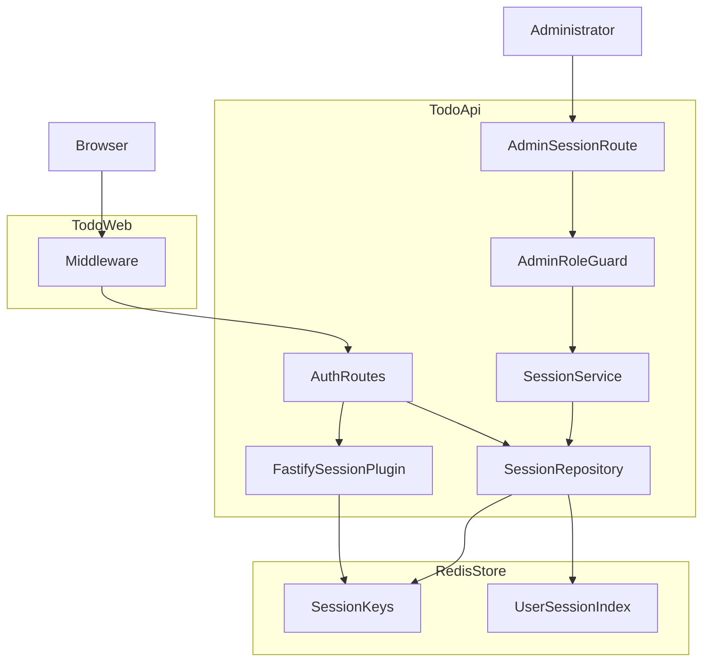
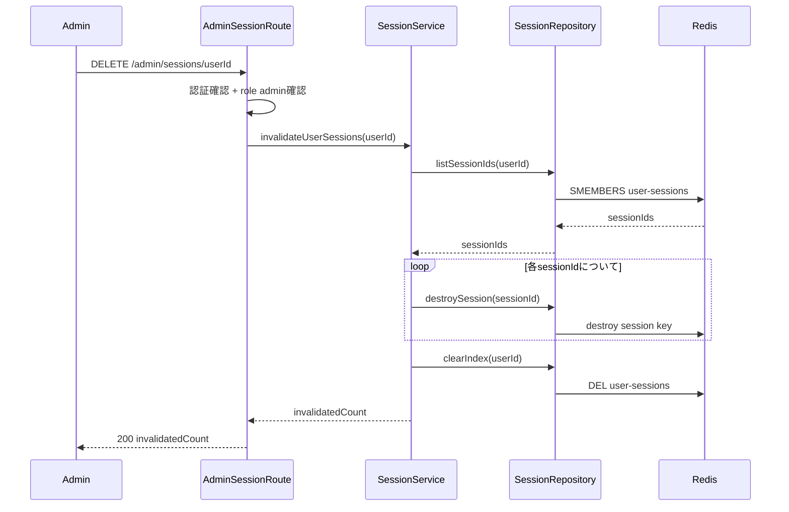

# Design Document

## Overview
**Purpose**: 本機能は、`todo-api`のセッションストアをRedisベースの外部ストアに切り替え、`userId → sessionId群`の逆引き索引を新設した上で、管理者が特定ユーザーの全セッションを強制的に無効化できるAPIを提供する。これにより、後続で計画している管理者画面の「アカウント無効化」機能が実際に機能する基盤を整える。

**Users**: `role = admin`を持つ管理者（今後実装される管理者画面から呼び出される想定）。また、複数の`todo-api`インスタンスを運用するシステム運用者が、その一貫した挙動の恩恵を受ける。

**Impact**: `todo-api`の既定インメモリ`Map`セッションストアをRedisに切り替える。`auth.controller.ts`のログイン/ログアウト処理に逆引き索引の維持ロジックを追加する。新規の管理者向けエンドポイントを追加する。`todo-web/middleware.ts`の認証キャッシュTTLを短縮する。Docker Compose構成にRedisサービスを追加する。

### Goals
- 管理者が1回の呼び出しで、特定ユーザーに紐づく全セッションを無効化できるようにする。
- 既存の自己ログアウトの挙動を変えない。
- 複数の`todo-api`インスタンス構成でもセッション状態と無効化結果を一貫させる。
- 無効化の反映までの遅延を、数秒程度の範囲に収める。

### Non-Goals
- 管理者画面のUI・アカウント無効化ワークフローそのものの実装（別スペック）。
- ロールに基づく認可（グループ/チーム単位のアクセス制御）の一般的な仕組み（別スペック「認可（Authorization）」）。
- 無効化された本人への通知、無効化操作の監査ログ記録。
- `todo-web`側キャッシュのpub/subによるリアルタイム能動破棄（`research.md`で検討し却下）。

## Boundary Commitments

### This Spec Owns
- `todo-api`のセッションストア設定（Redisバックエンドへの切り替え）。
- `userId → sessionId群`の逆引き索引のライフサイクル（ログイン時に追加、自己ログアウト時に該当1件のみ削除、管理者無効化時に全件参照・削除）。
- 管理者専用の`DELETE /admin/sessions/:userId`エンドポイントと、その最小限の権限チェック（`role === admin`）。
- `todo-web`の認証キャッシュTTLの値（無効化が反映されるまでの遅延許容の予算として）。

### Out of Boundary
- 管理者画面のUI・呼び出しタイミングの設計（今後実装される管理者画面スペックの責務）。
- グループ/チーム単位のアクセス制御を含む一般的な認可の仕組み（今後実装される認可スペックの責務）。
- `role`カラム自体の定義・付与ロジックの変更（`admin-role`スペックで完了済み、本specは読み取るのみ）。
- 無効化操作の監査ログ・本人通知。

### Allowed Dependencies
- 既存の`User.role`（`admin-role`スペックで導入済み、`AuthRepository`経由で参照）。
- 既存の`@fastify/session`セッション（`req.session`）と`app.ts`でのプラグイン登録。
- 新規: すべての`todo-api`インスタンスから到達可能なRedisインスタンス（`@fastify/redis` + `ioredis`経由）。
- 既存のレイヤードアーキテクチャ規約（routes → controllers → services → repositories）およびFastifyのカプセル化によるルート単位`preHandler`パターン（`todos.route.ts`と同様）。

### Revalidation Triggers
- `role`フィールドの名称・型・取得経路が変わった場合、本specの権限チェックロジックを再検証する必要がある。
- 逆引き索引のRedisキー命名やデータ形状を変更した場合、内部実装の変更に留まる限り管理者画面・認可スペックへの影響はないが、`DELETE /admin/sessions/:userId`のエンドポイント契約（パス・レスポンス形状）を変える場合はそれらのスペックの再検証が必要。
- `todo-web`の認証フローが再設計され`/auth/me`ポーリング方式自体をやめる場合、TTLに基づく遅延許容の設計判断を見直す必要がある。

## Architecture

### Existing Architecture Analysis
- `todo-api`は`routes → controllers → services → repositories → db`の厳格なレイヤードアーキテクチャに従う。ルート単位の`preHandler`はFastifyのカプセル化を利用し、そのプラグイン（ルートファイル）内でのみ有効（`todos.route.ts`のパターン）。
- セッション認証は`@fastify/session`によるステートフルなセッション方式。現在は既定のインメモリ`Map`ストア（`store.js`）を使用しており、`get/set/destroy`のみを要求する薄い`Store`契約に従っている。
- `todo-web/middleware.ts`は`/auth/me`の結果を`sessionId`ごとに30秒キャッシュしており、`todo-api`のセッションライフサイクルとは独立している。

### Architecture Pattern & Boundary Map



**Architecture Integration**:
- 選定パターン: 既存レイヤードアーキテクチャの延長上に、Redisを新しい永続化先として追加する「外部ストア + アプリ側索引」構成（詳細な比較は`research.md`参照）。
- ドメイン境界: セッションの実体（Redisストア）と、逆引き索引（Redis Set）は別々のキー空間として明確に分離する。
- 既存パターンの維持: レイヤー分離、Fastifyカプセル化による`preHandler`、`AppError`による例外処理は変更しない。
- 新規コンポーネントの根拠: `SessionRepository`/`SessionService`は「逆引き索引の維持」と「無効化の業務ロジック」という、既存のどのレイヤーにも属さない新しい責務を持つため新設する。
- Steering整合性: `todo-api/src/`のレイヤー命名規則（`<domain>.<layer>.ts`）、テストの`_test_/`配置規約に従う。

### Technology Stack

| Layer | Choice / Version | Role in Feature | Notes |
|-------|------------------|-----------------|-------|
| Backend / Session Store | 自前実装（`@fastify/redis`のioredisクライアントを利用） | `@fastify/session`の`store`オプションに渡す`Store`実装（`get/set/destroy`のみ）を自前で提供 | 既定の`MemoryStore`を置き換える。外部Storeアダプタ（`fastify-session-redis-store`等）は保守状況が悪く不採用（`research.md`参照） |
| Backend / Redis接続 | `@fastify/redis`（公式、ioredisベース） | `todo-api`全体で単一のRedis接続を共有 | 2026年1月時点でも継続的にメンテナンスされている |
| Data / Storage | Redis（新規追加） | セッション実体（自前実装の`RedisSessionStore`管理）と`userId → sessionId`逆引き索引（Set）を保持 | 新しい実行時依存。既存のMySQLとは別のデータストア |
| Infrastructure / Runtime | Docker Compose `redis`サービス | dev/prod双方でRedisインスタンスを提供 | 既存の`db`サービスと同様のヘルスチェックパターンを踏襲 |
| Frontend | `todo-web/middleware.ts`（既存、TTL値のみ変更） | 認証結果キャッシュのTTLを短縮し、無効化反映までの遅延を許容範囲に収める | 新規ライブラリ追加なし |

## File Structure Plan

### Directory Structure
```
todo-api/src/
├── app.ts                            # 変更: @fastify/redis登録、sessionのstoreを自前RedisSessionStoreに切替
├── session/
│   └── redisSessionStore.ts          # 新規: @fastify/sessionのStore契約(get/set/destroy)を自前実装
├── routes/
│   ├── auth.route.ts                 # 変更なし
│   └── admin.session.route.ts        # 新規: DELETE /admin/sessions/:userId、管理者チェックのpreHandler
├── controllers/
│   ├── auth.controller.ts            # 変更: login/logoutで逆引き索引を更新
│   └── admin.session.controller.ts   # 新規: userIdパラメータの解釈、SessionService呼び出し、レスポンス整形
├── services/
│   ├── auth.service.ts               # 変更なし
│   └── session.service.ts            # 新規: invalidateUserSessions（一覧取得→全destroy→索引クリア）
├── repositories/
│   ├── auth.repository.ts            # 変更なし
│   └── session.repository.ts         # 新規: Redis Set操作（track/untrack/list/clear）とセッション破棄の委譲
└── types/
    └── session.ts                    # 新規: InvalidateSessionsResult等の型定義
```

### Modified Files
- `todo-api/src/app.ts` — `@fastify/redis`を登録し、共有ioredisクライアントを`RedisSessionStore`（自前実装）に渡して`session`プラグインの`store`オプションとする。`admin.session.route`を登録する。
- `todo-api/src/controllers/auth.controller.ts` — `login`で`req.session.userId`設定後に`SessionRepository.trackSession`を呼ぶ。`logout`で`session.destroy`と合わせて`SessionRepository.untrackSession`を呼ぶ。
- `todo-web/middleware.ts` — `AUTH_CACHE_TTL_MS`を`30_000`から数秒程度の値に短縮する。
- `docker-compose.yml` — `redis`サービス（イメージ・ヘルスチェック）を追加し、`api`の`depends_on`に`redis`（healthy条件）を加える。
- `docker-compose.dev.yml` — dev向けの`redis`ポート公開・env設定を追加。
- `docker-compose.prod.yml` — `app-net`ネットワーク上に`redis`サービスを追加。
- `todo-api/.env.dev.example` / `.env.prod.example` / `.env.test.example` — `REDIS_HOST` / `REDIS_PORT`（必要に応じて`REDIS_PASSWORD`）を追加。
- `todo-api/package.json` — `@fastify/redis`を依存関係に追加（外部Storeアダプタは追加しない。ioredisの型は`@fastify/redis`経由で利用）。

## System Flows



**フロー上の判断ポイント**:
- 権限チェック（認証済みか、`role === admin`か）は`AdminSessionRoute`の`preHandler`で完結させ、`SessionService`側では権限を意識しない（呼ばれた時点で許可済みという前提）。
- `sessionIds`が空の場合はループが0回実行され、`invalidatedCount: 0`をエラーなく返す（Requirement 1.3）。
- 対象ユーザーが管理者自身であっても分岐を設けない（Requirement 3.3）。

## Requirements Traceability

| Requirement | Summary | Components | Interfaces | Flows |
|-------------|---------|------------|------------|-------|
| 1.1 | 管理者要求で対象ユーザーの全有効セッションを無効化 | SessionService, SessionRepository | invalidateUserSessions, listSessionIds, destroySession, clearIndex | 無効化シーケンス |
| 1.2 | 無効化されたセッションは短い許容遅延内に未認証として扱われる | RedisSessionStore, todo-web Middleware | Store.destroy, authCache TTL | 無効化シーケンス |
| 1.3 | 有効セッションが無い場合はエラーにしない | SessionService | invalidateUserSessions（invalidatedCount: 0） | 無効化シーケンス |
| 2.1 | 自己ログアウトは従来通り機能する | AuthController.logout（既存ロジック維持） | 既存の`session.destroy` | - |
| 2.2 | 自己ログアウトは他セッションに影響しない | AuthController, SessionRepository | untrackSession | - |
| 3.1 | 管理者以外は拒否される | AdminRoleGuard | preHandler | 無効化シーケンス |
| 3.2 | 管理者は任意ユーザーを対象にできる | AdminRoleGuard, AdminSessionController | preHandler, DELETE /admin/sessions/:userId | 無効化シーケンス |
| 3.3 | 管理者が自分自身を対象にしても同じ挙動 | SessionService（特別分岐なし） | invalidateUserSessions | 無効化シーケンス |
| 4.1 | 別インスタンスで作成したセッションも有効と認識される | RedisSessionStore | 共有Redisバックエンドの`Store`契約 | - |
| 4.2 | どのインスタンスが処理しても無効化結果は一貫する | SessionRepository | listSessionIds/destroySession/clearIndexが同一Redisに対して動作 | 無効化シーケンス |
| 4.3 | 再起動不要で即時反映 | RedisSessionStore | Redisへの書き込みは即座に他インスタンスから可視 | - |

## Components and Interfaces

| Component | Domain/Layer | Intent | Req Coverage | Key Dependencies (P0/P1) | Contracts |
|-----------|--------------|--------|--------------|--------------------------|-----------|
| RedisSessionStore | Infrastructure | `@fastify/session`の`Store`契約（get/set/destroy）を自前実装し、`@fastify/session`に配線する | 1.1, 4.1, 4.2, 4.3 | @fastify/redis (P0) | State |
| SessionRepository | Repository | 逆引き索引のRedis Set操作とセッション破棄の委譲 | 1.1, 1.3, 2.2, 4.2 | ioredisクライアント (P0), Fastify SessionのStoreインスタンス (P0) | State |
| SessionService | Service | 管理者無効化の業務ロジック（一覧→全destroy→索引クリア、空なら no-op） | 1.1, 1.3, 3.3 | SessionRepository (P0) | Service |
| AdminSessionController | Controller | `userId`パラメータの解釈、SessionService呼び出し、レスポンス整形 | 1.1, 1.3 | SessionService (P0) | API |
| AdminRoleGuard（preHandler） | Route | 認証済み・管理者ロールであることの確認 | 3.1, 3.2 | AuthRepository (P0) | API |
| AuthController（変更） | Controller | ログイン/自己ログアウト時の逆引き索引維持 | 2.2 | SessionRepository (P0) | Service |
| 認証キャッシュTTL（`todo-web`） | Frontend/Middleware | 無効化反映までの遅延を許容範囲に収める | 1.2 | なし | State |

### Infrastructure

#### RedisSessionStore

| Field | Detail |
|-------|--------|
| Intent | `@fastify/session`が要求する`Store`契約を、外部アダプタパッケージに頼らず自前実装し、既定の`MemoryStore`を置き換える |
| Requirements | 1.1, 4.1, 4.2, 4.3 |

**Responsibilities & Constraints**
- `get(sessionId, callback)` / `set(sessionId, session, callback)` / `destroy(sessionId, callback)`の3メソッドのみを実装する（`@fastify/session`の`Store`契約全量）。
- キー命名は`<prefix>` + `sessionId`のように単純な文字列結合とし、`SessionRepository`が同じ命名規則を意識せず済むよう、破棄は必ずこのクラスの`destroy`経由で行う（`SessionRepository.destroySession`から呼ばれる）。
- セッションデータのシリアライズ形式（JSON文字列化）と、Redisキーの有効期限（本specでは設定しない）をこのクラスが一元的に決める。

**Dependencies**
- Inbound: `app.ts`（`@fastify/session`の`store`オプションとして登録） (P0)
- Inbound: SessionRepository（`destroySession`からの委譲先） (P0)
- External: `@fastify/redis`が提供するioredisクライアント (P0)

**Contracts**: Service [ ] / API [ ] / Event [ ] / Batch [ ] / State [x]

##### Service Interface
```typescript
interface Store {
  get(sessionId: string, callback: (err: Error | null, session?: object) => void): void;
  set(sessionId: string, session: object, callback: (err: Error | null) => void): void;
  destroy(sessionId: string, callback: (err: Error | null) => void): void;
}
```
- Preconditions: `@fastify/redis`経由のioredisクライアントが接続済みであること。
- Postconditions: `set`はRedisに`JSON.stringify`したセッションデータを書き込む。`get`は存在しないキーに対して`undefined`をコールバックへ渡す（エラー扱いにしない）。`destroy`はキーを削除し、以降の`get`はセッションなしを返す。
- Invariants: 3メソッドとも例外を投げず、必ずnode形式のコールバック（第1引数にエラー）で結果を返す。

**Implementation Notes**
- Integration: 実装は`todo-api/src/session/redisSessionStore.ts`に置き、`app.ts`でインスタンス化して`@fastify/session`の`store`オプションに渡す。
- Validation: 外部パッケージ（`fastify-session-redis-store`等）を採用しなかった理由は`research.md`のDesign Decisionsを参照。
- Risks: 自前実装のため、`@fastify/session`側が期待するコールバック契約からズレるとセッション全体が壊れる。実装時にローカルRedisに対する結合テストで契約遵守を確認する（`research.md`のFollow-up参照）。
- **ドキュメント要件**: このファイルの先頭に、なぜ既存パッケージ（`fastify-session-redis-store`等）を使わず自前実装しているか（保守状況が悪く採用を見送った旨）と、実装が満たすべき`Store`契約（get/set/destroy）を、実装を知らない読み手にも分かる形でコメントとして明記する。このコメントを欠いたレビューは通さない。

### Session Domain

#### SessionRepository

| Field | Detail |
|-------|--------|
| Intent | `userId → sessionId群`の逆引き索引（Redis Set）の読み書きと、セッション実体の破棄を担う |
| Requirements | 1.1, 1.3, 2.2, 4.2 |

**Responsibilities & Constraints**
- `user-sessions:<userId>`というRedis Setをキーとする逆引き索引の追加・削除・列挙・クリアを担当する。
- セッション実体そのものの破棄は、`@fastify/session`に登録された`Store`インスタンスの`destroy`メソッドに委譲し、キー命名の詳細を重複して持たない。

**Dependencies**
- Inbound: SessionService — 無効化処理からの一覧取得・破棄・索引クリア (P0)
- Inbound: AuthController — ログイン/自己ログアウトからの索引更新 (P0)
- External: `ioredis`クライアント（`@fastify/redis`経由） (P0)
- External: 自前実装の`RedisSessionStore`インスタンス（`destroySession`委譲先） (P0)

**Contracts**: Service [x] / API [ ] / Event [ ] / Batch [ ] / State [x]

##### Service Interface
```typescript
interface SessionRepository {
  trackSession(userId: number, sessionId: string): Promise<void>;
  untrackSession(userId: number, sessionId: string): Promise<void>;
  listSessionIds(userId: number): Promise<string[]>;
  destroySession(sessionId: string): Promise<void>;
  clearIndex(userId: number): Promise<void>;
}
```
- Preconditions: Redis接続（`fastify.redis`）が利用可能であること。
- Postconditions: `trackSession`は`user-sessions:<userId>`に`sessionId`を追加する。`untrackSession`は指定した1件のみを削除し、同じユーザーの他の`sessionId`には影響しない。`destroySession`は登録済み`Store`の`destroy`を呼び出し、セッション実体を削除する。
- Invariants: `listSessionIds`・`clearIndex`は常に同一のキー命名規則（`user-sessions:<userId>`）を参照する。

##### State Management
- State model: Redis Set（`user-sessions:<userId>` → `sessionId`文字列の集合）
- Persistence & consistency: Redisが単一の真実源であり、複数`todo-api`インスタンス間で共有される（Requirement 4.1, 4.2の根拠）。
- Concurrency strategy: `SADD`/`SREM`/`SMEMBERS`/`DEL`はRedisのアトミックなコマンドであり、追加のロックは不要。

**Implementation Notes**
- Integration: `app.ts`で構築した`Store`インスタンスをDI的に受け取り、`destroySession`から呼び出す（キー命名の重複実装を避ける）。
- Validation: 呼び出し元（Service層）が渡す`userId`/`sessionId`の型はTypeScriptの型で保証し、追加のランタイムバリデーションは行わない。
- Risks: 索引（Set）とセッション実体がズレる可能性は`research.md`のRisksを参照。無効化のたびに索引を丸ごとクリアすることで自己修復する。

#### SessionService

| Field | Detail |
|-------|--------|
| Intent | 管理者による無効化リクエストの業務ロジック（権限チェックは含まない） |
| Requirements | 1.1, 1.3, 3.3 |

**Responsibilities & Constraints**
- 対象`userId`のセッション一覧を取得し、それぞれを破棄し、索引をクリアする一連の手順を実行する。
- 呼び出された時点で権限チェックは完了している前提とし、権限判定ロジックを持たない（ルート層の`AdminRoleGuard`の責務）。
- 対象が呼び出し元本人（管理者自身）であっても分岐を設けない。

**Dependencies**
- Outbound: SessionRepository — 一覧取得・破棄・索引クリア (P0)

**Contracts**: Service [x] / API [ ] / Event [ ] / Batch [ ] / State [ ]

##### Service Interface
```typescript
type InvalidateSessionsResult = {
  invalidatedCount: number;
};

interface SessionService {
  invalidateUserSessions(targetUserId: number): Promise<InvalidateSessionsResult>;
}
```
- Preconditions: 呼び出し元（ルート層）が、リクエスト送信者が認証済みかつ`role === admin`であることを確認済みであること。
- Postconditions: `targetUserId`に紐づいていたすべての`sessionId`がセッションストアから破棄され、逆引き索引が空になる。
- Invariants: 対象に有効セッションが1件も無い場合でも例外を投げず、`invalidatedCount: 0`を返す。

**Implementation Notes**
- Integration: `AdminSessionController`から呼び出される。
- Validation: `targetUserId`の妥当性（数値であること）はルート層のスキーマ検証で担保済み。
- Risks: Redis呼び出しが失敗した場合は例外を伝播させ、コントローラ層で500として扱う（既存の`auth.controller.ts`のtry/catchパターンと同様）。

### Admin API

#### AdminSessionController / AdminSessionRoute

| Field | Detail |
|-------|--------|
| Intent | 管理者向けセッション強制無効化APIのエンドポイントと権限チェック |
| Requirements | 1.1, 1.3, 3.1, 3.2 |

**Responsibilities & Constraints**
- `DELETE /admin/sessions/:userId`を受け付け、`userId`パラメータを数値として解釈する。
- `preHandler`で、リクエスト送信者が認証済み（`req.session.userId`が存在する）かつ`role === admin`であることを確認する（`AuthRepository.findById`経由）。いずれかを満たさない場合は`SessionService`を呼び出さない。

**Dependencies**
- Outbound: SessionService — 無効化処理の実行 (P0)
- Outbound: AuthRepository — リクエスト送信者のロール確認 (P0)

**Contracts**: Service [ ] / API [x] / Event [ ] / Batch [ ] / State [ ]

##### API Contract
| Method | Endpoint | Request | Response | Errors |
|--------|----------|---------|----------|--------|
| DELETE | /admin/sessions/:userId | Params: `{ userId: number }` | `200 { invalidatedCount: number }` | 401（未認証）, 403（管理者以外）, 500（内部エラー） |

**Implementation Notes**
- Integration: `todos.route.ts`と同様に、`preHandler`をこのルートプラグインのスコープ内に閉じる（Fastifyのカプセル化）。他ルートには影響しない。
- Validation: `userId`はJSON Schemaで`integer`型として宣言し、Fastifyの既定の型強制で数値化する（`todos.route.ts`の`:id`パラメータと同様のパターン）。
- Risks: `AuthRepository.findById`の呼び出しが失敗した場合は500として扱い、権限チェックを素通りさせない。

## Data Models

### Logical Data Model
本機能は新しいSQLテーブルを追加しない。データはすべてRedis上のキー・バリュー構造として表現される。

### Physical Data Model（Key-Value Store）
- セッション実体キー: 自前実装の`RedisSessionStore`が内部的に管理する（`<prefix>` + `sessionId`形式）。値は既存の`{ authenticated, userId }`を含むセッションデータのシリアライズ形式。TTLは現状設定しない（既存のCookie側の「有効期限なし」という挙動を踏襲し、本specでは有効期限の追加は扱わない）。
- 逆引き索引キー: `user-sessions:<userId>` → `sessionId`文字列のRedis Set。TTLは設定せず、自己ログアウト時に該当1件を削除、管理者無効化時に全体を削除することで明示的に管理する。

## Error Handling

### Error Strategy
既存の`AppError` + コントローラ層でのtry/catchパターンをそのまま踏襲する。新しいエラー分類は導入しない。

### Error Categories and Responses
- **401 Unauthorized**: `req.session.userId`が存在しない（未認証）。既存の`todos.route.ts`と同様の`preHandler`パターン。
- **403 Forbidden**（新規）: 認証済みだが`role !== admin`。
- **500 Internal Server Error**: Redis呼び出し失敗など予期しないエラー。`req.log.error`でログし、汎用メッセージを返す（既存の`auth.controller.ts`と同様）。

## Testing Strategy

### Unit Tests
- `session.service.test.ts`: 対象ユーザーに有効セッションが複数ある場合、各`sessionId`に対して`destroySession`が呼ばれ、`clearIndex`が呼ばれ、正しい`invalidatedCount`が返る（Req 1.1）。
- `session.service.test.ts`: 対象ユーザーに有効セッションが無い場合、例外を投げず`invalidatedCount: 0`を返す（Req 1.3）。
- `session.repository.test.ts`: `untrackSession`が指定した1件のみをSetから削除し、同じユーザーの他の`sessionId`は残る（Req 2.2）。
- `redisSessionStore.test.ts`: `set`で書き込んだセッションを`get`で取得できる、`destroy`後は`get`が「セッションなし」を返す、いずれも`@fastify/session`が期待するコールバック契約（第1引数エラー）で返る（Req 1.1, 4.1, 4.3）。

### Integration Tests
- ローカルRedisに対する結合テスト: 同一ユーザーで2つのセッション（デバイスA・B）を作成 → 管理者無効化APIを呼ぶ → 両方の`sessionId`がその後`/auth/me`で401になる（Req 1.1, 1.2, 4.2）。
- 自己ログアウトが他デバイスのセッションに影響しないことを確認する結合テスト（Req 2.1, 2.2）。
- `preHandler`の権限チェック: 非管理者リクエストは403で`SessionService`が呼ばれない（Req 3.1）、管理者リクエストは処理が進む（Req 3.2）、管理者が自分自身を指定しても同じ経路で処理される（Req 3.3）。

### E2E/UI Tests
本specはUIを持たないため対象外（管理者画面は別スペックの責務、Non-Goals参照）。

## Security Considerations
本エンドポイントの権限チェックは「認証済みかつ`role === admin`」という最小限のものであり、グループ/チーム単位のアクセス制御を含む一般的な認可の枠組みは意図的に対象外とする（Non-Goals、`Out of Boundary`参照）。Redisにはセッションデータ（`userId`等）が保持されるため、既存の`db`サービスと同様に外部に公開せず、Dockerの内部ネットワークからのみ到達可能にする。

## Performance & Scalability
`SMEMBERS`のコストは対象ユーザーの同時セッション数（通常は数件程度）に比例するのみで、Redis全体のキー数には依存しない。`todo-web`側`authCache`のTTL短縮により`/auth/me`への問い合わせ頻度は増えるが、TTLを完全に無くさず数秒残すことで、負荷増加を抑えつつ遅延許容範囲（数秒程度）を満たす（`research.md`のDesign Decisions参照）。
