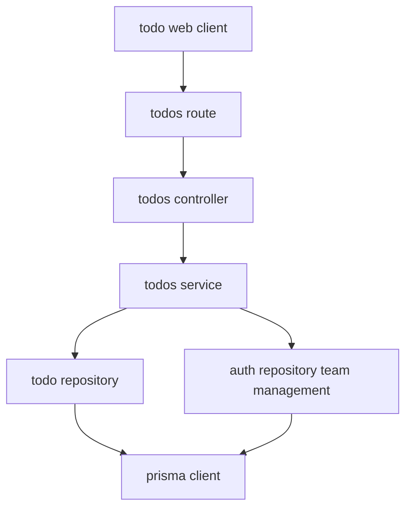
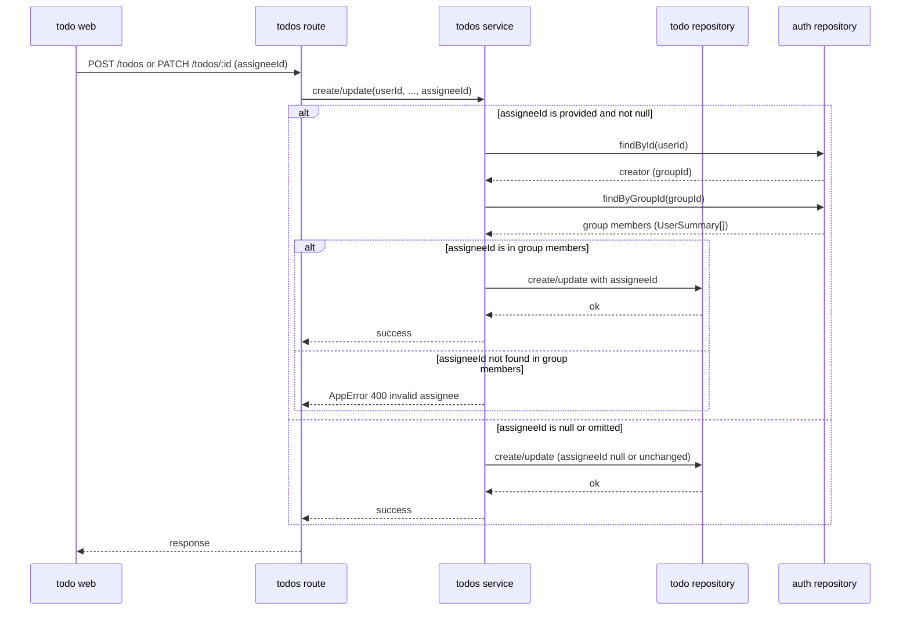
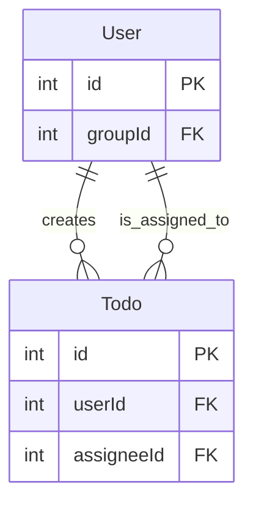

# Technical Design Document

## Overview
本機能は、`todo-api`のTodoに単一の担当者（`assigneeId`）を追加し、担当者候補をタスク作成者が現在所属するグループのメンバーに限定する。

**Purpose**: グループでTodoを運用するメンバー・group_leaderに対して、タスクの担当者を明示的に割り当てる手段を提供し、誰が対応すべきかを機械的に判別可能にする。

**Users**: グループに所属する`member`・`group_leader`が、自身の作成したタスクの作成・編集時に担当者を設定・変更・解除する。

**Impact**: `orm-migration`が確立した`prisma/schema.prisma`の`Todo`モデルに`assigneeId`（nullable FK）を追加し、`TodoRepository`/`TodoService`/`TodoController`/`todos.route.ts`を拡張する。既存のTodo CRUD自体の挙動（タイトル・ステータスの操作、`user_id`スコープ）は変更しない。担当者情報は`task-rot-detection`（別ブランチで設計承認済み）の可視性判定にそのまま利用される。

### Goals
- Todoに担当者（`assigneeId`、nullable）を設定・変更・解除できるようにする
- 担当者候補を、タスク作成者が現在所属するグループのメンバー（作成者自身を含む）に限定する
- 自己アサインを許可する
- タスク一覧・詳細の表示に担当者情報を反映する
- `task-rot-detection`が前提とする`assignee_id`の契約（nullable、非NULL＝アサイン済み）にそのまま適合する形でデータを提供する

### Non-Goals
- 1タスクへの複数担当者の割り当て
- 担当者の変更履歴・監査ログの記録
- 担当者へのアサイン通知（`task-rot-detection`の責務）
- 承認を要するアサイン変更ワークフロー
- 担当者設定後にタスク作成者・担当者のグループ所属が変化した場合の再検証・自動解除
- `assignee_id`に基づく可視性判定そのもの（`task-rot-detection`の責務。本specは値を提供するのみ）

## Boundary Commitments

### This Spec Owns
- `prisma/schema.prisma`の`Todo`モデルへの`assigneeId`（`@map("assignee_id")`）列追加とマイグレーション
- `TodoRepository`の`create`/`update`拡張（`assigneeId`の読み書き）
- 担当者候補解決ロジック（`TodoService.resolveGroupMembers`）と、それを用いた担当者指定のバリデーション（グループ外・存在しないユーザーの拒否）
- 担当者候補一覧を返す新規エンドポイント（`GET /todos/assignee-candidates`）
- タスク一覧・詳細レスポンスへの担当者表示情報（`assigneeId`・`assigneeName`）の付与
- フロントエンドの担当者選択UI（作成・編集フォーム、一覧・詳細表示）

### Out of Boundary
- `groups`テーブル・`users.group_id`のスキーマそのもの、`GroupRepository`/`GroupLeaderService`/`groupLeaderOnlyGuard`（`team-management`が所有。本specは`AuthRepository`の既存メソッドを消費するのみ）
- `assignee_id`の非NULLをもって「アサインされたグループタスク」と判定し可視性・通知に反映するロジック（`task-rot-detection`の責務。本specは値を提供するのみで、可視性の解釈は行わない）
- 複数担当者の割り当て、担当者変更履歴・監査ログ、担当者へのアサイン通知、承認を要するアサイン変更ワークフロー（brief.md Out of scope）
- 担当者・作成者のグループ異動、担当者アカウントの無効化に伴う既存アサインの再検証・自動解除
- タスク作成者以外（group_leaderを含む）による他者作成タスクへの担当者設定（既存の`user_id`スコープをそのまま維持し、新たな越権経路を作らない）

### Allowed Dependencies
- `team-management`が提供する`AuthRepository.findById(userId): Promise<User | null>` — 作成者の現在の`groupId`取得に使用（Criticality P0）
- `team-management`が提供する`AuthRepository.findByGroupId(groupId): Promise<UserSummary[]>` — 候補一覧・担当者表示名の解決に使用（Criticality P0）
- `orm-migration`が確立したPrisma Clientベースの`TodoRepository`パターン（`affectedRows`/影響行数ベースの404判定契約）（Criticality P0）
- `task-status-model`が確立した`Todo.status`の型（`TodoStatus`enum、`pending`/`in_progress`/`blocked`/`done`）— 本specは`TodoRepository.create`/`update`の同じシグネチャを拡張するため、`status`の型はこのenumに従う（Criticality P0。cross-spec reviewで発見: 本specは当初`team-management`のみを依存として宣言していたが、`TodoRepository.create`/`update`を共通で拡張する`task-status-model`への依存が未宣言だった）
- 既存の`AppError`（`todo-api/src/errors/AppError.ts`）（Criticality P1）

### Revalidation Triggers
- `AuthRepository.findByGroupId`の返却フィールド構成（`UserSummary`の形）が変わる場合
- `users.group_id`の型・NOT NULL制約・「全ユーザーが常にちょうど1つのグループに所属する」という前提が変わる場合
- `todos.assignee_id`の型・null許容・意味づけ（非NULL＝アサイン済みという単純な二値判定）を変更する場合（`task-rot-detection`が再検証対象）
- `TodoRepository`の`create`/`update`公開シグネチャを変更する場合（`task-status-model`の`TodoStatus`enum定義も参照）

## Architecture

### Existing Architecture Analysis
既存のレイヤードアーキテクチャ（`routes → controllers → services → repositories → DB`）を維持する。`orm-migration`によりリポジトリ層はPrisma Clientベースとなり、本機能もこのパターンに従う。`todos`ドメインは既に`user_id`スコープを全メソッドで強制しており（`TodoRepository.findById(id, userId)`等）、この不変条件が「タスク作成者以外は担当者を設定できない」という要件7を構造的に満たす一部となる。

- 既存パターン: `TodoService`は`TodoRepository`のみに依存してきたが、本機能により`team-management`が提供する`AuthRepository`にも依存するクロスドメイン依存が生じる。これは`task-rot-detection`design.mdの`HelpService → team-management group lookup`と同型の既存許容パターンであり、新しい依存方向を導入しない。
- 既存パターンの維持: `affectedRows`ベースの404判定、リクエスト層でのスキーマ検証、コントローラーでの`AppError`ハンドリング。
- 新規コンポーネントの理由: 独立した`AssigneeService`のような新規レイヤーは追加しない（Simplification。呼び出し元が`TodoService`のみのため、追加の抽象化は不要）。候補解決・検証ロジックは`TodoService`の拡張として実装する。

### Architecture Pattern & Boundary Map



**Architecture Integration**:
- 選択パターン: 既存レイヤードアーキテクチャの拡張（新レイヤーは導入しない）
- ドメイン境界: 担当者候補解決・検証は`todos`ドメイン（`TodoService`）が所有し、グループメンバーシップそのもののデータ源は`team-management`の`AuthRepository`に留める。二重管理を避けるため、本specはグループメンバー一覧を独自にキャッシュ・複製しない
- 既存パターンの維持: `user_id`スコープによる認可、`AppError`によるエラー処理、Fastifyスキーマ検証
- 新規コンポーネントの理由: `GET /todos/assignee-candidates`は`team-management`の`GET /groups/me/members`（`group_leader`専用）を再利用できない（本機能は全メンバーが候補を見る必要がある）ため、`todos`ドメイン内に認可レベルの異なる新規エンドポイントとして追加する（research.md「担当者候補一覧APIの認可レベル」参照）
- Steering準拠: TypeScript strict・`any`不使用（`tech.md`）、レイヤー単一責務（`structure.md`）を維持

**依存方向**: `schema.prisma` → `PrismaClient` → `Repository`（`TodoRepository`, `AuthRepository`） → `TodoService` → `TodoController` → `todos.route.ts`。各層は左側のレイヤーのみを参照する。`TodoService`は`AuthRepository`を直接参照するが、`team-management`のサービス層・コントローラー層・ルート層には一切依存しない。

### Technology Stack

| Layer | Choice / Version | Role in Feature | Notes |
|-------|------------------|------------------|-------|
| ORM | Prisma / `@prisma/client`（`orm-migration`導入済みバージョン） | `Todo.assigneeId`列の定義とクエリ実行 | 新規バージョン導入なし |
| Backend | Fastify 5 / Node.js（既存） | 新規エンドポイント（候補一覧）、既存エンドポイントの拡張 | 新規ライブラリ追加なし |
| Frontend | Next.js 16 + React 19（既存） | 担当者選択UI、一覧・詳細への担当者表示 | 新規ライブラリ追加なし |

## File Structure Plan

### Directory Structure
```
todo-api/
├── prisma/
│   ├── schema.prisma                    # 変更: Todoモデルにassigneeid列・User assignedTodosリレーション追加
│   └── migrations/
│       └── <timestamp>_add_todo_assignee/
│           └── migration.sql            # 新規: todos.assignee_id追加(NULL許容、FK→users.id)
├── src/
│   ├── repositories/
│   │   └── todos.repository.ts          # 変更: create/updateがassigneeIdを読み書きする
│   ├── services/
│   │   └── todos.service.ts             # 変更: resolveGroupMembers、担当者バリデーション、表示用enrichment追加
│   ├── controllers/
│   │   └── todos.controller.ts          # 変更: getAssigneeCandidatesハンドラ追加、create/updateがassigneeIdを受け渡す
│   ├── routes/
│   │   └── todos.route.ts               # 変更: GET /todos/assignee-candidates追加、POST/PATCHスキーマにassigneeId追加
│   └── types/
│       └── todo.ts                      # 変更: Todo型にassigneeId追加、TodoWithAssignee型追加

todo-web/
├── lib/
│   ├── types.ts                          # 変更: Todo型にassigneeId・assigneeNameを追加
│   └── api/
│       └── todos.ts                      # 変更: fetchAssigneeCandidates追加、create/updateペイロードにassigneeId追加
├── features/todo/
│   └── TodoApp.tsx                       # 変更: 作成・編集フォームに担当者セレクトを追加、一覧・詳細に担当者名を表示
```

### Modified Files
- `todo-api/prisma/schema.prisma` — `Todo`モデルに`assigneeId Int?`（`@map("assignee_id")`）、`User`への`@relation`を追加。`User`モデルに逆参照リレーション（既存の`todos`と区別する命名、例: `assignedTodos`）を追加
- `todo-api/src/repositories/todos.repository.ts` — `create(title, userId, status, assigneeId)`・`update`の`Partial<Pick<Todo, "title" | "status" | "assigneeId">>`拡張。既存の`findAll`/`findById`/`delete`のシグネチャは変更しない
- `todo-api/src/services/todos.service.ts` — `resolveGroupMembers(creatorId)`追加、`create`/`update`に担当者バリデーションを追加、`getAll`/`getById`が`assigneeName`を付与した形で返すよう拡張、`getAssigneeCandidates(userId)`追加
- `todo-api/src/controllers/todos.controller.ts` — `getAssigneeCandidates`ハンドラ追加、`create`/`update`が`req.body.assigneeId`をサービスへ渡すよう拡張
- `todo-api/src/routes/todos.route.ts` — `GET /todos/assignee-candidates`ルート追加、既存`POST /todos`・`PATCH /todos/:id`のFastifyスキーマに`assigneeId`（`type: ["integer", "null"]`、optional）を追加
- `todo-api/src/types/todo.ts` — `Todo`型に`assigneeId: number | null`追加、`TodoWithAssignee`型（`Todo & { assigneeName: string | null }`）追加
- `todo-web/lib/types.ts` — `Todo`型に`assigneeId: number | null`・`assigneeName: string | null`追加
- `todo-web/lib/api/todos.ts` — `fetchAssigneeCandidates(): Promise<AssigneeCandidate[]>`追加、`createTodo`/`updateTodo`が`assigneeId`を送信できるよう拡張
- `todo-web/features/todo/TodoApp.tsx` — 作成・編集フォームへの担当者セレクト追加、一覧行・詳細への担当者名表示追加

## System Flows

### 担当者設定時の検証フロー



- 存在しないユーザーIDを担当者に指定した場合も「グループメンバー一覧に含まれない」という同一の判定経路でエラーになる（要件6.1・6.2を単一のチェックで満たす）。
- 自己アサイン（`assigneeId === userId`）は常に`resolveGroupMembers`の結果に作成者自身が含まれるため、追加分岐なしで許可される（要件3）。
- 作成者以外のグループメンバーが1人もいない場合、`resolveGroupMembers`は作成者自身のみを含む配列を返し、担当者候補は自分のみになる（要件4）。

## Requirements Traceability

| Requirement | Summary | Components | Interfaces | Flows |
|-------------|---------|------------|------------|-------|
| 1.1, 1.2 | 作成・編集時の担当者設定 | TodoService, TodoRepository | POST /todos, PATCH /todos/:id | 担当者設定時の検証フロー |
| 1.3 | 担当者未設定での作成・編集許可 | TodoService | POST /todos, PATCH /todos/:id | 担当者設定時の検証フロー |
| 1.4 | 担当者指定の解除 | TodoService, TodoRepository | PATCH /todos/:id | 担当者設定時の検証フロー |
| 1.5 | 単一担当者の保持 | PrismaSchemaExtension | Todo.assigneeId (単一カラム) | - |
| 2.1, 2.3 | 担当者候補のグループ限定・不正指定の拒否 | TodoService (resolveGroupMembers) | POST /todos, PATCH /todos/:id | 担当者設定時の検証フロー |
| 2.2 | 担当者候補一覧の提示 | TodoService, TodoController | GET /todos/assignee-candidates | - |
| 3.1, 3.2 | 自己アサインの許可 | TodoService (resolveGroupMembers) | POST /todos, PATCH /todos/:id, GET /todos/assignee-candidates | 担当者設定時の検証フロー |
| 4.1 | 単独グループでの候補提示 | TodoService (resolveGroupMembers) | GET /todos/assignee-candidates | 担当者設定時の検証フロー |
| 5.1, 5.2 | 一覧・詳細への担当者表示 | TodoService (enrichment) | GET /todos, GET /todos/:id | - |
| 6.1, 6.2 | 不正な担当者指定のエラー | TodoService | POST /todos, PATCH /todos/:id | 担当者設定時の検証フロー |
| 6.3 | 存在しないタスクへの操作エラー | TodoService (既存getById) | PATCH /todos/:id | - |
| 7.1, 7.2 | 作成者本人のみへの操作権限限定 | TodoRepository (既存user_idスコープ) | PATCH /todos/:id | - |

## Components and Interfaces

| Component | Domain/Layer | Intent | Req Coverage | Key Dependencies (P0/P1) | Contracts |
|-----------|---------------|--------|---------------|---------------------------|-----------|
| PrismaSchemaExtension | Data Layer | `Todo.assigneeId`列の定義 | 1.5 | PrismaClientSingleton (P0) | State |
| TodoRepository（拡張） | Data Layer | `assigneeId`の読み書き | 1.1, 1.2, 1.4, 1.5, 7.1 | PrismaClientSingleton (P0) | Service |
| TodoService（拡張） | Business Logic | 担当者バリデーション・候補解決・表示enrichment | 1.1–1.4, 2.1–2.3, 3.1–3.2, 4.1, 5.1–5.2, 6.1–6.3 | TodoRepository (P0), AuthRepository (P0) | Service, API |
| TodoController（拡張） / todos.route.ts（拡張） | API | HTTP窓口の拡張、候補一覧エンドポイント | 1.1–1.4, 2.2, 5.1–5.2, 6.1–6.3 | TodoService (P0) | API |

### Data Layer

#### PrismaSchemaExtension

| Field | Detail |
|-------|--------|
| Intent | `Todo`モデルに担当者列を追加する |
| Requirements | 1.5 |

**Responsibilities & Constraints**
- `Todo`モデルに`assigneeId Int?`（`@map("assignee_id")`）を追加し、`User`への`@relation(fields: [assigneeId], references: [id])`を定義する（リレーション名を既存の`user`とは別名にする。例: `assignee`）
- `User`モデルに逆参照`assignedTodos Todo[] @relation("TodoAssignee")`を追加する（既存の`todos Todo[]`とは別のリレーション名を使う）
- `onDelete`は指定しない（既存システムにユーザー削除機能自体が存在せず、`disabled`ステータスによる無効化のみのため、カスケード・SET NULLのいずれも実運用上発生しない。将来ユーザー削除機能が追加される場合は本カラムのFK方針を再検討する）
- 1カラムのみの追加であり、全既存Todoは`assigneeId = NULL`のまま後方互換を保つ

**Dependencies**
- Outbound: PrismaClientSingleton（`orm-migration`提供） (P0)

**Contracts**: Service [ ] / API [ ] / Event [ ] / Batch [ ] / State [x]

##### State Management
- State model: `todos.assignee_id`列がstate。Prisma Migrateのマイグレーション履歴が変更履歴を管理する
- Persistence & consistency: `assignee_id`は`users.id`への外部キー制約を持つNULL許容列。存在しないユーザーへの参照は作成できない
- Concurrency strategy: 追加のみの列であり、既存の同時実行制御に影響しない

**Implementation Notes**
- Integration: `prisma generate`で`Todo`型に`assigneeId`を含める
- Validation: 新規マイグレーション適用後、既存Todoの`assignee_id`が全てNULLであることを確認する
- Risks: リレーション名の衝突（`User.todos`と`User.assignedTodos`）に注意し、Prismaスキーマのバリデーションエラーが出ないことを実装時に確認する

#### TodoRepository（拡張）

| Field | Detail |
|-------|--------|
| Intent | `assigneeId`の読み書きを既存のTodo CRUDに統合する |
| Requirements | 1.1, 1.2, 1.4, 1.5, 7.1 |

**Responsibilities & Constraints**
- `create(title, userId, status, assigneeId)`: `assigneeId`が`undefined`の場合は`NULL`として作成する
- `update(id, userId, data)`: `data`の`Pick`型に`assigneeId`を追加する。`assigneeId: null`が明示された場合は担当者を解除し、`undefined`の場合は既存値を変更しない（既存の`title`/`status`と同じ部分更新セマンティクスを維持）
- 既存の`findAll(userId)`/`findById(id, userId)`/`delete(id, userId)`のシグネチャ・`user_id`スコープは変更しない（要件7.1の「作成者本人のみが操作可能」は、この既存スコープがそのまま担う）

**Dependencies**
- Inbound: TodoService (P0)
- Outbound: PrismaClientSingleton (P0)

**Contracts**: Service [x] / API [ ] / Event [ ] / Batch [ ] / State [ ]

##### Service Interface
```typescript
interface TodoRepositoryAssigneeExtension {
  create(
    title: string,
    userId: number,
    status: TodoStatus,
    assigneeId: number | null
  ): Promise<void>;

  update(
    id: number,
    userId: number,
    data: Partial<Pick<Todo, "title" | "status" | "assigneeId">>
  ): Promise<void>;
}
```
- Preconditions: `assigneeId`が非NULLの場合、呼び出し元（`TodoService`）が候補集合に含まれることを検証済みであること
- Postconditions: `update`は`data`に含まれないフィールドを変更しない（既存の部分更新契約を維持）
- Invariants: `user_id`が一致しないTodoは一切変更・返却しない（既存不変条件を継続）

**Implementation Notes**
- Integration: 既存の`findAll`/`findById`/`delete`は無変更
- Validation: `assigneeId: null`を指定した`update`が担当者を解除すること、`assigneeId`省略時に既存値が変わらないことをユニットテストで確認する
- Risks: なし（既存のPartial更新パターンをそのまま拡張）

### Business Logic

#### TodoService（拡張）

| Field | Detail |
|-------|--------|
| Intent | 担当者候補の解決・バリデーション、一覧・詳細表示への担当者情報の付与 |
| Requirements | 1.1, 1.2, 1.3, 1.4, 2.1, 2.2, 2.3, 3.1, 3.2, 4.1, 5.1, 5.2, 6.1, 6.2, 6.3 |

**Responsibilities & Constraints**
- `resolveGroupMembers(creatorId)`: `AuthRepository.findById(creatorId)`でユーザーの現在の`groupId`を取得し、`AuthRepository.findByGroupId(groupId)`を返す。作成者自身を含む、作成者が現在所属するグループの全メンバーを返す（要件2.1, 3.2, 4.1）
- `create(title, userId, assigneeId?)`: `assigneeId`が指定され`null`でない場合、`resolveGroupMembers(userId)`の結果に含まれることを検証する（含まれなければ`AppError(400)`）。検証通過後`TodoRepository.create`を呼び出す
- `update(id, userId, data)`: 既存の`getById(id, userId)`による存在確認（要件6.3、既存パターン）に加え、`data.assigneeId`が指定され`null`でない場合は同様に候補集合を検証する
- `getAssigneeCandidates(userId)`: `resolveGroupMembers(userId)`をそのまま返す（要件2.2）
- `getAll(userId)`/`getById(id, userId)`: 返却前に`resolveGroupMembers(userId)`（呼び出し元は常に自分自身のTodoのみを取得するため、リクエスト単位で1回だけ解決すればよい）の結果から`assigneeId`に一致するメンバーの`name`を引き当て、`assigneeName: string | null`として付与する（要件5.1, 5.2）
- 権限チェックは行わない（既存の`user_id`スコープが構造的に「作成者本人のみ」を担保する。要件7は本コンポーネントの新規ロジックではなく既存の`TodoRepository`スコープの帰結として満たされる）

**Dependencies**
- Inbound: TodoController (P0)
- Outbound: TodoRepository (P0), AuthRepository — `team-management`提供 (P0)

**Contracts**: Service [x] / API [x] / Event [ ] / Batch [ ] / State [ ]

##### Service Interface
```typescript
interface TodoServiceAssigneeExtension {
  resolveGroupMembers(creatorId: number): Promise<UserSummary[]>;
  getAssigneeCandidates(userId: number): Promise<UserSummary[]>;
  create(title: string, userId: number, assigneeId?: number | null): Promise<void>;
  update(
    id: number,
    userId: number,
    data: { title?: string; status?: TodoStatus; assigneeId?: number | null }
  ): Promise<void>;
  getAll(userId: number): Promise<TodoWithAssignee[]>;
  getById(id: number, userId: number): Promise<TodoWithAssignee>;
}

type TodoWithAssignee = Todo & { assigneeName: string | null };
```
- Preconditions: `userId`は認証済みセッションから取得された値であること
- Postconditions: `assigneeId`が候補集合に含まれない場合、Todoは作成・更新されず`AppError(400)`が送出される
- Invariants: `assigneeName`は常に`resolveGroupMembers`が返すメンバー一覧から解決され、グループ外のユーザー名を漏らさない

##### API Contract
| Method | Endpoint | Request | Response | Errors |
|--------|----------|---------|----------|--------|
| GET | /todos/assignee-candidates | - | `UserSummary[]` | 401 |
| POST | /todos | `{ title, assigneeId? }` | 201 | 400（不正なタイトル／担当者） |
| PATCH | /todos/:id | `{ title?, status?, assigneeId? }` | 200 | 400（不正な担当者）, 404（タスク不在） |
| GET | /todos | - | `TodoWithAssignee[]` | - |
| GET | /todos/:id | - | `TodoWithAssignee` | 404 |

**Implementation Notes**
- Integration: `getAll`/`getById`のレスポンス形が変わる（`assigneeId`/`assigneeName`が追加される）ため、`todo-web`側の型定義も同時に更新する
- Validation: 「候補外ユーザーの指定が400になること」「自己アサインが成功すること」「候補が自分のみのグループで自己アサインのみ可能なこと」をユニットテストで確認する
- Risks: `getAll`が複数Todoを返す際も`resolveGroupMembers`はリクエストにつき1回のみ呼び出す（同一`userId`の全Todoは同じグループに属するため、Todoごとの呼び出しは不要）。実装時にループ内呼び出しを避けることを明記する

### API

#### TodoController（拡張）/ todos.route.ts（拡張）

| Field | Detail |
|-------|--------|
| Intent | 担当者関連のHTTPリクエスト/レスポンス整形とスキーマ検証 |
| Requirements | 1.1, 1.2, 1.4, 2.2, 5.1, 5.2, 6.1, 6.2, 6.3 |

**Responsibilities & Constraints**
- `getAssigneeCandidates`ハンドラを追加し、`TodoService.getAssigneeCandidates(userId)`をそのまま返す
- 既存の`create`/`update`ハンドラは`req.body.assigneeId`を`TodoService`へ渡すよう拡張する（それ以外のリクエスト/レスポンス整形ロジックは変更しない）
- Fastifyルートスキーマの`body`に`assigneeId`（`type: ["integer", "null"]`, optional）を追加し、不正な型（文字列等）はスキーマ検証段階で拒否する
- 認可: `GET /todos/assignee-candidates`は既存の`requireAuthGuard`相当（セッション存在チェックのみ）を適用し、ロール制限は課さない

**Dependencies**
- Inbound: なし（ルート層）
- Outbound: TodoService (P0)

**Contracts**: Service [ ] / API [x] / Event [ ] / Batch [ ] / State [ ]

**Implementation Notes**
- Integration: 既存の`create`/`update`/`getAll`/`getById`のエラーハンドリング（`AppError` → `err.statusCode`）パターンをそのまま踏襲する
- Validation: `assigneeId`に文字列を渡した場合にFastifyスキーマ検証で400になることを確認する
- Risks: なし

## Data Models

### Domain Model
- `Todo`（既存アグリゲートルート、拡張）: `assigneeId`を新たに持ち、`null`（担当者未設定）または`users.id`への参照のいずれかを取る。担当者は常にタスク作成者（`userId`）が現在所属するグループのメンバー（作成者自身を含む）でなければならない、という不変条件は作成・更新時のバリデーションでのみ強制される（継続的な再検証は行わない）
- 不変条件: 「担当者は設定時点でタスク作成者と同一グループに属する」（作成・更新時にのみ検証。事後のグループ異動による乖離は許容する）、「1タスクにつき担当者は最大1人」（単一カラムで構造的に保証）

### Logical Data Model
- `User 1 --- N Todo`（既存、`Todo.user_id → User.id`、作成者としての関係）
- `User 1 --- N Todo`（新規、`Todo.assignee_id → User.id`、担当者としての関係。同一`User`モデルへの2本目の関係）
- 参照整合性: `Todo.assignee_id`は`User.id`への外部キー制約を持つNULL許容列



### Physical Data Model

**For Relational Databases**:
- `todos`（変更）: `assignee_id INT NULL FK→users.id`を追加
- インデックス: `assignee_id`に外部キー由来のインデックスを追加（担当者別の絞り込みが将来必要になった場合に備える。本specでは絞り込みAPIは提供しない）
- パーティショニング: 対象外

## Error Handling

### Error Strategy
既存の`AppError`パターンをそのまま踏襲する。`TodoService`が担当者バリデーションエラーを`AppError`として投げ、`TodoController`が既存の`try/catch`パターンでハンドリングする。

### Error Categories and Responses
- **400（不正な入力）**: 存在しないユーザー・タスク作成者の所属グループに属さないユーザーを担当者に指定 → `TodoService.create`/`update`が`AppError(400)`（要件6.1, 6.2）。不正な型（文字列等）はFastifyスキーマ検証段階で拒否
- **404（存在しない対象）**: 存在しないタスクへの担当者設定・解除 → 既存の`getById`が`AppError(404)`を送出（要件6.3、既存パターンの再利用）
- **403相当（越権操作）**: 作成者以外による担当者操作 → 既存の`user_id`スコープにより対象タスクが見つからず404として扱われる（既存の`TodoRepository`の挙動と一貫。新たな403判定は導入しない）

### Monitoring
既存同様、追加のロギング・監視基盤は導入しない（本機能のスコープ外）。

## Testing Strategy

### Unit Tests
- `TodoService.resolveGroupMembers`が作成者自身を含むグループメンバー一覧を返すこと（要件2.1, 3.2）
- `TodoService.create`/`update`が、候補集合に含まれないユーザーIDの指定を`400`で拒否すること（要件2.3, 6.1, 6.2）
- `TodoService.create`/`update`が自己アサイン（`assigneeId === userId`）を許可すること（要件3.1）
- `TodoService.update`が`assigneeId: null`指定で担当者を解除すること（要件1.4）
- `TodoRepository.update`が`assigneeId`省略時に既存値を変更しないこと（要件1.3）

### Integration Tests
- `GET /todos/assignee-candidates`が、作成者以外にメンバーがいないグループでは作成者自身のみを返すこと（要件4.1）
- `POST /todos`でグループ外のユーザーIDを担当者に指定した場合に`400`が返り、Todoが作成されないこと（要件2.3, 6.1）
- `GET /todos`/`GET /todos/:id`のレスポンスに担当者設定済みタスクは`assigneeName`が、未設定タスクは`assigneeName: null`が含まれること（要件5.1, 5.2）
- 作成者以外のユーザーが`PATCH /todos/:id`で他者のタスクの担当者変更を試みた場合、既存の`user_id`スコープにより`404`が返ること（要件7.1, 7.2）

### E2E/UI Tests
- タスク作成フォームで担当者候補を選択し、作成後の一覧に担当者名が表示されること
- タスク編集フォームで担当者を解除し、一覧表示が「担当者未設定」に戻ること

## Security Considerations
- 担当者候補は`AuthRepository.findByGroupId`が返すグループスコープの一覧に限定されるため、`GET /todos/assignee-candidates`はグループ外のユーザー情報を漏らさない
- 担当者指定のバリデーションはサーバー側でのみ行われ、クライアントが任意の`assigneeId`を送信しても候補集合外であれば拒否される（IDOR対策）
- タスクの担当者操作は既存の`user_id`スコープにより作成者本人に限定される。新たな認可経路は追加しない

## Migration Strategy
`todos`テーブルへの`assignee_id`列追加のみで、NULL許容のため単一マイグレーションで完結する。既存データへのバックフィルは不要（全既存Todoは`assignee_id = NULL`のまま）。ロールバックは列のdropのみで、既存データへの影響はない。

## Open Questions / Risks
- 担当者・作成者のグループ異動後に既存アサインが「候補集合外」になり得る乖離は、本spec・`task-rot-detection`のいずれもリアルタイムに解消しない。運用上の混乱が実際に確認された場合は、別途整合性チェックのspecを検討する
- 将来ユーザーの物理削除機能が追加される場合、`assignee_id`のFK方針（`SET NULL`等）を再検討する必要がある（現時点では削除機能自体が存在しないため対象外）
