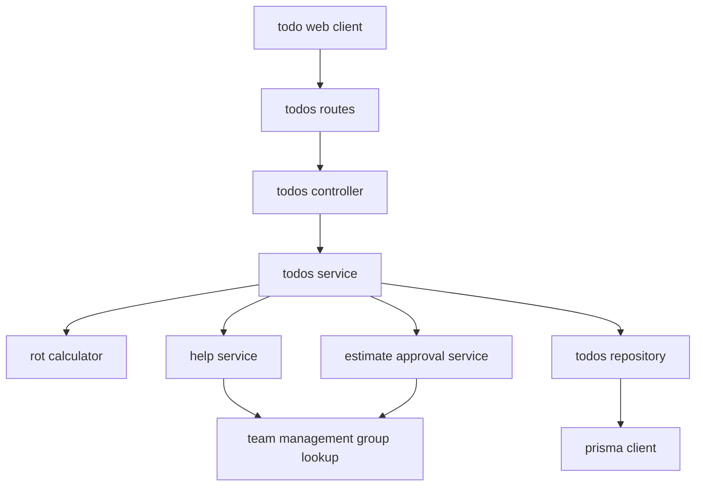
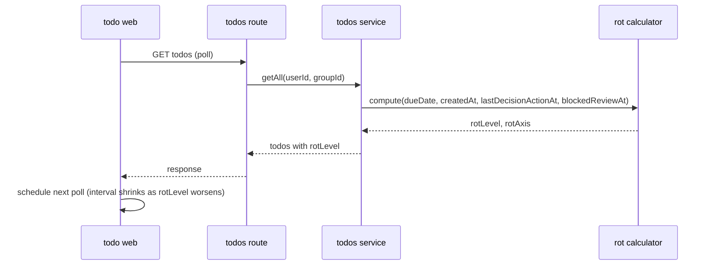
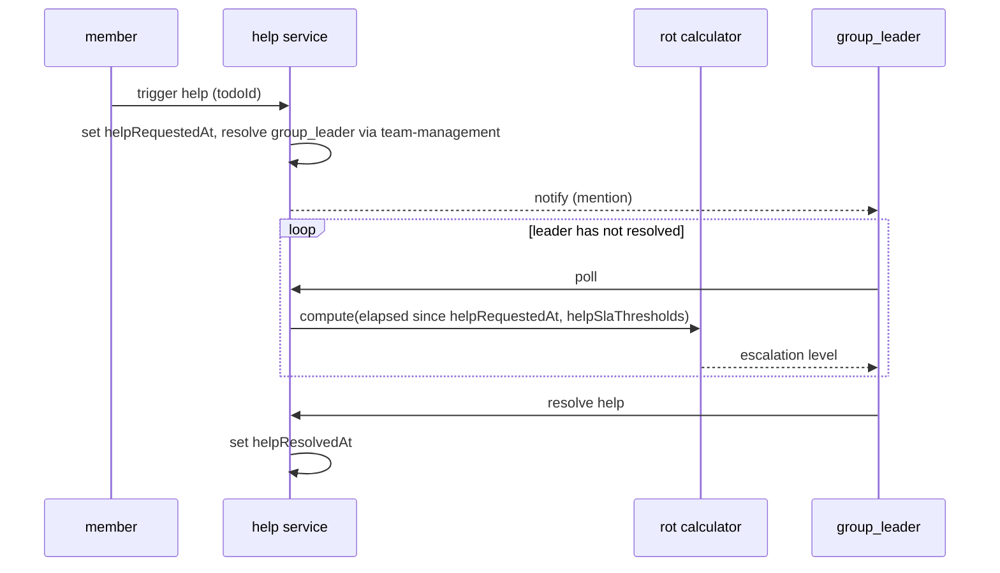
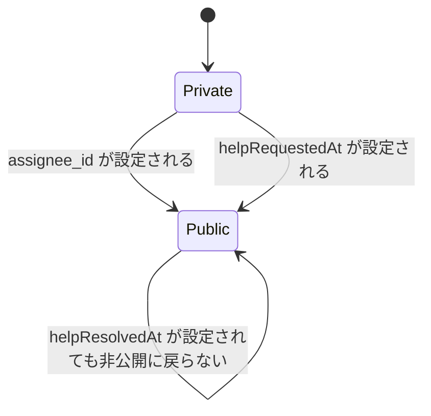

# Design Document

## Overview
**Purpose**: 締切からの経過時間という本人が操作できない機械的な軸でタスクの停滞を検知し、段階的な色・アプリ内通知・ヘルプ機能を通じてチームの目に自然に触れさせる。
**Users**: グループでTodoを運用するメンバーと`group_leader`が、日々のタスク一覧・グループ共有ボードでこの機能を利用する。
**Impact**: Todoに締切・見積もり・ヘルプ状態などの新しい属性が加わり、一覧・詳細APIのレスポンスに腐敗レベルが派生フィールドとして含まれるようになる。既存のTodo CRUD自体の挙動（タイトル・完了フラグ相当の操作）は変更しない。

### Goals
- 締切比率（軸A）と着手ラグ（軸B）の二軸で腐敗レベルを算出し、一覧・詳細表示に反映する
- 腐敗レベルに応じたアプリ内通知（3段階・集約通知）とワンタップのヘルプ機能を提供する
- タスクの由来（アサイン／個人発案）とヘルプ発火に応じて可視性を機械的に決定する
- `in_progress`移行時の見積もり入力と、締切とのギャップが大きい場合の`group_leader`承認フローを提供する

### Non-Goals
- 腐敗レベルの永続化・配信状態の記録（バックエンドの通知キュー・push配信基盤は導入しない。すべてリクエスト時の派生値として算出する）
- 組織階層をたどった多段階エスカレーション（`group_leader`の1段階のみ）
- 見積もり精度の実績ベース自動補正、腐敗しきい値のユーザーカスタマイズUI
- `group_id`・`group_leader`ロール・ステータスenumの値定義・`assignee_id`そのものの実装（それぞれ`team-management`・`task-status-model`・`task-assignment`の責務）

## Boundary Commitments

### This Spec Owns
- `due_date`、`last_decision_action_at`、`blocked_reason`／`blocked_review_at`、`help_requested_at`／`help_resolved_at`、`estimate_minutes`／`estimate_approval_status`、`parent_todo_id`のデータ
- 腐敗レベル算出ロジック（`RotCalculator`）と、それをAPIレスポンスに反映する`rotLevel`／`rotAxis`派生フィールド
- 可視性の導出ロジック（アサイン有無・ヘルプ状態からグループ共有ボードへの表示可否を決定する）
- アプリ内通知UI（軽度/中度/重度・集約通知）とヘルプUI、見積もり入力・承認UI

### Out of Boundary
- `groups`／メンバーシップのスキーマと`group_leader`ロールの認可基盤（`team-management`が提供、本specは利用するのみ）
- ステータスenum（`pending`/`in_progress`/`blocked`/`done`）の値定義そのもの（`task-status-model`の責務。本specは`blocked`/`in_progress`への遷移イベントを消費するのみ）
- `assignee_id`カラムと担当者候補の解決ロジック（`task-assignment`の責務。本specは値を読むのみ）
- Redmine連携で作成されたTodoを腐敗判定の対象に含めるかどうかの判断（`redmine-integration`側の検討事項）
- 組織階層の多段階エスカレーション、見積もり精度の自動補正、可視性のユーザー設定UI（brief.md Out of scope）

### Allowed Dependencies
- `team-management`: グループメンバーシップ・`group_leader`の判定/参照（Criticality: P0 — ヘルプ通知先・見積もり承認者の解決に必須）
- `task-status-model`: `status`のenum値（`pending`/`in_progress`/`blocked`/`done`）と、その遷移イベント（Criticality: P0 — 意思決定アクション・見積もりトリガーの起点）
- `task-assignment`: `assignee_id`カラムと担当者候補解決（Criticality: P0 — 可視性判定の入力）
- `orm-migration`: Prisma Clientベースの`TodoRepository`（Criticality: P1 — 本spec実装時の永続化層）

### Revalidation Triggers
- `task-status-model`のenum値・遷移イベントの意味が変わったとき（特に「意思決定アクション」の対応付け）
- `team-management`の`group_leader`解決コントラクトが変わったとき
- `task-assignment`の`assignee_id`の型・null許容が変わったとき
- `orm-migration`の`TodoRepository`メソッドシグネチャが変わったとき

## Architecture

### Architecture Pattern & Boundary Map
既存の`routes → controllers → services → repositories → types`という層構成をそのまま踏襲し、腐敗判定を独立したドメインサービス（`RotCalculator`）として`services`層に追加する。可視性・通知はAPIレスポンス生成時の派生値であり、新しい永続化層は追加しない。



**Architecture Integration**:
- Selected pattern: 既存レイヤードアーキテクチャの拡張（新レイヤーは導入しない）
- Domain/feature boundaries: 腐敗算出（`RotCalculator`）・ヘルプ（`HelpService`）・見積もり承認（`EstimateApprovalService`）を`TodoService`から呼び出される独立ドメインサービスとして分離し、それぞれが単一の責務を持つ
- Existing patterns preserved: `AppError`によるエラー処理、`user_id`/グループスコープでの認可、サーバー側で真実を持つ方針（クライアントを信用しない）
- New components rationale: `RotCalculator`は軸A・軸B・ヘルプSLAで共通の「経過時間→段階」ロジックを再利用するために独立させる（research.md参照）
- Steering compliance: サーバーサイドauth guardと同じ思想で、可視性・腐敗レベルもサーバー側で確定させる

### Technology Stack

| Layer | Choice / Version | Role in Feature | Notes |
|-------|------------------|-----------------|-------|
| Backend / Services | Fastify 5 + TypeScript strict（既存） | 腐敗レベル算出・可視性導出・ヘルプ/見積もり承認API | 新規ライブラリ追加なし |
| Data / Storage | MySQL 2（永続化層の実装は`orm-migration`が確定させるものをそのまま利用。本specはPrismaの導入自体を行わない） | `todos`テーブルへの列追加 | 新規テーブルは作らない（research.md参照） |
| Frontend | Next.js 16 + React 19、`react-toastify`（既存） | 腐敗色表示・中度通知（トースト再スケジュール）・重度通知（新規カスタムバナー） | 重度通知のみ新規UIコンポーネントが必要 |

## File Structure Plan

### Directory Structure
```
todo-api/src/
├── services/
│   ├── rot-calculator.service.ts   # 軸A/軸B/ヘルプSLA共通の経過時間→段階ロジック(純粋関数)
│   ├── todos.service.ts            # 既存を拡張: due_date/見積もり/意思決定アクションの受け口、rotLevel算出の呼び出し
│   ├── help.service.ts             # ヘルプ発火/解決、group_leaderへの通知先解決
│   └── estimate-approval.service.ts # 見積もりギャップ判定、group_leader承認
├── repositories/
│   └── todos.repository.ts         # 既存を拡張: 新規カラムの読み書き(orm-migration完了後の永続化層を利用。Prisma導入自体は本specの作業に含まない)
├── controllers/
│   └── todos.controller.ts         # 既存を拡張: 新規フィールドの入出力、ヘルプ/承認エンドポイント
├── routes/
│   └── todos.routes.ts             # 既存を拡張: スキーマに新規フィールド・新規エンドポイント追加
└── types/
    └── rot.ts                      # RotLevel, RotAxis, EstimateApprovalStatus等の型定義

todo-web/
├── features/todo/
│   └── rot-status.ts                # rotLevelに基づく表示ロジック(色・アイコンのマッピング)
├── components/todo/
│   └── RotBadge.tsx                 # 腐敗レベルの色表示コンポーネント
├── components/notifications/
│   ├── ModerateToast.tsx            # react-toastifyを間隔短縮付きで再発火させるラッパー
│   ├── SevereBanner.tsx             # 新規: 閉じても再出現する固定バナー
│   └── AggregatedNotification.tsx   # 複数タスク重度化時の集約表示
├── lib/
│   ├── rotPolling.ts                # 現在の腐敗レベルに応じてポーリング間隔を調整するスケジューラ
│   └── api/todos.ts                 # 既存を拡張: 新規フィールドの型・API呼び出し関数
```

### Modified Files
- `todo-api/src/types/todo.ts` — `Todo`型に`dueDate`, `lastDecisionActionAt`, `blockedReason`, `blockedReviewAt`, `helpRequestedAt`, `helpResolvedAt`, `estimateMinutes`, `estimateApprovalStatus`, `parentTodoId`, 派生の`rotLevel`/`rotAxis`/`isVisibleToGroup`を追加

## System Flows

### 腐敗レベル算出とポーリング

腐敗レベルはリクエストごとにサーバー側で再計算される派生値であり、独立した保存状態を持たない（Non-Goals参照）。クライアントは返却された`rotLevel`に応じて次回ポーリング間隔を短縮する（中度=6.3）。

### ヘルプ発火とリーダーへの腐敗連鎖

ヘルプ対応タスクは新規のTodoレコードを作らず、`helpRequestedAt`を起点に`RotCalculator`を短いしきい値（brief.md Constraints）で再適用するだけで実現する（research.md「軸A・軸Bを1つのRotCalculatorに統合」参照）。

### 可視性の状態遷移

可視性は`assignee_id IS NOT NULL OR help_requested_at IS NOT NULL`という単純な導出であり、一度公開されたタスクは非公開へ戻らない（9.1-9.5）。

## Requirements Traceability

| Requirement | Summary | Components | Interfaces | Flows |
|-------------|---------|------------|------------|-------|
| 1.1-1.3 | 締切の設定・任意性 | TodoService, TodoRepository | PATCH /todos/:id | - |
| 2.1-2.5 | 軸A: 締切比率による段階・当日/超過後着手の初期値 | RotCalculator, TodoService | GET /todos (rotLevel) | 腐敗レベル算出 |
| 3.1-3.4 | 軸B: 着手ラグ・分割導線・子タスクのリセット | RotCalculator, TodoService | GET /todos, POST /todos (parentTodoId) | 腐敗レベル算出 |
| 4.1-4.3 | blocked緩和 | RotCalculator, TodoService | PATCH /todos/:id (blockedReason/blockedReviewAt) | 腐敗レベル算出 |
| 5.1-5.2 | 意思決定アクションによるリセット | TodoService | POST /todos/:id/decision-actions | 腐敗レベル算出 |
| 6.1-6.6 | アプリ内通知3段階・集約・再出現 | ModerateToast, SevereBanner, AggregatedNotification, rotPolling | GET /todos (rotLevel) | 腐敗レベル算出とポーリング |
| 7.1-7.6 | ヘルプ発火・公開・対応中表示 | HelpService, TodoService | POST /todos/:id/help, POST /todos/:id/help/resolve | ヘルプ発火とリーダーへの腐敗連鎖 |
| 8.1-8.4 | ヘルプ放置のリーダー連鎖 | HelpService, RotCalculator | GET /todos/:id (help escalation level) | ヘルプ発火とリーダーへの腐敗連鎖 |
| 9.1-9.5 | 可視性の分岐 | TodoService | GET /group/:groupId/todos | 可視性の状態遷移 |
| 10.1-10.4 | 見積もりギャップ承認 | EstimateApprovalService, TodoService | POST /todos/:id/estimate, POST /todos/:id/estimate/approve | - |

## Components and Interfaces

| Component | Domain/Layer | Intent | Req Coverage | Key Dependencies (P0/P1) | Contracts |
|-----------|--------------|--------|--------------|---------------------------|-----------|
| RotCalculator | Service (domain) | 経過時間としきい値から腐敗段階を算出する純粋関数群 | 2, 3, 4, 8 | なし（純粋関数） | Service |
| TodoService (拡張) | Service | 締切・意思決定アクション・可視性・腐敗レベルを統合してTodoを返す | 1, 2, 3, 4, 5, 9 | RotCalculator (P0), TodoRepository (P0), task-status-model status (P0), task-assignment assigneeId (P0) | Service, API |
| HelpService | Service (domain) | ヘルプ発火/解決、group_leaderへの通知先解決 | 7, 8 | RotCalculator (P0), team-management group lookup (P0) | Service, API |
| EstimateApprovalService | Service (domain) | 見積もり入力とギャップ判定、group_leader承認 | 10 | team-management group_leader判定 (P0) | Service, API |

### Service Layer

#### RotCalculator

| Field | Detail |
|-------|--------|
| Intent | 経過時間としきい値集合から腐敗段階（healthy/mild/moderate/severe）を返す共通コア |
| Requirements | 2.1, 2.2, 2.3, 2.4, 2.5, 3.1, 3.2, 4.1, 4.2, 4.3, 8.2, 8.3 |

**Responsibilities & Constraints**
- 軸A（締切までの残り時間比率）・軸B（作成/`helpRequestedAt`からの経過時間）を同一の「経過時間→段階」コアで評価する（research.md参照）
- 同一タスクについて軸A・軸Bのうちより進んだ段階を採用する（3.2）
- `blockedReviewAt`が未来である間は進行速度を緩和した結果を返す（4.2）。緩和対象外の場合は通常の進行速度を用いる
- 純粋関数として実装し、DB・時刻取得以外の副作用を持たない

**Contracts**: Service [x]

##### Service Interface
```typescript
type RotLevel = "healthy" | "mild" | "moderate" | "severe";
type RotAxis = "deadline_ratio" | "start_lag" | "help_sla";

interface RotInput {
  now: Date;
  dueDate: Date | null;
  createdAt: Date;
  lastDecisionActionAt: Date | null;
  blockedReviewAt: Date | null;
  isBlockedWithoutReason: boolean;
}

interface RotResult {
  level: RotLevel;
  axis: RotAxis;
}

interface RotCalculator {
  computeForTodo(input: RotInput): RotResult;
  computeForHelpSla(helpRequestedAt: Date, now: Date): RotLevel;
}
```
- Preconditions: `createdAt <= now`
- Postconditions: `level`は`dueDate`が未設定の場合、軸Bのみから決定される（1.3）
- Invariants: `isBlockedWithoutReason`が真の間は緩和を適用しない（4.1）

### Application Services

#### TodoService（拡張）

| Field | Detail |
|-------|--------|
| Intent | 既存のTodo CRUDに締切・意思決定アクション・可視性・腐敗レベルの統合を追加する |
| Requirements | 1.1, 1.2, 1.3, 3.3, 3.4, 5.1, 5.2, 9.1, 9.2, 9.3, 9.4, 9.5 |

**Responsibilities & Constraints**
- Todo取得時に`RotCalculator.computeForTodo`を呼び出し、`rotLevel`/`rotAxis`をレスポンスに含める
- `assignee_id IS NOT NULL OR help_requested_at IS NOT NULL`でグループ共有ボードへの表示可否（`isVisibleToGroup`）を導出する（9.1-9.5）。この判定はサーバー側でのみ行い、クライアントに可視性の決定権を渡さない
- 意思決定アクション（着手/却下/計画）の記録時に`last_decision_action_at`を更新する。着手・blockedへの遷移は`task-status-model`のステータス変更イベントを購読して自動記録し、「却下」「計画」（ステータスは`pending`のまま）は本specが提供する軽量な確認アクション（`POST /todos/:id/decision-actions`）で記録する
- タスク分割（`parentTodoId`を持つ子タスクの作成）時、子タスクの`createdAt`を着手ラグの起点として扱う（3.4、`RotCalculator`へは子タスク自身の`createdAt`を渡すだけで自然に満たされる）

**Dependencies**
- Inbound: TodoController — Todo一覧/詳細/更新のリクエストを受け取る (P0)
- Outbound: RotCalculator — 腐敗レベル算出 (P0)、TodoRepository — 永続化 (P0)
- External: `task-status-model`のステータス値 (P0)、`task-assignment`の`assigneeId` (P0)

**Contracts**: Service [x] / API [x]

##### API Contract
| Method | Endpoint | Request | Response | Errors |
|--------|----------|---------|----------|--------|
| PATCH | /todos/:id | `{ dueDate?, blockedReason?, blockedReviewAt? }` | Todo (rotLevel/isVisibleToGroup含む) | 400, 404 |
| POST | /todos/:id/decision-actions | `{ kind: "reject" \| "plan" }` | Todo | 400, 404, 409(doneタスク) |
| GET | /group/:groupId/todos | - | `Todo[]`（`isVisibleToGroup=true`のみ） | 403（非メンバー） |

#### HelpService

| Field | Detail |
|-------|--------|
| Intent | ヘルプの発火・解決と、group_leaderへの通知先解決、ヘルプSLAの腐敗連鎖 |
| Requirements | 7.1, 7.2, 7.3, 7.4, 7.5, 7.6, 8.1, 8.2, 8.3, 8.4 |

**Responsibilities & Constraints**
- ヘルプ発火は理由入力を必須にしない（7.1）。発火時に`help_requested_at`を設定し、`team-management`経由でそのグループの`group_leader`を解決して通知する（7.2）
- 一般メンバーはヘルプ状態を閲覧できるが、メンションは行わない（7.3）
- 対応タスクとしての扱いは新規Todoを作らず、`help_requested_at`起点で`RotCalculator.computeForHelpSla`を固定の短いしきい値（brief.md Constraints、通常タスクの着手ラグより短い）で評価する（8.2, 8.3）
- エスカレーション先は`group_leader`の1段階のみ。上位ロールへの伝播ロジックは持たない（8.4）
- `help_resolved_at`が設定されるまで、対象タスクは健全表示（`healthy`）を返さない（7.5）

**Dependencies**
- Inbound: TodoController (P0)
- Outbound: RotCalculator (P0)
- External: `team-management`の`group_leader`解決API (P0)

**Contracts**: Service [x] / API [x]

##### API Contract
| Method | Endpoint | Request | Response | Errors |
|--------|----------|---------|----------|--------|
| POST | /todos/:id/help | `{}` | Todo（対応中表示） | 400（既にヘルプ中）, 404 |
| POST | /todos/:id/help/resolve | `{}` | Todo | 404, 409（ヘルプ未発火） |

#### EstimateApprovalService

| Field | Detail |
|-------|--------|
| Intent | `in_progress`移行時の見積もり入力と、締切とのギャップが小さい場合の`group_leader`承認フロー |
| Requirements | 10.1, 10.2, 10.3, 10.4 |

**Responsibilities & Constraints**
- `task-status-model`の`in_progress`遷移イベントを受け、見積もり入力を要求する（10.1）
- 見積もり時間と締切までの残り時間の差が許容範囲を下回る場合、`estimate_approval_status`を`pending`にする（10.2）。許容範囲の具体値はDesign時点では設計パラメータとして扱い、実装時に確定する
- `pending`の間、見積もりは確定値として扱わない（10.3）
- `group_leader`のみが承認操作を行える。承認者が対象タスクの所属グループの`group_leader`であることを`team-management`経由で検証する

**Dependencies**
- Inbound: TodoController (P0)
- Outbound: TodoRepository (P0)
- External: `team-management`の`group_leader`判定 (P0)、`task-status-model`の`in_progress`遷移イベント (P0)

**Contracts**: Service [x] / API [x]

##### API Contract
| Method | Endpoint | Request | Response | Errors |
|--------|----------|---------|----------|--------|
| POST | /todos/:id/estimate | `{ estimateMinutes }` | Todo（`estimateApprovalStatus`含む） | 400, 404 |
| POST | /todos/:id/estimate/approve | `{}` | Todo | 403（`group_leader`以外）, 409（`pending`でない） |

### Frontend Components（summary-only）
- `RotBadge` — `rotLevel`を色にマッピングして表示。新しい状態を持たない純粋な表示コンポーネント
- `ModerateToast` — 既存`react-toastify`を、`rotPolling`から渡される間隔でトーストを再発火させるラッパー
- `SevereBanner` — 新規。閉じても`rotPolling`が一定時間後に再表示する固定バナー（6.4）
- `AggregatedNotification` — 複数タスクが同時に`severe`のとき、`SevereBanner`の代わりに1件の集約表示を出す（6.5）

**Implementation Notes**
- Integration: いずれも`rotLevel`（サーバー由来の派生値）のみを入力に取り、通知の要否ロジックはコンポーネント側に持たせない
- Validation: なし（表示専用）
- Risks: ポーリング前提のためタブを長時間非アクティブにしていると更新が遅れる（research.md Risks参照）

## Data Models

### Logical Data Model
`todos`テーブルへのカラム追加のみ。新規テーブルは導入しない（research.md「可視性・通知の状態は新規テーブルを作らず導出する」）。

| Column | Type | Nullable | Notes |
|---|---|---|---|
| due_date | DATETIME | Yes | 締切。未設定時は軸A判定の対象外（1.3） |
| last_decision_action_at | DATETIME | Yes | 軸Bの起点リセットに使用（3.1, 5.1） |
| blocked_reason | TEXT | Yes | blocked理由（4.2） |
| blocked_review_at | DATETIME | Yes | blocked緩和の期限（4.2, 4.3） |
| help_requested_at | DATETIME | Yes | ヘルプ発火時刻（7.2, 8.2） |
| help_resolved_at | DATETIME | Yes | ヘルプ解決時刻（7.6） |
| estimate_minutes | INT | Yes | 見積もり時間（10.1） |
| estimate_approval_status | ENUM('none','pending','approved') | No (default 'none') | 見積もり承認状態（10.2-10.4） |
| parent_todo_id | INT (self FK) | Yes | タスク分割時の親子関係（3.3, 3.4） |

`rotLevel`・`rotAxis`・`isVisibleToGroup`はいずれも上記カラムから都度算出する派生値であり、カラムとして保存しない。

### Physical Data Model
- 全カラムがnullableまたはデフォルト値付きのため、既存データへの後方互換のあるマイグレーションとして追加できる（バックフィル不要）
- `parent_todo_id`は`todos.id`への自己参照外部キー。親タスク削除時のカスケード方針は実装時に確定する

## Error Handling

### Error Categories and Responses
- **User Errors (4xx)**: 不正な`dueDate`/`estimateMinutes`（負値等） → 400。存在しないTodo → 404。ヘルプ二重発火・見積もり承認の権限なし → 400/403
- **Business Logic Errors (422系)**: 見積もり承認待ちの状態で確定値として扱おうとする操作は、`estimate_approval_status=pending`である旨を返し、確定を拒否する

## Testing Strategy

- **Unit Tests**: `RotCalculator`の軸A/軸B/ヘルプSLA各境界値（2.1-2.5, 3.1-3.2, 8.2-8.3）、`blockedReviewAt`緩和の適用/失効（4.1-4.3）、意思決定アクションによるリセット（5.1-5.2）
- **Integration Tests**: `TodoService`が`rotLevel`と`isVisibleToGroup`を一貫して返すこと（9.1-9.5）、ヘルプ発火から`group_leader`通知までの一連の流れ（7.2, 8.1）、見積もりギャップ判定から承認までのフロー（10.1-10.4）
- **E2E/UI Tests**: 締切当日着手で中度スタート・超過後着手で重度スタートになる表示（2.4-2.5）、重度通知が閉じても再出現すること（6.4）、複数タスク重度化時に集約通知になること（6.5）

## Security Considerations
- 可視性判定（9.1-9.5）はサーバー側でのみ行い、`GET /group/:groupId/todos`は`isVisibleToGroup=false`のタスクを応答に含めない。クライアント側のフィルタリングに依存しない（既存のサーバー専用auth guard方針と一貫）
- 見積もり承認（10.4）は`team-management`が提供する`group_leader`判定を経由し、対象タスクの所属グループのリーダーであることを検証する

## Migration Strategy
`todos`テーブルへのカラム追加のみで、全カラムがnullableまたはデフォルト値を持つため、単一のマイグレーションで完結する。ロールバックは追加カラムのdropのみで、既存データへの影響はない。

## Open Questions / Risks
- 「意思決定アクション（着手/却下/計画）」と`task-status-model`の4値ステータスの対応関係は、`task-status-model`の設計確定時に再検証が必要（research.md Risks参照）
- 腐敗しきい値・ヘルプSLAの固定猶予時間の具体値は本designでは未確定（brief.md Constraints通り、実装時に決定）
- ポーリング間隔の具体値とUX上の許容度は実装時に調整
