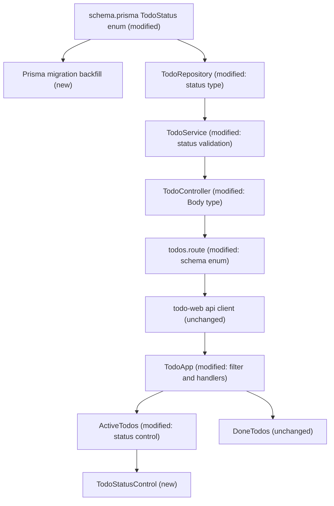
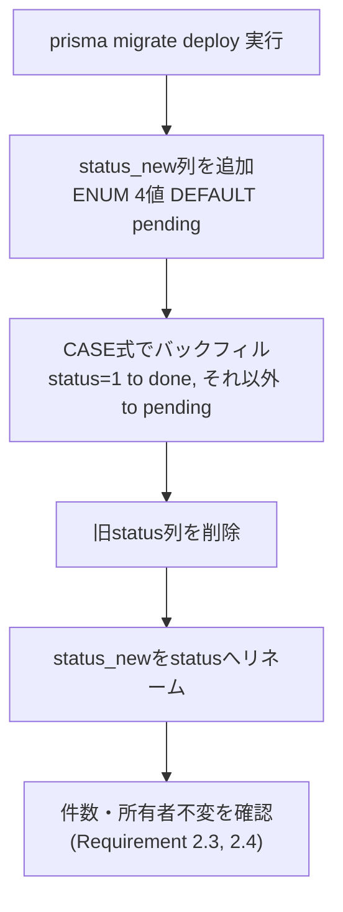
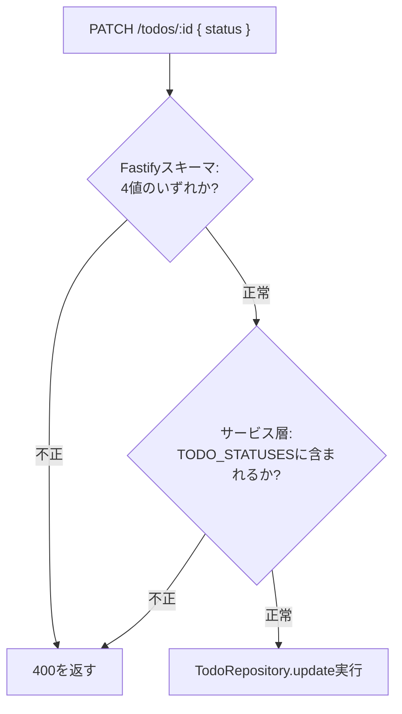
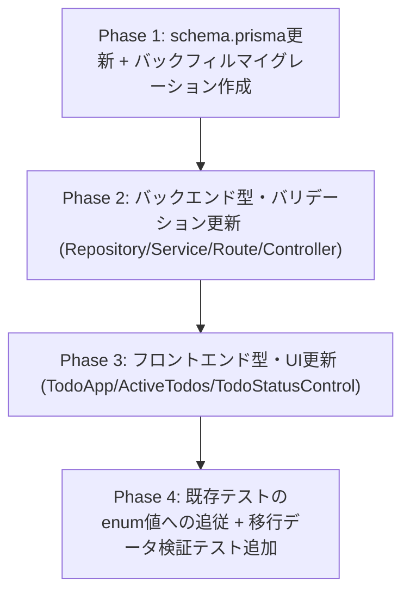

# 技術設計書

## Overview

本機能は、`todo-api`のTodoステータスを、現行の`未完了/完了`の2値（Prisma上`Boolean`、DB上`BOOLEAN`）から、`pending`/`in_progress`/`blocked`/`done`の4値enumへ拡張する。`orm-migration`が確立するPrismaスキーマ・リポジトリ層の上に新しいマイグレーションを追加し、既存データを安全に新enumへ移行した上で、API層・フロントエンドの型とロジックを追従させる。

**Users**: Todoアプリの利用者（既存のチェックボックスで完了/未完了を切り替える利用者）。加えて、本機能が確定する4値のenum値とその意味は、後続の`task-rot-detection`（腐敗信号判定）・`redmine-integration`（Redmineステータスとのマッピング）が前提として消費する安定した契約となる。

**Impact**: `prisma/schema.prisma`の`Todo.status`をBooleanからenum(`TodoStatus`)へ変更し、既存データを`0→pending`、`1→done`へバックフィルするマイグレーションを追加する。`todo-api`の型・リポジトリ・サービス・ルート・コントローラーの各層で`status`の型を`TodoStatus`に統一し、Fastifyスキーマの許容値を4値に拡張する。`todo-web`は`status`の型をミラーし、既存のチェックボックス（完了/戻す）操作の挙動は変えずに、未完了Todoに対して`pending`/`in_progress`/`blocked`を切り替える最小限のUIを追加する。カンバン化等の大規模UI刷新は行わない。

### Goals
- `pending`/`in_progress`/`blocked`/`done`の4値enumを`orm-migration`のPrismaスキーマ上に確定させ、以後値の名称・意味を変更しない安定した契約として提供する
- 既存データ（`status`0/1）を、件数・所有者を変えずに新enum値（`pending`/`done`）へ安全に移行する
- Todo作成・更新APIが4値のenum値を受け渡しできるようにしつつ、既存のtitle更新等の挙動は変更しない
- 既存のチェックボックス操作（完了/未完了への切り替え）と、アクティブ/完了の二分表示・5件制限ロジックを壊さない
- 未完了Todoについて、`pending`/`in_progress`/`blocked`を確認・切り替えられる最小限のUIを提供する

### Non-Goals
- ステータス遷移のワークフロー制御（特定の状態からしか遷移できない等のルール）の実装
- ステータス変更履歴の監査ログ・イベント配信基盤の実装
- カンバンビュー等、Todo一覧の大規模なUI刷新
- `blocked`理由・次回見直し予定日時、見積もり時間等の付随メタデータ（`task-rot-detection`の責務）
- 担当者・グループに基づく可視性制御（`team-management`/`task-assignment`の責務）

## Boundary Commitments

### This Spec Owns
- `prisma/schema.prisma`における`TodoStatus`enumの定義、および`Todo.status`フィールドの型変更（`orm-migration`が確立したベースラインの上に追加する変更）
- 既存Boolean値を新enum値へ安全にバックフィルするPrisma migration
- `todo-api/src/types/todo.ts`の`TodoStatus`型・許容値定数、および`Todo.status`の型
- `todo-api/src/repositories/todos.repository.ts`・`services/todos.service.ts`・`routes/todos.route.ts`・`controllers/todos.controller.ts`における`status`の型・バリデーション・デフォルト値（`pending`）
- `todo-web/lib/types.ts`の`Todo.status`型（バックエンドの`TodoStatus`をミラー）
- `todo-web`側のチェックボック後方互換性、および未完了Todoに対する最小限のステータス切替UI（`pending`/`in_progress`/`blocked`）

### Out of Boundary
- `team-management`のgroups/membership/`group_leader`ロール
- `task-assignment`の`assignee_id`
- `task-rot-detection`が所有する`due_date`、`blocked_reason`、`blocked_review_at`、`estimate_minutes`、`estimate_approval_status`等のフィールドと、それらに基づく腐敗判定ロジック
- `redmine-integration`のRedmineステータスとのマッピングロジック
- ステータス変更の遷移ルール強制・監査ログ・通知/イベント配信基盤
- `orm-migration`のベースラインマイグレーション（`0_init`）そのものの変更、および`TodoRepository`/`AuthRepository`の公開メソッドシグネチャの変更

### Allowed Dependencies
- `orm-migration`が確立するPrisma Client・`prisma/schema.prisma`・マイグレーション運用（`prisma migrate deploy`）（P0。本specの実装着手は`orm-migration`の実装完了後）
- MySQL 8.0（既存DBエンジン。`ENUM`型カラムを利用）
- 既存の`AppError`（`todo-api/src/errors/AppError.ts`）によるサービス層のエラー送出パターン
- 既存のFastify JSON Schemaベースのリクエストバリデーション

### Revalidation Triggers
- `TodoStatus`のenum値の名称・個数（`pending`/`in_progress`/`blocked`/`done`）を変更する場合（`task-rot-detection`・`redmine-integration`全体が再検証対象）
- 各enum値の意味（例: `blocked`が示す状態の定義）を変更する場合
- `Todo.status`のAPIレスポンス上のデータ型（文字列union以外への変更、例: 数値コード化）を変更する場合
- `TodoRepository`の`create`/`update`の公開シグネチャを変更する場合

## Architecture

### Existing Architecture Analysis
既存のレイヤードアーキテクチャ（`routes → controllers → services → repositories → DB`）を維持し、変更が閉じるのは各層の`status`フィールドの型・許容値・デフォルト値のみである。`orm-migration`が確立する「リポジトリはPrisma Clientベース、公開シグネチャは呼び出し元から見て不変」という契約をそのまま踏襲する。フロントエンドは既存の`TodoApp.tsx`（状態管理・フィルタ）→`ActiveTodos.tsx`/`DoneTodos.tsx`（表示）という構造を維持し、`ActiveTodos.tsx`にステータス切替UIを追加する。

### Architecture Pattern & Boundary Map



**Architecture Integration**:
- 選択パターン: 既存レイヤードアーキテクチャを維持したままの「型・許容値の拡張」パターン。新規のアーキテクチャ層は導入しない
- ドメイン境界: `Todo`集約は既存のまま。ステータスは`Todo`の1フィールドの表現力を広げるのみで、新規エンティティは追加しない
- 既存パターンの維持: `userId`スコープの強制、`AppError`によるサービス層エラー送出、Fastify JSON Schemaによる境界バリデーション
- 新規コンポーネントの理由: `TodoStatusControl`（新規UI）は、未完了Todoに対する最小限のステータス切替という新しいユーザー操作の受け皿として必要。既存の`ActiveTodos`/`DoneTodos`に直接ロジックを埋め込むと責務が肥大化するため分離する
- Steering準拠: TypeScript strict・`any`不使用（`tech.md`）、レイヤー単一責務・Fastifyカプセル化（`structure.md`）を維持

**依存方向**: `schema.prisma`（型定義） → `Repository`（データアクセス） → `Service`（バリデーション・業務ロジック） → `Controller/Route`（境界バリデーション・レスポンス整形） → フロントエンド`api client` → `TodoApp`（状態管理） → `ActiveTodos`/`DoneTodos`/`TodoStatusControl`（表示）。各層は左側のレイヤーのみを参照する。

### Technology Stack

| Layer | Choice / Version | Role in Feature | Notes |
|-------|------------------|------------------|-------|
| Data / Storage | MySQL 8.0 `ENUM` | `todos.status`カラムの新しい物理型 | `orm-migration`が確立した`BOOLEAN`カラムを本specのマイグレーションで置き換える |
| ORM | Prisma / `@prisma/client`（`orm-migration`で導入済みの版） | `TodoStatus`enumの型定義・マイグレーション適用 | `orm-migration`のバージョン・運用方式をそのまま利用 |
| Backend | Fastify 5（既存） | `status`の境界バリデーション（JSON Schema enum） | ルート層のスキーマ定義のみ変更 |
| Frontend | Next.js 16 / React 19（既存） | ステータス表示・切替UI | 新規ライブラリ追加なし |

## File Structure Plan

### Directory Structure
```
todo-api/
├── prisma/
│   ├── schema.prisma                        # 変更: TodoStatus enum定義 + Todo.status型変更
│   └── migrations/
│       └── <timestamp>_todo_status_enum/
│           └── migration.sql                # 新規: Boolean→enumのバックフィルマイグレーション
├── src/
│   ├── types/
│   │   └── todo.ts                          # 変更: TODO_STATUSES定数・TodoStatus型・Todo.status型
│   ├── repositories/
│   │   └── todos.repository.ts              # 変更: status型・create()デフォルト値("pending")
│   ├── services/
│   │   └── todos.service.ts                 # 変更: status値バリデーション追加
│   ├── controllers/
│   │   └── todos.controller.ts              # 変更: Body型のstatus?をTodoStatusへ
│   └── routes/
│       └── todos.route.ts                   # 変更: updateTodoSchemaのstatus enumを4値へ

todo-web/
├── lib/
│   └── types.ts                             # 変更: Todo.statusをTodoStatus(文字列union)へ
├── features/todo/
│   └── TodoApp.tsx                          # 変更: フィルタ条件・handleComplete/handleRestore
└── components/todo/
    ├── ActiveTodos.tsx                       # 変更: 各TodoにTodoStatusControlを表示
    ├── DoneTodos.tsx                         # 変更なし
    └── TodoStatusControl.tsx                 # 新規: pending/in_progress/blocked切替UI
```

### Modified Files
- `todo-api/prisma/schema.prisma` — `enum TodoStatus { pending in_progress blocked done }`を追加し、`Todo.status`の型を`Boolean @default(false)`から`TodoStatus @default(pending)`へ変更
- `todo-api/src/types/todo.ts` — `export const TODO_STATUSES = ["pending", "in_progress", "blocked", "done"] as const;`と`export type TodoStatus = typeof TODO_STATUSES[number];`を追加し、`Todo.status: TodoStatus`に変更
- `todo-api/src/repositories/todos.repository.ts` — `create()`の`status`引数の型・デフォルト値を`TodoStatus`/`"pending"`へ、`update()`の`data`型を`Partial<Pick<Todo, "title" | "status">>`のまま型のみ追従
- `todo-api/src/services/todos.service.ts` — `update()`で受け取った`status`が`TODO_STATUSES`に含まれることを検証し、含まれない場合は`AppError("invalid status", 400)`を送出
- `todo-api/src/routes/todos.route.ts` — `updateTodoSchema.body.properties.status`を`{ type: "string", enum: [...TODO_STATUSES] }`へ変更
- `todo-api/src/controllers/todos.controller.ts` — `update`のBody型`{ title?: string; status?: number }`を`{ title?: string; status?: TodoStatus }`へ変更
- `todo-web/lib/types.ts` — `Todo.status: number`を`Todo.status: TodoStatus`（`"pending" | "in_progress" | "blocked" | "done"`）へ変更
- `todo-web/features/todo/TodoApp.tsx` — `activeTodos`/`doneTodos`のフィルタ条件を`status === 0 / 1`から`status !== "done" / === "done"`へ、`handleComplete`は`status: "done"`、`handleRestore`は`status: "pending"`を送信するよう変更
- `todo-web/components/todo/ActiveTodos.tsx` — 各Todo行に`TodoStatusControl`を追加し、現在のステータス表示と`pending`/`in_progress`/`blocked`間の切替を提供
- `todo-api/src/repositories/_test_/todos.repository.test.ts`・`todo-api/src/services/_test_/todos.service.test.ts`・`todo-web/features/todo/_test_/TodoApp.test.tsx`・`todo-web/components/todo/_test_/ActiveTodos.test.tsx`・`DoneTodos.test.tsx` — `status`のアサーション・フィクスチャをenum文字列値へ更新

### New Files
- `todo-web/components/todo/TodoStatusControl.tsx` — 未完了Todo1件分の`pending`/`in_progress`/`blocked`切替UI（プレゼンテーショナルコンポーネント）
- `todo-api/prisma/migrations/<timestamp>_todo_status_enum/migration.sql` — バックフィルマイグレーション

## System Flows

### 既存データのステータス移行フロー



- ゲーティング条件: `prisma migrate deploy`が途中で失敗した場合、アプリケーションを起動しない（`orm-migration`が確立した既存のフェイルファスト運用を踏襲）
- 本マイグレーションは`orm-migration`のベースラインマイグレーション（`0_init`）が適用済みであることを前提とする

### ステータス更新リクエストの検証フロー



- Fastifyスキーマとサービス層の二重チェックは、いずれも`TODO_STATUSES`という単一の定数配列を参照することでドリフトを防ぐ（`research.md` Design Decisions参照）

## Requirements Traceability

| Requirement | Summary | Components | Interfaces | Flows |
|-------------|---------|------------|------------|-------|
| 1.1, 1.2, 1.3 | enum値の確定・初期値・永続化不変条件 | TodoStatusSchema, TodoRepository | schema.prisma, `create()`デフォルト値 | - |
| 2.1, 2.2, 2.3, 2.4 | 既存データの移行 | StatusBackfillMigration | migration.sql | 既存データのステータス移行フロー |
| 3.1, 3.2, 3.3, 3.4 | API経由のステータス更新 | TodoService, TodoController, TodoRoute | PATCH /todos/:id | ステータス更新リクエストの検証フロー |
| 4.1, 4.2, 4.3, 4.4 | チェックボックスとの後方互換性 | TodoApp | handleComplete/handleRestore | - |
| 5.1, 5.2, 5.3 | 未完了Todoの最小限のステータス可視化・切替 | TodoStatusControl, ActiveTodos | TodoStatusControl Props | - |
| 6.1, 6.2, 6.3 | 既存の集計・件数制限ロジックの非破壊 | TodoApp | activeTodosフィルタ条件 | - |

## Components and Interfaces

| Component | Domain/Layer | Intent | Req Coverage | Key Dependencies (P0/P1) | Contracts |
|-----------|---------------|--------|---------------|---------------------------|-----------|
| TodoStatusSchema | Data Layer | `TodoStatus`enumの定義と`Todo.status`の型を確定する | 1.1, 1.2, 1.3 | orm-migration Prisma schema (P0) | State |
| StatusBackfillMigration | Ops/Infra | 既存Boolean値を新enum値へ安全にバックフィルする | 2.1, 2.2, 2.3, 2.4 | TodoStatusSchema (P0) | Batch |
| TodoRepository（拡張） | Data Layer | enum型でのTodo CRUD（公開シグネチャは`orm-migration`のまま） | 1.2, 3.1 | TodoStatusSchema (P0) | Service |
| TodoService（拡張） | Backend/Service | ステータス値のバリデーションと更新ロジック | 1.3, 3.1, 3.2, 3.4 | TodoRepository (P0) | Service |
| TodoController/Route（拡張） | Backend/API | APIスキーマでのenum値の受け渡し | 3.1, 3.2, 3.3 | TodoService (P0) | API |
| TodoApp（拡張） | Frontend | チェックボックス後方互換・未完了/完了フィルタ・件数制限 | 4.1, 4.2, 4.3, 4.4, 6.1, 6.2, 6.3 | Todo API (P0) | - |
| TodoStatusControl（新規） | Frontend | 未完了Todoの`pending`/`in_progress`/`blocked`切替 | 5.1, 5.2, 5.3 | TodoApp (P0) | - |

### Data Layer

#### TodoStatusSchema

| Field | Detail |
|-------|--------|
| Intent | Todoのステータスを表す`TodoStatus`enumを定義し、以後の値の名称・意味を安定させる |
| Requirements | 1.1, 1.2, 1.3 |

**Responsibilities & Constraints**
- `prisma/schema.prisma`に`enum TodoStatus { pending in_progress blocked done }`を追加する
- `Todo.status`の型を`Boolean @default(false)`から`TodoStatus @default(pending)`へ変更する（物理カラム名`status`は維持）
- `todo-api/src/types/todo.ts`に`TODO_STATUSES`（許容値の単一の定数配列）と`TodoStatus`（そこから導出される型）を定義し、Fastifyスキーマ・サービス層のバリデーションの唯一の参照元とする
- 本コンポーネントが確定する4値の名称・意味は、`task-rot-detection`・`redmine-integration`が前提として消費するため、本spec完了後に変更しない（Revalidation Triggers参照）

**Dependencies**
- Outbound: `orm-migration`が確立したPrisma schema・MySQL 8.0（P0）

**Contracts**: Service [ ] / API [ ] / Event [ ] / Batch [ ] / State [x]

##### State Management
- State model: `Todo.status`が保持する4値のenum状態。状態遷移ルールの強制はNon-Goalとし、任意の値から任意の値への更新を許可する
- Persistence & consistency: MySQLの`ENUM`型カラムとして永続化し、既存の`user_id`スコープ・カスケード削除等の整合性制約はそのまま維持する
- Concurrency strategy: 追加の排他制御なし（既存の`TodoRepository.update`のupdateMany相当の挙動を維持）

**Implementation Notes**
- Integration: `prisma generate`で型を再生成し、`TODO_STATUSES`とPrismaの`TodoStatus`enumの値が一致することを実装時に確認する
- Validation: 既存の`mysql/init.sql`ベースの初期化と矛盾しないよう、新規マイグレーションが対象とするDBは`orm-migration`のベースライン適用済みであることを前提とする
- Risks: enum値のスペル・大文字小文字がPrisma/DB/APIレスポンス/フロントエンドの各層で完全一致していないと、後続spec（`task-rot-detection`等）との統合時に不整合が生じる

#### StatusBackfillMigration

| Field | Detail |
|-------|--------|
| Intent | 既存の`status`（Boolean 0/1）を新enum値（`pending`/`done`）へ、件数・所有者を変えずに移行する |
| Requirements | 2.1, 2.2, 2.3, 2.4 |

**Responsibilities & Constraints**
- 新しいPrisma migrationとして、以下の手順を実行する: (1) `status_new ENUM(...) NOT NULL DEFAULT 'pending'`列を追加 (2) `UPDATE todos SET status_new = CASE WHEN status = 1 THEN 'done' ELSE 'pending' END`でバックフィル (3) 旧`status`列を削除 (4) `status_new`を`status`にリネーム
- 移行後、Todoの件数・各行の`user_id`が移行前と一致することを保証する（1テーブル内の列変更のみで行の追加・削除・所有者変更を伴わない）
- `orm-migration`のベースラインマイグレーション（`0_init`）には手を加えない

**Dependencies**
- Outbound: TodoStatusSchema（移行先のenum定義） (P0)
- External: MySQL 8.0 (P0)

**Contracts**: Service [ ] / API [ ] / Event [ ] / Batch [x] / State [ ]

##### Batch / Job Contract
- Trigger: `prisma migrate deploy`実行時（コンテナ起動・CIジョブ、`orm-migration`が確立した既存の適用フローに追従）
- Input / validation: 移行対象の`todos`テーブル（既存の`status`列が`0`または`1`であること）
- Output / destination: `todos.status`が`ENUM('pending','in_progress','blocked','done')`として、`0→pending`・`1→done`にマッピングされた状態
- Idempotency & recovery: Prisma Migrateの標準機構により、適用済みマイグレーションの再実行はスキップされる。失敗時は`orm-migration`と同様に「失敗」として記録され、手動解決が必要

**Implementation Notes**
- Integration: 実装時に`0/1`以外の値を持つ行が存在しないことを事前に確認する（存在する場合は移行前にデータクレンジングが必要になるため、実装タスクでこの前提を検証する）
- Validation: 移行前後で`SELECT COUNT(*) FROM todos`および`status`別件数を比較するテストを追加する（Requirement 2.1–2.3）
- Risks: 直接型変換（`MODIFY COLUMN`）ではなく明示的なバックフィルを採用した理由は`research.md` Design Decisions参照

#### TodoRepository（拡張）

| Field | Detail |
|-------|--------|
| Intent | `orm-migration`が確立したPrisma Clientベースの実装のまま、`status`の型をenumへ拡張する |
| Requirements | 1.2, 3.1 |

**Responsibilities & Constraints**
- `create(title, userId, status: TodoStatus = "pending")`: デフォルト値を`"pending"`に変更する（振る舞い上、新規Todoは常に`pending`から開始するというRequirement 1.2を満たす）
- `update(id, userId, data: Partial<Pick<Todo, "title" | "status">>)`: `data.status`の型が`TodoStatus`になる以外、既存の早期return・部分更新ロジックは変更しない
- `findAll`/`findById`/`delete`は変更なし（戻り値の`Todo.status`の型のみ追従）
- `orm-migration`が確立した`userId`スコープの強制、戻り値の形は維持する

**Dependencies**
- Inbound: TodoService — Todo CRUD呼び出し (P0)
- Outbound: TodoStatusSchema（Prisma Client経由） (P0)

**Contracts**: Service [x] / API [ ] / Event [ ] / Batch [ ] / State [ ]

##### Service Interface
```typescript
interface TodoRepositoryContract {
  findAll(userId: number): Promise<Todo[]>;
  findById(id: number, userId: number): Promise<Todo | null>;
  create(title: string, userId: number, status?: TodoStatus): Promise<void>;
  update(id: number, userId: number, data: Partial<Pick<Todo, "title" | "status">>): Promise<void>;
  delete(id: number, userId: number): Promise<void>;
}
```
- Preconditions: `status`を指定する場合は`TODO_STATUSES`のいずれかであること（呼び出し元のTodoServiceが保証する）
- Postconditions: `create`は常に`status`が4値のいずれかであるTodoを1件生成する。省略時は`"pending"`
- Invariants: `orm-migration`と同様、`user_id`が一致しない行は一切変更・返却しない

**Implementation Notes**
- Integration: `TodoService`からの呼び出しシグネチャは変更しない。型チェック（`pnpm build`）でstatus型の整合を保証する
- Validation: `todos.repository.test.ts`のフィクスチャ・アサーションをenum文字列値へ更新し、同一の振る舞い（1件作成→取得、部分更新）を確認する
- Risks: なし（型変更のみで、既存のクエリ構築ロジックへの影響はない）

### Backend/Service

#### TodoService（拡張）

| Field | Detail |
|-------|--------|
| Intent | 更新リクエストの`status`が許容4値のいずれかであることを検証し、不正な値を拒否する |
| Requirements | 1.3, 3.1, 3.2, 3.4 |

**Responsibilities & Constraints**
- `update(id, userId, data)`内で、`data.status`が指定されている場合に`TODO_STATUSES`に含まれるかを検証する
- 含まれない場合、既存の`create()`の`invalid title`と同様のパターンで`AppError("invalid status", 400)`を送出する
- `title`のみの更新など、`status`を含まないリクエストの既存の挙動は変更しない
- Fastifyスキーマ（ルート層）による境界バリデーションに加えた防御的な二重チェックであり、両者は同じ`TODO_STATUSES`を参照する

**Dependencies**
- Inbound: TodoController — Todo更新呼び出し (P0)
- Outbound: TodoRepository (P0)

**Contracts**: Service [x] / API [ ] / Event [ ] / Batch [ ] / State [ ]

##### Service Interface
```typescript
interface TodoServiceContract {
  update(
    id: number,
    userId: number,
    data: { title?: string; status?: TodoStatus }
  ): Promise<void>;
}
```
- Preconditions: `id`で指定されたTodoが`userId`の所有であること（既存の`getById`による存在・所有権チェックを維持）
- Postconditions: `status`が指定されていれば、`TODO_STATUSES`のいずれかの値としてのみ永続化される
- Invariants: 不正な`status`値によってTodoの状態が変化することはない（拒否時は更新前の状態が維持される）

**Implementation Notes**
- Integration: `AppError`の送出パターンは既存の`create()`実装（`invalid title`）と揃え、コントローラー層のエラーハンドリング（`err instanceof AppError`）をそのまま利用する
- Validation: `todos.service.test.ts`に、許容4値それぞれの更新成功ケースと、不正値でのリジェクトケースを追加する
- Risks: なし

### Backend/API

#### TodoController/Route（拡張）

| Field | Detail |
|-------|--------|
| Intent | Fastifyの境界でリクエストの`status`を4値のenumとして検証し、既存のレスポンス形式を維持する |
| Requirements | 3.1, 3.2, 3.3 |

**Responsibilities & Constraints**
- `todos.route.ts`の`updateTodoSchema.body.properties.status`を`{ type: "integer", enum: [0, 1] }`から`{ type: "string", enum: [...TODO_STATUSES] }`へ変更する
- `todos.controller.ts`の`update`ハンドラのBody型`{ title?: string; status?: number }`を`{ title?: string; status?: TodoStatus }`へ変更する。ハンドラ自体のロジック（サービス呼び出し・エラーハンドリング）は変更しない
- 所有者以外のTodoへの操作は既存どおり`AppError`経由で404を返す（`getById`の存在・所有権チェックを維持）

**Dependencies**
- Inbound: フロントエンド`api client` (P0)
- Outbound: TodoService (P0)

**Contracts**: Service [ ] / API [x] / Event [ ] / Batch [ ] / State [ ]

##### API Contract
| Method | Endpoint | Request | Response | Errors |
|--------|----------|---------|----------|--------|
| PATCH | /todos/:id | `{ title?: string; status?: "pending" \| "in_progress" \| "blocked" \| "done" }` | `{ message: "updated" }` | 400（不正なstatus値）, 404（存在しない/他ユーザー所有） |

**Implementation Notes**
- Integration: `POST /todos`（作成）のリクエストスキーマは変更しない（作成時に`status`を受け付けない既存の挙動を維持し、常に`pending`から開始する）
- Validation: Fastifyスキーマ違反時に既存同様400が返ることをルートレベルのテストで確認する
- Risks: なし

### Frontend

#### TodoApp（拡張）

| Component | Domain/Layer | Intent | Req Coverage | Key Dependencies (P0/P1) | Contracts |
|-----------|---------------|--------|---------------|---------------------------|-----------|
| TodoApp | Frontend | 未完了/完了のフィルタ・件数制限・チェックボックス操作のハンドラを提供する | 4.1, 4.2, 4.3, 4.4, 6.1, 6.2, 6.3 | Todo API (P0) | - |

**Responsibilities & Constraints**
- `activeTodos = todos.filter(t => t.status !== "done")`、`doneTodos = todos.filter(t => t.status === "done")`へ変更する（Requirement 4.3, 4.4, 6.3）
- `handleComplete`は`updateTodo(id, { status: "done" })`を送信する（Requirement 4.1）
- `handleRestore`は`updateTodo(id, { status: "pending" })`を送信する（Requirement 4.2）。完了前に`in_progress`/`blocked`であった場合でも、復帰後は`pending`に統一する（状態変更履歴の保持はNon-Goal）
- `isAtCapacity`（5件制限）の判定は`activeTodos.length`のままで、`pending`/`in_progress`/`blocked`いずれのステータスもカウント対象に含める（Requirement 6.1, 6.3）

**Implementation Notes**
- Integration: `ActiveTodos`/`DoneTodos`への`props`の型（`Todo[]`）は変更しない。`Todo`型自体が`todo-web/lib/types.ts`の変更で`TodoStatus`を持つようになる
- Validation: `TodoApp.test.tsx`のフィクスチャをenum文字列値へ更新し、既存の完了/戻す/5件制限のテストケースが同一の結果になることを確認する
- Risks: なし（フィルタ条件の書き換えのみ）

#### TodoStatusControl（新規）

| Component | Domain/Layer | Intent | Req Coverage | Key Dependencies (P0/P1) | Contracts |
|-----------|---------------|--------|---------------|---------------------------|-----------|
| TodoStatusControl | Frontend | 未完了Todo1件について、現在のステータスを表示し`pending`/`in_progress`/`blocked`間の切替を提供する | 5.1, 5.2, 5.3 | ActiveTodos (P0) | - |

**Responsibilities & Constraints**
- `ActiveTodos.tsx`の各Todo行に配置し、現在の`status`（`pending`/`in_progress`/`blocked`のいずれか。`done`は`ActiveTodos`に渡らないため扱わない）をラベル表示する
- 利用者が`pending`/`in_progress`/`blocked`の間で選択を変更した際、`onStatusChange(id, newStatus)`を呼び出す
- 完了操作（チェックボックス相当の「完了」ボタン）とは独立したUI要素として提供し、既存の「完了」「削除」ボタンの配置・挙動は変更しない（Requirement 5.3）

**Implementation Notes**
- Integration: `ActiveTodos`の`onStatusChange`コールバックは`TodoApp.tsx`で`updateTodo(id, { status })`を呼び出し、成功後にローカル状態を更新する（既存の`handleComplete`/`handleDelete`と同じ更新パターン）
- Validation: `ActiveTodos.test.tsx`に、ステータス表示・切替コールバック呼び出しのテストを追加する
- Risks: なし（新規の単純なプレゼンテーショナルコンポーネント）

## Data Models

### Domain Model
- `Todo`（アグリゲートルート、`orm-migration`で確定）: `userId`に従属する既存の境界は変更しない
- `status`は`Todo`の値オブジェクトとして4値のenumに拡張される。状態遷移ルール上の制約（不変条件）は導入しない（Non-Goal）。永続化される値は常に4値のいずれかに限定される（Requirement 1.3）

### Logical Data Model
- `Todo.status: TodoStatus`（`"pending" | "in_progress" | "blocked" | "done"`）、デフォルト`"pending"`
- 既存の`User 1 --- N Todo`関係・`ON DELETE CASCADE`は変更しない

### Physical Data Model

**For Relational Databases**:
- `todos.status`: `BOOLEAN NOT NULL DEFAULT 0`から`ENUM('pending','in_progress','blocked','done') NOT NULL DEFAULT 'pending'`へ変更
- 移行SQL（概要。詳細な`CASE`式は`StatusBackfillMigration`参照）:
```sql
ALTER TABLE todos ADD COLUMN status_new ENUM('pending','in_progress','blocked','done') NOT NULL DEFAULT 'pending';
UPDATE todos SET status_new = CASE WHEN status = 1 THEN 'done' ELSE 'pending' END;
ALTER TABLE todos DROP COLUMN status;
ALTER TABLE todos CHANGE status_new status ENUM('pending','in_progress','blocked','done') NOT NULL DEFAULT 'pending';
```
- インデックス・主キー・外部キーは変更なし

### Data Contracts & Integration

**API Data Transfer**
- `PATCH /todos/:id`のリクエスト/レスポンスにおける`status`は文字列リテラル（`"pending" | "in_progress" | "blocked" | "done"`）
- この文字列表現が、`task-rot-detection`・`redmine-integration`が消費する契約となる（Revalidation Triggers参照）

## Error Handling

### Error Strategy
既存の`AppError`ベースのエラーハンドリングをそのまま踏襲する。`status`の値検証はFastifyスキーマ（ルート層）とサービス層の二重チェックで行い、いずれも400を返す。

### Error Categories and Responses
- **User Errors (4xx)**: 不正な`status`値 → 400（`TODO_STATUSES`に含まれる値のみ許可）。存在しない/他ユーザー所有のTodoへの操作 → 既存どおり404
- **System Errors (5xx)**: 既存のマイグレーション失敗時のフェイルファスト挙動（`orm-migration`確立分）をそのまま利用

### Monitoring
既存同様、追加の監視基盤は導入しない。

## Testing Strategy

### Unit Tests
- `TodoService.update`が許容4値それぞれで正常に更新されること、不正値で400相当の`AppError`を送出すること（Requirement 1.3, 3.1, 3.2）
- `TodoRepository.create`のデフォルト`status`が`"pending"`であること（Requirement 1.2）

### Integration Tests
- `todos.repository.test.ts`: 作成→取得、更新（4値それぞれ）、削除が既存同様の結果になること（Requirement 3.1）
- ルートレベル: `PATCH /todos/:id`に不正な`status`文字列を送信すると400が返ること（Requirement 3.2）、他ユーザー所有のTodoへの更新が404になること（Requirement 3.3）

### E2E/UI Tests
- `TodoApp.test.tsx`: チェックボックス相当の完了操作で対象Todoが「完了済み」セクションに移動すること（Requirement 4.1, 4.3, 4.4）、「戻す」操作で「未完了」セクションに戻り`status`が`pending`になること（Requirement 4.2）
- `ActiveTodos.test.tsx`: `TodoStatusControl`経由で`pending`/`in_progress`/`blocked`を切り替えると、対応する更新リクエストが送信されること（Requirement 5.1, 5.2, 5.3）
- 5件制限: `in_progress`/`blocked`のTodoを含めて5件に達した場合、既存と同じ上限メッセージが表示されること（Requirement 6.1, 6.2, 6.3）

### Migration/Ops Tests
- 既存の`status`が0/1混在するシードデータに対して移行マイグレーションを実行し、`0→pending`・`1→done`へ正しく変換されること、件数・`user_id`が変化しないこと（Requirement 2.1–2.4）

## Migration Strategy



- ロールバックトリガー: Phase4でVitestスイート・既存フロントエンドテストが合格しない場合、Phase1–3の是正を行ってから再度進める
- 検証チェックポイント: 各Phase完了時に`pnpm test`（Vitest）・`pnpm build`（型チェック）が合格することを確認する
- 前提条件: `orm-migration`の実装（Prismaスキーマ・マイグレーション運用の確立）が完了していること。ロードマップの依存順序どおり、`orm-migration`実装完了前に本specの実装には着手しない

## Open Questions / Risks
- 移行対象データに`0`/`1`以外の値を持つ行が存在するかは、実装タスク開始時に対象DBを確認して検証する（`research.md` Risks参照）
- `TodoStatusControl`のUI表現（ラベル文言・配置）は実装時にプロダクトの既存デザイン（`ActiveTodos.tsx`のTailwindスタイル）に合わせて確定する
