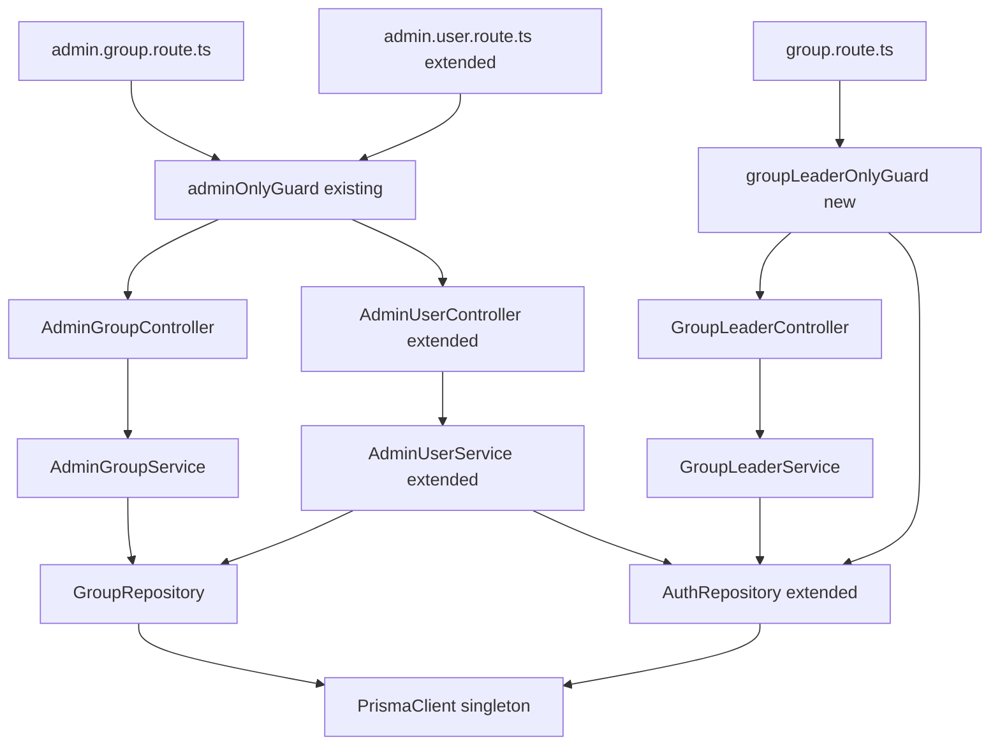
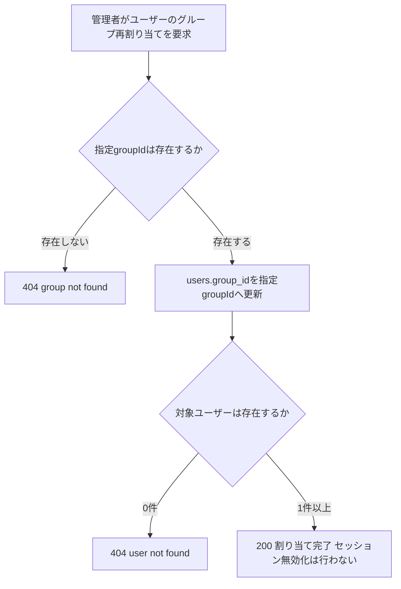
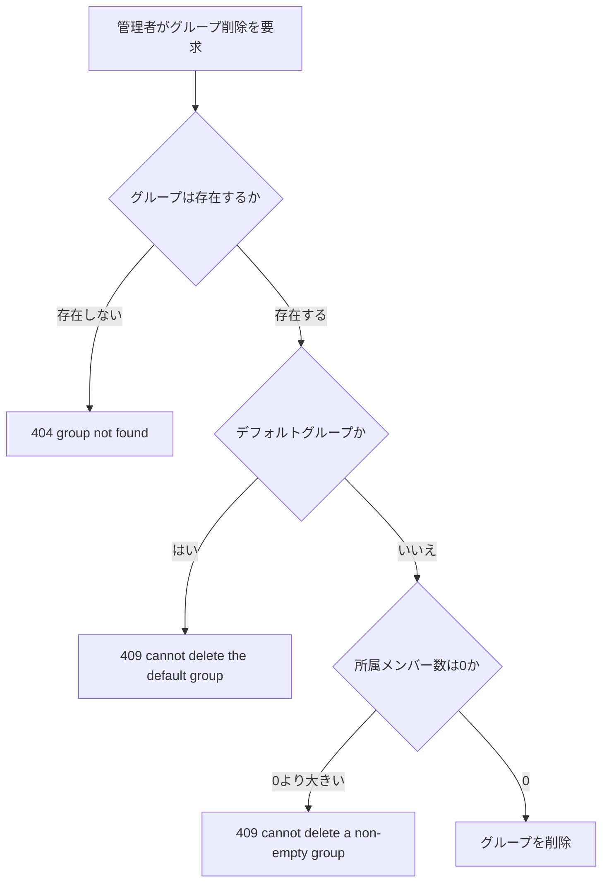
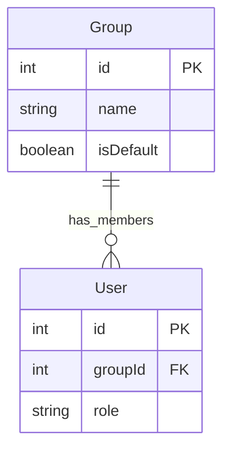
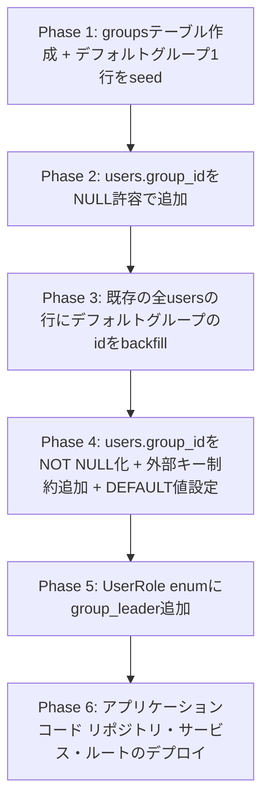

# 技術設計書

## Overview

本機能は、`todo-api`にグループ（チーム）という単位を導入し、全ユーザーが常にいずれか1つのグループに所属する状態を確立した上で、`role`のenumに`group_leader`を追加する。`group_leader`ロールを持つユーザーは、自分が現在所属しているグループ（自グループ）のメンバー一覧と各メンバーの基本状態を参照できる。

**Purpose**: 管理者・グループリーダーに対して、チーム単位でメンバーを編成・把握するための権限基盤を提供する。

**Users**: `admin`ロールを持つ管理者（グループの作成・改廃、メンバーシップの割り当てを行う）、`group_leader`ロールを持つユーザー（自グループのメンバー一覧を参照する）。

**Impact**: `orm-migration`が確立した`prisma/schema.prisma`に`Group`モデルと`User.groupId`列を追加し、`UserRole` enumに`group_leader`を追加する。既存の`users`/`todos`スキーマ、既存の`admin`/`member`向け機能（ユーザー一覧・ロール変更・アカウント状態変更）の外部挙動は変更しない。

### Goals
- グループ（`groups`テーブル）の作成・改称・削除を管理者が行える
- 全ユーザーアカウントが常にちょうど1つのグループに所属する状態を、新規登録・既存データ移行の両方で保証する
- 管理者がユーザーのグループ所属を任意に変更できる（除外はデフォルトグループへの再割り当てとして表現する）
- `role`のenumに`group_leader`を追加し、既存の`admin`/`member`の挙動・不変条件を変更しない
- `group_leader`が自グループのメンバー一覧（氏名・メールアドレス・アカウント状態）を参照でき、他グループのメンバーには一切アクセスできない

### Non-Goals
- グループが所有するTodoの内容・ステータスの可視化（`task-rot-detection`の責務）
- 1ユーザーが複数グループに所属するケース、グループの階層構造
- グループ単位の権限カスタマイズ（read/manage分離等）
- ユーザー一覧の検索・絞り込み・ページネーション（`admin-user-management`のスコープ外のまま）
- グループ再割り当て・`group_leader`ロールの付与/剥奪に伴うセッション強制無効化（`research.md`の設計決定により非対象と決定。既存の`role`変更と同じ扱い）

## Boundary Commitments

### This Spec Owns
- `prisma/schema.prisma`への`Group`モデル・`User.groupId`列・`UserRole` enumへの`group_leader`追加
- `groups`テーブルに対応する`GroupRepository`（作成・改称・削除・一覧・単一取得）
- `users.group_id`に対する読み書き（`AuthRepository`の`updateGroup`/`findByGroupId`として拡張）
- グループCRUDの業務ロジック（`AdminGroupService`）とエンドポイント（`admin.group.route.ts`）
- ユーザーのグループ再割り当ての業務ロジック（`AdminUserService`拡張）とエンドポイント（`admin.user.route.ts`拡張）
- `group_leader`による自グループメンバー一覧参照の業務ロジック（`GroupLeaderService`）とエンドポイント（`group.route.ts`）
- `group_leader`ロールの認可ガード（`groupLeaderOnlyGuard`）
- デフォルトグループの存在保証（マイグレーション時のseedと削除保護）

### Out of Boundary
- グループが所有するTodoの内容・ステータスをメンバー/リーダーへ可視化する機能（`task-rot-detection`の責務）
- Todoへの担当者割り当て（`task-assignment`の責務。本機能はグループメンバーの集合を提供するのみ）
- 1ユーザー複数グループ所属、グループ階層、read/manage権限分離（brief.mdで明示的にOut of scope）
- 既存の`admin`/`member`向け機能（`AdminUserService.changeRole`/`changeStatus`、`AuthRepository`の既存メソッド）のロジック変更 — `role`のenum値追加以外の変更は行わない
- セッション無効化ロジック自体の変更（`SessionService`は無変更。グループ変更時に呼び出さないという判断のみが本機能のスコープ）

### Allowed Dependencies
- `orm-migration`が提供する`prismaClient.ts`（Prisma Clientシングルトン）、`prisma/schema.prisma`の既存モデル（`User`）
- 既存の`AppError`（`todo-api/src/errors/AppError.ts`）— 404/409判定に既存と同じ契約で使用する
- 既存の`adminOnlyGuard`（`guards/adminOnly.ts`）— グループCRUD・メンバーシップ変更エンドポイントの認可にそのまま再利用する
- 既存の`AuthRepository`の型（`UserRole`, `UserSummary`）— `group_leader`を追加した形で拡張する

### Revalidation Triggers
- `groups`テーブル・`users.group_id`のスキーマ（列名・型・NOT NULL制約）を変更する場合（`task-assignment`, `task-rot-detection`が再検証対象）
- `GroupLeaderService`/`AuthRepository.findByGroupId`が返すメンバー一覧の形（フィールド構成）を変更する場合
- `groupLeaderOnlyGuard`の判定条件（`role === 'group_leader'`の比較方法）を変更する場合
- デフォルトグループの識別方法（`is_default`フラグ、予約ID）を変更する場合

## Architecture

### Existing Architecture Analysis

既存のレイヤードアーキテクチャ（`routes → controllers → services → repositories → DB`）を維持する。`orm-migration`によりリポジトリ層はPrisma Clientベースであり、本機能の新規リポジトリ（`GroupRepository`）および既存リポジトリの拡張（`AuthRepository`）もこのパターンに従う。

- 既存パターン: 1テーブル1リポジトリ（`TodoRepository`↔`todos`、`AuthRepository`↔`users`）。本機能は`groups`テーブルに対応する`GroupRepository`を新設し、`users.group_id`の読み書きは`users`テーブル担当の`AuthRepository`に追加する（テーブル境界とリポジトリ境界を一致させる既存原則を維持）。
- 既存パターン: 認可はルート層の`preHandler`ガード（`adminOnlyGuard`/`requireAuthGuard`）が行い、サービス層は権限チェックを行わない。本機能はこの規約に従い、新規`groupLeaderOnlyGuard`を同型で追加する。
- 既存パターン: `role`/`status`列はDBレベルの`DEFAULT`値で新規行への既定割り当てを実現している（`admin-role`設計）。本機能は`users.group_id`にも同じ手法を適用する。
- 維持すべき制約: 「有効な管理者が最低1人残る」という既存不変条件（`AuthRepository.updateRole`/`updateStatus`）は変更しない。`group_leader`の追加はこの判定に影響しない（`group_leader`は`admin`ではないため、判定対象外のまま）。

### Architecture Pattern & Boundary Map



**Architecture Integration**:
- 選択パターン: 既存レイヤードアーキテクチャへの「新規ドメイン追加＋既存ドメイン拡張」パターン。`groups`は新規ドメインとして独立したリポジトリ/サービス/コントローラー/ルートを持ち、`users.group_id`の変更は既存の`users`ドメイン（`AuthRepository`/`AdminUserService`/`AdminUserController`/`admin.user.route.ts`）を拡張する形で行う。
- ドメイン/機能境界: グループそのもの（作成・改称・削除）＝新規`groups`ドメイン。ユーザーのグループ所属（`group_id`列）＝既存`users`ドメインの一部として扱う（`role`/`status`と同じ列レベルの拡張）。
- 既存パターンの維持: ガードによるルート層認可、サービス層は権限チェックをしない、リポジトリはテーブル境界で分離、`affectedRows`/`count`ベースの404/409判別。
- 新規コンポーネントの理由: `GroupRepository`/`AdminGroupService`/`AdminGroupController`（`groups`テーブルという新しいデータ主体の追加）、`GroupLeaderService`/`GroupLeaderController`/`groupLeaderOnlyGuard`（`group_leader`という新しい認可主体・自己スコープAPIの追加）。
- Steering準拠: TypeScript strict・`any`不使用（`tech.md`）、レイヤー単一責務・`<domain>.<layer>.ts`命名規則（`structure.md`）を維持。

**依存方向**: `schema.prisma`（型定義）→ `PrismaClientSingleton`（接続）→ `Repository`（データアクセス）→ `Service`（業務ロジック）→ `Controller`（リクエスト/レスポンス整形）→ `Route`（スキーマ検証・ガード登録）。各層は左側のレイヤーのみを参照する。

### Technology Stack

| Layer | Choice / Version | Role in Feature | Notes |
|-------|------------------|------------------|-------|
| ORM | Prisma / `@prisma/client`（`orm-migration`で導入済みのバージョンを継続使用） | `Group`モデル・`User.groupId`・`UserRole` enum拡張の定義とクエリ実行 | 新規バージョン導入は行わない |
| Data / Storage | MySQL 8.0（既存） | `groups`テーブル新設、`users.group_id`列追加 | エンジン変更なし |
| Backend | Fastify 5 / Node.js（既存） | 新規ルート・ガード・コントローラー・サービスの追加 | 新規ライブラリ追加なし |

## File Structure Plan

### Directory Structure
```
todo-api/
├── prisma/
│   ├── schema.prisma                    # 変更: Groupモデル追加、User.groupId追加、UserRole enumにgroup_leader追加
│   └── migrations/
│       └── <timestamp>_add_groups/
│           └── migration.sql            # 新規: groupsテーブル作成、デフォルトグループseed、users.group_id追加(NOT NULL・FK)
├── src/
│   ├── repositories/
│   │   ├── groups.repository.ts         # 新規: groupsテーブルのCRUD（Prisma Clientベース）
│   │   └── auth.repository.ts           # 変更: updateGroup/findByGroupId追加、UserRole型にgroup_leader追加
│   ├── services/
│   │   ├── adminGroup.service.ts        # 新規: グループCRUDの業務ロジック（管理者操作）
│   │   ├── adminUser.service.ts         # 変更: assignGroup追加（ユーザーのグループ再割り当て）
│   │   └── groupLeader.service.ts       # 新規: 自グループメンバー一覧取得
│   ├── controllers/
│   │   ├── adminGroup.controller.ts     # 新規
│   │   ├── adminUser.controller.ts      # 変更: assignGroupハンドラ追加
│   │   └── groupLeader.controller.ts    # 新規
│   ├── guards/
│   │   └── groupLeaderOnly.ts           # 新規: 認証済み かつ role === 'group_leader' を確認する共有preHandler
│   ├── routes/
│   │   ├── admin.group.route.ts         # 新規: /admin/groups* （adminOnlyGuard適用）
│   │   ├── admin.user.route.ts          # 変更: PATCH /admin/users/:userId/group追加、role enumにgroup_leader追加
│   │   └── group.route.ts               # 新規: GET /groups/me/members （groupLeaderOnlyGuard適用）
│   ├── types/
│   │   ├── group.ts                     # 新規: CreateGroupBody, RenameGroupBody, GroupParams
│   │   └── admin.ts                     # 変更: AssignGroupBody追加、ChangeRoleBody.roleの許容値にgroup_leaderが含まれる
│   └── app.ts                           # 変更: adminGroupRoutes/groupRoutesの登録追加
```

### Modified Files
- `todo-api/prisma/schema.prisma` — `Group`モデル追加、`User`モデルに`groupId`（`@map("group_id")`）と`Group`へのリレーション追加、`UserRole` enumに`group_leader`追加
- `todo-api/src/repositories/auth.repository.ts` — `UserRole`型に`'group_leader'`追加、`updateGroup(userId, groupId): Promise<number>`（`affectedRows`/`count`相当）と`findByGroupId(groupId): Promise<UserSummary[]>`を追加。既存メソッドのシグネチャ・挙動は変更しない
- `todo-api/src/services/adminUser.service.ts` — `assignGroup(targetUserId, groupId): Promise<void>`を追加（`GroupRepository.findById`でグループ存在確認 → `AuthRepository.updateGroup`）。既存の`changeRole`/`changeStatus`は変更しない
- `todo-api/src/controllers/adminUser.controller.ts` — `assignGroup`ハンドラを追加（既存の`list`/`changeRole`/`changeStatus`は変更しない）
- `todo-api/src/routes/admin.user.route.ts` — `PATCH /admin/users/:userId/group`ルートを追加、`changeRoleSchema`の`role`列挙値に`"group_leader"`を追加
- `todo-api/src/types/admin.ts` — `AssignGroupBody`型（`{ groupId: number }`）を追加
- `todo-api/src/app.ts` — `adminGroupRoutes`・`groupRoutes`の登録を追加

## System Flows

### グループ除外（デフォルトグループへの再割り当て）フロー



- 「除外」は専用エンドポイントを持たず、管理者がデフォルトグループの`groupId`を割り当て先として指定する操作として表現する（要件3.3）。デフォルトグループの`groupId`は`GET /admin/groups`のレスポンス中の`isDefault: true`な行から判別できる。

### グループ削除フロー



- デフォルトグループの削除拒否は要件本文には明示されないが、要件2.3（全ユーザーが常にちょうど1つのグループに所属する状態の保証）を機械的に満たすための安全策として設計に組み込む（`research.md`「Risks & Mitigations」参照）。

## Requirements Traceability

| Requirement | Summary | Components | Interfaces | Flows |
|-------------|---------|------------|------------|-------|
| 1.1, 1.2 | グループ作成・バリデーション | AdminGroupService, GroupRepository | POST /admin/groups | - |
| 1.3 | グループ改称 | AdminGroupService, GroupRepository | PATCH /admin/groups/:groupId | - |
| 1.4, 1.5 | 空グループの削除・非空グループの削除拒否 | AdminGroupService, GroupRepository | DELETE /admin/groups/:groupId | グループ削除フロー |
| 1.6 | 管理者以外によるグループCRUD拒否 | AdminOnlyGuard (既存) | admin.group.route.ts | - |
| 2.1 | 既存ユーザーのデフォルトグループへの移行時割り当て | PrismaSchemaExtension (Migration) | - | Migration Strategy |
| 2.2 | 新規ユーザーのデフォルトグループ自動割り当て | PrismaSchemaExtension (DB DEFAULT) | - | - |
| 2.3 | 常時1グループ所属の保証（デフォルトグループ削除保護含む） | GroupRepository, AdminGroupService | DELETE /admin/groups/:groupId | グループ削除フロー |
| 3.1, 3.2 | メンバーシップ割り当て・存在検証 | AdminUserService, GroupRepository, AuthRepository | PATCH /admin/users/:userId/group | グループ除外フロー |
| 3.3 | メンバー除外（デフォルトグループへの再割り当て） | AdminUserService, AuthRepository | PATCH /admin/users/:userId/group | グループ除外フロー |
| 3.4 | 管理者以外によるメンバーシップ変更拒否 | AdminOnlyGuard (既存) | admin.user.route.ts | - |
| 4.1, 4.2 | group_leaderロールの追加・付与 | AuthRepository (UserRole型), AdminUserService (既存changeRole) | PATCH /admin/users/:userId/role | - |
| 4.3 | 管理者以外によるロール変更拒否 | AdminOnlyGuard (既存) | admin.user.route.ts | - |
| 4.4, 4.5 | 自グループの定義（現在の所属に追従） | GroupLeaderService, AuthRepository | GET /groups/me/members | - |
| 5.1, 5.2, 5.3 | 自グループメンバー一覧の参照 | GroupLeaderService, AuthRepository | GET /groups/me/members | - |
| 6.1 | group_leaderの他グループアクセス拒否（構造的防止） | GroupLeaderService, GroupLeaderController | GET /groups/me/members | - |
| 6.2, 6.3 | member/未認証によるメンバー一覧参照拒否 | GroupLeaderOnlyGuard | group.route.ts | - |
| 6.4 | adminによる任意グループのメンバー一覧参照 | AdminGroupService, AuthRepository | GET /admin/groups/:groupId/members | - |
| 7.1, 7.2, 7.3 | 既存admin/member機能・不変条件の非回帰 | AuthRepository (既存メソッド無変更), AdminUserService (既存メソッド無変更) | 既存API契約無変更 | - |

## Components and Interfaces

| Component | Domain/Layer | Intent | Req Coverage | Key Dependencies (P0/P1) | Contracts |
|-----------|---------------|--------|---------------|---------------------------|-----------|
| PrismaSchemaExtension | Data Layer | `Group`モデル・`User.groupId`・`UserRole` enum拡張の定義 | 1.1–1.5, 2.1–2.3, 4.1 | PrismaClientSingleton (P0) | State |
| GroupRepository | Data Layer | `groups`テーブルのCRUD | 1.1–1.5, 2.3, 3.2, 6.4 | PrismaClientSingleton (P0) | Service |
| AuthRepository (拡張) | Data Layer | `users.group_id`の読み書き、`UserRole`型拡張 | 3.1, 3.3, 4.1, 4.4, 5.1–5.3, 6.4, 7.1–7.3 | PrismaClientSingleton (P0) | Service |
| AdminGroupService | Business Logic | グループCRUDの業務ロジック（存在確認・削除保護） | 1.1–1.6, 2.3, 6.4 | GroupRepository (P0), AuthRepository (P1) | Service |
| AdminUserService (拡張) | Business Logic | ユーザーのグループ再割り当て | 3.1–3.4 | GroupRepository (P0), AuthRepository (P0) | Service |
| GroupLeaderService | Business Logic | 自グループメンバー一覧の取得 | 4.4, 4.5, 5.1–5.3, 6.1 | AuthRepository (P0) | Service |
| GroupLeaderOnlyGuard | API/Guard | `group_leader`ロールの認可 | 6.2, 6.3 | AuthRepository (P0) | Service |
| AdminGroupController / admin.group.route.ts | API | グループCRUD・任意グループのメンバー一覧のHTTP窓口 | 1.1–1.6, 6.4 | AdminGroupService (P0), AdminOnlyGuard (P0) | API |
| AdminUserController / admin.user.route.ts (拡張) | API | グループ再割り当てのHTTP窓口 | 3.1–3.4 | AdminUserService (P0), AdminOnlyGuard (P0) | API |
| GroupLeaderController / group.route.ts | API | 自グループメンバー一覧のHTTP窓口 | 5.1–5.3, 6.1–6.3 | GroupLeaderService (P0), GroupLeaderOnlyGuard (P0) | API |

### Data Layer

#### PrismaSchemaExtension

| Field | Detail |
|-------|--------|
| Intent | `groups`テーブルと`users.group_id`列、`group_leader`ロール値をPrismaスキーマとして定義する |
| Requirements | 1.1, 1.2, 1.3, 1.4, 1.5, 2.1, 2.2, 2.3, 4.1 |

**Responsibilities & Constraints**
- `Group`モデル: `id`(Int, PK, autoincrement), `name`(String), `isDefault`(Boolean, `@map("is_default")`, default false), `createdAt`/`updatedAt`(DateTime, `@map`)。`@@map("groups")`
- `User`モデルに`groupId`(Int, `@map("group_id")`, DBレベルの既定値としてデフォルトグループの予約ID)を追加し、`Group`への`@relation`（`onDelete`は指定しない — グループ削除は「メンバー0件かつ非デフォルト」の場合のみアプリケーション層で許可するため、DBレベルのカスケード削除・SET NULLのいずれも使わない。既存メンバーが残るグループの削除はDB制約でも拒否される）
- `UserRole` enumに`group_leader`を追加（`admin` | `member` | `group_leader`）
- デフォルトグループはマイグレーション適用時に1行だけseedされ、`isDefault = true`を持つ。以降、`isDefault = true`の行は削除操作の対象外とする（アプリケーション層で強制。DB制約では表現しない）

**Dependencies**
- Outbound: PrismaClientSingleton（既存、`orm-migration`が提供） (P0)

**Contracts**: Service [ ] / API [ ] / Event [ ] / Batch [ ] / State [x]

##### State Management
- State model: `groups`テーブルと`users.group_id`列がstate。Prisma Migrateのマイグレーション履歴が変更履歴を管理する（`orm-migration`と同じ運用）
- Persistence & consistency: `users.group_id`は`groups.id`への外部キー制約を持つ`NOT NULL`列。存在しないグループへの参照は作成できない
- Concurrency strategy: グループ削除とメンバーシップ変更が競合した場合、外部キー制約により「メンバーが存在するグループ」の削除はDBレベルでも失敗する（アプリケーション層のメンバー数チェックと二重の安全策になる）

**Implementation Notes**
- Integration: `prisma generate`で`Group`型・拡張された`UserRole`型を生成する
- Validation: 新規の空DBに対して`prisma migrate deploy`を実行し、`groups`テーブルとデフォルトグループの1行が作成されることを確認する
- Risks: 既存の永続化済みDBに対しては、デフォルトグループのseed → `users.group_id`のbackfill → `NOT NULL`化、という順序を誤るとマイグレーションが失敗する（Migration Strategy参照）

#### GroupRepository

| Field | Detail |
|-------|--------|
| Intent | `groups`テーブルに対するCRUDをPrisma Clientベースで提供する |
| Requirements | 1.1, 1.2, 1.3, 1.4, 1.5, 2.3, 3.2, 6.4 |

**Responsibilities & Constraints**
- `create(name)`: `prisma.group.create({ data: { name } })`相当。`isDefault`は常に`false`（デフォルトグループはマイグレーションでのみ作成される。アプリケーションAPI経由では作成できない）
- `rename(id, name)`: `prisma.group.update({ where: { id }, data: { name } })`相当。対象が存在しなければ更新0件
- `delete(id)`: `prisma.group.delete({ where: { id } })`相当。呼び出し前に`AdminGroupService`が`isDefault`チェックとメンバー数チェックを行う（本メソッド自体はチェックを行わない。関心の分離）
- `findAll()`: 全グループを返す（`id`, `name`, `isDefault`）
- `findById(id)`: 単一グループを返す（存在しなければ`null`）
- `countMembers(id)`: 指定グループに所属するユーザー数を返す

**Dependencies**
- Inbound: AdminGroupService, AdminUserService (P0)
- Outbound: PrismaClientSingleton (P0)

**Contracts**: Service [x] / API [ ] / Event [ ] / Batch [ ] / State [ ]

##### Service Interface
```typescript
export type Group = {
  id: number;
  name: string;
  isDefault: boolean;
};

interface GroupRepositoryContract {
  create(name: string): Promise<Group>;
  rename(id: number, name: string): Promise<number>;
  delete(id: number): Promise<number>;
  findAll(): Promise<Group[]>;
  findById(id: number): Promise<Group | null>;
  countMembers(id: number): Promise<number>;
}
```
- Preconditions: `name`は呼び出し元（サービス層）で空文字列でないことが検証済みであること
- Postconditions: `delete`はメンバーが存在するグループに対して呼び出された場合、外部キー制約違反により失敗する（呼び出し元の事前チェックと二重の安全策）
- Invariants: `isDefault = true`の行はアプリケーションAPI経由で作成されない（マイグレーションでのみ存在する）

**Implementation Notes**
- Integration: `AdminGroupService`/`AdminUserService`から呼び出される。`AuthRepository`とは独立したテーブルを扱うため、実装は並行に進められる
- Validation: `countMembers`が0を返す場合のみ`AdminGroupService`が`delete`を呼び出すことをユニットテストで確認する
- Risks: `isDefault`グループの`delete`をアプリケーション層のチェックだけに頼ると、チェックとDB操作の間に競合が生じ得る。実装時は`delete`条件に`isDefault: false`をWHERE句として含める（`prisma.group.deleteMany({ where: { id, isDefault: false } })`相当とし、影響行数0で保護を保証する）ことで競合を排除する

#### AuthRepository（拡張）

| Field | Detail |
|-------|--------|
| Intent | `users.group_id`の読み書きと`UserRole`型の拡張を提供する。既存メソッドの契約は変更しない |
| Requirements | 3.1, 3.3, 4.1, 4.4, 5.1, 5.2, 5.3, 6.4, 7.1, 7.2, 7.3 |

**Responsibilities & Constraints**
- `UserRole`型を`'admin' | 'member' | 'group_leader'`に拡張する
- `updateGroup(userId, groupId)`: `prisma.user.updateMany({ where: { id: userId }, data: { groupId } })`相当。影響行数を返す（`updateRole`/`updateStatus`と同じ契約形。ただし「有効な管理者が最低1人残る」のような不変条件チェックは伴わない — グループ変更は管理者資格に影響しないため）
- `findByGroupId(groupId)`: `prisma.user.findMany({ where: { groupId }, select: { id, email, role, status, name } })`相当。`password_hash`を含まない（既存`findAll`と同じ列選択方針）
- 既存の`findByEmail`/`findById`/`findAll`/`createUser`/`updateRole`/`updateStatus`/`updateName`/`findPasswordHashById`/`updatePasswordHash`のシグネチャ・挙動・不変条件は一切変更しない

**Dependencies**
- Inbound: AdminUserService, GroupLeaderService, GroupLeaderOnlyGuard (P0)
- Outbound: PrismaClientSingleton (P0)

**Contracts**: Service [x] / API [ ] / Event [ ] / Batch [ ] / State [ ]

##### Service Interface
```typescript
export type UserRole = 'admin' | 'member' | 'group_leader';

interface AuthRepositoryGroupExtension {
  updateGroup(userId: number, groupId: number): Promise<number>;
  findByGroupId(groupId: number): Promise<UserSummary[]>;
}
```
- Preconditions: `groupId`は呼び出し元（`AdminUserService`）が`GroupRepository.findById`で存在確認済みであること
- Postconditions: `updateGroup`は対象ユーザーが存在しなければ0を返す（404判定に使用）
- Invariants: `findByGroupId`は`password_hash`を含む列を一切返さない（既存の列選択方針を維持）

**Implementation Notes**
- Integration: 既存の`AdminUserService.changeRole`/`changeStatus`、`AuthService`、`ProfileService`は無変更。呼び出しシグネチャが変わらないことを型チェック（`pnpm build`）で保証する
- Validation: 既存の`auth.repository.test.ts`・`auth.repository.concurrency.test.ts`は既存アサーションを変更せずそのまま合格することを確認する（非回帰）
- Risks: `UserRole`型に`group_leader`を追加する際、既存の`updateRole`/`updateStatus`が使う「有効な管理者」判定SQL（`$executeRaw`または相当のPrismaクエリ）の`role = 'admin'`条件が`group_leader`を誤って含めないことを確認する（`role`カラムの値ではなく`'admin'`という文字列の等価比較のため、影響なしが期待値だが実装時に明示的にテストする）

### Business Logic

#### AdminGroupService

| Field | Detail |
|-------|--------|
| Intent | グループの作成・改称・削除・一覧・メンバー一覧参照の業務ロジック |
| Requirements | 1.1, 1.2, 1.3, 1.4, 1.5, 1.6, 2.3, 6.4 |

**Responsibilities & Constraints**
- `createGroup(name)`: `name`が空文字列であれば`AppError(400)`。それ以外は`GroupRepository.create`を呼び出す
- `renameGroup(id, name)`: `name`が空文字列であれば`AppError(400)`。`GroupRepository.rename`の影響行数が0なら`AppError(404)`
- `deleteGroup(id)`: `GroupRepository.findById`で存在確認（なければ`AppError(404)`）。`isDefault`なら`AppError(409, "cannot delete the default group")`。`countMembers(id) > 0`なら`AppError(409, "cannot delete a non-empty group")`。それ以外は`GroupRepository.delete`を呼び出す
- `listGroups()`: `GroupRepository.findAll()`をそのまま返す
- `listMembers(groupId)`: `GroupRepository.findById`で存在確認（なければ`AppError(404)`）。`AuthRepository.findByGroupId(groupId)`を返す
- 権限チェックは行わない（ルート層の`adminOnlyGuard`が確認済みという既存の規約に従う）

**Dependencies**
- Inbound: AdminGroupController (P0)
- Outbound: GroupRepository (P0), AuthRepository (P1, `listMembers`のみ)

**Contracts**: Service [x] / API [ ] / Event [ ] / Batch [ ] / State [ ]

##### Service Interface
```typescript
interface AdminGroupServiceContract {
  createGroup(name: string): Promise<Group>;
  renameGroup(id: number, name: string): Promise<void>;
  deleteGroup(id: number): Promise<void>;
  listGroups(): Promise<Group[]>;
  listMembers(groupId: number): Promise<UserSummary[]>;
}
```
- Preconditions: 呼び出し元（コントローラー）は認証済み・管理者ロールであることを保証済み
- Postconditions: `deleteGroup`が成功した場合、当該グループは以後`findAll`/`findById`の結果に含まれない
- Invariants: デフォルトグループは`deleteGroup`によって削除され得ない

**Implementation Notes**
- Integration: `AdminGroupController`から1:1で呼び出される
- Validation: `deleteGroup`が「非空グループ」「デフォルトグループ」の双方で`409`を返すことをユニットテストで確認する
- Risks: なし（新規ドメインで既存機能への影響なし）

#### AdminUserService（拡張）

| Field | Detail |
|-------|--------|
| Intent | ユーザーのグループ再割り当ての業務ロジックを追加する。既存の`changeRole`/`changeStatus`は変更しない |
| Requirements | 3.1, 3.2, 3.3, 3.4 |

**Responsibilities & Constraints**
- `assignGroup(targetUserId, groupId)`: `GroupRepository.findById(groupId)`で割り当て先グループの存在確認（なければ`AppError(404, "group not found")`）。`AuthRepository.updateGroup(targetUserId, groupId)`の影響行数が0なら`AppError(404, "user not found")`
- セッション無効化は行わない（`research.md`の設計決定。既存の`changeRole`と同じ扱い）
- 既存の`changeRole`/`changeStatus`、および内部の`assertUpdatePossible`は変更しない

**Dependencies**
- Inbound: AdminUserController (P0)
- Outbound: GroupRepository (P0), AuthRepository (P0)

**Contracts**: Service [x] / API [ ] / Event [ ] / Batch [ ] / State [ ]

##### Service Interface
```typescript
interface AdminUserServiceGroupExtension {
  assignGroup(targetUserId: number, groupId: number): Promise<void>;
}
```
- Preconditions: 呼び出し元は認証済み・管理者ロールであることを保証済み
- Postconditions: 成功時、対象ユーザーの`group_id`は指定`groupId`に更新される。対象ユーザーが`group_leader`であった場合、その「自グループ」は暗黙的に新しいグループへ追従する（`AuthRepository`が`group_id`のみを保持するため、追加の同期処理は不要）
- Invariants: グループ存在確認とユーザー更新の間に競合が生じても、`updateGroup`の影響行数チェックにより対象ユーザー不在は404として検出される

**Implementation Notes**
- Integration: 既存の`AdminUserController.list`/`changeRole`/`changeStatus`は無変更。新規`assignGroup`ハンドラのみ追加する
- Validation: 存在しない`groupId`を指定した場合に404が返ることをユニットテストで確認する
- Risks: なし

#### GroupLeaderService

| Field | Detail |
|-------|--------|
| Intent | `group_leader`ロールを持つユーザー自身の所属グループのメンバー一覧を取得する |
| Requirements | 4.4, 4.5, 5.1, 5.2, 5.3, 6.1 |

**Responsibilities & Constraints**
- `listMyGroupMembers(requesterId)`: `AuthRepository.findById(requesterId)`で要求者自身の`group_id`を取得し、`AuthRepository.findByGroupId(その group_id)`を返す
- 引数として`groupId`を一切受け取らない（要求者のセッションから解決した自分自身の`group_id`のみを使う）。この設計により、他グループのIDを指定して参照する経路がAPI上そもそも存在しない（要件6.1を構造的に満たす）
- 権限チェック（`group_leader`ロールであること）は行わない（ルート層の`groupLeaderOnlyGuard`が確認済み）

**Dependencies**
- Inbound: GroupLeaderController (P0)
- Outbound: AuthRepository (P0)

**Contracts**: Service [x] / API [ ] / Event [ ] / Batch [ ] / State [ ]

##### Service Interface
```typescript
interface GroupLeaderServiceContract {
  listMyGroupMembers(requesterId: number): Promise<UserSummary[]>;
}
```
- Preconditions: `requesterId`は認証済みセッションの`userId`であり、`groupLeaderOnlyGuard`により`role === 'group_leader'`であることが確認済みであること
- Postconditions: 返却される一覧には要求者自身を含む、要求者と同じ`group_id`を持つ全ユーザーが含まれる
- Invariants: 要求者以外のグループのユーザーは一切返却されない（クエリ条件が常に要求者自身の`group_id`に固定されるため）

**Implementation Notes**
- Integration: `GroupLeaderController`から1:1で呼び出される
- Validation: 要求者の所属グループが変更された直後に呼び出した場合、新しい所属グループのメンバーが返ることを確認する（要件4.5）
- Risks: なし（自己スコープのみのシンプルな読み取り）

#### GroupLeaderOnlyGuard

| Field | Detail |
|-------|--------|
| Intent | 認証済みかつ`role === 'group_leader'`であることを確認する共有`preHandler` |
| Requirements | 6.2, 6.3 |

**Responsibilities & Constraints**
- `req.session.userId`が存在しなければ401（`adminOnlyGuard`と同じ既存パターン）
- `AuthRepository.findById(req.session.userId)`で取得したユーザーの`role`が`'group_leader'`でなければ403
- `admin`ロールであってもこのガードは通過させない（管理者は`/admin/groups/:groupId/members`という別エンドポイントを使う）

**Dependencies**
- Inbound: group.route.ts (P0)
- Outbound: AuthRepository (P0)

**Contracts**: Service [x] / API [ ] / Event [ ] / Batch [ ] / State [ ]

##### Service Interface
```typescript
export async function groupLeaderOnlyGuard(
  req: FastifyRequest,
  reply: FastifyReply
): Promise<void | FastifyReply>;
```
- Preconditions: なし（ルート登録時にプラグインスコープの`preHandler`として使用する）
- Postconditions: 通過した場合、`req.session.userId`は`role === 'group_leader'`のユーザーのIDである
- Invariants: `adminOnlyGuard`とは判定条件（比較する`role`の値）以外は同一の実装パターンを踏襲する

**Implementation Notes**
- Integration: `group.route.ts`のプラグインスコープに`app.addHook("preHandler", groupLeaderOnlyGuard)`として登録する（`admin.user.route.ts`の`adminOnlyGuard`登録と同じパターン）
- Validation: `member`/`admin`ロールでのアクセスが403になること、未認証アクセスが401になることをユニットテストで確認する（`guards/_test_/adminOnly.test.ts`と対になるテストファイルを新設）
- Risks: `adminOnlyGuard`をコピーして実装する際、比較対象の`role`文字列を書き換え忘れるとバイパスにつながる（`research.md`のRisks参照）。レビュー時に明示的に確認する

## Data Models

### Domain Model
- `Group`（新規アグリゲートルート）: `id`を自然キーとするチーム単位のエンティティ。`isDefault`によって「常に1グループに所属する」という不変条件を支えるシステム予約グループを識別する
- `User`（既存アグリゲートルート、拡張）: `groupId`を新たに持ち、常にちょうど1つの`Group`を参照する。`role === 'group_leader'`のとき、参照先グループが「自グループ」となる（`Group`側に`leaderId`のような逆参照は持たない — `research.md`のDesign Decisions参照）
- 不変条件: 「全ユーザーは常にちょうど1つのグループに所属する」（`group_id`は`NOT NULL`外部キー）、「デフォルトグループは削除されない」（アプリケーション層のWHERE条件付き削除）、「メンバーが1人以上いるグループは削除されない」（外部キー制約＋アプリケーション層の事前チェックの二重の安全策）

### Logical Data Model
- `Group 1 --- N User`（`User.group_id → Group.id`）
- 自然キー: `Group.id`（サロゲートキー、AUTO_INCREMENT）。`Group.name`はユニーク制約を持たない（要件に一意性の要求がないため、意図的に制約を設けない）
- 参照整合性: `User.group_id`は`Group.id`への外部キー制約を持つ`NOT NULL`列。カスケード削除・SET NULLのいずれも設定しない（メンバーが存在するグループの削除は常に拒否されるべきであるため）



### Physical Data Model

**For Relational Databases**:
- `groups`: `id INT AUTO_INCREMENT PK`, `name VARCHAR(255) NOT NULL`, `is_default BOOLEAN NOT NULL DEFAULT FALSE`, `created_at/updated_at DATETIME`
- `users`（変更）: `group_id INT NOT NULL FK→groups.id`（既存の`role ENUM('admin','member')`を`role ENUM('admin','member','group_leader')`へ拡張）
- インデックス: `users.group_id`に外部キー由来のインデックスを追加（既存の`users.email` UNIQUE、`todos.user_id` FKはそのまま維持）
- パーティショニング: 対象外

## Error Handling

### Error Strategy
既存の`AppError`パターンをそのまま踏襲する。サービス層が業務的なエラー（404/409/400）を`AppError`として投げ、コントローラー層が`err.statusCode`をそのまま返す（`AdminUserController`の既存`try/catch`パターンと同一）。

### Error Categories and Responses
- **400（不正な入力）**: グループ名が空文字列 → `AdminGroupService.createGroup`/`renameGroup`が`AppError(400)`
- **401（未認証）**: `groupLeaderOnlyGuard`/`adminOnlyGuard`がセッション未確立を検知
- **403（権限不足）**: `groupLeaderOnlyGuard`が`role !== 'group_leader'`を検知、`adminOnlyGuard`が`role !== 'admin'`を検知（グループCRUD・メンバーシップ変更・任意グループのメンバー参照全てで既存ガードを再利用）
- **404（存在しない対象）**: 割り当て先グループが存在しない、対象ユーザーが存在しない、対象グループが存在しない
- **409（不変条件違反）**: 非空グループの削除要求、デフォルトグループの削除要求

### Monitoring
既存同様、追加のロギング・監視基盤は導入しない（本機能のスコープ外）。

## Testing Strategy

### Unit Tests
- `AdminGroupService.deleteGroup`が「非空グループ」「デフォルトグループ」の双方で`409`を返すこと（要件1.5, 2.3）
- `AdminGroupService.createGroup`/`renameGroup`が空文字列のグループ名を`400`で拒否すること（要件1.2）
- `AdminUserService.assignGroup`が存在しない`groupId`に対して`404`を返すこと（要件3.2）
- `GroupLeaderService.listMyGroupMembers`が要求者自身の`group_id`のみに基づいてメンバーを返すこと（要件5.1, 6.1）
- `groupLeaderOnlyGuard`が`member`/`admin`ロールを403で拒否し、未認証を401で拒否すること（要件6.2, 6.3）

### Integration Tests
- `PATCH /admin/users/:userId/group`実行後、`GET /groups/me/members`（新しい`group_leader`として）が新グループのメンバーを返すこと（要件3.1, 4.5）
- `DELETE /admin/groups/:groupId`が、メンバーが0人になった時点でのみ成功すること（メンバーを先に他グループへ移動 → 削除成功の順序を実DBに対して確認、要件1.4）
- 既存の`auth.repository.test.ts`・`auth.repository.concurrency.test.ts`・`adminUser.controller`関連テストが、`group_id`列・`group_leader`ロール追加後も変更なしに合格すること（要件7.1, 7.2, 7.3）
- 「有効な管理者が最低1人残る」不変条件が、ロールを`admin`から`group_leader`へ変更する場合にも維持されること（要件7.3）

### E2E/UI Tests
対象外（本specはAPIレベルの権限基盤のみを提供し、UIは対象外）。

### Migration/Ops Tests
- 新規の空DBに対して`prisma migrate deploy`を実行し、`groups`テーブルにデフォルトグループが1行存在し、新規登録したユーザーの`group_id`が自動的にそのデフォルトグループを指すこと（要件2.2）
- 既存データを持つDBに対してマイグレーションを適用し、適用前に存在した全ユーザーの`group_id`がデフォルトグループを指すこと（要件2.1）

## Security Considerations

- `group_leader`の可視性はセッションから解決した`requesterId`を起点に`group_id`を導出する設計であり、クライアントが任意の`groupId`をパラメータとして送信できる経路を持たない（IDOR対策。要件6.1を構造的に満たす）
- 管理者向けの任意グループ参照（`GET /admin/groups/:groupId/members`）は既存の`adminOnlyGuard`で保護され、`group_leader`/`member`ロールからは到達できない
- グループ再割り当て・`group_leader`ロールの付与/剥奪はセッションを無効化しない（`research.md`の設計決定）。これは既存の`role`変更の挙動と一貫しており、新たな権限昇格の窓を開くものではない（次回のガード評価時に最新の`role`/`group_id`が`AuthRepository.findById`経由で参照されるため）

## Migration Strategy



- ロールバックトリガー: Phase4完了時点でVitestの統合テストが合格しない場合、Phase1〜3のマイグレーションを取り消さず、Phase4以降のみ修正して再適用する（Phase1〜3は既存データに対して非破壊的なため巻き戻し不要）
- 検証チェックポイント: 各Phase完了時に`prisma migrate status`でマイグレーション状態を確認し、Phase3完了時点で「`group_id`が`NULL`のユーザーが0件」であることをクエリで確認してからPhase4に進む
- 本番デプロイ順序: `orm-migration`のMigration Strategyと同様、コンテナ起動時の`prisma migrate deploy`によって全Phaseが順次適用される（既存の永続化済みボリュームに対しても、baseline適用済みであれば追加マイグレーションとしてそのまま適用可能）

## Open Questions / Risks
- グループ名の一意性制約を設けないという判断（`research.md`参照）は、将来UI表示で同名グループが並ぶ可能性を許容する。運用上の混乱が実際に発生した場合は、別途一意性制約を追加するマイグレーションを検討する
- `isDefault`グループの削除保護をアプリケーション層のWHERE条件付き削除（`deleteMany`の影響行数チェック）で実装する方針は、実装タスク開始時に`GroupRepository.delete`の具体的なPrisma呼び出し形として確定する
