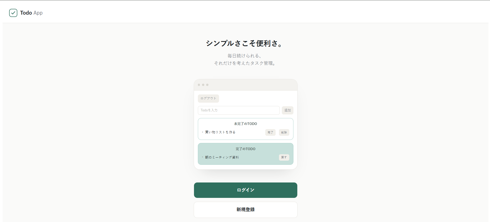
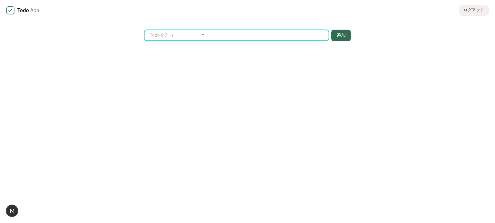
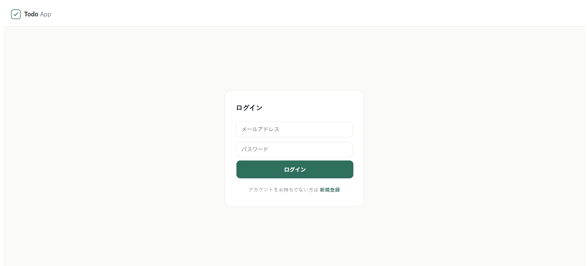
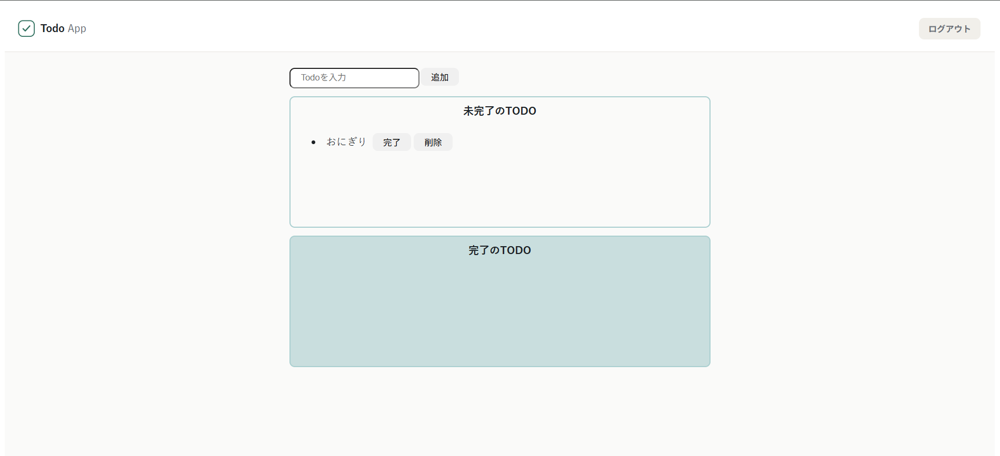

# Todo App

A full-stack Todo application — create, complete, and delete personal todos with account registration and login.



## Prerequisites

Make sure the following are installed before getting started:

- [Node.js](https://nodejs.org/) v16 or later
- [pnpm](https://pnpm.io/installation) v11 — `npm install -g pnpm`
- [Docker Desktop](https://www.docker.com/products/docker-desktop/)

## Setup

1. **Clone the repository**

   ```bash
   git clone https://github.com/NAKANO8/todo_app.git
   cd todo_app
   ```

2. **Create the environment file**

   ```bash
   cp todo-api/.env.dev.example todo-api/.env.dev
   ```

   Open `todo-api/.env.dev` and set your own values for `DB_PASSWORD`, `MYSQL_ROOT_PASSWORD`, and `SESSION_SECRET`.

3. **Build and start all services** (first time only)

   ```bash
   pnpm docker:dev-init
   ```

   This builds the Docker images and starts the API, database, and frontend together.

4. **Open the app**

   Visit [http://localhost:3000](http://localhost:3000) in your browser.

> After the first run, use `pnpm docker:dev` to start without rebuilding.

## First-time Usage



1. Click **新規登録 (Register)** and create an account
2. Log in with your email and password
3. Type a todo in the input field and click **追加 (Add)**
4. Mark todos as complete or delete them from the list




## Troubleshooting

**Port already in use**
Another process is using port 3000 or 3001. Stop it, or update the ports in `docker-compose.dev.yml`.

**Database not connecting on first start**
MySQL takes ~10–20 seconds to initialize. Wait a moment and refresh the page.

**Docker services won't start**
Make sure Docker Desktop is running before any `pnpm docker:*` command.

---

## Tech Stack

| Layer | Technology |
|---|---|
| API | Fastify 5 + Node.js |
| Frontend | Next.js 16 (App Router) + React 19 |
| Database | MySQL 2 |
| Language | TypeScript (strict) |
| Package manager | pnpm 11 (workspaces) |

## Architecture

Monorepo with two packages (`todo-api`, `todo-web`) managed by pnpm workspaces.

- **`todo-api`** — Fastify REST API with session auth, rate limiting, and JSON Schema validation
- **`todo-web`** — Next.js frontend; auth calls proxied through Next.js API routes so the browser never calls Fastify directly

Auth is enforced in `middleware.ts` via a server-side call to `/auth/me` — no auth logic runs in the browser.
