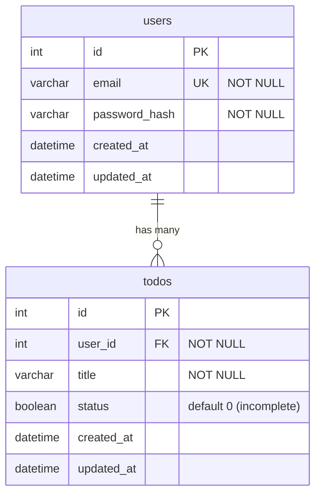

# Database Schema

MySQL schema used by `todo-api`. Source of truth: [`mysql/init.sql`](../mysql/init.sql).

## ER Diagram

## Tables

### `users`

| Column | Type | Constraints | Notes |
|---|---|---|---|
| `id` | `INT` | `PRIMARY KEY`, `AUTO_INCREMENT` | |
| `email` | `VARCHAR(255)` | `NOT NULL`, `UNIQUE` | Login identifier |
| `password_hash` | `VARCHAR(255)` | `NOT NULL` | Hashed password, never stored in plaintext |
| `created_at` | `DATETIME` | default `CURRENT_TIMESTAMP` | |
| `updated_at` | `DATETIME` | default `CURRENT_TIMESTAMP`, updates on row change | |

### `todos`

| Column | Type | Constraints | Notes |
|---|---|---|---|
| `id` | `INT` | `PRIMARY KEY`, `AUTO_INCREMENT` | |
| `user_id` | `INT` | `NOT NULL`, `FOREIGN KEY → users(id)` | `ON DELETE CASCADE` — deleting a user deletes their todos |
| `title` | `VARCHAR(255)` | `NOT NULL` | |
| `status` | `BOOLEAN` | `NOT NULL`, default `0` | `0` = incomplete, `1` = complete |
| `created_at` | `DATETIME` | default `CURRENT_TIMESTAMP` | |
| `updated_at` | `DATETIME` | default `CURRENT_TIMESTAMP`, updates on row change | |

## Relationships

- **`users` 1 — N `todos`**: each todo belongs to exactly one user via `todos.user_id`. Deleting a user cascades to delete all of their todos (`ON DELETE CASCADE`).

## Migration Notes

- No migration tool is currently in use; `mysql/init.sql` runs once against an empty database (see `docker-compose.dev.yml` MySQL init mount).
- Schema changes must be applied manually to existing databases (no versioned migration history yet).
