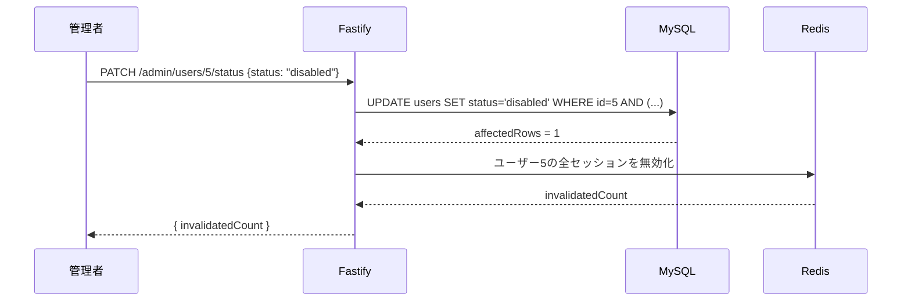

# Admin & User Management

*[English version here](Admin-User-Management.md)*

管理者が全アカウントを閲覧し、ロールの昇格/降格、アカウントの有効化/無効化を行える機能です — UIの`/admin/users`から、またはAPIに直接アクセスして操作できます。

## ロールとアカウント状態

`users`テーブル上の独立した2つのフィールド:

| フィールド | 値 | 意味 |
|---|---|---|
| `role` | `admin` \| `member` | `admin`は`/admin/users`と`/admin/*` APIにアクセスできる。`member`は一般ユーザー |
| `status` | `active` \| `disabled` | `disabled`のアカウントはログインできず、既存の全セッションが強制終了される |

どちらも管理者UI([`AdminUserList.tsx`](https://github.com/NAKANO8/todo_app/blob/main/todo-web/features/admin/AdminUserList.tsx))から確認・変更できます:

- **ロールを変更するボタン** — 管理者 / 一般ユーザーを切り替える
- **無効化 / 再有効化ボタン** — アカウントを無効化・再有効化する

## 最初の管理者を作る

**adminを作成するAPIエンドポイントやUI操作は存在しません** — 登録は常に`member`を作成し([Authentication & Sessions](Authentication-and-Sessions.ja.md#登録register)参照)、他の誰かを昇格できるのは既存の管理者だけです。最初の管理者は、データベースに直接作成する必要があります:

```sql
UPDATE users SET role = 'admin' WHERE email = 'you@example.com';
```

これは環境(まっさらなdev DB、ステージング、本番)ごとに、そのユーザーが通常通り登録した直後に1回だけ行います。

## 「最後の有効な管理者」不変条件

**唯一残っている有効な管理者を降格・無効化することは絶対にできません。** これは、ミス(あるいはバグ)によって誰も`/admin/users`にアクセスできなくなり、後戻りできなくなる事態を防ぐための仕組みです。

これを試みると、`PATCH /admin/users/:userId/role`と`PATCH /admin/users/:userId/status`のどちらからも`409`が返り、UI側は日本語のトーストとして表示します: *「唯一の有効な管理者のため、この操作はできません」*。

### 不変条件がどう強制されているか

これは(チェックしてから更新する、というアプリケーションコード側の処理では**ありません** — それだとチェックと書き込みの間に競合状態が生まれます)。`UPDATE`文の`WHERE`句自体に組み込まれており、データベースがアトミックに強制します([`auth.repository.ts`](https://github.com/NAKANO8/todo_app/blob/main/todo-api/src/repositories/auth.repository.ts)):

```sql
UPDATE users
SET status = ?, updated_at = NOW()
WHERE id = ?
  AND (? = 'active' OR EXISTS (
    SELECT 1 FROM (
      SELECT id FROM users WHERE role = 'admin' AND status = 'active' AND id <> ?
    ) AS other_active_admins
  ))
```

読み方: *再有効化は常に許可。無効化は、対象**以外**の有効な管理者がまだ存在する場合のみ許可。* `updateRole`も`role`に対して全く同じパターンです。

この`WHERE`句にマッチしなければ、`affectedRows`は`0`になります。サービス層([`adminUser.service.ts`](https://github.com/NAKANO8/todo_app/blob/main/todo-api/src/services/adminUser.service.ts))は、その後に**失敗の原因を分類するためだけの**追加の問い合わせを1回行います。結果を左右するためではありません:

- 対象が全く存在しない → `404`
- 対象は存在する(つまり`affectedRows = 0`は不変条件によって阻止されたことを意味する) → `409`

これは意図的な設計です: 不変条件のチェック自体は、書き込みと同じアトミックな文の中にあるため決して競合しません。追加の問い合わせは、より良いエラーメッセージを作るためだけのものであり、それ自体が誤った更新を引き起こすことはありません。

**なぜ`EXISTS`を派生テーブルでラップしているのか?** MySQLは、更新対象のテーブルを`FROM`句のサブクエリで直接参照することを拒否します(`ERROR 1093`)。`EXISTS`サブクエリをネストした`SELECT`(派生テーブル)でラップすることで、チェック内容自体を変えずにこの制約を回避しています。

**この不変条件は「誰が要求したか」を区別しません。** 管理者が自分自身に対して行っても、他の管理者に対して行っても、同じ`WHERE`句が適用されます — このチェックには自己ターゲット時の特別扱いはありません(自己ターゲットの特別扱いは別の箇所にあります — 下記参照)。

## アカウントの無効化

`PATCH /admin/users/:userId/status`に`{ "status": "disabled" }`を送ると、順に2つのことが起きます:

1. 上記の不変条件に従って行を更新
2. 対象ユーザーが持つ**アクティブな全セッションを即座に無効化**する — `SessionService.invalidateUserSessions`経由([Authentication & Sessions](Authentication-and-Sessions.ja.md#強制セッション無効化管理者の機能)参照)。これは任意でも遅延でもありません: 無効化されたユーザーは、今後のログインが防がれるだけでなく、数秒以内にあらゆる場所からログアウトされます。



状態の更新自体が成功した後にセッション無効化が例外を投げた場合(例: Redisに接続できない)、**状態の変更はロールバックされません** — アカウントはMySQL上では`disabled`のままになり、古いセッションは期限切れになるか操作がリトライされるまでRedis上で生き続ける可能性があります。これは設計上意図されたトレードオフです: 無関係なインフラの不調によってアカウントが黙って有効なままになるより、無効化はされたがログアウトが完全ではないアカウントの方が安全だと判断されています。

**自分自身を無効化する場合:** 管理者が自分自身のアカウントを無効化すると、[Authentication & Sessions](Authentication-and-Sessions.ja.md#強制セッション無効化管理者の機能)で説明したのと同じ自己ターゲット問題が起きます — コントローラーは明示的に`req.session.destroy()`を呼び、`@fastify/session`の自動保存によって今のリクエストのセッションが黙って復活しないようにしています。

## 認可: `adminOnlyGuard`

`/admin/*`の全てのルート(`admin.session.route.ts`と`admin.user.route.ts`のどちらも)は、1つの`preHandler`フックを共有しています: [`adminOnlyGuard`](https://github.com/NAKANO8/todo_app/blob/main/todo-api/src/guards/adminOnly.ts)。

```
セッションなし              → 401 Unauthorized
セッションあり、role != admin → 403 Forbidden
セッションあり、role == admin → リクエストを続行
```

各ルートプラグイン関数の**内側**で`app.addHook("preHandler", adminOnlyGuard)`として登録されています — Fastifyのカプセル化により、このフックは同じプラグインスコープに登録されたルートにしか効かないため、`/todos`や`/auth/*`に誤って漏れ出すことは決してありません。

フロントエンド側の`middleware.ts`にある`/admin`ゲート(非管理者を`/todos`へリダイレクトする)はUXのためだけのものです — `adminOnlyGuard`こそが実際の認可の境界です。[Architecture](Architecture.ja.md#認可の原則)を参照してください。

## 管理者に表示されるエラーメッセージ

生のAPIエラー(`{"message": "cannot change the last remaining active admin"}`、英語、`AppError`由来)がそのまま表示されることはありません。[`AdminUserList.tsx`](https://github.com/NAKANO8/todo_app/blob/main/todo-web/features/admin/AdminUserList.tsx)が、ロール変更・状態変更どちらの操作についても、HTTPステータスを日本語メッセージにマッピングします:

| ステータス | 表示されるトースト |
|---|---|
| `409` | 唯一の有効な管理者のため、この操作はできません |
| `404` | 対象のユーザーが見つかりませんでした |
| その他 | 汎用フォールバック(例:「ロールの変更に失敗しました」) |

`AdminUserService`に新しい失敗パターンを追加する場合は、`toAdminActionErrorMessage`にも対応するcaseを追加してください — 追加しないと、黙って汎用メッセージにフォールバックしてしまいます。
