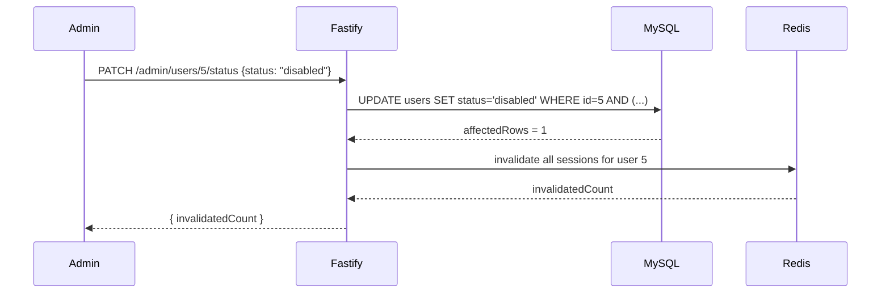

# Admin & User Management

*[日本語版はこちら](Admin-User-Management.ja.md)*

Lets an admin see every account, promote/demote roles, and enable/disable accounts — from `/admin/users` in the UI or directly against the API.

## Roles and account status

Two independent fields on `users`:

| Field | Values | Meaning |
|---|---|---|
| `role` | `admin` \| `member` | `admin` can access `/admin/users` and the `/admin/*` API; `member` is a regular user |
| `status` | `active` \| `disabled` | `disabled` accounts can't log in and have all existing sessions killed |

Both are visible and editable from the admin UI ([`AdminUserList.tsx`](https://github.com/NAKANO8/todo_app/blob/main/todo-web/features/admin/AdminUserList.tsx)):

- **ロールを変更 (role toggle button)** — flips between 管理者 (admin) / 一般ユーザー (member)
- **無効化 / 再有効化 (status toggle button)** — disables or re-enables the account

## Promoting the first admin

There is **no API endpoint or UI action that creates an admin** — registration always creates a `member` (see [Authentication & Sessions](Authentication-and-Sessions#register)), and only an existing admin can promote someone else. The first admin has to be created directly in the database:

```sql
UPDATE users SET role = 'admin' WHERE email = 'you@example.com';
```

Do this once per environment (fresh dev DB, staging, prod) right after that user registers normally.

## The "last active admin" invariant

**You can never demote or disable the only remaining active admin.** This is enforced so a mistake (or bug) can never lock every admin out of `/admin/users` with no way back in.

Attempting to do so returns `409` from both `PATCH /admin/users/:userId/role` and `PATCH /admin/users/:userId/status`, which the UI surfaces as a Japanese toast: *「唯一の有効な管理者のため、この操作はできません」* ("This operation isn't allowed because this is the only remaining active admin").

### How the invariant is enforced

This is **not** a check-then-update in application code (which would have a race condition between the check and the write). It's built directly into the `UPDATE` statement's `WHERE` clause, so the database enforces it atomically ([`auth.repository.ts`](https://github.com/NAKANO8/todo_app/blob/main/todo-api/src/repositories/auth.repository.ts)):

```sql
UPDATE users
SET status = ?, updated_at = NOW()
WHERE id = ?
  AND (? = 'active' OR EXISTS (
    SELECT 1 FROM (
      SELECT id FROM users WHERE role = 'admin' AND status = 'active' AND id <> ?
    ) AS other_active_admins
  ))
```

Read as: *re-activating is always allowed; disabling is only allowed if some **other** active admin still exists.* `updateRole` follows the identical pattern for `role`.

If the row doesn't match this `WHERE` clause, `affectedRows` comes back `0`. The service layer ([`adminUser.service.ts`](https://github.com/NAKANO8/todo_app/blob/main/todo-api/src/services/adminUser.service.ts)) then does one extra lookup **only to classify the failure**, never to decide the outcome:

- Target doesn't exist at all → `404`
- Target exists (so `affectedRows = 0` must mean the invariant blocked it) → `409`

This is deliberate: the invariant check itself never races, because it's inside the same atomic statement as the write. The follow-up lookup is purely for producing a better error message and cannot itself cause an incorrect update.

**Why a derived-table wrapper around `EXISTS`?** MySQL rejects a subquery that references the same table being updated directly in `FROM` (`ERROR 1093`). Wrapping the `EXISTS` subquery in a nested `SELECT` (a derived table) sidesteps this restriction without changing what's being checked.

**The invariant doesn't care who's asking.** Whether an admin does this to themselves or to another admin, the same `WHERE` clause applies — there's no special-case for self-targeting in this check (there *is* a special case for self-targeting elsewhere — see below).

## Disabling an account

`PATCH /admin/users/:userId/status` with `{ "status": "disabled" }` does two things in sequence:

1. Updates the row (subject to the invariant above)
2. **Immediately invalidates every active session** the target user has — via `SessionService.invalidateUserSessions` (see [Authentication & Sessions](Authentication-and-Sessions#forced-session-invalidation-admin-capability)). This is not optional or delayed: a disabled user is logged out everywhere within seconds, not just prevented from *future* logins.



If the status update succeeds but session invalidation then throws (e.g. Redis is unreachable), **the status change is not rolled back** — the account is left `disabled` in MySQL even though old sessions may still be live in Redis until they expire or the operation is retried. This is an intentional trade-off documented in the design: a disabled-but-not-fully-logged-out account is judged safer than silently leaving an account enabled because of an unrelated infrastructure hiccup.

**Self-disable:** if an admin disables their own account, the same self-targeting problem described in [Authentication & Sessions](Authentication-and-Sessions#forced-session-invalidation-admin-capability) applies — the controller explicitly calls `req.session.destroy()` so the current request's own session doesn't get silently resurrected by `@fastify/session`'s auto-save.

## Authorization: `adminOnlyGuard`

Every `/admin/*` route (both `admin.session.route.ts` and `admin.user.route.ts`) shares one `preHandler` hook: [`adminOnlyGuard`](https://github.com/NAKANO8/todo_app/blob/main/todo-api/src/guards/adminOnly.ts).

```
no session          → 401 Unauthorized
session, role != admin → 403 Forbidden
session, role == admin → request proceeds
```

Registered via `app.addHook("preHandler", adminOnlyGuard)` **inside** each route plugin function — Fastify's encapsulation means this hook only applies to routes registered in that same plugin scope, so it can never accidentally leak onto `/todos` or `/auth/*`.

The frontend's own `/admin` gate in `middleware.ts` (redirects non-admins to `/todos`) is UX only — `adminOnlyGuard` is the actual authorization boundary. See [Architecture](Architecture#authorization-principle).

## Error messages shown to the admin

The raw API error (`{"message": "cannot change the last remaining active admin"}`, English, from `AppError`) is never shown as-is. [`AdminUserList.tsx`](https://github.com/NAKANO8/todo_app/blob/main/todo-web/features/admin/AdminUserList.tsx) maps HTTP status to a Japanese message for both role and status actions:

| Status | Toast shown |
|---|---|
| `409` | 唯一の有効な管理者のため、この操作はできません |
| `404` | 対象のユーザーが見つかりませんでした |
| other | generic fallback (e.g. 「ロールの変更に失敗しました」) |

If you add a new failure mode to `AdminUserService`, make sure to add a matching case in `toAdminActionErrorMessage` — otherwise it silently falls through to the generic message.
