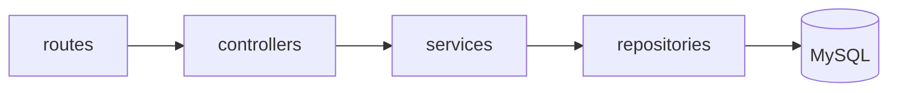
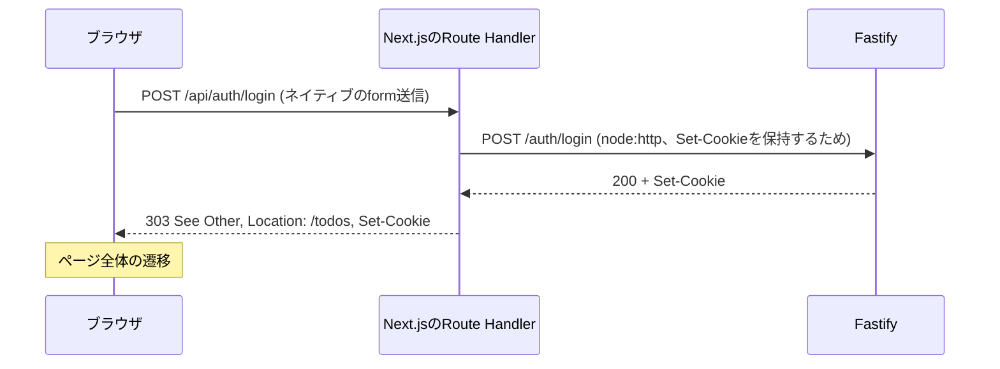
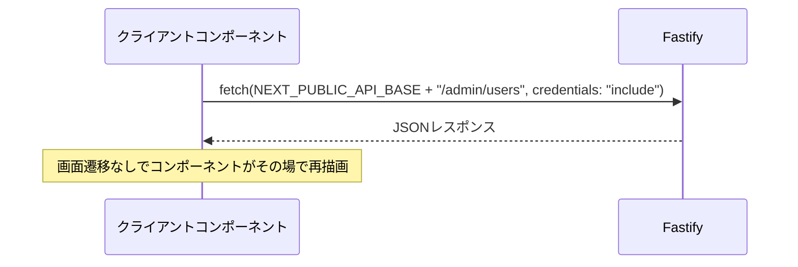
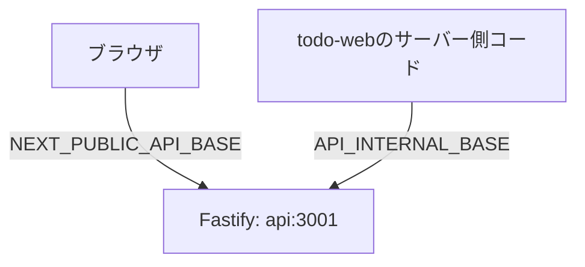

# Architecture

*[English version here](Architecture.md)*

`todo-web`(Next.js 16)と`todo-api`(Fastify 5)がどう通信しているか、そしてなぜそれぞれの呼び出しがその経路を通るのかをまとめます。

## パッケージ構成

pnpm workspacesによるモノレポで、2つの独立したパッケージから成ります:

- **[`todo-api`](https://github.com/NAKANO8/todo_app/tree/main/todo-api)** — Fastify製のREST API。`routes` → `controllers` → `services` → `repositories` → MySQLのレイヤー構成。セッション認証は`@fastify/session` + `@fastify/cookie`、バックエンドはRedis。
- **[`todo-web`](https://github.com/NAKANO8/todo_app/tree/main/todo-web)** — Next.js App Routerのフロントエンド。



| レイヤー | ディレクトリ | 役割 |
|---|---|---|
| ルート | `routes/` | スキーマ検証(AJV)と`preHandler`フック(認証ガード)の登録。処理自体はコントローラーに委譲 |
| コントローラー | `controllers/` | リクエストの解析、サービスの呼び出し、レスポンスの整形のみ — ビジネスロジックも認証ロジックも持たない |
| サービス | `services/` | ビジネスルール(例: 「最後の有効な管理者」保護)、エラーハンドリング |
| リポジトリ | `repositories/` | `mysql2`による生SQL — `users`/`todos`テーブルに直接触れる唯一のレイヤー |

## 3つの通信パターン

`todo-web`から`todo-api`への到達方法は1種類ではありません。どの経路を使うかは、その操作の後にページ全体が遷移してよいかどうかで決まります。

**判断基準:** 操作後にページ遷移してよい(むしろそれが自然な)場合はネイティブのHTML `<form>`を使います。ページ遷移が不適切(同じページに留まり、一覧だけがその場で更新されてほしい)場合は、クライアントコンポーネントから直接`fetch`します。

### 1. 認証系の操作(ログイン/登録/ログアウト)— `<form>` → Next.jsのRoute Handler(BFFプロキシ)

ログイン・登録・ログアウトはいずれも`fetch`ではなく、本物の`<form action="..." method="POST">`を使います。ここではページ遷移が起きること自体が正しい挙動(ログイン成功後は`/todos`へ、ログアウト後は`/login`へ)なので、クライアントサイドのJSでブラウザの標準動作を無理に置き換える必要がありません。



Next.jsはグローバルの`fetch`にパッチを当てており、レスポンスから`Set-Cookie`を取り除いてしまいます。そのため、login/logoutのRoute Handlerは`fetch`ではなくあえて`node:http`を直接使い、生の`Set-Cookie`ヘッダーをブラウザまで届けています。登録(register)は`Set-Cookie`を受け取らない(登録後の自動ログインはなく、`/login`へリダイレクトするだけ)ため、素の`fetch`を使います。

関連ファイル: [`LoginForm.tsx`](https://github.com/NAKANO8/todo_app/blob/main/todo-web/features/auth/LoginForm.tsx)、[`app/api/auth/login/route.ts`](https://github.com/NAKANO8/todo_app/blob/main/todo-web/app/api/auth/login/route.ts)、[`app/api/auth/register/route.ts`](https://github.com/NAKANO8/todo_app/blob/main/todo-web/app/api/auth/register/route.ts)、[`app/api/auth/logout/route.ts`](https://github.com/NAKANO8/todo_app/blob/main/todo-web/app/api/auth/logout/route.ts)

### 2. ページ内でのデータ操作(todos、admin users)— ブラウザからFastifyへ直接`fetch`

Todoの一覧表示・作成・更新、およびユーザー一覧表示・ロール変更・アカウント状態変更は、いずれもページのリロードなしに行われます — コンポーネントがその場で新しい状態を反映して再描画するだけです。Next.jsのプロキシを挟まず、ブラウザから直接Fastifyへ向かいます:



関連ファイル: [`lib/api/todos.ts`](https://github.com/NAKANO8/todo_app/blob/main/todo-web/lib/api/todos.ts)、[`lib/api/adminUsers.ts`](https://github.com/NAKANO8/todo_app/blob/main/todo-web/lib/api/adminUsers.ts)。CORS設定は[`todo-api/src/app.ts`](https://github.com/NAKANO8/todo_app/blob/main/todo-api/src/app.ts)(`origin: CORS_ORIGIN`、`credentials: true`)。

### 3. 全リクエストでの認証ゲート — Next.jsのmiddlewareがFastifyをサーバー間で呼び出す

(ほぼ)すべてのページ描画の前に、[`todo-web/middleware.ts`](https://github.com/NAKANO8/todo_app/blob/main/todo-web/middleware.ts)がサーバーサイドで`GET /auth/me`をFastifyに呼び出し、セッションが有効かどうか、そして(admin機能以降は)どのロールかを確認します。

```mermaid
flowchart TD
    A[todo-webへのリクエスト] --> B[middleware.ts]
    B --> C{sessionIdのキャッシュあり?}
    C -->|あり、3秒以内| D[キャッシュ済みのok/roleを使用]
    C -->|なし| E[API_INTERNAL_BASE経由でGET /auth/me]
    E --> D
    D --> F{認証済み?}
    F -->|いいえ| G[/loginへリダイレクト]
    F -->|はい| H{非管理者が/adminパスへ?}
    H -->|はい| I[/todosへリダイレクト]
    H -->|いいえ| J[NextResponse.next]
```

3秒のキャッシュは、強制的に無効化されたセッション(詳細は[Admin & User Management](Admin-User-Management.ja.md)参照)がmiddleware上で有効と見なされ続ける時間を短く抑えつつ、リクエストのたびにFastifyへ問い合わせる負荷を避けるためのものです。

**このmiddlewareのチェックはあくまでUX上の便宜であり、認可の権威的な判定ではありません。** ブラウザで`/admin/users`から`/todos`へリダイレクトされた非管理者でも、理屈の上ではAPIを直接呼び出すことができます — それを拒否するのは実際のルートに付いている`preHandler`フックである`adminOnlyGuard`であり、これが本当の、権威的なチェックです。[`todo-api/src/guards/adminOnly.ts`](https://github.com/NAKANO8/todo_app/blob/main/todo-api/src/guards/adminOnly.ts)を参照してください。

## この分割を支える環境変数

| 変数 | 使用箇所 | 参照先 | 理由 |
|---|---|---|---|
| `NEXT_PUBLIC_API_BASE` | ブラウザ(クライアントコンポーネント、経路2) | **ブラウザから見た**Fastifyのアドレス(devでは`http://localhost:3001`) | クライアントバンドルに焼き込まれるため、ブラウザが実際に動く場所から到達可能である必要がある |
| `API_INTERNAL_BASE` | Next.jsのサーバー側コード(middleware、`/api/auth/*`のRoute Handler、経路1と3) | **`web`コンテナ内部から見た**Fastifyのアドレス(Docker ComposeのサービスDNSで`http://api:3001`) | サーバー間の呼び出しはComposeネットワークの外に出ない |



## 認可の原則

クライアントが提供する状態(ブラウザで読めるCookie、`middleware.ts`がキャッシュしているrole、Reactのstateにある何か)は、決して権威的なものとして扱われません。特権を伴う操作はすべて、それが実際に問題になる場所でサーバーサイドが再チェックします:

- セッションの有効性: Redisバックエンドのセッションストアに対して、`GET /auth/me`経由でチェック
- 管理者専用の操作: `adminOnlyGuard`のpreHandlerが、フロントエンドが既に何を判断していたかに関わらず、リクエストのたびに再チェック

ディレクトリ構成・命名規則の全体像は[`.kiro/steering/structure.md`](https://github.com/NAKANO8/todo_app/blob/main/.kiro/steering/structure.md)を参照してください。
