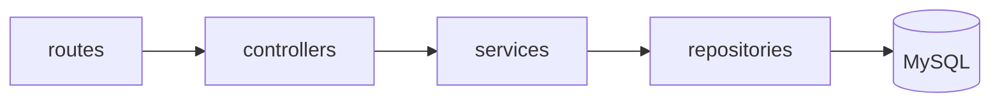
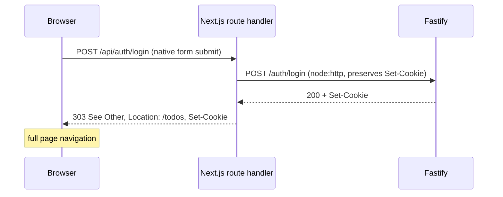
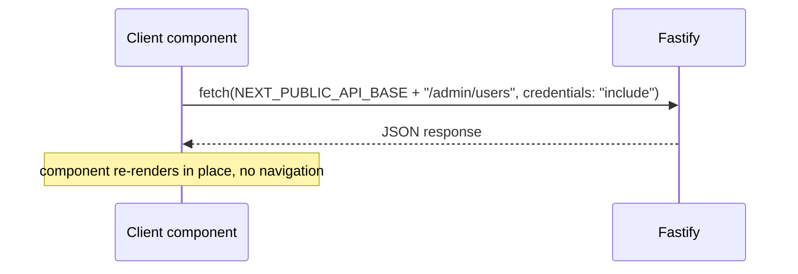
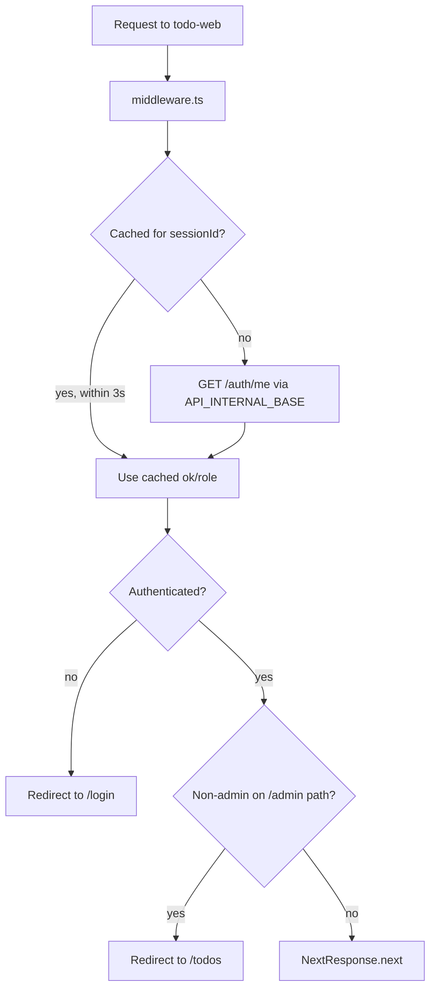
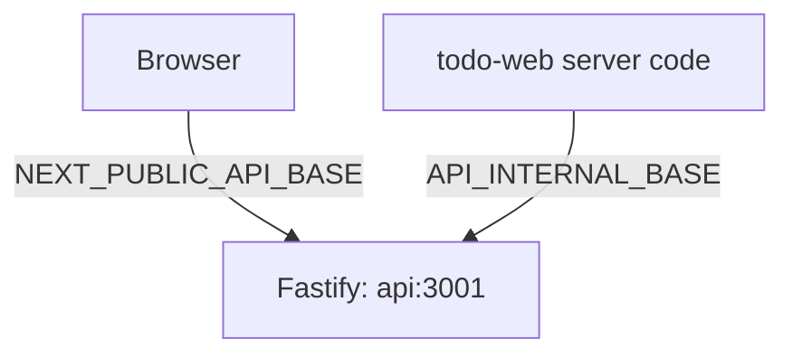

# Architecture

*[日本語版はこちら](Architecture.ja.md)*

How `todo-web` (Next.js 16) and `todo-api` (Fastify 5) talk to each other, and why each call takes the path it does.

## Packages

Monorepo, two independent pnpm-workspace packages:

- **[`todo-api`](https://github.com/NAKANO8/todo_app/tree/main/todo-api)** — Fastify REST API. Layered: `routes` → `controllers` → `services` → `repositories` → MySQL. Session auth via `@fastify/session` + `@fastify/cookie`, backed by Redis.
- **[`todo-web`](https://github.com/NAKANO8/todo_app/tree/main/todo-web)** — Next.js App Router frontend.

| Layer | Directory | Role |
|---|---|---|
| Routes | `routes/` | Schema validation (AJV) + `preHandler` hooks (auth guards); delegates to controllers |
| Controllers | `controllers/` | Parse request, call service, shape response — no business logic, no auth logic |
| Services | `services/` | Business rules (e.g. "last active admin" protection), error handling |
| Repositories | `repositories/` | Raw SQL via `mysql2` — the only layer that touches `users`/`todos` directly |

## Three communication paths

There isn't one single way `todo-web` reaches `todo-api` — which path is used depends on whether a full page transition is acceptable for that action.

**Rule of thumb:** if a page transition is fine (or expected) after the action, use a native HTML `<form>`. If a page transition would be bad UX (the user should stay on the same page and just see the list update), use `fetch` directly from a client component.

### 1. Auth mutations (login / register / logout) — `<form>` → Next.js route handler (BFF proxy)

Login, register, and logout all use a real `<form action="..." method="POST">`, not `fetch`. A page transition is exactly what should happen here (successful login should land you on `/todos`, logout should land you back on `/login`), so there's no reason to fight the browser's default behavior with client-side JS.

Next.js patches the global `fetch` and strips `Set-Cookie` from the response, so the login/logout route handlers use `node:http` directly instead of `fetch`, specifically to get the raw `Set-Cookie` header through to the browser. Register doesn't receive a `Set-Cookie` (no auto-login after registering — it redirects to `/login`), so it uses plain `fetch`.

Files: [`LoginForm.tsx`](https://github.com/NAKANO8/todo_app/blob/main/todo-web/features/auth/LoginForm.tsx), [`app/api/auth/login/route.ts`](https://github.com/NAKANO8/todo_app/blob/main/todo-web/app/api/auth/login/route.ts), [`app/api/auth/register/route.ts`](https://github.com/NAKANO8/todo_app/blob/main/todo-web/app/api/auth/register/route.ts), [`app/api/auth/logout/route.ts`](https://github.com/NAKANO8/todo_app/blob/main/todo-web/app/api/auth/logout/route.ts)

### 2. In-page data operations (todos, admin users) — direct `fetch` from the browser to Fastify

Listing/creating/updating todos, and listing users / changing role / changing account status, all happen without a page reload — the component just re-renders with new state. These go straight from the browser to Fastify, no Next.js proxy in between:

Files: [`lib/api/todos.ts`](https://github.com/NAKANO8/todo_app/blob/main/todo-web/lib/api/todos.ts), [`lib/api/adminUsers.ts`](https://github.com/NAKANO8/todo_app/blob/main/todo-web/lib/api/adminUsers.ts). CORS is configured in [`todo-api/src/app.ts`](https://github.com/NAKANO8/todo_app/blob/main/todo-api/src/app.ts) (`origin: CORS_ORIGIN`, `credentials: true`).

### 3. Auth gate on every request — Next.js middleware calling Fastify server-to-server

Before rendering (almost) any page, [`todo-web/middleware.ts`](https://github.com/NAKANO8/todo_app/blob/main/todo-web/middleware.ts) calls `GET /auth/me` on Fastify server-side to check whether the session is valid and, since the admin feature, what role it has.

The 3-second cache bounds how long a forcibly-invalidated session (see [Admin & User Management](Admin-User-Management)) stays valid in the middleware's eyes, without hammering Fastify on every request.

**This middleware check is a UX convenience only, not the authorization boundary.** A non-admin redirected away from `/admin/users` in the browser could still, in principle, call the API directly — that's rejected by `adminOnlyGuard`, a `preHandler` hook on the actual routes, which is the real, authoritative check. See [`todo-api/src/guards/adminOnly.ts`](https://github.com/NAKANO8/todo_app/blob/main/todo-api/src/guards/adminOnly.ts).

## Environment variables driving the split

| Variable | Used by | Points to | Why |
|---|---|---|---|
| `NEXT_PUBLIC_API_BASE` | Browser (client components, path 2) | Fastify's address as seen **from the host/browser** (`http://localhost:3001` in dev) | Baked into the client bundle; must be reachable from wherever the browser actually runs |
| `API_INTERNAL_BASE` | Next.js server code (middleware, `/api/auth/*` route handlers, paths 1 and 3) | Fastify's address **from inside the `web` container** (`http://api:3001` via Docker Compose service DNS) | Server-to-server call never leaves the Compose network |

## Authorization principle

Client-supplied state (cookies read in the browser, role cached in `middleware.ts`, anything in React state) is never treated as authoritative. Every privileged action is re-checked server-side at the point it matters:

- Session validity: checked via `GET /auth/me` against the Redis-backed session store
- Admin-only actions: `adminOnlyGuard` preHandler, re-checked on every request regardless of what the frontend already decided

See [`.kiro/steering/structure.md`](https://github.com/NAKANO8/todo_app/blob/main/.kiro/steering/structure.md) for the full directory layout and naming conventions.
