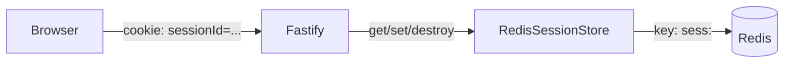

# Authentication & Sessions

*[日本語版はこちら](Authentication-and-Sessions.ja.md)*

How registration, login, logout, and session validity actually work — and how an admin can forcibly end a user's sessions.

## Register

`POST /auth/register` ([`auth.route.ts`](https://github.com/NAKANO8/todo_app/blob/main/todo-api/src/routes/auth.route.ts), [`auth.service.ts`](https://github.com/NAKANO8/todo_app/blob/main/todo-api/src/services/auth.service.ts))

- Body: `{ email, password }` — validated by JSON Schema before the handler runs (see [API Reference](API-Reference#validation-rules) for the exact pattern)
- Rejects if the email is already registered (`400`)
- Password is hashed with `bcrypt` (cost factor 10) — never stored in plaintext
- New accounts are always created with `role = "member"`, `status = "active"` — there is no way to self-register as admin (see [Admin & User Management](Admin-User-Management#promoting-the-first-admin))
- No session is created on register — the frontend redirects to `/login` afterward, it does not auto-login

**Why `role` can't be smuggled in:** the request schema sets `additionalProperties: false` and only declares `email`/`password`. Fastify 5's AJV defaults to `removeAdditional: true`, so a `role: "admin"` field in the request body is **silently stripped**, not rejected — the request still succeeds as a normal member registration. Don't assume a `400` here if you're testing this.

## Login

`POST /auth/login`

- Looks up the user by email, compares password with `bcrypt.compare`
- Wrong email *or* wrong password both return the same `401 invalid credentials` — intentionally not distinguished, so a failed attempt can't be used to enumerate which emails are registered
- If credentials are correct but the account `status = "disabled"`, returns `403 account disabled` — this check happens *after* password verification, so it only reveals disabled-status to someone who already knows the correct password. This is an accepted UX/security trade-off, not a bug.
- On success: `req.session.userId` is set, and the new `sessionId` is recorded in the user's session index (see [Forced session invalidation](#forced-session-invalidation) below) via `SessionRepository.trackSession`

## Logout

`POST /auth/logout` — untracks the session from the user's session index, destroys the session server-side, and clears the `sessionId` cookie. Safe to call when not logged in (`200 not logged in`).

## `GET /auth/me`

The single source of truth for "am I logged in, and as what role" — called by:
- `todo-web/middleware.ts` on (almost) every page request (see [Architecture](Architecture#3-auth-gate-on-every-request--nextjs-middleware-calling-fastify-server-to-server))
- `lib/api/auth.ts` (`fetchMe`) from client components that need the current user

Returns `{ id, email, role }` on `200`, or `401` if there's no valid session.

## How a session is stored

Sessions are **not** in-memory (the `@fastify/session` default) — they're backed by Redis, via a small custom store: [`RedisSessionStore`](https://github.com/NAKANO8/todo_app/blob/main/todo-api/src/session/redisSessionStore.ts).



**Why a custom store instead of an existing package?** The candidates were checked and rejected for maintenance risk:
- `fastify-session-redis-store` — only 3 published versions, last updated mid-2024, 2 GitHub stars
- `@mgcrea/fastify-session-redis-store` — built for a different fork of the session plugin (`@mgcrea/fastify-session`), incompatible with the official `@fastify/session` this project uses; last updated 4 years ago
- `connect-redis` — peer-depends on `express-session` since v7, not compatible with `@fastify/session`

The `Store` contract itself is thin (just `get`/`set`/`destroy`), so a ~60-line wrapper around the officially-maintained `@fastify/redis` client was judged lower-risk than depending on an unmaintained adapter.

**No TTL is set at the store level** — a session lives in Redis until explicitly destroyed (logout, forced invalidation, or cookie `maxAge` expiry on the client side).

## Cookie configuration

Set in [`app.ts`](https://github.com/NAKANO8/todo_app/blob/main/todo-api/src/app.ts):

| Setting | Value | Why |
|---|---|---|
| `httpOnly` | `true` | Not readable from client-side JS |
| `sameSite` | `"lax"` | CSRF mitigation while still allowing top-level navigation (e.g. following a link) to send the cookie |
| `secure` | `process.env.COOKIE_SECURE === "true"` | HTTPS-only in production |
| `domain` | `process.env.COOKIE_DOMAIN` | Set explicitly in prod so the cookie is scoped correctly behind the reverse proxy |

Fastify's `trustProxy` is set to the Cloudflare IP ranges plus the Docker internal network (`172.16.0.0/12`), so `X-Forwarded-Proto: https` from the `web` container (behind Cloudflare in prod) is trusted when deciding whether the connection counts as secure.

## Forced session invalidation (admin capability)

`DELETE /admin/sessions/:userId` ([`admin.session.route.ts`](https://github.com/NAKANO8/todo_app/blob/main/todo-api/src/routes/admin.session.route.ts)) lets an admin immediately end **all** active sessions for a given user — used both as a standalone action and automatically whenever an admin disables an account (see [Admin & User Management](Admin-User-Management#disabling-an-account)).

Because `@fastify/session`'s built-in sessions can only be looked up by `sessionId`, there's a separate reverse index — `userId → sessionId set` — maintained in Redis by [`SessionRepository`](https://github.com/NAKANO8/todo_app/blob/main/todo-api/src/repositories/session.repository.ts) (key: `user-sessions:<userId>`, a Redis Set). Login adds to this index; logout removes from it.

```mermaid
sequenceDiagram
    participant Admin
    participant API as Fastify
    participant Idx as user-sessions:&lt;userId&gt; (Redis Set)
    participant Store as sess:&lt;sessionId&gt; (Redis)

    Admin->>API: DELETE /admin/sessions/:userId
    API->>Idx: SMEMBERS user-sessions:userId
    Idx-->>API: [sessionId1, sessionId2, ...]
    loop each sessionId
        API->>Store: DEL sess:sessionId
    end
    API->>Idx: DEL user-sessions:userId
    API-->>Admin: { invalidatedCount: N }
```

**Self-targeting edge case:** if an admin invalidates *their own* sessions (or disables their own account), the Redis-side session data is destroyed, but `@fastify/session` still thinks the current request's `req.session` is valid and will re-save it when the response is sent (its `onSend` hook auto-persists the session by default). Without intervention, this would resurrect the very session that was just deleted. Both [`AdminSessionController.invalidate`](https://github.com/NAKANO8/todo_app/blob/main/todo-api/src/controllers/admin.session.controller.ts) and [`AdminUserController.changeStatus`](https://github.com/NAKANO8/todo_app/blob/main/todo-api/src/controllers/adminUser.controller.ts) explicitly call `req.session.destroy()` when the target is the requester themself, which sets `request.session = null` and suppresses the auto re-save.

The middleware-side auth cache (3s TTL, see [Architecture](Architecture)) is short specifically so a forced invalidation takes effect within a few seconds rather than the default 30s.
