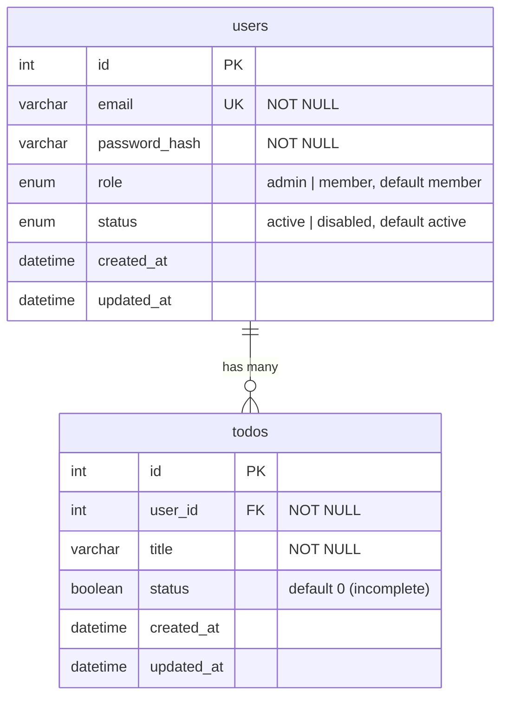

# Database Schema

*[English version here](Database-Schema.md)*

`todo-api`が使うMySQLスキーマです。正とするソースは[`mysql/init.sql`](https://github.com/NAKANO8/todo_app/blob/main/mysql/init.sql)。

## ER図



## テーブル

### `users`

| カラム | 型 | 制約 | 備考 |
|---|---|---|---|
| `id` | `INT` | `PRIMARY KEY`, `AUTO_INCREMENT` | |
| `email` | `VARCHAR(255)` | `NOT NULL`, `UNIQUE` | ログインID |
| `password_hash` | `VARCHAR(255)` | `NOT NULL` | `bcrypt`ハッシュ、平文は決して保存しない |
| `role` | `ENUM('admin','member')` | `NOT NULL`, デフォルト`'member'` | [Admin & User Management](Admin-User-Management.ja.md)参照 |
| `status` | `ENUM('active','disabled')` | `NOT NULL`, デフォルト`'active'` | `disabled`はログインを阻止し、アクティブなセッションを終了させる |
| `created_at` | `DATETIME` | デフォルト`CURRENT_TIMESTAMP` | |
| `updated_at` | `DATETIME` | デフォルト`CURRENT_TIMESTAMP`、行更新時に更新 | |

**アプリケーションコードだけでなくSQLレベルで強制される不変条件:** `role = 'admin' AND status = 'active'`の行が常に最低1件は存在しなければなりません。これは`CHECK`制約ではありません(MySQLは行をまたぐ制約をそのようには表現できないため) — `role`や`status`を変更できる2つの`UPDATE`文(`AuthRepository.updateRole` / `updateStatus`)の`WHERE`句によって強制されています。実際のSQLとその構造の理由は[Admin & User Management](Admin-User-Management.ja.md#不変条件がどう強制されているか)を参照してください。

### `todos`

| カラム | 型 | 制約 | 備考 |
|---|---|---|---|
| `id` | `INT` | `PRIMARY KEY`, `AUTO_INCREMENT` | |
| `user_id` | `INT` | `NOT NULL`, `FOREIGN KEY → users(id)` | `ON DELETE CASCADE` |
| `title` | `VARCHAR(255)` | `NOT NULL` | |
| `status` | `BOOLEAN` | `NOT NULL`, デフォルト`0` | `0`=未完了、`1`=完了 — 上記の`users.status`のenumとは無関係。カラム名が同じだけで別テーブル |
| `created_at` | `DATETIME` | デフォルト`CURRENT_TIMESTAMP` | |
| `updated_at` | `DATETIME` | デフォルト`CURRENT_TIMESTAMP`、行更新時に更新 | |

## リレーション

- **`users` 1 — N `todos`**: 各Todoは`todos.user_id`経由でちょうど1人のユーザーに属します。ユーザーを削除すると、そのユーザーの全Todoも連鎖的に削除されます(`ON DELETE CASCADE`)。現時点でプロダクトに「アカウント削除」機能はありません — このカスケードは今日ユーザーが操作できる機能があるからではなく、スキーマの整合性のために存在しています。

## セッションの状態はMySQLの外にある

ログインセッションはこのスキーマの中の**テーブルではありません** — Redis(`sess:<sessionId>`キーと`user-sessions:<userId>`の逆引き索引)に保存されています。[Authentication & Sessions](Authentication-and-Sessions.ja.md#セッションはどう保存されているか)参照。

## マイグレーションに関する注意

- **マイグレーションツールは使用していません。** `mysql/init.sql`は、空のデータベースに対してのみ一度だけ実行されます(Docker ComposeがこれをMySQLの初期化スクリプトとしてマウントしており、MySQLはデータディレクトリが最初に作られたときにのみこれを実行します)。
- (admin機能のために追加された`role`/`status`カラムのような)スキーマ変更は、既にデータが入っているデータベースには**手動で**適用する必要があります — `init.sql`は既存のテーブルを遡って変更しません。既存のdev/staging/本番データベースには、同等の`ALTER TABLE`を手動で実行してください。例:
  ```sql
  ALTER TABLE users
    ADD COLUMN role ENUM('admin','member') NOT NULL DEFAULT 'member',
    ADD COLUMN status ENUM('active','disabled') NOT NULL DEFAULT 'active';
  ```
- まっさらな環境をセットアップする場合は、`init.sql`に既にこれらのカラムが含まれているため、手動の対応は不要です。
- **スキーマ変更を加える際は**、`mysql/init.sql`とこのページを同じPR内で更新し、既存のデータベースに手動の`ALTER TABLE`が必要かどうかをここに明記してください。
