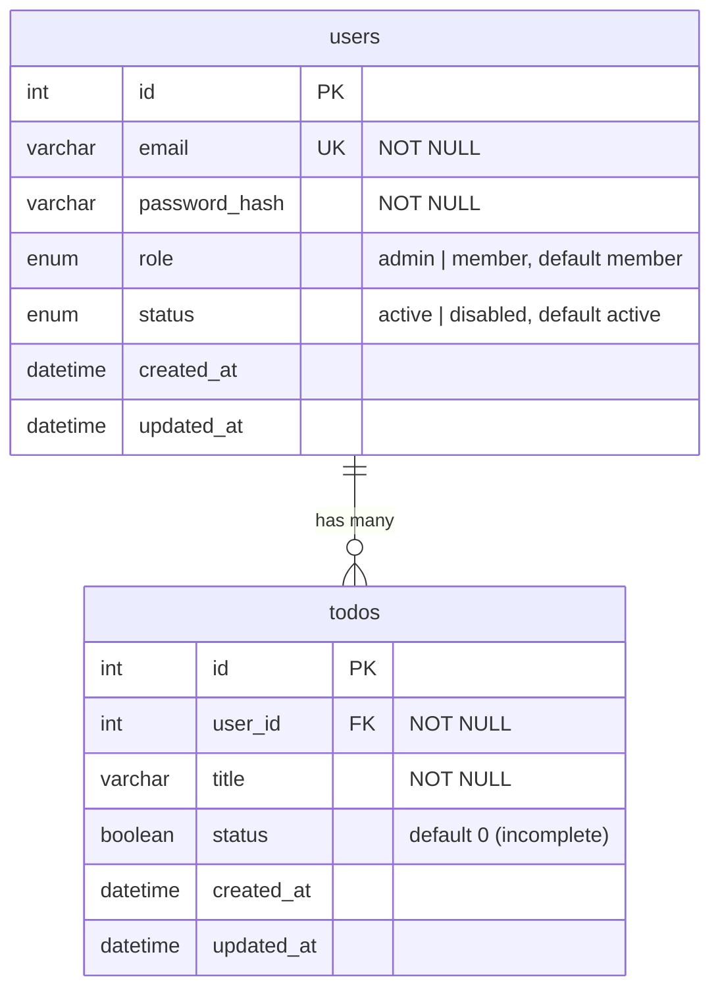

# Database Schema

*[日本語版はこちら](Database-Schema.ja.md)*

MySQL schema used by `todo-api`. Source of truth: [`mysql/init.sql`](https://github.com/NAKANO8/todo_app/blob/main/mysql/init.sql).

## ER Diagram



## Tables

### `users`

| Column | Type | Constraints | Notes |
|---|---|---|---|
| `id` | `INT` | `PRIMARY KEY`, `AUTO_INCREMENT` | |
| `email` | `VARCHAR(255)` | `NOT NULL`, `UNIQUE` | Login identifier |
| `password_hash` | `VARCHAR(255)` | `NOT NULL` | `bcrypt` hash, never plaintext |
| `role` | `ENUM('admin','member')` | `NOT NULL`, default `'member'` | See [Admin & User Management](Admin-User-Management) |
| `status` | `ENUM('active','disabled')` | `NOT NULL`, default `'active'` | `disabled` blocks login and kills active sessions |
| `created_at` | `DATETIME` | default `CURRENT_TIMESTAMP` | |
| `updated_at` | `DATETIME` | default `CURRENT_TIMESTAMP`, updates on row change | |

**Invariant enforced at the SQL level, not just in application code:** there must always be at least one row with `role = 'admin' AND status = 'active'`. This isn't a `CHECK` constraint — MySQL can't express a cross-row constraint that way — it's enforced by the `WHERE` clause of the two `UPDATE` statements that can change `role` or `status` (`AuthRepository.updateRole` / `updateStatus`). See [Admin & User Management](Admin-User-Management#how-the-invariant-is-enforced) for the actual SQL and why it's structured that way.

### `todos`

| Column | Type | Constraints | Notes |
|---|---|---|---|
| `id` | `INT` | `PRIMARY KEY`, `AUTO_INCREMENT` | |
| `user_id` | `INT` | `NOT NULL`, `FOREIGN KEY → users(id)` | `ON DELETE CASCADE` |
| `title` | `VARCHAR(255)` | `NOT NULL` | |
| `status` | `BOOLEAN` | `NOT NULL`, default `0` | `0` = incomplete, `1` = complete — unrelated to the `users.status` enum above, same column name, different table |
| `created_at` | `DATETIME` | default `CURRENT_TIMESTAMP` | |
| `updated_at` | `DATETIME` | default `CURRENT_TIMESTAMP`, updates on row change | |

## Relationships

- **`users` 1 — N `todos`**: each todo belongs to exactly one user via `todos.user_id`. Deleting a user cascades to delete all of their todos (`ON DELETE CASCADE`). There is currently no "delete account" feature in the product — this cascade exists for schema integrity, not because it's user-triggerable today.

## Session state lives outside MySQL

Login sessions are **not** a table in this schema — they're stored in Redis (`sess:<sessionId>` keys plus a `user-sessions:<userId>` reverse index). See [Authentication & Sessions](Authentication-and-Sessions#how-a-session-is-stored).

## Migration notes

- **No migration tool is in use.** `mysql/init.sql` runs once, only against an empty database (Docker Compose mounts it as a MySQL init script, which MySQL only executes when the data directory is first created).
- Schema changes (like the `role`/`status` columns added for the admin feature) must be applied **manually** to any database that already has data — `init.sql` won't retroactively alter an existing table. For an existing dev/staging/prod database, run the equivalent `ALTER TABLE` by hand, e.g.:
  ```sql
  ALTER TABLE users
    ADD COLUMN role ENUM('admin','member') NOT NULL DEFAULT 'member',
    ADD COLUMN status ENUM('active','disabled') NOT NULL DEFAULT 'active';
  ```
- If you're setting up a fresh environment, `init.sql` already includes these columns — no manual step needed.
- **When you add a schema change**, update `mysql/init.sql` *and* this page in the same PR, and call out here whether existing databases need a manual `ALTER TABLE`.
