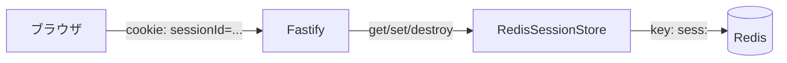
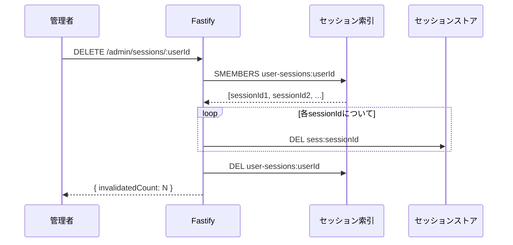

# Authentication & Sessions

*[English version here](Authentication-and-Sessions.md)*

登録・ログイン・ログアウト・セッションの有効性が実際にどう動いているか、そして管理者がユーザーのセッションを強制的に終了させる仕組みです。

## 登録(Register)

`POST /auth/register`([`auth.route.ts`](https://github.com/NAKANO8/todo_app/blob/main/todo-api/src/routes/auth.route.ts)、[`auth.service.ts`](https://github.com/NAKANO8/todo_app/blob/main/todo-api/src/services/auth.service.ts))

- ボディ: `{ email, password }` — ハンドラーが実行される前にJSON Schemaで検証される(正確なパターンは[API Reference](API-Reference.ja.md#バリデーションルール)を参照)
- メールアドレスが既に登録済みなら拒否(`400`)
- パスワードは`bcrypt`(コスト係数10)でハッシュ化 — 平文で保存されることは決してない
- 新規アカウントは常に `role = "member"`、`status = "active"` で作成される — 自己登録でadminになる方法はない([Admin & User Management](Admin-User-Management.ja.md#最初の管理者を作る)参照)
- 登録時にセッションは作られない — フロントエンドはその後`/login`へリダイレクトするだけで、自動ログインはしない

**`role`を紛れ込ませられない理由:** リクエストスキーマは `additionalProperties: false` を設定しており、`email`/`password`しか宣言していません。Fastify 5のAJVは既定で`removeAdditional: true`なので、リクエストボディに`role: "admin"`のようなフィールドがあっても**拒否されずに黙って取り除かれます** — リクエスト自体は通常のmember登録として成功します。ここで`400`が返ることを期待してテストしないよう注意してください。

## ログイン(Login)

`POST /auth/login`

- メールアドレスでユーザーを検索し、`bcrypt.compare`でパスワードを照合
- メールアドレスが間違っている場合とパスワードが間違っている場合、どちらも同じ `401 invalid credentials` を返す — どのメールアドレスが登録されているかを推測されないよう、意図的に区別していない
- 認証情報は正しいがアカウントの`status = "disabled"`の場合は `403 account disabled` を返す — このチェックはパスワード照合の**後**に行われるため、既に正しいパスワードを知っている人にしか無効化状態を明かさない。これはバグではなく、受け入れ済みのUX/セキュリティのトレードオフ
- 成功時: `req.session.userId` がセットされ、新しい`sessionId`が`SessionRepository.trackSession`によってそのユーザーのセッション索引に記録される(詳細は下記[強制セッション無効化](#強制セッション無効化管理者の機能)を参照)

## ログアウト(Logout)

`POST /auth/logout` — セッション索引からセッションを外し、サーバー側でセッションを破棄し、`sessionId` Cookieをクリアします。ログインしていない状態で呼んでも安全です(`200 not logged in`)。

## `GET /auth/me`

「自分はログインしているか、どのロールか」の唯一の情報源で、以下から呼ばれます:
- `todo-web/middleware.ts`が(ほぼ)すべてのページリクエストで呼び出す([Architecture](Architecture.ja.md#3-全リクエストでの認証ゲート--nextjsのmiddlewareがfastifyをサーバー間で呼び出す)参照)
- 現在のユーザー情報が必要なクライアントコンポーネントから`lib/api/auth.ts`(`fetchMe`)経由

`200`で`{ id, email, role }`を返し、有効なセッションがなければ`401`を返します。

## セッションはどう保存されているか

セッションは(`@fastify/session`の既定である)インメモリ**ではなく**、Redisをバックエンドにした小さな自作ストア経由で保存されます: [`RedisSessionStore`](https://github.com/NAKANO8/todo_app/blob/main/todo-api/src/session/redisSessionStore.ts)。

**なぜ既存パッケージではなく自作なのか?** 候補は保守状況の観点から検討した上で見送られています:
- `fastify-session-redis-store` — 公開バージョンは3つのみ、最終更新は2024年半ば、GitHubスターも2件
- `@mgcrea/fastify-session-redis-store` — 別フォーク系統のセッションプラグイン(`@mgcrea/fastify-session`)向けで、本プロジェクトが使う公式の`@fastify/session`とは互換性がない。最終更新も4年前
- `connect-redis` — v7以降`express-session`にpeer依存しており、`@fastify/session`とは互換しない

`Store`契約自体は薄い(`get`/`set`/`destroy`のみ)ため、公式にメンテナンスされている`@fastify/redis`クライアントの上に約60行のラッパーを書く方が、メンテされていないアダプタに依存するよりリスクが低いと判断されました。

**ストア側ではTTLを設定していません** — セッションは、明示的に破棄される(ログアウト、強制無効化、クライアント側のCookie `maxAge`の期限切れ)までRedis上に存在し続けます。

## Cookieの設定

[`app.ts`](https://github.com/NAKANO8/todo_app/blob/main/todo-api/src/app.ts)での設定:

| 設定 | 値 | 理由 |
|---|---|---|
| `httpOnly` | `true` | クライアント側JSから読めない |
| `sameSite` | `"lax"` | トップレベルナビゲーション(リンクを辿る等)ではCookieを送りつつCSRFを軽減 |
| `secure` | `process.env.COOKIE_SECURE === "true"` | 本番ではHTTPS限定 |
| `domain` | `process.env.COOKIE_DOMAIN` | 本番ではリバースプロキシ配下で正しくスコープされるよう明示的に設定 |

Fastifyの`trustProxy`にはCloudflareのIPレンジとDockerの内部ネットワーク(`172.16.0.0/12`)が設定されており、`web`コンテナ(本番ではCloudflareの背後)からの`X-Forwarded-Proto: https`が、接続がセキュアかどうかの判定時に信頼されます。

## 強制セッション無効化(管理者の機能)

`DELETE /admin/sessions/:userId`([`admin.session.route.ts`](https://github.com/NAKANO8/todo_app/blob/main/todo-api/src/routes/admin.session.route.ts))は、管理者が特定ユーザーの**全ての**アクティブなセッションを即座に終了させる機能です — 単独の操作としても、管理者がアカウントを無効化したときに自動でも使われます([Admin & User Management](Admin-User-Management.ja.md#アカウントの無効化)参照)。

`@fastify/session`の組み込みセッションは`sessionId`でしか引けないため、`userId → sessionId`の逆引き索引を[`SessionRepository`](https://github.com/NAKANO8/todo_app/blob/main/todo-api/src/repositories/session.repository.ts)が別途Redis上に維持しています(キー: `user-sessions:<userId>`、Redisの Set型)。ログイン時にこの索引へ追加し、ログアウト時に取り除きます。

**自分自身が対象になるエッジケース:** 管理者が*自分自身の*セッションを無効化した場合(またはアカウントを無効化した場合)、Redis側のセッションデータは破棄されますが、`@fastify/session`は今処理中のリクエストの`req.session`がまだ有効だと思い込んだままで、レスポンス送信時に再保存してしまいます(既定で`onSend`フックがセッションを自動保存するため)。何もしなければ、たった今削除したはずのセッションが復活してしまいます。[`AdminSessionController.invalidate`](https://github.com/NAKANO8/todo_app/blob/main/todo-api/src/controllers/admin.session.controller.ts)と[`AdminUserController.changeStatus`](https://github.com/NAKANO8/todo_app/blob/main/todo-api/src/controllers/adminUser.controller.ts)はどちらも、対象がリクエスト送信者自身の場合に明示的に`req.session.destroy()`を呼び、これが`request.session = null`をセットして自動再保存を止めます。

middleware側の認証キャッシュ(TTL 3秒、[Architecture](Architecture.ja.md)参照)が短いのは、強制無効化が既定の30秒ではなく数秒以内に反映されるようにするためです。
