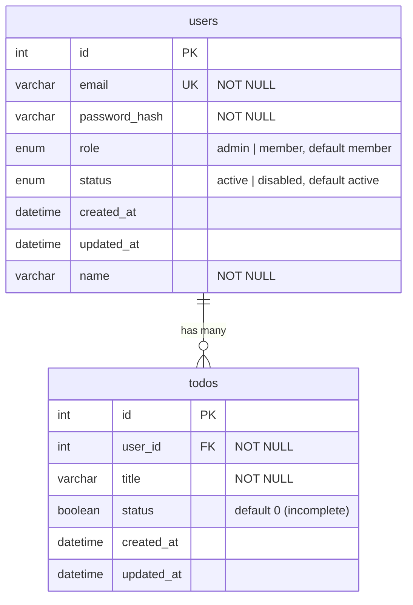

# Database Schema

*[English version here](Database-Schema.md)*

`todo-api`が使うMySQLスキーマです。正とするソースは[`mysql/init.sql`](https://github.com/NAKANO8/todo_app/blob/main/mysql/init.sql)。

## ER図



## テーブル

### `users`

| カラム | 型 | 制約 | 備考 |
|---|---|---|---|
| `id` | `INT` | `PRIMARY KEY`, `AUTO_INCREMENT` | |
| `email` | `VARCHAR(255)` | `NOT NULL`, `UNIQUE` | ログインID |
| `password_hash` | `VARCHAR(255)` | `NOT NULL` | `bcrypt`ハッシュ、平文は決して保存しない |
| `role` | `ENUM('admin','member')` | `NOT NULL`, デフォルト`'member'` | [Admin & User Management](Admin-User-Management.ja.md)参照 |
| `status` | `ENUM('active','disabled')` | `NOT NULL`, デフォルト`'active'` | `disabled`はログインを阻止し、アクティブなセッションを終了させる |
| `created_at` | `DATETIME` | デフォルト`CURRENT_TIMESTAMP` | |
| `updated_at` | `DATETIME` | デフォルト`CURRENT_TIMESTAMP`、行更新時に更新 | |
| `name` | `VARCHAR(255)` | `NOT NULL` | 表示名。`DEFAULT`なし — すべての行が値を持つ必要がある。導入前から存在するアカウントへの初期値設定方法はマイグレーションに関する注意を参照 |

**アプリケーションコードだけでなくSQLレベルで強制される不変条件:** `role = 'admin' AND status = 'active'`の行が常に最低1件は存在しなければなりません。これは`CHECK`制約ではありません(MySQLは行をまたぐ制約をそのようには表現できないため) — `role`や`status`を変更できる2つの`UPDATE`文(`AuthRepository.updateRole` / `updateStatus`)の`WHERE`句によって強制されています。実際のSQLとその構造の理由は[Admin & User Management](Admin-User-Management.ja.md#不変条件がどう強制されているか)を参照してください。

### `todos`

| カラム | 型 | 制約 | 備考 |
|---|---|---|---|
| `id` | `INT` | `PRIMARY KEY`, `AUTO_INCREMENT` | |
| `user_id` | `INT` | `NOT NULL`, `FOREIGN KEY → users(id)` | `ON DELETE CASCADE` |
| `title` | `VARCHAR(255)` | `NOT NULL` | |
| `status` | `BOOLEAN` | `NOT NULL`, デフォルト`0` | `0`=未完了、`1`=完了 — 上記の`users.status`のenumとは無関係。カラム名が同じだけで別テーブル |
| `created_at` | `DATETIME` | デフォルト`CURRENT_TIMESTAMP` | |
| `updated_at` | `DATETIME` | デフォルト`CURRENT_TIMESTAMP`、行更新時に更新 | |

## リレーション

- **`users` 1 — N `todos`**: 各Todoは`todos.user_id`経由でちょうど1人のユーザーに属します。ユーザーを削除すると、そのユーザーの全Todoも連鎖的に削除されます(`ON DELETE CASCADE`)。現時点でプロダクトに「アカウント削除」機能はありません — このカスケードは今日ユーザーが操作できる機能があるからではなく、スキーマの整合性のために存在しています。

## セッションの状態はMySQLの外にある

ログインセッションはこのスキーマの中の**テーブルではありません** — Redis(`sess:<sessionId>`キーと`user-sessions:<userId>`の逆引き索引)に保存されています。[Authentication & Sessions](Authentication-and-Sessions.ja.md#セッションはどう保存されているか)参照。

## マイグレーションに関する注意

- **マイグレーションツールは使用していません。** `mysql/init.sql`は、空のデータベースに対してのみ一度だけ実行されます(Docker ComposeがこれをMySQLの初期化スクリプトとしてマウントしており、MySQLはデータディレクトリが最初に作られたときにのみこれを実行します)。
- (admin機能のために追加された`role`/`status`カラムのような)スキーマ変更は、既にデータが入っているデータベースには**手動で**適用する必要があります — `init.sql`は既存のテーブルを遡って変更しません。既存のdev/staging/本番データベースには、同等の`ALTER TABLE`を手動で実行してください。例:
  ```sql
  ALTER TABLE users
    ADD COLUMN role ENUM('admin','member') NOT NULL DEFAULT 'member',
    ADD COLUMN status ENUM('active','disabled') NOT NULL DEFAULT 'active';
  ```
- まっさらな環境をセットアップする場合は、`init.sql`に既にこれらのカラムが含まれているため、手動の対応は不要です。
- **スキーマ変更を加える際は**、`mysql/init.sql`とこのページを同じPR内で更新し、既存のデータベースに手動の`ALTER TABLE`が必要かどうかをここに明記してください。

### `users.name`のバックフィル(profile-screen機能)

`role`/`status`とは異なり、`name`には単一の定数`DEFAULT`が使えません — 既存の各行はそれぞれの`email`から導出した**異なる**値を必要とするためです。既存のdev/staging/本番データベースでは、1回の`ALTER TABLE`ではなく、以下の3段階を順番に実行する必要があります。

```sql
-- 1. まずNULL許容でカラムを追加する(既に行が存在するテーブルに対して
--    いきなりNOT NULLでADD COLUMNすると即座に失敗するため)。
ALTER TABLE users ADD COLUMN name VARCHAR(255) NULL;

-- 2. 既存の全行に、そのemailの@より前の部分(ローカル部)をバックフィルする。
UPDATE users SET name = SUBSTRING_INDEX(email, '@', 1) WHERE name IS NULL;

-- 3. 全行が値を持った状態で、NOT NULL制約を確定させる。
ALTER TABLE users MODIFY COLUMN name VARCHAR(255) NOT NULL;
```

この3ステップは、ユーザー向けの書き込み(新規登録)が間に発生しないよう連続して実行してください — ステップ1の後・ステップ3の前に`name`なしで挿入された行は、ステップ2のバックフィル対象に含まれないため、ステップ3の`NOT NULL`制約に違反します。小規模な単一インスタンス構成では、この数秒間トラフィックを止める(または短いメンテナンスウィンドウを設ける)方が、ゼロダウンタイムマイグレーションを構築するより単純です。

**デプロイ順序の必須要件 — このマイグレーションは、本アプリコードのデプロイより前か、少なくとも同時に本番へ適用しなければならず、後からでは絶対にいけません。** `AuthRepository.findById`/`findAll`は現在、無条件で`name`カラムを`SELECT`します。このクエリは認証済みの全リクエスト(`/auth/me`、および ログイン後にユーザーが到達するそれ以降の全画面)で実行されます。カラムが本番にまだ存在しない状態で新しいアプリコードが先にデプロイされると、これらのクエリは即座に失敗し、新しいプロフィール画面だけでなく、既存の全ユーザーのログイン関連機能そのものが壊れます。このリポジトリでは特に、以下の2点がこの落とし穴を踏みやすくしています。
- [`.github/workflows/cd.yml`](https://github.com/NAKANO8/todo_app/blob/main/.github/workflows/cd.yml)は、`todo-api/`に変更を含みCIを通過した`main`へのpushのたびに、**手動承認ゲートなしで**自動デプロイを行います — このスキーマ変更を`main`へマージするだけで本番デプロイが発火します。
- CDのヘルスチェックは、未認証リクエストに対する`GET /auth/me`が`401`を返すことのみを確認します([Deployment & Operations](Deployment-and-Operations.ja.md#cd-githubworkflowscdyml)参照) — カラムが存在しない状態でも、未認証リクエストは`SELECT`に到達しないため、このチェックは**それでも成功してしまいます**。パイプライン自体にはこの失敗モードを検知する手段がありません。

したがって、行ごとに異なる値をバックフィルする`NOT NULL`カラムを追加するPR(本件、または今後同じパターンに従うもの)をマージする前には、本番に対して3ステップのマイグレーションを先に実行するか、適用済みになるまで自動CDデプロイを一時停止してください。

まっさらな環境をセットアップする場合は、`init.sql`に既に`name VARCHAR(255) NOT NULL`が含まれているため、手動の対応は不要です。
