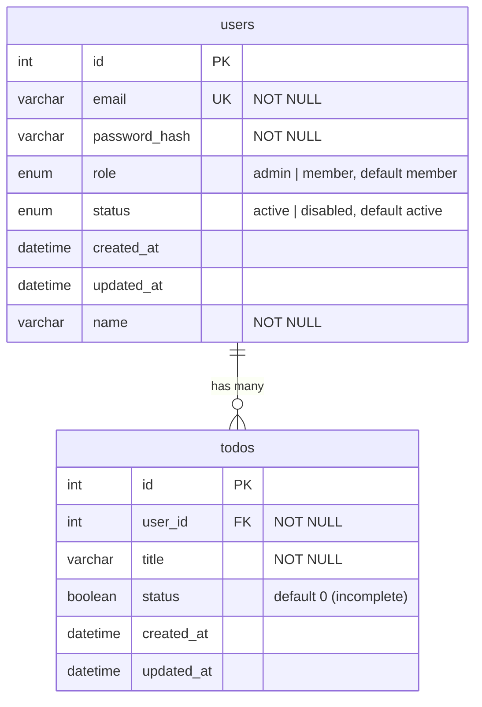

# Database Schema

*[日本語版はこちら](Database-Schema.ja.md)*

MySQL schema used by `todo-api`. Source of truth: [`mysql/init.sql`](https://github.com/NAKANO8/todo_app/blob/main/mysql/init.sql).

## ER Diagram



## Tables

### `users`

| Column | Type | Constraints | Notes |
|---|---|---|---|
| `id` | `INT` | `PRIMARY KEY`, `AUTO_INCREMENT` | |
| `email` | `VARCHAR(255)` | `NOT NULL`, `UNIQUE` | Login identifier |
| `password_hash` | `VARCHAR(255)` | `NOT NULL` | `bcrypt` hash, never plaintext |
| `role` | `ENUM('admin','member')` | `NOT NULL`, default `'member'` | See [Admin & User Management](Admin-User-Management) |
| `status` | `ENUM('active','disabled')` | `NOT NULL`, default `'active'` | `disabled` blocks login and kills active sessions |
| `created_at` | `DATETIME` | default `CURRENT_TIMESTAMP` | |
| `updated_at` | `DATETIME` | default `CURRENT_TIMESTAMP`, updates on row change | |
| `name` | `VARCHAR(255)` | `NOT NULL` | Display name. No `DEFAULT` — every row must have one; see Migration notes for how pre-existing accounts get an initial value |

**Invariant enforced at the SQL level, not just in application code:** there must always be at least one row with `role = 'admin' AND status = 'active'`. This isn't a `CHECK` constraint — MySQL can't express a cross-row constraint that way — it's enforced by the `WHERE` clause of the two `UPDATE` statements that can change `role` or `status` (`AuthRepository.updateRole` / `updateStatus`). See [Admin & User Management](Admin-User-Management#how-the-invariant-is-enforced) for the actual SQL and why it's structured that way.

### `todos`

| Column | Type | Constraints | Notes |
|---|---|---|---|
| `id` | `INT` | `PRIMARY KEY`, `AUTO_INCREMENT` | |
| `user_id` | `INT` | `NOT NULL`, `FOREIGN KEY → users(id)` | `ON DELETE CASCADE` |
| `title` | `VARCHAR(255)` | `NOT NULL` | |
| `status` | `BOOLEAN` | `NOT NULL`, default `0` | `0` = incomplete, `1` = complete — unrelated to the `users.status` enum above, same column name, different table |
| `created_at` | `DATETIME` | default `CURRENT_TIMESTAMP` | |
| `updated_at` | `DATETIME` | default `CURRENT_TIMESTAMP`, updates on row change | |

## Relationships

- **`users` 1 — N `todos`**: each todo belongs to exactly one user via `todos.user_id`. Deleting a user cascades to delete all of their todos (`ON DELETE CASCADE`). There is currently no "delete account" feature in the product — this cascade exists for schema integrity, not because it's user-triggerable today.

## Session state lives outside MySQL

Login sessions are **not** a table in this schema — they're stored in Redis (`sess:<sessionId>` keys plus a `user-sessions:<userId>` reverse index). See [Authentication & Sessions](Authentication-and-Sessions#how-a-session-is-stored).

## Migration notes

- **No migration tool is in use.** `mysql/init.sql` runs once, only against an empty database (Docker Compose mounts it as a MySQL init script, which MySQL only executes when the data directory is first created).
- Schema changes (like the `role`/`status` columns added for the admin feature) must be applied **manually** to any database that already has data — `init.sql` won't retroactively alter an existing table. For an existing dev/staging/prod database, run the equivalent `ALTER TABLE` by hand, e.g.:
  ```sql
  ALTER TABLE users
    ADD COLUMN role ENUM('admin','member') NOT NULL DEFAULT 'member',
    ADD COLUMN status ENUM('active','disabled') NOT NULL DEFAULT 'active';
  ```
- If you're setting up a fresh environment, `init.sql` already includes these columns — no manual step needed.
- **When you add a schema change**, update `mysql/init.sql` *and* this page in the same PR, and call out here whether existing databases need a manual `ALTER TABLE`.

### `users.name` backfill (profile-screen feature)

Unlike `role`/`status`, `name` has no single constant `DEFAULT` — each existing row needs a *different* value derived from its own `email`. For an existing dev/staging/prod database, this requires three sequential steps instead of one `ALTER TABLE`:

```sql
-- 1. Add the column nullable first (a bare NOT NULL ADD COLUMN would fail
--    immediately against any table that already has rows).
ALTER TABLE users ADD COLUMN name VARCHAR(255) NULL;

-- 2. Backfill every existing row from the local part of its email address
--    (the substring before '@').
UPDATE users SET name = SUBSTRING_INDEX(email, '@', 1) WHERE name IS NULL;

-- 3. Lock in the NOT NULL constraint now that every row has a value.
ALTER TABLE users MODIFY COLUMN name VARCHAR(255) NOT NULL;
```

Run all three statements back-to-back with no user-facing writes (registrations) happening in between — a row inserted after step 1 but before step 3 without a `name` would still violate step 3's `NOT NULL` constraint, since it was never covered by step 2's backfill. On a small single-instance deployment, pausing traffic (or a brief maintenance window) for the few seconds this takes is simpler than building a zero-downtime migration for it.

**Deploy-order requirement — this migration must reach prod before or with this code, never after.** `AuthRepository.findById`/`findAll` unconditionally `SELECT` the `name` column now, and that query runs on every authenticated request (`/auth/me`, and by extension every screen a logged-in user reaches after that). If the new application code is deployed before the column exists in prod, those queries fail outright and break login-adjacent functionality for every existing user — not just the new profile screen. Two things make this easy to trip over in this repo specifically:
- [`.github/workflows/cd.yml`](https://github.com/NAKANO8/todo_app/blob/main/.github/workflows/cd.yml) auto-deploys on every CI-passing push to `main` that touches `todo-api/`, with **no manual approval gate** — merging this schema change to `main` is enough to trigger a prod deploy.
- The CD health check only asserts `GET /auth/me` returns `401` for an anonymous request (see [Deployment & Operations](Deployment-and-Operations#cd-githubworkflowscdyml)) — that check would **still pass** even if the column is missing, since an anonymous request never reaches the `SELECT`. The pipeline cannot catch this failure mode on its own.

So: before merging a PR that adds a `NOT NULL` column with a per-row backfill (this one, or any future one following the same pattern), either run the 3-step migration against prod first, or pause/hold the automatic CD deploy until it has been applied.

If you're setting up a fresh environment, `init.sql` already includes `name VARCHAR(255) NOT NULL` — no manual step needed.
