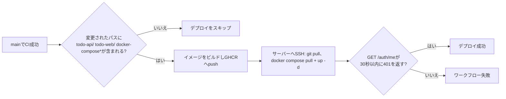

# Deployment & Operations

*[English version here](Deployment-and-Operations.md)*

## ローカル開発環境

```bash
pnpm docker:dev-init   # 初回
pnpm docker:dev        # 2回目以降
```

`docker-compose.yml` + `docker-compose.dev.yml`を使用: `api`/`web`をローカルのDockerfileからビルドし、ソースディレクトリをボリュームとしてマウント(各コンテナ内の`pnpm run dev`によるライブリロード)。MySQL(3306)とRedis(6379)はローカルでのデバッグ用にホストへ直接公開されます。

## 本番環境

```bash
pnpm docker:prod-init   # イメージをローカルでビルド + 起動(初回、またはCDを使わない環境向け)
pnpm docker:prod        # GHCRから事前ビルド済みイメージをpull + 起動
```

`docker-compose.yml` + `docker-compose.prod.yml`を使用:
- `api`と`web`は`ghcr.io/nakano8/todos-api` / `todos-web`の事前ビルド済みイメージを実行します(サーバー上ではビルドしません)
- 全サービスは専用の`app-net`ブリッジネットワークに参加します — 本番ではMySQLとRedisはホストに公開**されず**、`api`/`web`から内部ネットワーク経由でのみ到達可能です
- `web`は`API_INTERNAL_BASE=http://api:3001`(ComposeのサービスDNS)経由でAPIに到達します([Architecture](Architecture.ja.md#この分割を支える環境変数)参照)
- 全サービスに`restart: always`を設定

## 必要な環境ファイル

dev・本番どちらも、`todo-api/.env.dev` / `todo-api/.env.prod`(git管理外、コミットされない)からシークレットを読み込みます:

| 変数 | 用途 |
|---|---|
| `DB_HOST`, `DB_USER`, `DB_PASSWORD`, `DB_NAME`, `DB_PORT` | MySQL接続(アプリ用ユーザー) |
| `MYSQL_ROOT_PASSWORD`, `MYSQL_DATABASE`, `MYSQL_USER`, `MYSQL_PASSWORD` | MySQLコンテナの初期化(root・アプリ用ユーザーの作成) |
| `REDIS_HOST`, `REDIS_PORT` | セッションストアへの接続 — 未設定なら`127.0.0.1:6379` / `6379`にフォールバックするため、`REDIS_PORT`が欠けていてもプロセスがクラッシュしない(`app.ts`参照) |
| `SESSION_SECRET` | セッションCookieの署名鍵 |
| `NODE_ENV` | `development` / `production` |
| `COOKIE_SECURE` | 本番では`"true"` — HTTPS経由でのみCookieを送信 |
| `COOKIE_DOMAIN` | 本番での明示的なCookieドメイン(Cloudflare配下) |
| `CORS_ORIGIN` | 認証情報付きでAPIを呼び出せるフロントエンドのオリジン |

`NEXT_PUBLIC_API_BASE`(実行時ではなくビルド時にフロントエンドへ焼き込まれる)は、本番のDockerビルドで`--build-arg`として渡されます — 詳細は下記のCDワークフローを参照。

## CI(`.github/workflows/ci.yml`)

`main`へのpush/PRのたびに実行されます:

1. **`test-api`** — 実際のMySQL 8.0 + Redis 7のサービスコンテナを起動し、`mysql/init.sql`を適用した上で、それらに対して`todo-api`の`pnpm test`(Vitest)を実行
2. **`build-check`** — 両パッケージを型チェック/ビルド(`todo-api`で`pnpm build`、`todo-web`で`pnpm build`)し、`todo-web`をlint

補足: `todo-api`のテストはCI上ではモックではなく**実際の**MySQL/Redisに対して実行されます — これが重要なのは、Redisセッション関連のテスト(`session.service.test.ts`など)はローカルでは`ioredis-mock`を使っており、これはマイクロタスクで解決されるため、実I/O特有のタイミングに関するバグを再現できないからです。Redis絡みのタイミングに敏感なコードを触った場合は、ローカルのテストが緑になったことをCIと同等とみなさず、実際のDocker Redisに対して手動で確認してください。

## CD(`.github/workflows/cd.yml`)

`main`でのCI成功をトリガーに実行されます:



- 直前2コミット間の差分が`todo-api/`、`todo-web/`、`docker-compose*`のいずれにも触れていない場合、(コストのかかる)ビルド・デプロイ手順を丸ごとスキップします — 例えばドキュメントのみのコミットではデプロイはトリガーされません
- サーバーへSSHして`docker compose pull && up -d`を再実行することでデプロイします — サーバー自体はビルドを一切行いません(既にpush済みのイメージに対して実行)
- ヘルスチェックは意図的に`GET /auth/me`から**`401`**を期待します(`200`ではなく) — 新規のcurlリクエストはセッションCookieを持たないため、`401 Unauthorized`こそが*正しい*レスポンスであり、単にTCP接続を受け付けているだけでなく、APIが実際に起動して認証を評価していることの証明になります
- **このヘルスチェックは認証済みのコードパスを検証しません。** プロセスが起動し未認証リクエストを正しく拒否していることのみを証明するものであり、認証済みリクエストが実行するクエリが全て壊れていても(例: 本番にまだ存在しないカラムへの`SELECT`)成功したと報告してしまいます。CIを通過した`main`へのpushから本番デプロイまでの間に**手動承認ゲートが存在しない**ため、マイグレーションを本番へ適用する前にスキーマ追加のPRがマージされると、CDが一切気づかないまま実ユーザーのログイン関連機能が壊れる可能性があります。具体例と、マイグレーションをデプロイより前か同時に適用すべき理由については[Database Schema § `users.name`のバックフィル](Database-Schema.ja.md#usersnameのバックフィルprofile-screen機能)を参照してください。

必要なGitHub Secrets: `SERVER_HOST`, `SERVER_USER`, `SERVER_SSH_KEY`, `SERVER_PORT`, `SERVER_DEPLOY_PATH`。

## ロールバック

自動化されたロールバックはありません。手動でロールバックする場合: サーバーにSSHし、`docker compose -f docker-compose.yml -f docker-compose.prod.yml pull`で特定の古いタグをpullする(現状イメージは`:latest`のみでpushされており、固定できるコミット単位のタグは今のところありません)か、composeファイルの古いコミットを`git checkout`して手動で再デプロイしてください。
