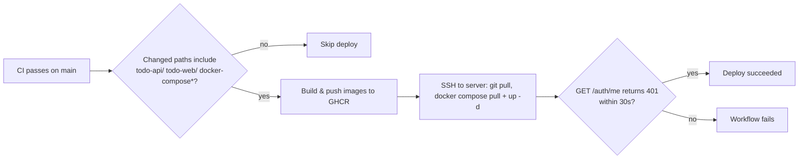

# Deployment & Operations

*[日本語版はこちら](Deployment-and-Operations.ja.md)*

## Local development

```bash
pnpm docker:dev-init   # first run
pnpm docker:dev        # subsequent runs
```

Uses `docker-compose.yml` + `docker-compose.dev.yml`: builds `api`/`web` from local Dockerfiles, mounts source directories as volumes (live reload via `pnpm run dev` in each container), and publishes MySQL (3306) and Redis (6379) directly to the host for local debugging.

## Production

```bash
pnpm docker:prod-init   # build images locally + start (first time / non-CD environments)
pnpm docker:prod        # pull pre-built images from GHCR + start
```

Uses `docker-compose.yml` + `docker-compose.prod.yml`:
- `api` and `web` run pre-built images from `ghcr.io/nakano8/todos-api` / `todos-web` (not built on the server)
- All services join a dedicated `app-net` bridge network — MySQL and Redis are **not** published to the host in prod, only reachable from `api`/`web` over the internal network
- `web` reaches the API via `API_INTERNAL_BASE=http://api:3001` (Compose service DNS — see [Architecture](Architecture#environment-variables-driving-the-split))
- `restart: always` on every service

## Required environment files

Both dev and prod read secrets from `todo-api/.env.dev` / `todo-api/.env.prod` (git-ignored, never committed):

| Variable | Purpose |
|---|---|
| `DB_HOST`, `DB_USER`, `DB_PASSWORD`, `DB_NAME`, `DB_PORT` | MySQL connection (app user) |
| `MYSQL_ROOT_PASSWORD`, `MYSQL_DATABASE`, `MYSQL_USER`, `MYSQL_PASSWORD` | MySQL container init (root + app user creation) |
| `REDIS_HOST`, `REDIS_PORT` | Session store connection — falls back to `127.0.0.1:6379` / `6379` if unset, so a missing `REDIS_PORT` won't crash the process (see `app.ts`) |
| `SESSION_SECRET` | Signs the session cookie |
| `NODE_ENV` | `development` / `production` |
| `COOKIE_SECURE` | `"true"` in prod — cookie only sent over HTTPS |
| `COOKIE_DOMAIN` | Explicit cookie domain in prod (behind Cloudflare) |
| `CORS_ORIGIN` | Frontend origin allowed to call the API with credentials |

`NEXT_PUBLIC_API_BASE` (baked into the frontend build at build time, not runtime) is passed as a `--build-arg` in the prod Docker build — see the CD workflow below.

## CI (`.github/workflows/ci.yml`)

Runs on every push/PR to `main`:

1. **`test-api`** — spins up real MySQL 8.0 + Redis 7 service containers, applies `mysql/init.sql`, runs `pnpm test` in `todo-api` (Vitest) against them
2. **`build-check`** — type-checks/builds both packages (`pnpm build` in `todo-api`, `pnpm build` in `todo-web`) and lints `todo-web`

Note: `todo-api` tests run against a **real** MySQL/Redis in CI, not mocks — this matters because Redis session tests use `ioredis-mock` locally (see `session.service.test.ts`), which resolves on microtasks and can't reproduce timing bugs specific to real I/O. Don't treat a green local test run as equivalent to CI for anything Redis-timing-sensitive; verify manually against the real Docker Redis if you touch session code.

## CD (`.github/workflows/cd.yml`)

Triggered by a successful CI run on `main`:



- Skips the (expensive) build/deploy steps entirely if the diff between the last two commits touches nothing under `todo-api/`, `todo-web/`, or `docker-compose*` — e.g. a docs-only commit does not trigger a deploy
- Deploys by SSH-ing into the server and re-running `docker compose pull && up -d` against the already-pushed images — the server never runs a build itself
- Health check deliberately expects **`401`** from `GET /auth/me` (not `200`) — a fresh curl request has no session cookie, so `401 Unauthorized` is the *correct* response and proves the API is actually up and evaluating auth, not just accepting TCP connections
- **This health check does not validate authenticated code paths.** It only proves the process is up and rejecting anonymous requests — it would still report success even if every authenticated query were broken (e.g. a `SELECT` on a column that doesn't exist in prod yet). Since there's **no manual approval gate** between a CI-passing `main` push and a live prod deploy, a schema-adding PR that merges before its migration has been applied to prod can break login-adjacent functionality for real users without CD ever noticing. See [Database Schema § `users.name` backfill](Database-Schema#usersname-backfill-profile-screen-feature) for a concrete example and the required migrate-before-or-with-deploy ordering.

Required GitHub Secrets: `SERVER_HOST`, `SERVER_USER`, `SERVER_SSH_KEY`, `SERVER_PORT`, `SERVER_DEPLOY_PATH`.

## Rolling back

There's no automated rollback. To roll back manually: SSH to the server, `docker compose -f docker-compose.yml -f docker-compose.prod.yml pull` a specific older tag (images are currently pushed as `:latest` only — there's no per-commit tag to pin to today), or `git checkout` an older commit of the compose files and re-deploy by hand.
